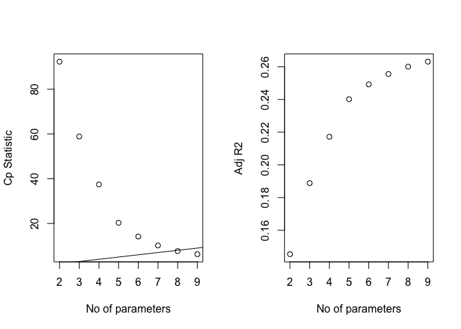
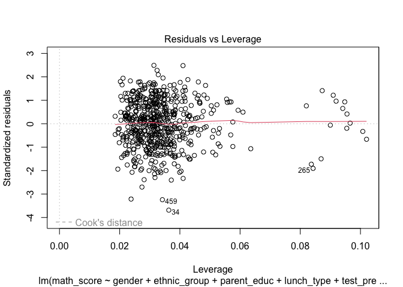

p8130_bm_final_proj
================
2024-11-25

``` r
library(tidyverse)
library(corrplot)
library(leaps)
library(glmnet)
library(faraway)
library(caret)
library(MASS) # boxcox
library(performance) # vif
```

``` r
df = read_csv("data/Project_1_data.csv")
```

    ## Rows: 948 Columns: 14
    ## ── Column specification ────────────────────────────────────────────────────────
    ## Delimiter: ","
    ## chr (10): Gender, EthnicGroup, ParentEduc, LunchType, TestPrep, ParentMarita...
    ## dbl  (4): NrSiblings, MathScore, ReadingScore, WritingScore
    ## 
    ## ℹ Use `spec()` to retrieve the full column specification for this data.
    ## ℹ Specify the column types or set `show_col_types = FALSE` to quiet this message.

``` r
score_df = df %>% 
  janitor::clean_names() %>% 
  drop_na() %>% # Drop rows with any missing values
  mutate(across(where(is.character), as.factor))
  

score_df
```

    ## # A tibble: 587 × 14
    ##    gender ethnic_group parent_educ    lunch_type test_prep parent_marital_status
    ##    <fct>  <fct>        <fct>          <fct>      <fct>     <fct>                
    ##  1 female group B      master's degr… standard   none      single               
    ##  2 male   group C      some college   standard   none      married              
    ##  3 female group B      associate's d… standard   none      married              
    ##  4 female group B      some college   standard   completed widowed              
    ##  5 male   group B      some college   free/redu… none      married              
    ##  6 male   group D      high school    free/redu… completed single               
    ##  7 male   group D      associate's d… standard   none      divorced             
    ##  8 female group B      high school    standard   none      married              
    ##  9 male   group A      some college   standard   completed single               
    ## 10 female group A      master's degr… standard   none      divorced             
    ## # ℹ 577 more rows
    ## # ℹ 8 more variables: practice_sport <fct>, is_first_child <fct>,
    ## #   nr_siblings <dbl>, transport_means <fct>, wkly_study_hours <fct>,
    ## #   math_score <dbl>, reading_score <dbl>, writing_score <dbl>

``` r
#create a df just for predicting math score
math_df = 
  score_df %>% 
  dplyr::select(-reading_score, -writing_score) %>% 
  dplyr::select(math_score, everything())

# convert data to numeric
math_df_numeric = math_df %>% 
  mutate(across(where(is.factor), ~ as.numeric(.)))
```

``` r
# Descriptive Statistics
summary(score_df)
```

    ##     gender     ethnic_group             parent_educ         lunch_type 
    ##  female:315   group A: 50   associate's degree:128   free/reduced:206  
    ##  male  :272   group B:123   bachelor's degree : 71   standard    :381  
    ##               group C:174   high school       :122                     
    ##               group D:155   master's degree   : 39                     
    ##               group E: 85   some college      :116                     
    ##                             some high school  :111                     
    ##      test_prep   parent_marital_status   practice_sport is_first_child
    ##  completed:208   divorced: 92          never    : 68    no :192       
    ##  none     :379   married :343          regularly:218    yes:395       
    ##                  single  :137          sometimes:301                  
    ##                  widowed : 15                                         
    ##                                                                       
    ##                                                                       
    ##   nr_siblings     transport_means wkly_study_hours   math_score    
    ##  Min.   :0.00   private   :229    < 5   :154       Min.   :  0.00  
    ##  1st Qu.:1.00   school_bus:358    > 10  :104       1st Qu.: 56.00  
    ##  Median :2.00                     10-May:329       Median : 67.00  
    ##  Mean   :2.14                                      Mean   : 66.68  
    ##  3rd Qu.:3.00                                      3rd Qu.: 78.00  
    ##  Max.   :7.00                                      Max.   :100.00  
    ##  reading_score    writing_score  
    ##  Min.   : 17.00   Min.   : 10.0  
    ##  1st Qu.: 60.00   1st Qu.: 58.0  
    ##  Median : 70.00   Median : 69.0  
    ##  Mean   : 69.85   Mean   : 68.9  
    ##  3rd Qu.: 81.00   3rd Qu.: 79.0  
    ##  Max.   :100.00   Max.   :100.0

``` r
# Check for missing values
colSums(is.na(score_df))
```

    ##                gender          ethnic_group           parent_educ 
    ##                     0                     0                     0 
    ##            lunch_type             test_prep parent_marital_status 
    ##                     0                     0                     0 
    ##        practice_sport        is_first_child           nr_siblings 
    ##                     0                     0                     0 
    ##       transport_means      wkly_study_hours            math_score 
    ##                     0                     0                     0 
    ##         reading_score         writing_score 
    ##                     0                     0

No missing values in the outcome variables. significant missing in
various predictor variables.

``` r
# Visualize distributions of outcome variables
ggplot(score_df, aes(x = math_score)) + 
  geom_histogram(binwidth = 5, fill = "blue", alpha = 0.7) + 
  labs(title = "Distribution of Math Scores", x = "Math Score", y = "Frequency") +
  theme_minimal()
```

<!-- -->

``` r
ggplot(score_df, aes(x = reading_score)) + 
  geom_histogram(binwidth = 5, fill = "green", alpha = 0.7) + 
  labs(title = "Distribution of Reading Scores", x = "Reading Score", y = "Frequency") +
  theme_minimal()
```

<!-- -->

``` r
ggplot(score_df, aes(x = writing_score)) + 
  geom_histogram(binwidth = 5, fill = "red", alpha = 0.7) + 
  labs(title = "Distribution of Writing Scores", x = "Writing Score", y = "Frequency") +
  theme_minimal()
```

<!-- -->

``` r
par(mfrow=c(1,3))
boxplot(score_df$math_score, main='math_score')
boxplot(score_df$reading_score, main='reading_score')
boxplot(score_df$writing_score, main='writing_score')
```

<!-- -->

``` r
library(patchwork)
```

    ## 
    ## Attaching package: 'patchwork'

    ## The following object is masked from 'package:MASS':
    ## 
    ##     area

``` r
# Create individual bar plots for each categorical variable
plot_gender <- ggplot(score_df, aes(x = gender)) +
  geom_bar(fill = "skyblue") +
  labs(title = "Gender Distribution", x = "Gender", y = "Count") +
  theme_minimal()

plot_ethnic_group <- ggplot(score_df, aes(x = ethnic_group)) +
  geom_bar(fill = "lightgreen") +
  labs(title = "Ethnic Group Distribution", x = "Ethnic Group", y = "Count") +
  theme_minimal()

plot_parent_educ <- ggplot(score_df, aes(x = parent_educ)) +
  geom_bar(fill = "purple") +
  labs(title = "Parent Education Distribution", x = "Parent Education", y = "Count") +
  theme_minimal()

plot_lunch_type <- ggplot(score_df, aes(x = lunch_type)) +
  geom_bar(fill = "orange") +
  labs(title = "Lunch Type Distribution", x = "Lunch Type", y = "Count") +
  theme_minimal()

plot_test_prep <- ggplot(score_df, aes(x = test_prep)) +
  geom_bar(fill = "pink") +
  labs(title = "Test Prep Distribution", x = "Test Prep", y = "Count") +
  theme_minimal()

plot_practice_sport <- ggplot(score_df, aes(x = practice_sport)) +
  geom_bar(fill = "cyan") +
  labs(title = "Practice Sport Distribution", x = "Practice Sport", y = "Count") +
  theme_minimal()

# Example for other variables (add similar code for all remaining variables)
plot_is_first_child <- ggplot(score_df, aes(x = is_first_child)) +
  geom_bar(fill = "lightblue") +
  labs(title = "First Child Status Distribution", x = "Is First Child", y = "Count") +
  theme_minimal()

plot_nr_siblings <- ggplot(score_df, aes(x = factor(nr_siblings))) +
  geom_bar(fill = "red") +
  labs(title = "Number of Siblings Distribution", x = "Number of Siblings", y = "Count") +
  theme_minimal()

plot_transport_means <- ggplot(score_df, aes(x = transport_means)) +
  geom_bar(fill = "gold") +
  labs(title = "Transport Means Distribution", x = "Transport Means", y = "Count") +
  theme_minimal()

plot_wkly_study_hours <- ggplot(score_df, aes(x = wkly_study_hours)) +
  geom_bar(fill = "darkgreen") +
  labs(title = "Weekly Study Hours Distribution", x = "Weekly Study Hours", y = "Count") +
  theme_minimal()

# Adjusting plot layout with more vertical space
combined_plot <- (
  plot_gender + plot_ethnic_group + plot_parent_educ +
  plot_lunch_type + plot_test_prep + plot_practice_sport +
  plot_is_first_child + plot_nr_siblings +
  plot_transport_means + plot_wkly_study_hours
) + plot_layout(ncol = 2, heights = c(1, 1, 1, 1, 1)) # Adjust the number of rows to your needs

# Save as a larger plot with better dimensions
ggsave("combined_plot.png", combined_plot, width = 12, height = 18) # Adjust height/width

# Display the adjusted plot
print(combined_plot)
```

<!-- --> visualize
correlations

``` r
pairs(math_df_numeric)
```

<!-- -->

``` r
corrplot(cor(math_df_numeric), type = "upper", diag = FALSE)
```

<!-- --> looks like
math score is correlated with gender, ethnic group, parent education,
lunch type, and test prep. Also slightly correlated with nr siblings and
weekly study hours

correlation between predictors: marital status & is first child parent
education & nr siblings, transportation means test prep & is first
child, nr siblings, transportation means, weekly study hours is first
child & nr siblings

Use automatic procedures to find a ‘best subset’ of the full model for
predicting math scores.

``` r
# Full model
full_model <- lm(math_score ~ ., data = math_df)

summary(full_model)
```

    ## 
    ## Call:
    ## lm(formula = math_score ~ ., data = math_df)
    ## 
    ## Residuals:
    ##     Min      1Q  Median      3Q     Max 
    ## -48.916  -9.265   0.725  10.104  33.013 
    ## 
    ## Coefficients:
    ##                              Estimate Std. Error t value Pr(>|t|)    
    ## (Intercept)                   49.0064     3.7750  12.982  < 2e-16 ***
    ## gendermale                     5.0855     1.1386   4.467 9.61e-06 ***
    ## ethnic_groupgroup B           -0.1788     2.3136  -0.077  0.93841    
    ## ethnic_groupgroup C           -0.2089     2.2149  -0.094  0.92489    
    ## ethnic_groupgroup D            3.6247     2.2286   1.626  0.10441    
    ## ethnic_groupgroup E           11.1752     2.4434   4.574 5.90e-06 ***
    ## parent_educbachelor's degree   1.7594     2.0219   0.870  0.38458    
    ## parent_educhigh school        -5.2293     1.7463  -2.994  0.00287 ** 
    ## parent_educmaster's degree     1.9038     2.5136   0.757  0.44912    
    ## parent_educsome college       -1.7126     1.7556  -0.976  0.32973    
    ## parent_educsome high school   -4.9058     1.7728  -2.767  0.00584 ** 
    ## lunch_typestandard            12.3539     1.1771  10.495  < 2e-16 ***
    ## test_prepnone                 -4.7717     1.2007  -3.974 7.99e-05 ***
    ## parent_marital_statusmarried   5.4805     1.6170   3.389  0.00075 ***
    ## parent_marital_statussingle    2.1682     1.8454   1.175  0.24053    
    ## parent_marital_statuswidowed   7.7944     3.8119   2.045  0.04134 *  
    ## practice_sportregularly        1.6701     1.9046   0.877  0.38092    
    ## practice_sportsometimes        1.5255     1.8439   0.827  0.40838    
    ## is_first_childyes              1.1303     1.2125   0.932  0.35162    
    ## nr_siblings                    0.7403     0.3844   1.926  0.05461 .  
    ## transport_meansschool_bus     -0.4319     1.1629  -0.371  0.71050    
    ## wkly_study_hours> 10           3.0384     1.7540   1.732  0.08378 .  
    ## wkly_study_hours10-May         3.5394     1.3429   2.636  0.00863 ** 
    ## ---
    ## Signif. codes:  0 '***' 0.001 '**' 0.01 '*' 0.05 '.' 0.1 ' ' 1
    ## 
    ## Residual standard error: 13.52 on 564 degrees of freedom
    ## Multiple R-squared:  0.3221, Adjusted R-squared:  0.2956 
    ## F-statistic: 12.18 on 22 and 564 DF,  p-value: < 2.2e-16

``` r
# Backward elimination
backward_model <- step(full_model, direction = "backward")
```

    ## Start:  AIC=3080.15
    ## math_score ~ gender + ethnic_group + parent_educ + lunch_type + 
    ##     test_prep + parent_marital_status + practice_sport + is_first_child + 
    ##     nr_siblings + transport_means + wkly_study_hours
    ## 
    ##                         Df Sum of Sq    RSS    AIC
    ## - practice_sport         2     149.5 103299 3077.0
    ## - transport_means        1      25.2 103175 3078.3
    ## - is_first_child         1     158.9 103308 3079.1
    ## <none>                               103149 3080.1
    ## - nr_siblings            1     678.4 103828 3082.0
    ## - wkly_study_hours       2    1299.9 104449 3083.5
    ## - parent_marital_status  3    2798.6 105948 3089.9
    ## - parent_educ            5    4174.0 107323 3093.4
    ## - test_prep              1    2888.2 106038 3094.4
    ## - gender                 1    3648.7 106798 3098.6
    ## - ethnic_group           4    8780.7 111930 3120.1
    ## - lunch_type             1   20145.7 123295 3182.9
    ## 
    ## Step:  AIC=3077
    ## math_score ~ gender + ethnic_group + parent_educ + lunch_type + 
    ##     test_prep + parent_marital_status + is_first_child + nr_siblings + 
    ##     transport_means + wkly_study_hours
    ## 
    ##                         Df Sum of Sq    RSS    AIC
    ## - transport_means        1      20.2 103319 3075.1
    ## - is_first_child         1     144.3 103443 3075.8
    ## <none>                               103299 3077.0
    ## - nr_siblings            1     676.7 103976 3078.8
    ## - wkly_study_hours       2    1325.3 104624 3080.5
    ## - parent_marital_status  3    2815.0 106114 3086.8
    ## - parent_educ            5    4108.3 107407 3089.9
    ## - test_prep              1    2955.2 106254 3091.6
    ## - gender                 1    3643.0 106942 3095.3
    ## - ethnic_group           4    8744.5 112043 3116.7
    ## - lunch_type             1   20057.7 123357 3179.2
    ## 
    ## Step:  AIC=3075.11
    ## math_score ~ gender + ethnic_group + parent_educ + lunch_type + 
    ##     test_prep + parent_marital_status + is_first_child + nr_siblings + 
    ##     wkly_study_hours
    ## 
    ##                         Df Sum of Sq    RSS    AIC
    ## - is_first_child         1     142.1 103461 3073.9
    ## <none>                               103319 3075.1
    ## - nr_siblings            1     675.5 103995 3076.9
    ## - wkly_study_hours       2    1319.0 104638 3078.6
    ## - parent_marital_status  3    2802.2 106121 3084.8
    ## - parent_educ            5    4088.2 107407 3087.9
    ## - test_prep              1    3021.0 106340 3090.0
    ## - gender                 1    3635.8 106955 3093.4
    ## - ethnic_group           4    8741.3 112060 3114.8
    ## - lunch_type             1   20047.0 123366 3177.2
    ## 
    ## Step:  AIC=3073.92
    ## math_score ~ gender + ethnic_group + parent_educ + lunch_type + 
    ##     test_prep + parent_marital_status + nr_siblings + wkly_study_hours
    ## 
    ##                         Df Sum of Sq    RSS    AIC
    ## <none>                               103461 3073.9
    ## - nr_siblings            1     629.8 104091 3075.5
    ## - wkly_study_hours       2    1344.8 104806 3077.5
    ## - parent_marital_status  3    2726.0 106187 3083.2
    ## - parent_educ            5    4053.0 107514 3086.5
    ## - test_prep              1    3115.5 106577 3089.3
    ## - gender                 1    3650.4 107112 3092.3
    ## - ethnic_group           4    8726.4 112188 3113.5
    ## - lunch_type             1   20082.2 123543 3176.1

``` r
summary(backward_model)
```

    ## 
    ## Call:
    ## lm(formula = math_score ~ gender + ethnic_group + parent_educ + 
    ##     lunch_type + test_prep + parent_marital_status + nr_siblings + 
    ##     wkly_study_hours, data = math_df)
    ## 
    ## Residuals:
    ##     Min      1Q  Median      3Q     Max 
    ## -48.412  -8.860   0.405  10.319  33.266 
    ## 
    ## Coefficients:
    ##                              Estimate Std. Error t value Pr(>|t|)    
    ## (Intercept)                  50.96821    3.25206  15.673  < 2e-16 ***
    ## gendermale                    5.08556    1.13600   4.477 9.16e-06 ***
    ## ethnic_groupgroup B          -0.12625    2.30718  -0.055 0.956379    
    ## ethnic_groupgroup C          -0.06815    2.20498  -0.031 0.975356    
    ## ethnic_groupgroup D           3.71549    2.22091   1.673 0.094886 .  
    ## ethnic_groupgroup E          11.18161    2.43421   4.594 5.37e-06 ***
    ## parent_educbachelor's degree  1.71868    2.01735   0.852 0.394602    
    ## parent_educhigh school       -5.06167    1.73363  -2.920 0.003643 ** 
    ## parent_educmaster's degree    1.87883    2.49420   0.753 0.451595    
    ## parent_educsome college      -1.59208    1.74419  -0.913 0.361740    
    ## parent_educsome high school  -4.87887    1.76705  -2.761 0.005948 ** 
    ## lunch_typestandard           12.32626    1.17393  10.500  < 2e-16 ***
    ## test_prepnone                -4.92090    1.18986  -4.136 4.07e-05 ***
    ## parent_marital_statusmarried  5.41133    1.60455   3.372 0.000796 ***
    ## parent_marital_statussingle   2.13481    1.83057   1.166 0.244023    
    ## parent_marital_statuswidowed  7.48771    3.79448   1.973 0.048944 *  
    ## nr_siblings                   0.71090    0.38232   1.859 0.063482 .  
    ## wkly_study_hours> 10          3.04378    1.74927   1.740 0.082395 .  
    ## wkly_study_hours10-May        3.60274    1.33885   2.691 0.007335 ** 
    ## ---
    ## Signif. codes:  0 '***' 0.001 '**' 0.01 '*' 0.05 '.' 0.1 ' ' 1
    ## 
    ## Residual standard error: 13.5 on 568 degrees of freedom
    ## Multiple R-squared:   0.32,  Adjusted R-squared:  0.2985 
    ## F-statistic: 14.85 on 18 and 568 DF,  p-value: < 2.2e-16

``` r
# Null model (no predictors)
null_model <- lm(math_score ~ 1, data = math_df)

# Forward selection
forward_model <- step(null_model, direction = "forward", scope = formula(full_model))
```

    ## Start:  AIC=3264.33
    ## math_score ~ 1
    ## 
    ##                         Df Sum of Sq    RSS    AIC
    ## + lunch_type             1   22340.6 129816 3173.1
    ## + ethnic_group           4   11630.1 140526 3225.7
    ## + gender                 1    5114.8 147042 3246.3
    ## + test_prep              1    4114.3 148042 3250.2
    ## + parent_educ            5    4397.1 147759 3257.1
    ## + wkly_study_hours       2    2365.3 149791 3259.1
    ## + parent_marital_status  3    2625.8 149531 3260.1
    ## + nr_siblings            1     615.0 151541 3264.0
    ## <none>                               152157 3264.3
    ## + is_first_child         1     132.5 152024 3265.8
    ## + transport_means        1       0.3 152156 3266.3
    ## + practice_sport         2      17.8 152139 3268.3
    ## 
    ## Step:  AIC=3173.12
    ## math_score ~ lunch_type
    ## 
    ##                         Df Sum of Sq    RSS    AIC
    ## + ethnic_group           4   10097.8 119718 3133.6
    ## + test_prep              1    4711.5 125104 3153.4
    ## + gender                 1    4049.1 125767 3156.5
    ## + parent_educ            5    4657.6 125158 3161.7
    ## + parent_marital_status  3    2481.0 127335 3167.8
    ## + wkly_study_hours       2    2008.6 127807 3168.0
    ## + nr_siblings            1     601.2 129215 3172.4
    ## <none>                               129816 3173.1
    ## + is_first_child         1      93.5 129722 3174.7
    ## + transport_means        1       1.5 129814 3175.1
    ## + practice_sport         2      76.4 129739 3176.8
    ## 
    ## Step:  AIC=3133.59
    ## math_score ~ lunch_type + ethnic_group
    ## 
    ##                         Df Sum of Sq    RSS    AIC
    ## + test_prep              1    4077.4 115641 3115.2
    ## + gender                 1    3574.9 116143 3117.8
    ## + parent_marital_status  3    3208.1 116510 3123.7
    ## + parent_educ            5    3901.2 115817 3124.1
    ## + wkly_study_hours       2    1623.3 118095 3129.6
    ## + nr_siblings            1     669.1 119049 3132.3
    ## <none>                               119718 3133.6
    ## + is_first_child         1      82.1 119636 3135.2
    ## + transport_means        1       1.2 119717 3135.6
    ## + practice_sport         2     178.0 119540 3136.7
    ## 
    ## Step:  AIC=3115.25
    ## math_score ~ lunch_type + ethnic_group + test_prep
    ## 
    ##                         Df Sum of Sq    RSS    AIC
    ## + gender                 1    3258.7 112382 3100.5
    ## + parent_marital_status  3    3343.5 112297 3104.0
    ## + parent_educ            5    3694.7 111946 3106.2
    ## + wkly_study_hours       2    1226.5 114414 3113.0
    ## + nr_siblings            1     527.9 115113 3114.6
    ## <none>                               115641 3115.2
    ## + is_first_child         1      34.0 115607 3117.1
    ## + transport_means        1      12.8 115628 3117.2
    ## + practice_sport         2     113.8 115527 3118.7
    ## 
    ## Step:  AIC=3100.47
    ## math_score ~ lunch_type + ethnic_group + test_prep + gender
    ## 
    ##                         Df Sum of Sq    RSS    AIC
    ## + parent_educ            5    4081.3 108301 3088.8
    ## + parent_marital_status  3    3157.1 109225 3089.7
    ## + wkly_study_hours       2    1243.9 111138 3097.9
    ## + nr_siblings            1     631.9 111750 3099.2
    ## <none>                               112382 3100.5
    ## + is_first_child         1      24.9 112357 3102.3
    ## + transport_means        1       7.4 112375 3102.4
    ## + practice_sport         2     118.4 112264 3103.8
    ## 
    ## Step:  AIC=3088.76
    ## math_score ~ lunch_type + ethnic_group + test_prep + gender + 
    ##     parent_educ
    ## 
    ##                         Df Sum of Sq    RSS    AIC
    ## + parent_marital_status  3   2912.61 105388 3078.8
    ## + wkly_study_hours       2   1385.30 106915 3085.2
    ## + nr_siblings            1    681.65 107619 3087.1
    ## <none>                               108301 3088.8
    ## + is_first_child         1     46.96 108254 3090.5
    ## + transport_means        1      2.22 108298 3090.7
    ## + practice_sport         2    172.15 108129 3091.8
    ## 
    ## Step:  AIC=3078.75
    ## math_score ~ lunch_type + ethnic_group + test_prep + gender + 
    ##     parent_educ + parent_marital_status
    ## 
    ##                    Df Sum of Sq    RSS    AIC
    ## + wkly_study_hours  2   1297.10 104091 3075.5
    ## + nr_siblings       1    582.04 104806 3077.5
    ## <none>                          105388 3078.8
    ## + is_first_child    1    118.24 105270 3080.1
    ## + transport_means   1     11.07 105377 3080.7
    ## + practice_sport    2    153.50 105235 3081.9
    ## 
    ## Step:  AIC=3075.48
    ## math_score ~ lunch_type + ethnic_group + test_prep + gender + 
    ##     parent_educ + parent_marital_status + wkly_study_hours
    ## 
    ##                   Df Sum of Sq    RSS    AIC
    ## + nr_siblings      1    629.79 103461 3073.9
    ## <none>                         104091 3075.5
    ## + is_first_child   1     96.35 103995 3076.9
    ## + transport_means  1     17.33 104074 3077.4
    ## + practice_sport   2    131.10 103960 3078.7
    ## 
    ## Step:  AIC=3073.92
    ## math_score ~ lunch_type + ethnic_group + test_prep + gender + 
    ##     parent_educ + parent_marital_status + wkly_study_hours + 
    ##     nr_siblings
    ## 
    ##                   Df Sum of Sq    RSS    AIC
    ## <none>                         103461 3073.9
    ## + is_first_child   1   142.106 103319 3075.1
    ## + transport_means  1    18.041 103443 3075.8
    ## + practice_sport   2   130.088 103331 3077.2

``` r
# Summary of the final model
summary(forward_model)
```

    ## 
    ## Call:
    ## lm(formula = math_score ~ lunch_type + ethnic_group + test_prep + 
    ##     gender + parent_educ + parent_marital_status + wkly_study_hours + 
    ##     nr_siblings, data = math_df)
    ## 
    ## Residuals:
    ##     Min      1Q  Median      3Q     Max 
    ## -48.412  -8.860   0.405  10.319  33.266 
    ## 
    ## Coefficients:
    ##                              Estimate Std. Error t value Pr(>|t|)    
    ## (Intercept)                  50.96821    3.25206  15.673  < 2e-16 ***
    ## lunch_typestandard           12.32626    1.17393  10.500  < 2e-16 ***
    ## ethnic_groupgroup B          -0.12625    2.30718  -0.055 0.956379    
    ## ethnic_groupgroup C          -0.06815    2.20498  -0.031 0.975356    
    ## ethnic_groupgroup D           3.71549    2.22091   1.673 0.094886 .  
    ## ethnic_groupgroup E          11.18161    2.43421   4.594 5.37e-06 ***
    ## test_prepnone                -4.92090    1.18986  -4.136 4.07e-05 ***
    ## gendermale                    5.08556    1.13600   4.477 9.16e-06 ***
    ## parent_educbachelor's degree  1.71868    2.01735   0.852 0.394602    
    ## parent_educhigh school       -5.06167    1.73363  -2.920 0.003643 ** 
    ## parent_educmaster's degree    1.87883    2.49420   0.753 0.451595    
    ## parent_educsome college      -1.59208    1.74419  -0.913 0.361740    
    ## parent_educsome high school  -4.87887    1.76705  -2.761 0.005948 ** 
    ## parent_marital_statusmarried  5.41133    1.60455   3.372 0.000796 ***
    ## parent_marital_statussingle   2.13481    1.83057   1.166 0.244023    
    ## parent_marital_statuswidowed  7.48771    3.79448   1.973 0.048944 *  
    ## wkly_study_hours> 10          3.04378    1.74927   1.740 0.082395 .  
    ## wkly_study_hours10-May        3.60274    1.33885   2.691 0.007335 ** 
    ## nr_siblings                   0.71090    0.38232   1.859 0.063482 .  
    ## ---
    ## Signif. codes:  0 '***' 0.001 '**' 0.01 '*' 0.05 '.' 0.1 ' ' 1
    ## 
    ## Residual standard error: 13.5 on 568 degrees of freedom
    ## Multiple R-squared:   0.32,  Adjusted R-squared:  0.2985 
    ## F-statistic: 14.85 on 18 and 568 DF,  p-value: < 2.2e-16

``` r
# Stepwise regression
stepwise_model <- step(full_model, direction = "both")
```

    ## Start:  AIC=3080.15
    ## math_score ~ gender + ethnic_group + parent_educ + lunch_type + 
    ##     test_prep + parent_marital_status + practice_sport + is_first_child + 
    ##     nr_siblings + transport_means + wkly_study_hours
    ## 
    ##                         Df Sum of Sq    RSS    AIC
    ## - practice_sport         2     149.5 103299 3077.0
    ## - transport_means        1      25.2 103175 3078.3
    ## - is_first_child         1     158.9 103308 3079.1
    ## <none>                               103149 3080.1
    ## - nr_siblings            1     678.4 103828 3082.0
    ## - wkly_study_hours       2    1299.9 104449 3083.5
    ## - parent_marital_status  3    2798.6 105948 3089.9
    ## - parent_educ            5    4174.0 107323 3093.4
    ## - test_prep              1    2888.2 106038 3094.4
    ## - gender                 1    3648.7 106798 3098.6
    ## - ethnic_group           4    8780.7 111930 3120.1
    ## - lunch_type             1   20145.7 123295 3182.9
    ## 
    ## Step:  AIC=3077
    ## math_score ~ gender + ethnic_group + parent_educ + lunch_type + 
    ##     test_prep + parent_marital_status + is_first_child + nr_siblings + 
    ##     transport_means + wkly_study_hours
    ## 
    ##                         Df Sum of Sq    RSS    AIC
    ## - transport_means        1      20.2 103319 3075.1
    ## - is_first_child         1     144.3 103443 3075.8
    ## <none>                               103299 3077.0
    ## - nr_siblings            1     676.7 103976 3078.8
    ## + practice_sport         2     149.5 103149 3080.1
    ## - wkly_study_hours       2    1325.3 104624 3080.5
    ## - parent_marital_status  3    2815.0 106114 3086.8
    ## - parent_educ            5    4108.3 107407 3089.9
    ## - test_prep              1    2955.2 106254 3091.6
    ## - gender                 1    3643.0 106942 3095.3
    ## - ethnic_group           4    8744.5 112043 3116.7
    ## - lunch_type             1   20057.7 123357 3179.2
    ## 
    ## Step:  AIC=3075.11
    ## math_score ~ gender + ethnic_group + parent_educ + lunch_type + 
    ##     test_prep + parent_marital_status + is_first_child + nr_siblings + 
    ##     wkly_study_hours
    ## 
    ##                         Df Sum of Sq    RSS    AIC
    ## - is_first_child         1     142.1 103461 3073.9
    ## <none>                               103319 3075.1
    ## - nr_siblings            1     675.5 103995 3076.9
    ## + transport_means        1      20.2 103299 3077.0
    ## + practice_sport         2     144.4 103175 3078.3
    ## - wkly_study_hours       2    1319.0 104638 3078.6
    ## - parent_marital_status  3    2802.2 106121 3084.8
    ## - parent_educ            5    4088.2 107407 3087.9
    ## - test_prep              1    3021.0 106340 3090.0
    ## - gender                 1    3635.8 106955 3093.4
    ## - ethnic_group           4    8741.3 112060 3114.8
    ## - lunch_type             1   20047.0 123366 3177.2
    ## 
    ## Step:  AIC=3073.92
    ## math_score ~ gender + ethnic_group + parent_educ + lunch_type + 
    ##     test_prep + parent_marital_status + nr_siblings + wkly_study_hours
    ## 
    ##                         Df Sum of Sq    RSS    AIC
    ## <none>                               103461 3073.9
    ## + is_first_child         1     142.1 103319 3075.1
    ## - nr_siblings            1     629.8 104091 3075.5
    ## + transport_means        1      18.0 103443 3075.8
    ## + practice_sport         2     130.1 103331 3077.2
    ## - wkly_study_hours       2    1344.8 104806 3077.5
    ## - parent_marital_status  3    2726.0 106187 3083.2
    ## - parent_educ            5    4053.0 107514 3086.5
    ## - test_prep              1    3115.5 106577 3089.3
    ## - gender                 1    3650.4 107112 3092.3
    ## - ethnic_group           4    8726.4 112188 3113.5
    ## - lunch_type             1   20082.2 123543 3176.1

``` r
# Summary of the final model
summary(stepwise_model)
```

    ## 
    ## Call:
    ## lm(formula = math_score ~ gender + ethnic_group + parent_educ + 
    ##     lunch_type + test_prep + parent_marital_status + nr_siblings + 
    ##     wkly_study_hours, data = math_df)
    ## 
    ## Residuals:
    ##     Min      1Q  Median      3Q     Max 
    ## -48.412  -8.860   0.405  10.319  33.266 
    ## 
    ## Coefficients:
    ##                              Estimate Std. Error t value Pr(>|t|)    
    ## (Intercept)                  50.96821    3.25206  15.673  < 2e-16 ***
    ## gendermale                    5.08556    1.13600   4.477 9.16e-06 ***
    ## ethnic_groupgroup B          -0.12625    2.30718  -0.055 0.956379    
    ## ethnic_groupgroup C          -0.06815    2.20498  -0.031 0.975356    
    ## ethnic_groupgroup D           3.71549    2.22091   1.673 0.094886 .  
    ## ethnic_groupgroup E          11.18161    2.43421   4.594 5.37e-06 ***
    ## parent_educbachelor's degree  1.71868    2.01735   0.852 0.394602    
    ## parent_educhigh school       -5.06167    1.73363  -2.920 0.003643 ** 
    ## parent_educmaster's degree    1.87883    2.49420   0.753 0.451595    
    ## parent_educsome college      -1.59208    1.74419  -0.913 0.361740    
    ## parent_educsome high school  -4.87887    1.76705  -2.761 0.005948 ** 
    ## lunch_typestandard           12.32626    1.17393  10.500  < 2e-16 ***
    ## test_prepnone                -4.92090    1.18986  -4.136 4.07e-05 ***
    ## parent_marital_statusmarried  5.41133    1.60455   3.372 0.000796 ***
    ## parent_marital_statussingle   2.13481    1.83057   1.166 0.244023    
    ## parent_marital_statuswidowed  7.48771    3.79448   1.973 0.048944 *  
    ## nr_siblings                   0.71090    0.38232   1.859 0.063482 .  
    ## wkly_study_hours> 10          3.04378    1.74927   1.740 0.082395 .  
    ## wkly_study_hours10-May        3.60274    1.33885   2.691 0.007335 ** 
    ## ---
    ## Signif. codes:  0 '***' 0.001 '**' 0.01 '*' 0.05 '.' 0.1 ' ' 1
    ## 
    ## Residual standard error: 13.5 on 568 degrees of freedom
    ## Multiple R-squared:   0.32,  Adjusted R-squared:  0.2985 
    ## F-statistic: 14.85 on 18 and 568 DF,  p-value: < 2.2e-16

- Do the procedures generate the same model?

### backward elimination model

significant predictors (7), same as stepwise model: `gender`
`ethnic_group` `parent_educ` `lunch_type` `test_prep`
`parent_marital_status` `wkly_study_hours`

### forward selection model

significant predictors (5): `gender` not significant `ethnic_group`
`parent_educ` `lunch_type` `test_prep` not significant
`parent_marital_status` `wkly_study_hours`

### step-wise regression model

significant predictors (7): `gender` `ethnic_group` `parent_educ`
`lunch_type` `test_prep` `parent_marital_status` `wkly_study_hours`

Since multi-colinearity can make a predictor appear less significant, we
should check for it.

``` r
vif(lm(math_score ~ ., data = math_df))
```

    ##                   gendermale          ethnic_groupgroup B 
    ##                     1.034618                     2.845495 
    ##          ethnic_groupgroup C          ethnic_groupgroup D 
    ##                     3.283702                     3.097841 
    ##          ethnic_groupgroup E parent_educbachelor's degree 
    ##                     2.372927                     1.395067 
    ##       parent_educhigh school   parent_educmaster's degree 
    ##                     1.611557                     1.257784 
    ##      parent_educsome college  parent_educsome high school 
    ##                     1.568503                     1.546840 
    ##           lunch_typestandard                test_prepnone 
    ##                     1.012939                     1.058701 
    ## parent_marital_statusmarried  parent_marital_statussingle 
    ##                     2.038332                     1.955689 
    ## parent_marital_statuswidowed      practice_sportregularly 
    ##                     1.161314                     2.718020 
    ##      practice_sportsometimes            is_first_childyes 
    ##                     2.726220                     1.038500 
    ##                  nr_siblings    transport_meansschool_bus 
    ##                     1.039492                     1.032714 
    ##         wkly_study_hours> 10       wkly_study_hours10-May 
    ##                     1.439583                     1.425941

None of the VIFs are larger than 5, so multi-colinearity is likely not a
concern.

Use criterion-based procedures to guide your selection of the ‘best
subset’. Summarize your results (tabular or graphical).

``` r
mat = as.matrix(math_df_numeric)
# Printing the 2 best models of each size, using the Cp criterion:
leaps(x = mat[,2:12], y = mat[,1], nbest = 2, method = "Cp")
```

    ## $which
    ##        1     2     3     4     5     6     7     8     9     A     B
    ## 1  FALSE FALSE FALSE  TRUE FALSE FALSE FALSE FALSE FALSE FALSE FALSE
    ## 1  FALSE  TRUE FALSE FALSE FALSE FALSE FALSE FALSE FALSE FALSE FALSE
    ## 2  FALSE  TRUE FALSE  TRUE FALSE FALSE FALSE FALSE FALSE FALSE FALSE
    ## 2  FALSE FALSE FALSE  TRUE  TRUE FALSE FALSE FALSE FALSE FALSE FALSE
    ## 3  FALSE  TRUE FALSE  TRUE  TRUE FALSE FALSE FALSE FALSE FALSE FALSE
    ## 3   TRUE  TRUE FALSE  TRUE FALSE FALSE FALSE FALSE FALSE FALSE FALSE
    ## 4   TRUE  TRUE FALSE  TRUE  TRUE FALSE FALSE FALSE FALSE FALSE FALSE
    ## 4  FALSE  TRUE  TRUE  TRUE  TRUE FALSE FALSE FALSE FALSE FALSE FALSE
    ## 5   TRUE  TRUE  TRUE  TRUE  TRUE FALSE FALSE FALSE FALSE FALSE FALSE
    ## 5   TRUE  TRUE FALSE  TRUE  TRUE FALSE FALSE FALSE FALSE FALSE  TRUE
    ## 6   TRUE  TRUE  TRUE  TRUE  TRUE FALSE FALSE FALSE FALSE FALSE  TRUE
    ## 6   TRUE  TRUE  TRUE  TRUE  TRUE FALSE FALSE FALSE  TRUE FALSE FALSE
    ## 7   TRUE  TRUE  TRUE  TRUE  TRUE FALSE FALSE FALSE  TRUE FALSE  TRUE
    ## 7   TRUE  TRUE  TRUE  TRUE  TRUE  TRUE FALSE FALSE FALSE FALSE  TRUE
    ## 8   TRUE  TRUE  TRUE  TRUE  TRUE  TRUE FALSE FALSE  TRUE FALSE  TRUE
    ## 8   TRUE  TRUE  TRUE  TRUE  TRUE FALSE FALSE  TRUE  TRUE FALSE  TRUE
    ## 9   TRUE  TRUE  TRUE  TRUE  TRUE  TRUE FALSE  TRUE  TRUE FALSE  TRUE
    ## 9   TRUE  TRUE  TRUE  TRUE  TRUE  TRUE FALSE FALSE  TRUE  TRUE  TRUE
    ## 10  TRUE  TRUE  TRUE  TRUE  TRUE  TRUE FALSE  TRUE  TRUE  TRUE  TRUE
    ## 10  TRUE  TRUE  TRUE  TRUE  TRUE  TRUE  TRUE  TRUE  TRUE FALSE  TRUE
    ## 11  TRUE  TRUE  TRUE  TRUE  TRUE  TRUE  TRUE  TRUE  TRUE  TRUE  TRUE
    ## 
    ## $label
    ##  [1] "(Intercept)" "1"           "2"           "3"           "4"          
    ##  [6] "5"           "6"           "7"           "8"           "9"          
    ## [11] "A"           "B"          
    ## 
    ## $size
    ##  [1]  2  2  3  3  4  4  5  5  6  6  7  7  8  8  9  9 10 10 11 11 12
    ## 
    ## $Cp
    ##  [1]  87.135817 162.178565  53.953897  64.813885  32.725714  35.213894
    ##  [7]  15.744985  26.745239  10.247064  11.925933   6.395909   9.357764
    ## [13]   5.149679   7.492994   6.374130   6.890386   8.031665   8.350999
    ## [19]  10.010907  10.019172  12.000000

``` r
# Printing the 2 best models of each size, using the adjusted R^2 criterion:
leaps(x = mat[,2:12], y = mat[,1], nbest = 2, method = "adjr2")
```

    ## $which
    ##        1     2     3     4     5     6     7     8     9     A     B
    ## 1  FALSE FALSE FALSE  TRUE FALSE FALSE FALSE FALSE FALSE FALSE FALSE
    ## 1  FALSE  TRUE FALSE FALSE FALSE FALSE FALSE FALSE FALSE FALSE FALSE
    ## 2  FALSE  TRUE FALSE  TRUE FALSE FALSE FALSE FALSE FALSE FALSE FALSE
    ## 2  FALSE FALSE FALSE  TRUE  TRUE FALSE FALSE FALSE FALSE FALSE FALSE
    ## 3  FALSE  TRUE FALSE  TRUE  TRUE FALSE FALSE FALSE FALSE FALSE FALSE
    ## 3   TRUE  TRUE FALSE  TRUE FALSE FALSE FALSE FALSE FALSE FALSE FALSE
    ## 4   TRUE  TRUE FALSE  TRUE  TRUE FALSE FALSE FALSE FALSE FALSE FALSE
    ## 4  FALSE  TRUE  TRUE  TRUE  TRUE FALSE FALSE FALSE FALSE FALSE FALSE
    ## 5   TRUE  TRUE  TRUE  TRUE  TRUE FALSE FALSE FALSE FALSE FALSE FALSE
    ## 5   TRUE  TRUE FALSE  TRUE  TRUE FALSE FALSE FALSE FALSE FALSE  TRUE
    ## 6   TRUE  TRUE  TRUE  TRUE  TRUE FALSE FALSE FALSE FALSE FALSE  TRUE
    ## 6   TRUE  TRUE  TRUE  TRUE  TRUE FALSE FALSE FALSE  TRUE FALSE FALSE
    ## 7   TRUE  TRUE  TRUE  TRUE  TRUE FALSE FALSE FALSE  TRUE FALSE  TRUE
    ## 7   TRUE  TRUE  TRUE  TRUE  TRUE  TRUE FALSE FALSE FALSE FALSE  TRUE
    ## 8   TRUE  TRUE  TRUE  TRUE  TRUE  TRUE FALSE FALSE  TRUE FALSE  TRUE
    ## 8   TRUE  TRUE  TRUE  TRUE  TRUE FALSE FALSE  TRUE  TRUE FALSE  TRUE
    ## 9   TRUE  TRUE  TRUE  TRUE  TRUE  TRUE FALSE  TRUE  TRUE FALSE  TRUE
    ## 9   TRUE  TRUE  TRUE  TRUE  TRUE  TRUE FALSE FALSE  TRUE  TRUE  TRUE
    ## 10  TRUE  TRUE  TRUE  TRUE  TRUE  TRUE FALSE  TRUE  TRUE  TRUE  TRUE
    ## 10  TRUE  TRUE  TRUE  TRUE  TRUE  TRUE  TRUE  TRUE  TRUE FALSE  TRUE
    ## 11  TRUE  TRUE  TRUE  TRUE  TRUE  TRUE  TRUE  TRUE  TRUE  TRUE  TRUE
    ## 
    ## $label
    ##  [1] "(Intercept)" "1"           "2"           "3"           "4"          
    ##  [6] "5"           "6"           "7"           "8"           "9"          
    ## [11] "A"           "B"          
    ## 
    ## $size
    ##  [1]  2  2  3  3  4  4  5  5  6  6  7  7  8  8  9  9 10 10 11 11 12
    ## 
    ## $adjr2
    ##  [1] 0.1453682 0.0496653 0.1888495 0.1749759 0.2171829 0.2139989 0.2401690
    ##  [8] 0.2260679 0.2484892 0.2463334 0.2547199 0.2509100 0.2576156 0.2545961
    ## [15] 0.2573322 0.2566658 0.2564879 0.2560750 0.2552240 0.2552133 0.2539428

``` r
# Function regsubsets() performs a subset selection by identifying the "best" model that contains
# a certain number of predictors. By default "best" is chosen using SSE/RSS (smaller is better)
b = regsubsets(math_score ~ ., data = math_df_numeric)
rs = summary(b)

# plot of Cp and Adj-R2 as functions of parameters
par(mfrow=c(1,2))

plot(2:9, rs$cp, xlab="No of parameters", ylab="Cp Statistic")
abline(0,1)

plot(2:9, rs$adjr2, xlab="No of parameters", ylab="Adj R2")
```

<!-- --> Cp is close
to p at 7 predictors; Adjusted R square increases rapidly from 2-5
predictors and peaks at 8 predictors. Overall it seems like 7 or 8 would
be a good choice.

Use the LASSO method to perform variable selection. Make sure you choose
the “best lambda” to use and show how you determined this.

``` r
# Separate the response variable (life_exp) and predictors
y <- math_df_numeric$math_score
X <- as.matrix(math_df_numeric[, -1])  # Exclude the response variable

# Fit LASSO model with cross-validation
lasso_cv <- cv.glmnet(X, y, alpha = 1)  # alpha = 1 for LASSO (L2 regularization)

# Plot the cross-validation results
plot(lasso_cv)
```

<!-- -->

``` r
# Best lambda (lambda.min is the one that minimizes cross-validation error)
best_lambda <- lasso_cv$lambda.min
best_lambda
```

    ## [1] 0.2863487

``` r
# Coefficients at the best lambda
lasso_coefs <- coef(lasso_cv, s = "lambda.min")
print(lasso_coefs)
```

    ## 12 x 1 sparse Matrix of class "dgCMatrix"
    ##                                s1
    ## (Intercept)           37.26753676
    ## gender                 4.57744113
    ## ethnic_group           2.65567579
    ## parent_educ           -0.69023533
    ## lunch_type            11.83058188
    ## test_prep             -4.73115475
    ## parent_marital_status  0.31794142
    ## practice_sport         .         
    ## is_first_child         0.05299081
    ## nr_siblings            0.50386567
    ## transport_means        .         
    ## wkly_study_hours       1.35389233

The LASSO model narrows down to 9 predictors: `gender` `ethnic_group`
`parent_educ` `lunch_type` `test_prep` `parent_marital_status`
`wkly_study_hours` `is_first_child` `nr_siblings`

# evaluating candidate models

## MLR assumptions

### 7-predictor model

- how are the models in terms of assumptions?

``` r
model_1 = lm(math_score ~ gender + ethnic_group + parent_educ + lunch_type
+ test_prep + parent_marital_status + wkly_study_hours, data = math_df)

plot(model_1)
```

<!-- --><!-- --><!-- --><!-- -->
QQ plot doesn’t seem so normal, some deviation at large values. Let’s
try a transformation.

``` r
math_df$math_score <- math_df$math_score + 1

boxcox(model_1, lambda = seq(-3, 3, by = 0.25))
```

<!-- --> looks like a
power of 1.5 is recommended.

``` r
math_df_tr = math_df %>% 
  mutate(sqrt_math_score = sqrt(math_score),
         log_math_score = log(math_score),
         ahalf_math_score = (math_score)^1.5)

model_1.5 = lm(sqrt_math_score ~ gender + ethnic_group + parent_educ + lunch_type
+ test_prep + parent_marital_status + wkly_study_hours, data = math_df_tr)

model_1.6 = lm(log_math_score ~ gender + ethnic_group + parent_educ + lunch_type
+ test_prep + parent_marital_status + wkly_study_hours, data = math_df_tr)

model_1.7 = lm(ahalf_math_score ~ gender + ethnic_group + parent_educ + lunch_type
+ test_prep + parent_marital_status + wkly_study_hours, data = math_df_tr)

plot(model_1)
```

<!-- --><!-- --><!-- --><!-- -->

``` r
plot(model_1.5)
```

<!-- --><!-- --><!-- --><!-- -->

``` r
plot(model_1.6)
```

<!-- --><!-- --><!-- --><!-- -->

``` r
plot(model_1.7)
```

<!-- --><!-- --><!-- --><!-- -->
The QQ plot did not get better with transformation.

### 5-predictor model

``` r
model_2 = lm(math_score ~ ethnic_group + parent_educ + lunch_type + parent_marital_status + wkly_study_hours, data = math_df)

plot(model_2)
```

<!-- --><!-- --><!-- --><!-- -->
looks good (?) \### 9-predictor model

``` r
model_3 = lm(math_score ~ gender + ethnic_group + parent_educ + lunch_type
+ test_prep + parent_marital_status + wkly_study_hours + is_first_child + nr_siblings,
data = math_df)

plot(model_3)
```

<!-- --><!-- --><!-- --><!-- -->
same issue with QQ plot

## Predictive power

### 7-predictor model

RMSE 13.70

``` r
set.seed(1)
# Use 10-fold validation and create the training sets
train = trainControl(method = "cv", number = 10)

# Fit the 4-variables model
model_caret = train(math_score ~ gender + ethnic_group + parent_educ + lunch_type
+ test_prep + parent_marital_status + wkly_study_hours, data = math_df,
                   trControl = train,
                   method = 'lm',
                   na.action = na.pass)

model_caret$finalModel
```

    ## 
    ## Call:
    ## lm(formula = .outcome ~ ., data = dat)
    ## 
    ## Coefficients:
    ##                    (Intercept)                      gendermale  
    ##                        53.7237                          4.9788  
    ##          `ethnic_groupgroup B`           `ethnic_groupgroup C`  
    ##                        -0.3532                         -0.1087  
    ##          `ethnic_groupgroup D`           `ethnic_groupgroup E`  
    ##                         3.5102                         11.0406  
    ## `parent_educbachelor's degree`        `parent_educhigh school`  
    ##                         1.5860                         -4.9685  
    ##   `parent_educmaster's degree`       `parent_educsome college`  
    ##                         1.6565                         -1.6345  
    ##  `parent_educsome high school`              lunch_typestandard  
    ##                        -5.0577                         12.3459  
    ##                  test_prepnone    parent_marital_statusmarried  
    ##                        -5.0316                          5.5078  
    ##    parent_marital_statussingle    parent_marital_statuswidowed  
    ##                         2.2403                          7.8685  
    ##         `wkly_study_hours> 10`        `wkly_study_hours10-May`  
    ##                         3.2082                          3.4990

``` r
print(model_caret)
```

    ## Linear Regression 
    ## 
    ## 587 samples
    ##   7 predictor
    ## 
    ## No pre-processing
    ## Resampling: Cross-Validated (10 fold) 
    ## Summary of sample sizes: 529, 527, 529, 528, 529, 528, ... 
    ## Resampling results:
    ## 
    ##   RMSE      Rsquared   MAE     
    ##   13.71335  0.2777857  11.13378
    ## 
    ## Tuning parameter 'intercept' was held constant at a value of TRUE

### 5-predictor model

RMSE 14.13

``` r
train = trainControl(method = "cv", number = 10)

# Fit the 4-variables model
model_caret = train(math_score ~ ethnic_group + parent_educ + lunch_type + parent_marital_status + wkly_study_hours, data = math_df,
                   trControl = train,
                   method = 'lm',
                   na.action = na.pass)

model_caret$finalModel
```

    ## 
    ## Call:
    ## lm(formula = .outcome ~ ., data = dat)
    ## 
    ## Coefficients:
    ##                    (Intercept)           `ethnic_groupgroup B`  
    ##                        53.1586                         -1.0695  
    ##          `ethnic_groupgroup C`           `ethnic_groupgroup D`  
    ##                        -0.7503                          2.8056  
    ##          `ethnic_groupgroup E`  `parent_educbachelor's degree`  
    ##                        11.0971                          1.5017  
    ##       `parent_educhigh school`    `parent_educmaster's degree`  
    ##                        -5.1646                          0.9057  
    ##      `parent_educsome college`   `parent_educsome high school`  
    ##                        -2.3393                         -4.9307  
    ##             lunch_typestandard    parent_marital_statusmarried  
    ##                        12.4578                          5.4861  
    ##    parent_marital_statussingle    parent_marital_statuswidowed  
    ##                         2.1932                          8.2634  
    ##         `wkly_study_hours> 10`        `wkly_study_hours10-May`  
    ##                         4.1708                          3.7276

``` r
print(model_caret)
```

    ## Linear Regression 
    ## 
    ## 587 samples
    ##   5 predictor
    ## 
    ## No pre-processing
    ## Resampling: Cross-Validated (10 fold) 
    ## Summary of sample sizes: 528, 527, 529, 528, 529, 529, ... 
    ## Resampling results:
    ## 
    ##   RMSE      Rsquared   MAE     
    ##   14.09591  0.2400184  11.49503
    ## 
    ## Tuning parameter 'intercept' was held constant at a value of TRUE

### 9-predictor model

RMSE 13.72

``` r
train = trainControl(method = "cv", number = 10)

# Fit the 9-variables model
model_caret = train(math_score ~ gender + ethnic_group + parent_educ + lunch_type
+ test_prep + parent_marital_status + wkly_study_hours + is_first_child + nr_siblings,
data = math_df,
                   trControl = train,
                   method = 'lm',
                   na.action = na.pass)

model_caret$finalModel
```

    ## 
    ## Call:
    ## lm(formula = .outcome ~ ., data = dat)
    ## 
    ## Coefficients:
    ##                    (Intercept)                      gendermale  
    ##                        51.1532                          5.0756  
    ##          `ethnic_groupgroup B`           `ethnic_groupgroup C`  
    ##                        -0.1980                         -0.1356  
    ##          `ethnic_groupgroup D`           `ethnic_groupgroup E`  
    ##                         3.7048                         11.1211  
    ## `parent_educbachelor's degree`        `parent_educhigh school`  
    ##                         1.7228                         -5.1485  
    ##   `parent_educmaster's degree`       `parent_educsome college`  
    ##                         1.7710                         -1.6432  
    ##  `parent_educsome high school`              lunch_typestandard  
    ##                        -4.8906                         12.3161  
    ##                  test_prepnone    parent_marital_statusmarried  
    ##                        -4.8552                          5.5403  
    ##    parent_marital_statussingle    parent_marital_statuswidowed  
    ##                         2.2769                          7.6811  
    ##         `wkly_study_hours> 10`        `wkly_study_hours10-May`  
    ##                         3.0292                          3.5676  
    ##              is_first_childyes                     nr_siblings  
    ##                         1.0650                          0.7388

``` r
print(model_caret)
```

    ## Linear Regression 
    ## 
    ## 587 samples
    ##   9 predictor
    ## 
    ## No pre-processing
    ## Resampling: Cross-Validated (10 fold) 
    ## Summary of sample sizes: 528, 529, 530, 527, 527, 528, ... 
    ## Resampling results:
    ## 
    ##   RMSE      Rsquared   MAE     
    ##   13.67099  0.2894601  11.21909
    ## 
    ## Tuning parameter 'intercept' was held constant at a value of TRUE

``` r
interaction_model_9 = lm(math_score ~ (gender + ethnic_group + parent_educ + lunch_type
+ test_prep + parent_marital_status + wkly_study_hours + is_first_child + nr_siblings)^2, 
                        data = math_df)

model_summary = summary(interaction_model_9)

coeff_table <- model_summary$coefficients

# Filter for significant terms (p-value < 0.05)
significant_terms <- coeff_table[coeff_table[, "Pr(>|t|)"] < 0.05, ]

# Create a data frame for better readability
significant_terms_df <- data.frame(
  Term = rownames(significant_terms),
  Coefficient = significant_terms[, "Estimate"],
  P_Value = significant_terms[, "Pr(>|t|)"]
)

# Print the significant terms
print(significant_terms_df)
```

    ##                                                                                                                Term
    ## (Intercept)                                                                                             (Intercept)
    ## parent_educbachelor's degree                                                           parent_educbachelor's degree
    ## test_prepnone                                                                                         test_prepnone
    ## parent_marital_statusmarried                                                           parent_marital_statusmarried
    ## gendermale:parent_educmaster's degree                                         gendermale:parent_educmaster's degree
    ## ethnic_groupgroup E:test_prepnone                                                 ethnic_groupgroup E:test_prepnone
    ## parent_educbachelor's degree:parent_marital_statusmarried parent_educbachelor's degree:parent_marital_statusmarried
    ## parent_educbachelor's degree:parent_marital_statussingle   parent_educbachelor's degree:parent_marital_statussingle
    ## parent_educhigh school:is_first_childyes                                   parent_educhigh school:is_first_childyes
    ## parent_educsome college:is_first_childyes                                 parent_educsome college:is_first_childyes
    ## parent_marital_statusmarried:wkly_study_hours> 10                 parent_marital_statusmarried:wkly_study_hours> 10
    ## parent_marital_statussingle:wkly_study_hours> 10                   parent_marital_statussingle:wkly_study_hours> 10
    ## parent_marital_statusmarried:is_first_childyes                       parent_marital_statusmarried:is_first_childyes
    ##                                                           Coefficient
    ## (Intercept)                                                 52.850912
    ## parent_educbachelor's degree                                29.623814
    ## test_prepnone                                              -20.308781
    ## parent_marital_statusmarried                                21.112814
    ## gendermale:parent_educmaster's degree                       14.351488
    ## ethnic_groupgroup E:test_prepnone                           12.948899
    ## parent_educbachelor's degree:parent_marital_statusmarried  -20.839435
    ## parent_educbachelor's degree:parent_marital_statussingle   -23.471541
    ## parent_educhigh school:is_first_childyes                     9.820198
    ## parent_educsome college:is_first_childyes                    9.430730
    ## parent_marital_statusmarried:wkly_study_hours> 10           14.029905
    ## parent_marital_statussingle:wkly_study_hours> 10            18.367764
    ## parent_marital_statusmarried:is_first_childyes              -9.912871
    ##                                                               P_Value
    ## (Intercept)                                               0.001533606
    ## parent_educbachelor's degree                              0.037048791
    ## test_prepnone                                             0.018943668
    ## parent_marital_statusmarried                              0.042511649
    ## gendermale:parent_educmaster's degree                     0.023345335
    ## ethnic_groupgroup E:test_prepnone                         0.040928577
    ## parent_educbachelor's degree:parent_marital_statusmarried 0.009353825
    ## parent_educbachelor's degree:parent_marital_statussingle  0.007778367
    ## parent_educhigh school:is_first_childyes                  0.024001224
    ## parent_educsome college:is_first_childyes                 0.028481480
    ## parent_marital_statusmarried:wkly_study_hours> 10         0.026045949
    ## parent_marital_statussingle:wkly_study_hours> 10          0.009347603
    ## parent_marital_statusmarried:is_first_childyes            0.029855485

``` r
interaction_model = lm(math_score ~ parent_educ+
test_prep+ 
parent_marital_status+
gender*parent_educ+
ethnic_group*test_prep + 
parent_educ*parent_marital_status+ 
parent_marital_status*wkly_study_hours+ 
parent_marital_status*is_first_child, data = math_df)

summary(interaction_model)
```

    ## 
    ## Call:
    ## lm(formula = math_score ~ parent_educ + test_prep + parent_marital_status + 
    ##     gender * parent_educ + ethnic_group * test_prep + parent_educ * 
    ##     parent_marital_status + parent_marital_status * wkly_study_hours + 
    ##     parent_marital_status * is_first_child, data = math_df)
    ## 
    ## Residuals:
    ##     Min      1Q  Median      3Q     Max 
    ## -56.522  -8.911   0.735   9.365  34.919 
    ## 
    ## Coefficients:
    ##                                                            Estimate Std. Error
    ## (Intercept)                                                58.91858    6.46527
    ## parent_educbachelor's degree                               19.59774    6.90806
    ## parent_educhigh school                                     -4.78910    5.35711
    ## parent_educmaster's degree                                  0.14284    6.66306
    ## parent_educsome college                                     8.91306    5.37481
    ## parent_educsome high school                                 1.98537    5.32924
    ## test_prepnone                                             -13.21567    4.45725
    ## parent_marital_statusmarried                               15.57704    5.58526
    ## parent_marital_statussingle                                 3.49820    6.19993
    ## parent_marital_statuswidowed                               17.26212   18.27057
    ## gendermale                                                  5.56278    2.66052
    ## ethnic_groupgroup B                                        -6.58744    4.26881
    ## ethnic_groupgroup C                                        -4.74097    4.12377
    ## ethnic_groupgroup D                                        -3.00236    4.25618
    ## ethnic_groupgroup E                                         5.14554    4.41292
    ## wkly_study_hours> 10                                       -4.31052    5.20391
    ## wkly_study_hours10-May                                      0.53281    3.83621
    ## is_first_childyes                                           7.18268    4.01005
    ## parent_educbachelor's degree:gendermale                    -4.29470    4.52363
    ## parent_educhigh school:gendermale                           1.22486    3.79027
    ## parent_educmaster's degree:gendermale                       6.62728    5.75362
    ## parent_educsome college:gendermale                         -3.23418    3.90224
    ## parent_educsome high school:gendermale                      2.48971    3.88947
    ## test_prepnone:ethnic_groupgroup B                          10.34979    5.29527
    ## test_prepnone:ethnic_groupgroup C                           7.12033    5.06206
    ## test_prepnone:ethnic_groupgroup D                          10.36993    5.19664
    ## test_prepnone:ethnic_groupgroup E                          11.21132    5.54301
    ## parent_educbachelor's degree:parent_marital_statusmarried -16.63139    7.24455
    ## parent_educhigh school:parent_marital_statusmarried        -1.41512    5.45905
    ## parent_educmaster's degree:parent_marital_statusmarried    -0.07571    7.40487
    ## parent_educsome college:parent_marital_statusmarried       -9.97379    5.54677
    ## parent_educsome high school:parent_marital_statusmarried   -9.00046    5.49917
    ## parent_educbachelor's degree:parent_marital_statussingle  -20.79118    8.16874
    ## parent_educhigh school:parent_marital_statussingle          0.51898    6.30841
    ## parent_educmaster's degree:parent_marital_statussingle     -5.44019    8.29535
    ## parent_educsome college:parent_marital_statussingle       -13.68536    6.36947
    ## parent_educsome high school:parent_marital_statussingle   -12.05748    6.15354
    ## parent_educbachelor's degree:parent_marital_statuswidowed -31.27026   17.84173
    ## parent_educhigh school:parent_marital_statuswidowed       -29.36432   18.26236
    ## parent_educmaster's degree:parent_marital_statuswidowed   -18.99066   22.54988
    ## parent_educsome college:parent_marital_statuswidowed      -14.67908   16.36277
    ## parent_educsome high school:parent_marital_statuswidowed  -15.77470   18.46597
    ## parent_marital_statusmarried:wkly_study_hours> 10           5.22752    5.73773
    ## parent_marital_statussingle:wkly_study_hours> 10           14.90879    6.42393
    ## parent_marital_statuswidowed:wkly_study_hours> 10           7.66243   18.27924
    ## parent_marital_statusmarried:wkly_study_hours10-May         2.11395    4.27098
    ## parent_marital_statussingle:wkly_study_hours10-May          8.74834    4.80124
    ## parent_marital_statuswidowed:wkly_study_hours10-May        14.48514   16.05822
    ## parent_marital_statusmarried:is_first_childyes             -8.75899    4.33991
    ## parent_marital_statussingle:is_first_childyes              -1.76770    4.83172
    ## parent_marital_statuswidowed:is_first_childyes             -1.53114   12.53990
    ##                                                           t value Pr(>|t|)    
    ## (Intercept)                                                 9.113  < 2e-16 ***
    ## parent_educbachelor's degree                                2.837  0.00473 ** 
    ## parent_educhigh school                                     -0.894  0.37174    
    ## parent_educmaster's degree                                  0.021  0.98290    
    ## parent_educsome college                                     1.658  0.09784 .  
    ## parent_educsome high school                                 0.373  0.70964    
    ## test_prepnone                                              -2.965  0.00316 ** 
    ## parent_marital_statusmarried                                2.789  0.00548 ** 
    ## parent_marital_statussingle                                 0.564  0.57283    
    ## parent_marital_statuswidowed                                0.945  0.34518    
    ## gendermale                                                  2.091  0.03701 *  
    ## ethnic_groupgroup B                                        -1.543  0.12338    
    ## ethnic_groupgroup C                                        -1.150  0.25079    
    ## ethnic_groupgroup D                                        -0.705  0.48086    
    ## ethnic_groupgroup E                                         1.166  0.24413    
    ## wkly_study_hours> 10                                       -0.828  0.40786    
    ## wkly_study_hours10-May                                      0.139  0.88959    
    ## is_first_childyes                                           1.791  0.07383 .  
    ## parent_educbachelor's degree:gendermale                    -0.949  0.34285    
    ## parent_educhigh school:gendermale                           0.323  0.74670    
    ## parent_educmaster's degree:gendermale                       1.152  0.24990    
    ## parent_educsome college:gendermale                         -0.829  0.40759    
    ## parent_educsome high school:gendermale                      0.640  0.52237    
    ## test_prepnone:ethnic_groupgroup B                           1.955  0.05116 .  
    ## test_prepnone:ethnic_groupgroup C                           1.407  0.16012    
    ## test_prepnone:ethnic_groupgroup D                           1.996  0.04649 *  
    ## test_prepnone:ethnic_groupgroup E                           2.023  0.04361 *  
    ## parent_educbachelor's degree:parent_marital_statusmarried  -2.296  0.02208 *  
    ## parent_educhigh school:parent_marital_statusmarried        -0.259  0.79556    
    ## parent_educmaster's degree:parent_marital_statusmarried    -0.010  0.99185    
    ## parent_educsome college:parent_marital_statusmarried       -1.798  0.07272 .  
    ## parent_educsome high school:parent_marital_statusmarried   -1.637  0.10228    
    ## parent_educbachelor's degree:parent_marital_statussingle   -2.545  0.01120 *  
    ## parent_educhigh school:parent_marital_statussingle          0.082  0.93446    
    ## parent_educmaster's degree:parent_marital_statussingle     -0.656  0.51223    
    ## parent_educsome college:parent_marital_statussingle        -2.149  0.03211 *  
    ## parent_educsome high school:parent_marital_statussingle    -1.959  0.05058 .  
    ## parent_educbachelor's degree:parent_marital_statuswidowed  -1.753  0.08023 .  
    ## parent_educhigh school:parent_marital_statuswidowed        -1.608  0.10844    
    ## parent_educmaster's degree:parent_marital_statuswidowed    -0.842  0.40007    
    ## parent_educsome college:parent_marital_statuswidowed       -0.897  0.37007    
    ## parent_educsome high school:parent_marital_statuswidowed   -0.854  0.39334    
    ## parent_marital_statusmarried:wkly_study_hours> 10           0.911  0.36266    
    ## parent_marital_statussingle:wkly_study_hours> 10            2.321  0.02067 *  
    ## parent_marital_statuswidowed:wkly_study_hours> 10           0.419  0.67525    
    ## parent_marital_statusmarried:wkly_study_hours10-May         0.495  0.62083    
    ## parent_marital_statussingle:wkly_study_hours10-May          1.822  0.06900 .  
    ## parent_marital_statuswidowed:wkly_study_hours10-May         0.902  0.36744    
    ## parent_marital_statusmarried:is_first_childyes             -2.018  0.04406 *  
    ## parent_marital_statussingle:is_first_childyes              -0.366  0.71462    
    ## parent_marital_statuswidowed:is_first_childyes             -0.122  0.90286    
    ## ---
    ## Signif. codes:  0 '***' 0.001 '**' 0.01 '*' 0.05 '.' 0.1 ' ' 1
    ## 
    ## Residual standard error: 14.61 on 536 degrees of freedom
    ## Multiple R-squared:  0.2485, Adjusted R-squared:  0.1784 
    ## F-statistic: 3.544 on 50 and 536 DF,  p-value: 2.126e-13

Overall, the 7 predictors is the best (?)

# are there interaction effects?

``` r
 # Fit a linear model with all two-way interactions
interaction_model <- lm(math_score ~ (gender + ethnic_group + parent_educ + lunch_type + 
                                      test_prep + parent_marital_status + practice_sport + 
                                      is_first_child + nr_siblings + transport_means + 
                                      wkly_study_hours)^2, 
                        data = math_df)

# Summarize the model
model_summary = summary(interaction_model)

coeff_table <- model_summary$coefficients

# Filter for significant terms (p-value < 0.05)
significant_terms <- coeff_table[coeff_table[, "Pr(>|t|)"] < 0.05, ]

# Create a data frame for better readability
significant_terms_df <- data.frame(
  Term = rownames(significant_terms),
  Coefficient = significant_terms[, "Estimate"],
  P_Value = significant_terms[, "Pr(>|t|)"]
)

# Print the significant terms
print(significant_terms_df)
```

    ##                                                                                                                Term
    ## (Intercept)                                                                                             (Intercept)
    ## parent_educbachelor's degree                                                           parent_educbachelor's degree
    ## parent_educbachelor's degree:parent_marital_statusmarried parent_educbachelor's degree:parent_marital_statusmarried
    ## parent_educbachelor's degree:parent_marital_statussingle   parent_educbachelor's degree:parent_marital_statussingle
    ## parent_educmaster's degree:parent_marital_statuswidowed     parent_educmaster's degree:parent_marital_statuswidowed
    ## parent_educhigh school:is_first_childyes                                   parent_educhigh school:is_first_childyes
    ## parent_educsome college:is_first_childyes                                 parent_educsome college:is_first_childyes
    ## parent_educmaster's degree:transport_meansschool_bus           parent_educmaster's degree:transport_meansschool_bus
    ## parent_educhigh school:wkly_study_hours10-May                         parent_educhigh school:wkly_study_hours10-May
    ## lunch_typestandard:practice_sportregularly                               lunch_typestandard:practice_sportregularly
    ## lunch_typestandard:practice_sportsometimes                               lunch_typestandard:practice_sportsometimes
    ## parent_marital_statusmarried:is_first_childyes                       parent_marital_statusmarried:is_first_childyes
    ## parent_marital_statusmarried:wkly_study_hours> 10                 parent_marital_statusmarried:wkly_study_hours> 10
    ## parent_marital_statussingle:wkly_study_hours> 10                   parent_marital_statussingle:wkly_study_hours> 10
    ##                                                           Coefficient
    ## (Intercept)                                                 74.281111
    ## parent_educbachelor's degree                                37.030962
    ## parent_educbachelor's degree:parent_marital_statusmarried  -18.766467
    ## parent_educbachelor's degree:parent_marital_statussingle   -20.017396
    ## parent_educmaster's degree:parent_marital_statuswidowed    -91.802239
    ## parent_educhigh school:is_first_childyes                     9.355803
    ## parent_educsome college:is_first_childyes                    9.212310
    ## parent_educmaster's degree:transport_meansschool_bus        13.683248
    ## parent_educhigh school:wkly_study_hours10-May              -10.665529
    ## lunch_typestandard:practice_sportregularly                  11.520785
    ## lunch_typestandard:practice_sportsometimes                  12.028706
    ## parent_marital_statusmarried:is_first_childyes             -12.424592
    ## parent_marital_statusmarried:wkly_study_hours> 10           16.537662
    ## parent_marital_statussingle:wkly_study_hours> 10            20.047014
    ##                                                                P_Value
    ## (Intercept)                                               0.0008907111
    ## parent_educbachelor's degree                              0.0267360327
    ## parent_educbachelor's degree:parent_marital_statusmarried 0.0336436332
    ## parent_educbachelor's degree:parent_marital_statussingle  0.0332036282
    ## parent_educmaster's degree:parent_marital_statuswidowed   0.0496370289
    ## parent_educhigh school:is_first_childyes                  0.0478396855
    ## parent_educsome college:is_first_childyes                 0.0421600878
    ## parent_educmaster's degree:transport_meansschool_bus      0.0471357216
    ## parent_educhigh school:wkly_study_hours10-May             0.0379438956
    ## lunch_typestandard:practice_sportregularly                0.0414627592
    ## lunch_typestandard:practice_sportsometimes                0.0272803025
    ## parent_marital_statusmarried:is_first_childyes            0.0139894741
    ## parent_marital_statusmarried:wkly_study_hours> 10         0.0132488994
    ## parent_marital_statussingle:wkly_study_hours> 10          0.0067961066

Adjusted R-squared: 0.3513

``` r
# Perform stepwise selection
final_model <- stepAIC(interaction_model, direction = "both")
```

    ## Start:  AIC=3208.56
    ## math_score ~ (gender + ethnic_group + parent_educ + lunch_type + 
    ##     test_prep + parent_marital_status + practice_sport + is_first_child + 
    ##     nr_siblings + transport_means + wkly_study_hours)^2
    ## 
    ##                                          Df Sum of Sq   RSS    AIC
    ## - ethnic_group:parent_educ               20    3337.4 67183 3198.5
    ## - parent_educ:nr_siblings                 5     428.7 64274 3202.5
    ## - ethnic_group:nr_siblings                4     294.6 64140 3203.3
    ## - ethnic_group:wkly_study_hours           8    1199.5 65045 3203.5
    ## - parent_educ:parent_marital_status      12    2105.8 65951 3203.6
    ## - parent_educ:test_prep                   5     562.1 64408 3203.7
    ## - parent_educ:wkly_study_hours           10    1676.9 65523 3203.8
    ## - parent_marital_status:practice_sport    4     398.8 64244 3204.2
    ## - parent_educ:lunch_type                  5     643.5 64489 3204.4
    ## - ethnic_group:lunch_type                 4     443.8 64290 3204.6
    ## - gender:parent_marital_status            2       9.6 63855 3204.6
    ## - gender:wkly_study_hours                 2      61.0 63907 3205.1
    ## - practice_sport:nr_siblings              2      76.7 63922 3205.3
    ## - gender:practice_sport                   2      81.2 63927 3205.3
    ## - nr_siblings:wkly_study_hours            2      84.1 63930 3205.3
    ## - parent_marital_status:nr_siblings       2      90.8 63936 3205.4
    ## - test_prep:practice_sport                2     110.6 63956 3205.6
    ## - practice_sport:is_first_child           2     139.7 63985 3205.8
    ## - lunch_type:wkly_study_hours             2     216.4 64062 3206.5
    ## - test_prep:is_first_child                1       0.1 63846 3206.6
    ## - gender:transport_means                  1       0.7 63846 3206.6
    ## - lunch_type:is_first_child               1       1.7 63847 3206.6
    ## - lunch_type:nr_siblings                  1      11.7 63857 3206.7
    ## - gender:test_prep                        1      12.1 63858 3206.7
    ## - test_prep:transport_means               1      20.4 63866 3206.7
    ## - test_prep:nr_siblings                   1      55.4 63901 3207.1
    ## - gender:lunch_type                       1      74.3 63920 3207.2
    ## - lunch_type:test_prep                    1      83.7 63929 3207.3
    ## - practice_sport:wkly_study_hours         4     747.7 64593 3207.4
    ## - nr_siblings:transport_means             1      97.3 63943 3207.5
    ## - transport_means:wkly_study_hours        2     316.5 64162 3207.5
    ## - test_prep:parent_marital_status         2     321.7 64167 3207.5
    ## - gender:is_first_child                   1     131.3 63977 3207.8
    ## - ethnic_group:practice_sport             8    1688.7 65534 3207.9
    ## - gender:nr_siblings                      1     172.3 64018 3208.1
    ## - parent_educ:transport_means             5    1056.7 64902 3208.2
    ## - lunch_type:transport_means              1     195.1 64041 3208.4
    ## <none>                                                63846 3208.6
    ## - is_first_child:nr_siblings              1     223.2 64069 3208.6
    ## - gender:ethnic_group                     4     917.0 64763 3208.9
    ## - ethnic_group:test_prep                  4     946.1 64792 3209.2
    ## - is_first_child:wkly_study_hours         2     540.2 64386 3209.5
    ## - parent_educ:is_first_child              5    1213.6 65059 3209.6
    ## - ethnic_group:parent_marital_status      8    1896.9 65743 3209.7
    ## - gender:parent_educ                      5    1241.2 65087 3209.9
    ## - is_first_child:transport_means          1     378.1 64224 3210.0
    ## - parent_educ:practice_sport             10    2485.2 66331 3211.0
    ## - practice_sport:transport_means          2     721.4 64567 3211.2
    ## - ethnic_group:transport_means            4    1224.0 65070 3211.7
    ## - parent_marital_status:transport_means   2     796.9 64643 3211.8
    ## - lunch_type:parent_marital_status        2     838.1 64684 3212.2
    ## - test_prep:wkly_study_hours              2     870.2 64716 3212.5
    ## - lunch_type:practice_sport               2     897.9 64744 3212.8
    ## - ethnic_group:is_first_child             4    1399.0 65245 3213.3
    ## - parent_marital_status:wkly_study_hours  4    1735.8 65581 3216.3
    ## - parent_marital_status:is_first_child    2    1617.3 65463 3219.2
    ## 
    ## Step:  AIC=3198.47
    ## math_score ~ gender + ethnic_group + parent_educ + lunch_type + 
    ##     test_prep + parent_marital_status + practice_sport + is_first_child + 
    ##     nr_siblings + transport_means + wkly_study_hours + gender:ethnic_group + 
    ##     gender:parent_educ + gender:lunch_type + gender:test_prep + 
    ##     gender:parent_marital_status + gender:practice_sport + gender:is_first_child + 
    ##     gender:nr_siblings + gender:transport_means + gender:wkly_study_hours + 
    ##     ethnic_group:lunch_type + ethnic_group:test_prep + ethnic_group:parent_marital_status + 
    ##     ethnic_group:practice_sport + ethnic_group:is_first_child + 
    ##     ethnic_group:nr_siblings + ethnic_group:transport_means + 
    ##     ethnic_group:wkly_study_hours + parent_educ:lunch_type + 
    ##     parent_educ:test_prep + parent_educ:parent_marital_status + 
    ##     parent_educ:practice_sport + parent_educ:is_first_child + 
    ##     parent_educ:nr_siblings + parent_educ:transport_means + parent_educ:wkly_study_hours + 
    ##     lunch_type:test_prep + lunch_type:parent_marital_status + 
    ##     lunch_type:practice_sport + lunch_type:is_first_child + lunch_type:nr_siblings + 
    ##     lunch_type:transport_means + lunch_type:wkly_study_hours + 
    ##     test_prep:parent_marital_status + test_prep:practice_sport + 
    ##     test_prep:is_first_child + test_prep:nr_siblings + test_prep:transport_means + 
    ##     test_prep:wkly_study_hours + parent_marital_status:practice_sport + 
    ##     parent_marital_status:is_first_child + parent_marital_status:nr_siblings + 
    ##     parent_marital_status:transport_means + parent_marital_status:wkly_study_hours + 
    ##     practice_sport:is_first_child + practice_sport:nr_siblings + 
    ##     practice_sport:transport_means + practice_sport:wkly_study_hours + 
    ##     is_first_child:nr_siblings + is_first_child:transport_means + 
    ##     is_first_child:wkly_study_hours + nr_siblings:transport_means + 
    ##     nr_siblings:wkly_study_hours + transport_means:wkly_study_hours
    ## 
    ##                                          Df Sum of Sq   RSS    AIC
    ## - parent_educ:wkly_study_hours           10    1067.2 68250 3187.7
    ## - ethnic_group:wkly_study_hours           8     845.4 68028 3189.8
    ## - ethnic_group:nr_siblings                4     212.1 67395 3192.3
    ## - parent_educ:test_prep                   5     443.4 67626 3192.3
    ## - parent_educ:lunch_type                  5     518.6 67702 3193.0
    ## - parent_marital_status:practice_sport    4     394.0 67577 3193.9
    ## - parent_educ:nr_siblings                 5     632.1 67815 3194.0
    ## - ethnic_group:practice_sport             8    1392.5 68576 3194.5
    ## - parent_marital_status:nr_siblings       2      22.2 67205 3194.7
    ## - gender:parent_marital_status            2      26.9 67210 3194.7
    ## - gender:wkly_study_hours                 2      54.4 67237 3194.9
    ## - nr_siblings:wkly_study_hours            2      57.5 67241 3195.0
    ## - test_prep:practice_sport                2      92.7 67276 3195.3
    ## - parent_educ:parent_marital_status      12    2440.0 69623 3195.4
    ## - ethnic_group:lunch_type                 4     573.1 67756 3195.5
    ## - practice_sport:is_first_child           2     153.8 67337 3195.8
    ## - gender:practice_sport                   2     229.3 67412 3196.5
    ## - gender:transport_means                  1       1.9 67185 3196.5
    ## - lunch_type:nr_siblings                  1       2.2 67185 3196.5
    ## - practice_sport:nr_siblings              2     234.4 67418 3196.5
    ## - gender:test_prep                        1       6.2 67189 3196.5
    ## - lunch_type:test_prep                    1       9.9 67193 3196.6
    ## - lunch_type:is_first_child               1      10.1 67193 3196.6
    ## - gender:is_first_child                   1      13.7 67197 3196.6
    ## - test_prep:is_first_child                1      14.6 67198 3196.6
    ## - test_prep:nr_siblings                   1      23.8 67207 3196.7
    ## - parent_educ:transport_means             5     949.5 68133 3196.7
    ## - gender:lunch_type                       1      30.4 67214 3196.7
    ## - test_prep:transport_means               1      48.2 67231 3196.9
    ## - gender:ethnic_group                     4     750.5 67934 3197.0
    ## - ethnic_group:test_prep                  4     755.1 67938 3197.0
    ## - test_prep:parent_marital_status         2     314.1 67497 3197.2
    ## - lunch_type:wkly_study_hours             2     340.7 67524 3197.4
    ## - is_first_child:wkly_study_hours         2     354.3 67537 3197.6
    ## - is_first_child:nr_siblings              1     151.3 67334 3197.8
    ## - nr_siblings:transport_means             1     154.5 67338 3197.8
    ## - gender:nr_siblings                      1     194.2 67377 3198.2
    ## <none>                                                67183 3198.5
    ## - gender:parent_educ                      5    1163.4 68347 3198.5
    ## - practice_sport:wkly_study_hours         4     954.6 68138 3198.8
    ## - transport_means:wkly_study_hours        2     495.6 67679 3198.8
    ## - lunch_type:transport_means              1     272.7 67456 3198.8
    ## - is_first_child:transport_means          1     273.1 67456 3198.9
    ## - lunch_type:parent_marital_status        2     547.9 67731 3199.2
    ## - parent_educ:is_first_child              5    1250.0 68433 3199.3
    ## - parent_marital_status:transport_means   2     577.7 67761 3199.5
    ## - ethnic_group:parent_marital_status      8    2061.3 69244 3200.2
    ## - parent_educ:practice_sport             10    2541.9 69725 3200.3
    ## - practice_sport:transport_means          2     725.3 67908 3200.8
    ## - ethnic_group:transport_means            4    1369.4 68552 3202.3
    ## - test_prep:wkly_study_hours              2     915.2 68098 3202.4
    ## - lunch_type:practice_sport               2     928.0 68111 3202.5
    ## - parent_marital_status:wkly_study_hours  4    1505.2 68688 3203.5
    ## - ethnic_group:is_first_child             4    1590.8 68774 3204.2
    ## - parent_marital_status:is_first_child    2    1599.4 68782 3208.3
    ## + ethnic_group:parent_educ               20    3337.4 63846 3208.6
    ## 
    ## Step:  AIC=3187.72
    ## math_score ~ gender + ethnic_group + parent_educ + lunch_type + 
    ##     test_prep + parent_marital_status + practice_sport + is_first_child + 
    ##     nr_siblings + transport_means + wkly_study_hours + gender:ethnic_group + 
    ##     gender:parent_educ + gender:lunch_type + gender:test_prep + 
    ##     gender:parent_marital_status + gender:practice_sport + gender:is_first_child + 
    ##     gender:nr_siblings + gender:transport_means + gender:wkly_study_hours + 
    ##     ethnic_group:lunch_type + ethnic_group:test_prep + ethnic_group:parent_marital_status + 
    ##     ethnic_group:practice_sport + ethnic_group:is_first_child + 
    ##     ethnic_group:nr_siblings + ethnic_group:transport_means + 
    ##     ethnic_group:wkly_study_hours + parent_educ:lunch_type + 
    ##     parent_educ:test_prep + parent_educ:parent_marital_status + 
    ##     parent_educ:practice_sport + parent_educ:is_first_child + 
    ##     parent_educ:nr_siblings + parent_educ:transport_means + lunch_type:test_prep + 
    ##     lunch_type:parent_marital_status + lunch_type:practice_sport + 
    ##     lunch_type:is_first_child + lunch_type:nr_siblings + lunch_type:transport_means + 
    ##     lunch_type:wkly_study_hours + test_prep:parent_marital_status + 
    ##     test_prep:practice_sport + test_prep:is_first_child + test_prep:nr_siblings + 
    ##     test_prep:transport_means + test_prep:wkly_study_hours + 
    ##     parent_marital_status:practice_sport + parent_marital_status:is_first_child + 
    ##     parent_marital_status:nr_siblings + parent_marital_status:transport_means + 
    ##     parent_marital_status:wkly_study_hours + practice_sport:is_first_child + 
    ##     practice_sport:nr_siblings + practice_sport:transport_means + 
    ##     practice_sport:wkly_study_hours + is_first_child:nr_siblings + 
    ##     is_first_child:transport_means + is_first_child:wkly_study_hours + 
    ##     nr_siblings:transport_means + nr_siblings:wkly_study_hours + 
    ##     transport_means:wkly_study_hours
    ## 
    ##                                          Df Sum of Sq   RSS    AIC
    ## - ethnic_group:wkly_study_hours           8   1002.35 69253 3180.3
    ## - parent_educ:lunch_type                  5    423.18 68674 3181.3
    ## - parent_educ:test_prep                   5    472.21 68723 3181.8
    ## - ethnic_group:nr_siblings                4    281.92 68532 3182.1
    ## - ethnic_group:practice_sport             8   1282.30 69533 3182.6
    ## - parent_educ:nr_siblings                 5    654.34 68905 3183.3
    ## - ethnic_group:lunch_type                 4    456.64 68707 3183.6
    ## - parent_marital_status:practice_sport    4    459.72 68710 3183.7
    ## - gender:parent_marital_status            2     27.49 68278 3184.0
    ## - parent_marital_status:nr_siblings       2     34.38 68285 3184.0
    ## - nr_siblings:wkly_study_hours            2     45.59 68296 3184.1
    ## - parent_educ:parent_marital_status      12   2483.46 70734 3184.7
    ## - gender:wkly_study_hours                 2    128.92 68379 3184.8
    ## - test_prep:practice_sport                2    152.18 68403 3185.0
    ## - practice_sport:is_first_child           2    171.95 68422 3185.2
    ## - ethnic_group:test_prep                  4    668.54 68919 3185.4
    ## - gender:practice_sport                   2    206.90 68457 3185.5
    ## - lunch_type:wkly_study_hours             2    227.10 68477 3185.7
    ## - lunch_type:is_first_child               1      0.12 68250 3185.7
    ## - lunch_type:nr_siblings                  1      0.17 68251 3185.7
    ## - test_prep:is_first_child                1      3.82 68254 3185.8
    ## - gender:test_prep                        1      5.92 68256 3185.8
    ## - lunch_type:test_prep                    1      6.50 68257 3185.8
    ## - gender:transport_means                  1     10.93 68261 3185.8
    ## - gender:is_first_child                   1     18.83 68269 3185.9
    ## - test_prep:nr_siblings                   1     19.91 68270 3185.9
    ## - parent_educ:transport_means             5    957.09 69207 3185.9
    ## - gender:lunch_type                       1     22.44 68273 3185.9
    ## - test_prep:transport_means               1     49.15 68299 3186.1
    ## - practice_sport:nr_siblings              2    286.70 68537 3186.2
    ## - is_first_child:wkly_study_hours         2    298.45 68549 3186.3
    ## - gender:ethnic_group                     4    771.42 69022 3186.3
    ## - practice_sport:wkly_study_hours         4    802.33 69053 3186.6
    ## - nr_siblings:transport_means             1    136.84 68387 3186.9
    ## - test_prep:parent_marital_status         2    372.01 68622 3186.9
    ## - gender:parent_educ                      5   1122.26 69373 3187.3
    ## - is_first_child:nr_siblings              1    184.86 68435 3187.3
    ## - gender:nr_siblings                      1    213.57 68464 3187.6
    ## <none>                                                68250 3187.7
    ## - is_first_child:transport_means          1    301.38 68552 3188.3
    ## - lunch_type:parent_marital_status        2    591.34 68842 3188.8
    ## - transport_means:wkly_study_hours        2    605.44 68856 3188.9
    ## - practice_sport:transport_means          2    606.97 68857 3188.9
    ## - lunch_type:transport_means              1    376.01 68626 3188.9
    ## - parent_educ:is_first_child              5   1323.09 69573 3189.0
    ## - parent_marital_status:transport_means   2    668.82 68919 3189.4
    ## - ethnic_group:transport_means            4   1249.12 69499 3190.4
    ## - lunch_type:practice_sport               2    859.89 69110 3191.1
    ## - ethnic_group:parent_marital_status      8   2309.29 70560 3191.3
    ## - parent_educ:practice_sport             10   2797.36 71048 3191.3
    ## - test_prep:wkly_study_hours              2   1112.42 69363 3193.2
    ## - parent_marital_status:wkly_study_hours  4   1611.71 69862 3193.4
    ## - ethnic_group:is_first_child             4   1655.91 69906 3193.8
    ## + parent_educ:wkly_study_hours           10   1067.24 67183 3198.5
    ## - parent_marital_status:is_first_child    2   1882.49 70133 3199.7
    ## + ethnic_group:parent_educ               20   2727.80 65523 3203.8
    ## 
    ## Step:  AIC=3180.28
    ## math_score ~ gender + ethnic_group + parent_educ + lunch_type + 
    ##     test_prep + parent_marital_status + practice_sport + is_first_child + 
    ##     nr_siblings + transport_means + wkly_study_hours + gender:ethnic_group + 
    ##     gender:parent_educ + gender:lunch_type + gender:test_prep + 
    ##     gender:parent_marital_status + gender:practice_sport + gender:is_first_child + 
    ##     gender:nr_siblings + gender:transport_means + gender:wkly_study_hours + 
    ##     ethnic_group:lunch_type + ethnic_group:test_prep + ethnic_group:parent_marital_status + 
    ##     ethnic_group:practice_sport + ethnic_group:is_first_child + 
    ##     ethnic_group:nr_siblings + ethnic_group:transport_means + 
    ##     parent_educ:lunch_type + parent_educ:test_prep + parent_educ:parent_marital_status + 
    ##     parent_educ:practice_sport + parent_educ:is_first_child + 
    ##     parent_educ:nr_siblings + parent_educ:transport_means + lunch_type:test_prep + 
    ##     lunch_type:parent_marital_status + lunch_type:practice_sport + 
    ##     lunch_type:is_first_child + lunch_type:nr_siblings + lunch_type:transport_means + 
    ##     lunch_type:wkly_study_hours + test_prep:parent_marital_status + 
    ##     test_prep:practice_sport + test_prep:is_first_child + test_prep:nr_siblings + 
    ##     test_prep:transport_means + test_prep:wkly_study_hours + 
    ##     parent_marital_status:practice_sport + parent_marital_status:is_first_child + 
    ##     parent_marital_status:nr_siblings + parent_marital_status:transport_means + 
    ##     parent_marital_status:wkly_study_hours + practice_sport:is_first_child + 
    ##     practice_sport:nr_siblings + practice_sport:transport_means + 
    ##     practice_sport:wkly_study_hours + is_first_child:nr_siblings + 
    ##     is_first_child:transport_means + is_first_child:wkly_study_hours + 
    ##     nr_siblings:transport_means + nr_siblings:wkly_study_hours + 
    ##     transport_means:wkly_study_hours
    ## 
    ##                                          Df Sum of Sq   RSS    AIC
    ## - parent_educ:lunch_type                  5    383.17 69636 3173.5
    ## - ethnic_group:nr_siblings                4    213.37 69466 3174.1
    ## - parent_educ:test_prep                   5    493.77 69746 3174.4
    ## - ethnic_group:practice_sport             8   1251.02 70504 3174.8
    ## - parent_marital_status:practice_sport    4    392.04 69645 3175.6
    ## - parent_educ:parent_marital_status      12   2339.41 71592 3175.8
    ## - parent_educ:nr_siblings                 5    662.71 69915 3175.9
    ## - parent_marital_status:nr_siblings       2     13.44 69266 3176.4
    ## - gender:parent_marital_status            2     27.27 69280 3176.5
    ## - ethnic_group:lunch_type                 4    501.19 69754 3176.5
    ## - nr_siblings:wkly_study_hours            2     51.46 69304 3176.7
    ## - ethnic_group:test_prep                  4    573.34 69826 3177.1
    ## - gender:wkly_study_hours                 2    113.50 69366 3177.2
    ## - test_prep:practice_sport                2    141.40 69394 3177.5
    ## - parent_educ:transport_means             5    863.90 70117 3177.6
    ## - practice_sport:is_first_child           2    200.48 69453 3178.0
    ## - gender:practice_sport                   2    220.51 69473 3178.1
    ## - lunch_type:test_prep                    1      0.05 69253 3178.3
    ## - lunch_type:nr_siblings                  1      1.02 69254 3178.3
    ## - lunch_type:is_first_child               1      1.64 69254 3178.3
    ## - gender:is_first_child                   1      3.74 69256 3178.3
    ## - gender:transport_means                  1     16.98 69270 3178.4
    ## - gender:test_prep                        1     17.65 69270 3178.4
    ## - test_prep:is_first_child                1     22.61 69275 3178.5
    ## - gender:lunch_type                       1     27.13 69280 3178.5
    ## - test_prep:nr_siblings                   1     30.61 69283 3178.5
    ## - test_prep:transport_means               1     48.22 69301 3178.7
    ## - lunch_type:wkly_study_hours             2    310.80 69563 3178.9
    ## - practice_sport:wkly_study_hours         4    786.74 70039 3178.9
    ## - gender:ethnic_group                     4    788.55 70041 3178.9
    ## - nr_siblings:transport_means             1     98.61 69351 3179.1
    ## - practice_sport:nr_siblings              2    376.20 69629 3179.5
    ## - is_first_child:wkly_study_hours         2    384.00 69637 3179.5
    ## - gender:parent_educ                      5   1116.44 70369 3179.7
    ## - transport_means:wkly_study_hours        2    407.67 69660 3179.7
    ## - test_prep:parent_marital_status         2    450.70 69703 3180.1
    ## - is_first_child:nr_siblings              1    215.03 69468 3180.1
    ## - gender:nr_siblings                      1    226.57 69479 3180.2
    ## <none>                                                69253 3180.3
    ## - is_first_child:transport_means          1    333.12 69586 3181.1
    ## - lunch_type:transport_means              1    335.56 69588 3181.1
    ## - lunch_type:parent_marital_status        2    618.24 69871 3181.5
    ## - practice_sport:transport_means          2    641.77 69894 3181.7
    ## - parent_educ:is_first_child              5   1378.74 70631 3181.9
    ## - parent_marital_status:transport_means   2    668.62 69921 3181.9
    ## - ethnic_group:transport_means            4   1228.79 70481 3182.6
    ## - parent_educ:practice_sport             10   2708.46 71961 3182.8
    ## - ethnic_group:parent_marital_status      8   2291.37 71544 3183.4
    ## - lunch_type:practice_sport               2    942.69 70195 3184.2
    ## - parent_marital_status:wkly_study_hours  4   1481.10 70734 3184.7
    ## - test_prep:wkly_study_hours              2   1095.57 70348 3185.5
    ## - ethnic_group:is_first_child             4   1726.26 70979 3186.7
    ## + ethnic_group:wkly_study_hours           8   1002.35 68250 3187.7
    ## + parent_educ:wkly_study_hours           10   1224.19 68028 3189.8
    ## - parent_marital_status:is_first_child    2   1727.91 70981 3190.7
    ## + ethnic_group:parent_educ               20   2467.94 66785 3199.0
    ## 
    ## Step:  AIC=3173.52
    ## math_score ~ gender + ethnic_group + parent_educ + lunch_type + 
    ##     test_prep + parent_marital_status + practice_sport + is_first_child + 
    ##     nr_siblings + transport_means + wkly_study_hours + gender:ethnic_group + 
    ##     gender:parent_educ + gender:lunch_type + gender:test_prep + 
    ##     gender:parent_marital_status + gender:practice_sport + gender:is_first_child + 
    ##     gender:nr_siblings + gender:transport_means + gender:wkly_study_hours + 
    ##     ethnic_group:lunch_type + ethnic_group:test_prep + ethnic_group:parent_marital_status + 
    ##     ethnic_group:practice_sport + ethnic_group:is_first_child + 
    ##     ethnic_group:nr_siblings + ethnic_group:transport_means + 
    ##     parent_educ:test_prep + parent_educ:parent_marital_status + 
    ##     parent_educ:practice_sport + parent_educ:is_first_child + 
    ##     parent_educ:nr_siblings + parent_educ:transport_means + lunch_type:test_prep + 
    ##     lunch_type:parent_marital_status + lunch_type:practice_sport + 
    ##     lunch_type:is_first_child + lunch_type:nr_siblings + lunch_type:transport_means + 
    ##     lunch_type:wkly_study_hours + test_prep:parent_marital_status + 
    ##     test_prep:practice_sport + test_prep:is_first_child + test_prep:nr_siblings + 
    ##     test_prep:transport_means + test_prep:wkly_study_hours + 
    ##     parent_marital_status:practice_sport + parent_marital_status:is_first_child + 
    ##     parent_marital_status:nr_siblings + parent_marital_status:transport_means + 
    ##     parent_marital_status:wkly_study_hours + practice_sport:is_first_child + 
    ##     practice_sport:nr_siblings + practice_sport:transport_means + 
    ##     practice_sport:wkly_study_hours + is_first_child:nr_siblings + 
    ##     is_first_child:transport_means + is_first_child:wkly_study_hours + 
    ##     nr_siblings:transport_means + nr_siblings:wkly_study_hours + 
    ##     transport_means:wkly_study_hours
    ## 
    ##                                          Df Sum of Sq   RSS    AIC
    ## - ethnic_group:nr_siblings                4    179.39 69815 3167.0
    ## - parent_educ:test_prep                   5    433.53 70069 3167.2
    ## - ethnic_group:practice_sport             8   1197.19 70833 3167.5
    ## - parent_marital_status:practice_sport    4    435.48 70071 3169.2
    ## - parent_educ:nr_siblings                 5    698.19 70334 3169.4
    ## - parent_educ:parent_marital_status      12   2416.68 72053 3169.5
    ## - parent_marital_status:nr_siblings       2      6.91 69643 3169.6
    ## - gender:parent_marital_status            2     33.58 69669 3169.8
    ## - ethnic_group:lunch_type                 4    528.16 70164 3170.0
    ## - nr_siblings:wkly_study_hours            2     55.62 69691 3170.0
    ## - ethnic_group:test_prep                  4    563.07 70199 3170.2
    ## - gender:wkly_study_hours                 2    122.76 69759 3170.6
    ## - test_prep:practice_sport                2    137.76 69774 3170.7
    ## - parent_educ:transport_means             5    926.38 70562 3171.3
    ## - gender:practice_sport                   2    224.04 69860 3171.4
    ## - practice_sport:is_first_child           2    226.27 69862 3171.4
    ## - lunch_type:test_prep                    1      0.13 69636 3171.5
    ## - lunch_type:is_first_child               1      3.86 69640 3171.6
    ## - lunch_type:nr_siblings                  1      6.88 69643 3171.6
    ## - gender:transport_means                  1     11.61 69647 3171.6
    ## - test_prep:is_first_child                1     12.86 69649 3171.6
    ## - gender:is_first_child                   1     19.89 69656 3171.7
    ## - gender:test_prep                        1     21.06 69657 3171.7
    ## - test_prep:nr_siblings                   1     32.17 69668 3171.8
    ## - test_prep:transport_means               1     51.99 69688 3172.0
    ## - lunch_type:wkly_study_hours             2    290.09 69926 3172.0
    ## - gender:lunch_type                       1     61.50 69697 3172.0
    ## - nr_siblings:transport_means             1     80.93 69717 3172.2
    ## - practice_sport:nr_siblings              2    329.54 69965 3172.3
    ## - practice_sport:wkly_study_hours         4    834.44 70470 3172.5
    ## - gender:ethnic_group                     4    835.79 70472 3172.5
    ## - gender:parent_educ                      5   1087.38 70723 3172.6
    ## - is_first_child:wkly_study_hours         2    403.32 70039 3172.9
    ## - gender:nr_siblings                      1    169.43 69805 3172.9
    ## - transport_means:wkly_study_hours        2    414.50 70050 3173.0
    ## - is_first_child:nr_siblings              1    179.71 69816 3173.0
    ## - test_prep:parent_marital_status         2    466.42 70102 3173.4
    ## <none>                                                69636 3173.5
    ## - is_first_child:transport_means          1    337.53 69973 3174.4
    ## - lunch_type:transport_means              1    343.93 69980 3174.4
    ## - lunch_type:parent_marital_status        2    608.07 70244 3174.6
    ## - parent_educ:is_first_child              5   1363.07 70999 3174.9
    ## - ethnic_group:transport_means            4   1170.95 70807 3175.3
    ## - parent_marital_status:transport_means   2    722.88 70359 3175.6
    ## - practice_sport:transport_means          2    723.86 70360 3175.6
    ## - ethnic_group:parent_marital_status      8   2229.02 71865 3176.0
    ## - parent_educ:practice_sport             10   2767.42 72403 3176.4
    ## - lunch_type:practice_sport               2    893.43 70529 3177.0
    ## - test_prep:wkly_study_hours              2   1097.55 70733 3178.7
    ## - parent_marital_status:wkly_study_hours  4   1594.19 71230 3178.8
    ## - ethnic_group:is_first_child             4   1751.51 71387 3180.1
    ## + parent_educ:lunch_type                  5    383.17 69253 3180.3
    ## + ethnic_group:wkly_study_hours           8    962.33 68674 3181.3
    ## + parent_educ:wkly_study_hours           10   1121.18 68515 3184.0
    ## - parent_marital_status:is_first_child    2   1896.84 71533 3185.3
    ## + ethnic_group:parent_educ               20   2487.94 67148 3192.2
    ## 
    ## Step:  AIC=3167.03
    ## math_score ~ gender + ethnic_group + parent_educ + lunch_type + 
    ##     test_prep + parent_marital_status + practice_sport + is_first_child + 
    ##     nr_siblings + transport_means + wkly_study_hours + gender:ethnic_group + 
    ##     gender:parent_educ + gender:lunch_type + gender:test_prep + 
    ##     gender:parent_marital_status + gender:practice_sport + gender:is_first_child + 
    ##     gender:nr_siblings + gender:transport_means + gender:wkly_study_hours + 
    ##     ethnic_group:lunch_type + ethnic_group:test_prep + ethnic_group:parent_marital_status + 
    ##     ethnic_group:practice_sport + ethnic_group:is_first_child + 
    ##     ethnic_group:transport_means + parent_educ:test_prep + parent_educ:parent_marital_status + 
    ##     parent_educ:practice_sport + parent_educ:is_first_child + 
    ##     parent_educ:nr_siblings + parent_educ:transport_means + lunch_type:test_prep + 
    ##     lunch_type:parent_marital_status + lunch_type:practice_sport + 
    ##     lunch_type:is_first_child + lunch_type:nr_siblings + lunch_type:transport_means + 
    ##     lunch_type:wkly_study_hours + test_prep:parent_marital_status + 
    ##     test_prep:practice_sport + test_prep:is_first_child + test_prep:nr_siblings + 
    ##     test_prep:transport_means + test_prep:wkly_study_hours + 
    ##     parent_marital_status:practice_sport + parent_marital_status:is_first_child + 
    ##     parent_marital_status:nr_siblings + parent_marital_status:transport_means + 
    ##     parent_marital_status:wkly_study_hours + practice_sport:is_first_child + 
    ##     practice_sport:nr_siblings + practice_sport:transport_means + 
    ##     practice_sport:wkly_study_hours + is_first_child:nr_siblings + 
    ##     is_first_child:transport_means + is_first_child:wkly_study_hours + 
    ##     nr_siblings:transport_means + nr_siblings:wkly_study_hours + 
    ##     transport_means:wkly_study_hours
    ## 
    ##                                          Df Sum of Sq   RSS    AIC
    ## - parent_educ:test_prep                   5    471.07 70286 3161.0
    ## - ethnic_group:practice_sport             8   1209.63 71025 3161.1
    ## - parent_marital_status:practice_sport    4    452.45 70268 3162.8
    ## - parent_educ:nr_siblings                 5    695.48 70511 3162.8
    ## - parent_marital_status:nr_siblings       2     15.97 69831 3163.2
    ## - gender:parent_marital_status            2     26.86 69842 3163.3
    ## - ethnic_group:lunch_type                 4    509.08 70324 3163.3
    ## - parent_educ:parent_marital_status      12   2491.37 72307 3163.6
    ## - nr_siblings:wkly_study_hours            2     95.95 69911 3163.8
    ## - gender:wkly_study_hours                 2    100.29 69916 3163.9
    ## - test_prep:practice_sport                2    147.00 69962 3164.3
    ## - gender:practice_sport                   2    202.19 70017 3164.7
    ## - practice_sport:is_first_child           2    206.96 70022 3164.8
    ## - ethnic_group:test_prep                  4    698.57 70514 3164.9
    ## - lunch_type:test_prep                    1      0.45 69816 3165.0
    ## - lunch_type:nr_siblings                  1      3.25 69818 3165.1
    ## - lunch_type:is_first_child               1      6.58 69822 3165.1
    ## - test_prep:is_first_child                1     11.12 69826 3165.1
    ## - gender:transport_means                  1     13.03 69828 3165.1
    ## - gender:is_first_child                   1     18.31 69834 3165.2
    ## - test_prep:nr_siblings                   1     24.05 69839 3165.2
    ## - parent_educ:transport_means             5    987.35 70803 3165.3
    ## - gender:test_prep                        1     29.29 69845 3165.3
    ## - test_prep:transport_means               1     51.30 69867 3165.5
    ## - practice_sport:nr_siblings              2    291.01 70106 3165.5
    ## - lunch_type:wkly_study_hours             2    298.27 70114 3165.5
    ## - nr_siblings:transport_means             1     73.29 69889 3165.6
    ## - gender:lunch_type                       1     77.61 69893 3165.7
    ## - practice_sport:wkly_study_hours         4    833.43 70649 3166.0
    ## - transport_means:wkly_study_hours        2    361.89 70177 3166.1
    ## - gender:parent_educ                      5   1084.86 70900 3166.1
    ## - gender:nr_siblings                      1    149.80 69965 3166.3
    ## - is_first_child:nr_siblings              1    157.75 69973 3166.4
    ## - is_first_child:wkly_study_hours         2    406.29 70222 3166.4
    ## - gender:ethnic_group                     4    910.46 70726 3166.6
    ## <none>                                                69815 3167.0
    ## - test_prep:parent_marital_status         2    503.86 70319 3167.2
    ## - lunch_type:parent_marital_status        2    559.35 70375 3167.7
    ## - lunch_type:transport_means              1    364.23 70179 3168.1
    ## - parent_educ:is_first_child              5   1328.74 71144 3168.1
    ## - is_first_child:transport_means          1    394.49 70210 3168.3
    ## - ethnic_group:transport_means            4   1126.89 70942 3168.4
    ## - parent_marital_status:transport_means   2    724.25 70539 3169.1
    ## - ethnic_group:parent_marital_status      8   2219.46 72035 3169.4
    ## - practice_sport:transport_means          2    777.61 70593 3169.5
    ## - parent_educ:practice_sport             10   2823.46 72639 3170.3
    ## - lunch_type:practice_sport               2    877.06 70692 3170.4
    ## - parent_marital_status:wkly_study_hours  4   1592.23 71407 3172.3
    ## - test_prep:wkly_study_hours              2   1109.57 70925 3172.3
    ## + ethnic_group:nr_siblings                4    179.39 69636 3173.5
    ## + parent_educ:lunch_type                  5    349.19 69466 3174.1
    ## - ethnic_group:is_first_child             4   1864.60 71680 3174.5
    ## + ethnic_group:wkly_study_hours           8    892.27 68923 3175.5
    ## + parent_educ:wkly_study_hours           10   1172.86 68642 3177.1
    ## - parent_marital_status:is_first_child    2   1828.11 71643 3178.2
    ## + ethnic_group:parent_educ               20   2544.59 67271 3185.2
    ## 
    ## Step:  AIC=3160.98
    ## math_score ~ gender + ethnic_group + parent_educ + lunch_type + 
    ##     test_prep + parent_marital_status + practice_sport + is_first_child + 
    ##     nr_siblings + transport_means + wkly_study_hours + gender:ethnic_group + 
    ##     gender:parent_educ + gender:lunch_type + gender:test_prep + 
    ##     gender:parent_marital_status + gender:practice_sport + gender:is_first_child + 
    ##     gender:nr_siblings + gender:transport_means + gender:wkly_study_hours + 
    ##     ethnic_group:lunch_type + ethnic_group:test_prep + ethnic_group:parent_marital_status + 
    ##     ethnic_group:practice_sport + ethnic_group:is_first_child + 
    ##     ethnic_group:transport_means + parent_educ:parent_marital_status + 
    ##     parent_educ:practice_sport + parent_educ:is_first_child + 
    ##     parent_educ:nr_siblings + parent_educ:transport_means + lunch_type:test_prep + 
    ##     lunch_type:parent_marital_status + lunch_type:practice_sport + 
    ##     lunch_type:is_first_child + lunch_type:nr_siblings + lunch_type:transport_means + 
    ##     lunch_type:wkly_study_hours + test_prep:parent_marital_status + 
    ##     test_prep:practice_sport + test_prep:is_first_child + test_prep:nr_siblings + 
    ##     test_prep:transport_means + test_prep:wkly_study_hours + 
    ##     parent_marital_status:practice_sport + parent_marital_status:is_first_child + 
    ##     parent_marital_status:nr_siblings + parent_marital_status:transport_means + 
    ##     parent_marital_status:wkly_study_hours + practice_sport:is_first_child + 
    ##     practice_sport:nr_siblings + practice_sport:transport_means + 
    ##     practice_sport:wkly_study_hours + is_first_child:nr_siblings + 
    ##     is_first_child:transport_means + is_first_child:wkly_study_hours + 
    ##     nr_siblings:transport_means + nr_siblings:wkly_study_hours + 
    ##     transport_means:wkly_study_hours
    ## 
    ##                                          Df Sum of Sq   RSS    AIC
    ## - ethnic_group:practice_sport             8   1195.04 71481 3154.9
    ## - parent_educ:nr_siblings                 5    656.69 70943 3156.4
    ## - parent_marital_status:practice_sport    4    434.84 70721 3156.6
    ## - parent_educ:parent_marital_status      12   2410.85 72697 3156.8
    ## - parent_marital_status:nr_siblings       2     15.65 70302 3157.1
    ## - gender:parent_marital_status            2     31.12 70317 3157.2
    ## - ethnic_group:lunch_type                 4    573.14 70859 3157.7
    ## - nr_siblings:wkly_study_hours            2     96.02 70382 3157.8
    ## - test_prep:practice_sport                2    119.70 70406 3158.0
    ## - gender:wkly_study_hours                 2    124.51 70411 3158.0
    ## - ethnic_group:test_prep                  4    628.27 70915 3158.2
    ## - gender:practice_sport                   2    181.61 70468 3158.5
    ## - lunch_type:nr_siblings                  1      1.78 70288 3159.0
    ## - lunch_type:test_prep                    1      2.66 70289 3159.0
    ## - practice_sport:nr_siblings              2    243.53 70530 3159.0
    ## - gender:transport_means                  1      6.73 70293 3159.0
    ## - test_prep:is_first_child                1     12.45 70299 3159.1
    ## - test_prep:nr_siblings                   1     12.50 70299 3159.1
    ## - lunch_type:is_first_child               1     12.60 70299 3159.1
    ## - practice_sport:is_first_child           2    253.62 70540 3159.1
    ## - gender:is_first_child                   1     16.07 70302 3159.1
    ## - gender:test_prep                        1     39.55 70326 3159.3
    ## - test_prep:transport_means               1     44.95 70331 3159.4
    ## - gender:lunch_type                       1     58.93 70345 3159.5
    ## - nr_siblings:transport_means             1     65.57 70352 3159.5
    ## - gender:parent_educ                      5   1047.45 71334 3159.7
    ## - parent_educ:transport_means             5   1055.06 71341 3159.7
    ## - lunch_type:wkly_study_hours             2    338.92 70625 3159.8
    ## - is_first_child:wkly_study_hours         2    346.18 70632 3159.9
    ## - transport_means:wkly_study_hours        2    352.02 70638 3159.9
    ## - practice_sport:wkly_study_hours         4    852.74 71139 3160.1
    ## - is_first_child:nr_siblings              1    153.92 70440 3160.3
    ## - gender:ethnic_group                     4    883.21 71170 3160.3
    ## - gender:nr_siblings                      1    167.89 70454 3160.4
    ## - test_prep:parent_marital_status         2    470.22 70757 3160.9
    ## <none>                                                70286 3161.0
    ## - lunch_type:parent_marital_status        2    532.23 70819 3161.4
    ## - lunch_type:transport_means              1    314.57 70601 3161.6
    ## - ethnic_group:transport_means            4   1091.66 71378 3162.0
    ## - parent_educ:is_first_child              5   1402.42 71689 3162.6
    ## - parent_marital_status:transport_means   2    731.14 71017 3163.1
    ## - ethnic_group:parent_marital_status      8   2198.70 72485 3163.1
    ## - is_first_child:transport_means          1    496.19 70782 3163.1
    ## - parent_educ:practice_sport             10   2774.83 73061 3163.7
    ## - practice_sport:transport_means          2    838.18 71124 3163.9
    ## - lunch_type:practice_sport               2    928.63 71215 3164.7
    ## - test_prep:wkly_study_hours              2   1160.71 71447 3166.6
    ## - parent_marital_status:wkly_study_hours  4   1698.87 71985 3167.0
    ## + parent_educ:test_prep                   5    471.07 69815 3167.0
    ## + ethnic_group:nr_siblings                4    216.92 70069 3167.2
    ## + parent_educ:lunch_type                  5    285.70 70001 3168.6
    ## - ethnic_group:is_first_child             4   1955.56 72242 3169.1
    ## + ethnic_group:wkly_study_hours           8    909.83 69376 3169.3
    ## + parent_educ:wkly_study_hours           10   1195.03 69091 3170.9
    ## - parent_marital_status:is_first_child    2   1926.25 72213 3172.8
    ## + ethnic_group:parent_educ               20   2381.68 67905 3180.7
    ## 
    ## Step:  AIC=3154.87
    ## math_score ~ gender + ethnic_group + parent_educ + lunch_type + 
    ##     test_prep + parent_marital_status + practice_sport + is_first_child + 
    ##     nr_siblings + transport_means + wkly_study_hours + gender:ethnic_group + 
    ##     gender:parent_educ + gender:lunch_type + gender:test_prep + 
    ##     gender:parent_marital_status + gender:practice_sport + gender:is_first_child + 
    ##     gender:nr_siblings + gender:transport_means + gender:wkly_study_hours + 
    ##     ethnic_group:lunch_type + ethnic_group:test_prep + ethnic_group:parent_marital_status + 
    ##     ethnic_group:is_first_child + ethnic_group:transport_means + 
    ##     parent_educ:parent_marital_status + parent_educ:practice_sport + 
    ##     parent_educ:is_first_child + parent_educ:nr_siblings + parent_educ:transport_means + 
    ##     lunch_type:test_prep + lunch_type:parent_marital_status + 
    ##     lunch_type:practice_sport + lunch_type:is_first_child + lunch_type:nr_siblings + 
    ##     lunch_type:transport_means + lunch_type:wkly_study_hours + 
    ##     test_prep:parent_marital_status + test_prep:practice_sport + 
    ##     test_prep:is_first_child + test_prep:nr_siblings + test_prep:transport_means + 
    ##     test_prep:wkly_study_hours + parent_marital_status:practice_sport + 
    ##     parent_marital_status:is_first_child + parent_marital_status:nr_siblings + 
    ##     parent_marital_status:transport_means + parent_marital_status:wkly_study_hours + 
    ##     practice_sport:is_first_child + practice_sport:nr_siblings + 
    ##     practice_sport:transport_means + practice_sport:wkly_study_hours + 
    ##     is_first_child:nr_siblings + is_first_child:transport_means + 
    ##     is_first_child:wkly_study_hours + nr_siblings:transport_means + 
    ##     nr_siblings:wkly_study_hours + transport_means:wkly_study_hours
    ## 
    ##                                          Df Sum of Sq   RSS    AIC
    ## - parent_educ:nr_siblings                 5    568.89 72050 3149.5
    ## - parent_educ:parent_marital_status      12   2366.60 73848 3150.0
    ## - parent_marital_status:nr_siblings       2      0.33 71482 3150.9
    ## - gender:parent_marital_status            2     21.40 71503 3151.0
    ## - test_prep:practice_sport                2    104.50 71586 3151.7
    ## - ethnic_group:test_prep                  4    625.24 72107 3152.0
    ## - parent_marital_status:practice_sport    4    634.24 72116 3152.1
    ## - ethnic_group:lunch_type                 4    635.23 72117 3152.1
    ## - parent_educ:transport_means             5    908.91 72390 3152.3
    ## - nr_siblings:wkly_study_hours            2    179.38 71661 3152.3
    ## - gender:parent_educ                      5    930.68 72412 3152.5
    ## - gender:wkly_study_hours                 2    203.70 71685 3152.5
    ## - practice_sport:is_first_child           2    212.48 71694 3152.6
    ## - gender:ethnic_group                     4    733.75 72215 3152.9
    ## - gender:is_first_child                   1      0.03 71481 3152.9
    ## - lunch_type:is_first_child               1      2.20 71484 3152.9
    ## - test_prep:is_first_child                1      5.21 71487 3152.9
    ## - lunch_type:nr_siblings                  1      5.45 71487 3152.9
    ## - gender:transport_means                  1      9.06 71490 3152.9
    ## - nr_siblings:transport_means             1     10.95 71492 3153.0
    ## - gender:test_prep                        1     17.09 71498 3153.0
    ## - test_prep:nr_siblings                   1     18.51 71500 3153.0
    ## - lunch_type:test_prep                    1     27.72 71509 3153.1
    ## - test_prep:transport_means               1     39.42 71521 3153.2
    ## - gender:lunch_type                       1     48.34 71530 3153.3
    ## - practice_sport:wkly_study_hours         4    792.91 72274 3153.3
    ## - practice_sport:nr_siblings              2    321.84 71803 3153.5
    ## - gender:practice_sport                   2    337.81 71819 3153.6
    ## - is_first_child:nr_siblings              1    114.92 71596 3153.8
    ## - lunch_type:wkly_study_hours             2    360.28 71842 3153.8
    ## - transport_means:wkly_study_hours        2    394.77 71876 3154.1
    ## - is_first_child:wkly_study_hours         2    397.37 71879 3154.1
    ## - gender:nr_siblings                      1    218.78 71700 3154.7
    ## <none>                                                71481 3154.9
    ## - test_prep:parent_marital_status         2    492.74 71974 3154.9
    ## - lunch_type:transport_means              1    252.56 71734 3154.9
    ## - lunch_type:parent_marital_status        2    559.96 72041 3155.5
    ## - ethnic_group:transport_means            4   1098.16 72580 3155.8
    ## - ethnic_group:parent_marital_status      8   2269.09 73750 3157.2
    ## - practice_sport:transport_means          2    836.18 72318 3157.7
    ## - is_first_child:transport_means          1    605.49 72087 3157.8
    ## - parent_marital_status:transport_means   2    855.24 72337 3157.9
    ## - parent_educ:practice_sport             10   2863.24 74345 3157.9
    ## - parent_educ:is_first_child              5   1617.79 73099 3158.0
    ## - lunch_type:practice_sport               2    892.79 72374 3158.2
    ## - test_prep:wkly_study_hours              2    985.43 72467 3158.9
    ## - parent_marital_status:wkly_study_hours  4   1716.21 73198 3160.8
    ## + ethnic_group:practice_sport             8   1195.04 70286 3161.0
    ## + ethnic_group:nr_siblings                4    227.80 71254 3161.0
    ## + parent_educ:test_prep                   5    456.47 71025 3161.1
    ## - ethnic_group:is_first_child             4   1782.58 73264 3161.3
    ## + parent_educ:lunch_type                  5    230.64 71251 3163.0
    ## + ethnic_group:wkly_study_hours           8    868.06 70613 3163.7
    ## - parent_marital_status:is_first_child    2   1673.18 73155 3164.5
    ## + parent_educ:wkly_study_hours           10   1128.92 70352 3165.5
    ## + ethnic_group:parent_educ               20   2046.94 69434 3177.8
    ## 
    ## Step:  AIC=3149.53
    ## math_score ~ gender + ethnic_group + parent_educ + lunch_type + 
    ##     test_prep + parent_marital_status + practice_sport + is_first_child + 
    ##     nr_siblings + transport_means + wkly_study_hours + gender:ethnic_group + 
    ##     gender:parent_educ + gender:lunch_type + gender:test_prep + 
    ##     gender:parent_marital_status + gender:practice_sport + gender:is_first_child + 
    ##     gender:nr_siblings + gender:transport_means + gender:wkly_study_hours + 
    ##     ethnic_group:lunch_type + ethnic_group:test_prep + ethnic_group:parent_marital_status + 
    ##     ethnic_group:is_first_child + ethnic_group:transport_means + 
    ##     parent_educ:parent_marital_status + parent_educ:practice_sport + 
    ##     parent_educ:is_first_child + parent_educ:transport_means + 
    ##     lunch_type:test_prep + lunch_type:parent_marital_status + 
    ##     lunch_type:practice_sport + lunch_type:is_first_child + lunch_type:nr_siblings + 
    ##     lunch_type:transport_means + lunch_type:wkly_study_hours + 
    ##     test_prep:parent_marital_status + test_prep:practice_sport + 
    ##     test_prep:is_first_child + test_prep:nr_siblings + test_prep:transport_means + 
    ##     test_prep:wkly_study_hours + parent_marital_status:practice_sport + 
    ##     parent_marital_status:is_first_child + parent_marital_status:nr_siblings + 
    ##     parent_marital_status:transport_means + parent_marital_status:wkly_study_hours + 
    ##     practice_sport:is_first_child + practice_sport:nr_siblings + 
    ##     practice_sport:transport_means + practice_sport:wkly_study_hours + 
    ##     is_first_child:nr_siblings + is_first_child:transport_means + 
    ##     is_first_child:wkly_study_hours + nr_siblings:transport_means + 
    ##     nr_siblings:wkly_study_hours + transport_means:wkly_study_hours
    ## 
    ##                                          Df Sum of Sq   RSS    AIC
    ## - parent_marital_status:nr_siblings       2      6.95 72057 3145.6
    ## - gender:parent_marital_status            2     33.34 72084 3145.8
    ## - parent_marital_status:practice_sport    4    583.90 72634 3146.3
    ## - parent_educ:parent_marital_status      12   2595.26 74646 3146.3
    ## - ethnic_group:lunch_type                 4    614.55 72665 3146.5
    ## - ethnic_group:test_prep                  4    615.82 72666 3146.5
    ## - parent_educ:transport_means             5    871.46 72922 3146.6
    ## - test_prep:practice_sport                2    153.67 72204 3146.8
    ## - gender:parent_educ                      5    902.47 72953 3146.8
    ## - practice_sport:wkly_study_hours         4    667.11 72717 3146.9
    ## - gender:wkly_study_hours                 2    186.59 72237 3147.0
    ## - practice_sport:is_first_child           2    198.09 72248 3147.1
    ## - nr_siblings:wkly_study_hours            2    207.00 72257 3147.2
    ## - gender:transport_means                  1      0.97 72051 3147.5
    ## - lunch_type:is_first_child               1      2.07 72052 3147.5
    ## - gender:is_first_child                   1      3.45 72054 3147.6
    ## - nr_siblings:transport_means             1      4.59 72055 3147.6
    ## - lunch_type:nr_siblings                  1      6.67 72057 3147.6
    ## - test_prep:is_first_child                1      9.80 72060 3147.6
    ## - test_prep:transport_means               1     27.27 72078 3147.7
    ## - lunch_type:test_prep                    1     27.90 72078 3147.8
    ## - gender:ethnic_group                     4    773.16 72823 3147.8
    ## - test_prep:nr_siblings                   1     33.32 72084 3147.8
    ## - gender:test_prep                        1     38.08 72088 3147.8
    ## - gender:practice_sport                   2    319.16 72369 3148.1
    ## - gender:lunch_type                       1     73.18 72123 3148.1
    ## - is_first_child:nr_siblings              1     93.90 72144 3148.3
    ## - transport_means:wkly_study_hours        2    350.69 72401 3148.4
    ## - gender:nr_siblings                      1    131.03 72181 3148.6
    ## - lunch_type:wkly_study_hours             2    391.33 72442 3148.7
    ## - practice_sport:nr_siblings              2    396.84 72447 3148.7
    ## - is_first_child:wkly_study_hours         2    419.93 72470 3148.9
    ## <none>                                                72050 3149.5
    ## - lunch_type:transport_means              1    255.24 72305 3149.6
    ## - lunch_type:parent_marital_status        2    503.33 72554 3149.6
    ## - test_prep:parent_marital_status         2    540.15 72590 3149.9
    ## - ethnic_group:transport_means            4   1109.34 73160 3150.5
    ## - ethnic_group:parent_marital_status      8   2145.95 74196 3150.8
    ## - parent_educ:is_first_child              5   1465.20 73515 3151.3
    ## - practice_sport:transport_means          2    831.56 72882 3152.3
    ## - lunch_type:practice_sport               2    850.72 72901 3152.4
    ## - parent_marital_status:transport_means   2    862.71 72913 3152.5
    ## - is_first_child:transport_means          1    647.55 72698 3152.8
    ## - parent_educ:practice_sport             10   2922.62 74973 3152.9
    ## - test_prep:wkly_study_hours              2    984.82 73035 3153.5
    ## + parent_educ:nr_siblings                 5    568.89 71481 3154.9
    ## + ethnic_group:nr_siblings                4    216.32 71834 3155.8
    ## - ethnic_group:is_first_child             4   1804.78 73855 3156.0
    ## + parent_educ:test_prep                   5    415.05 71635 3156.1
    ## - parent_marital_status:wkly_study_hours  4   1818.50 73869 3156.2
    ## + ethnic_group:practice_sport             8   1107.25 70943 3156.4
    ## + parent_educ:lunch_type                  5    253.47 71797 3157.5
    ## + ethnic_group:wkly_study_hours           8    900.80 71149 3158.1
    ## - parent_marital_status:is_first_child    2   1674.47 73725 3159.0
    ## + parent_educ:wkly_study_hours           10   1154.34 70896 3160.0
    ## + ethnic_group:parent_educ               20   2125.01 69925 3172.0
    ## 
    ## Step:  AIC=3145.58
    ## math_score ~ gender + ethnic_group + parent_educ + lunch_type + 
    ##     test_prep + parent_marital_status + practice_sport + is_first_child + 
    ##     nr_siblings + transport_means + wkly_study_hours + gender:ethnic_group + 
    ##     gender:parent_educ + gender:lunch_type + gender:test_prep + 
    ##     gender:parent_marital_status + gender:practice_sport + gender:is_first_child + 
    ##     gender:nr_siblings + gender:transport_means + gender:wkly_study_hours + 
    ##     ethnic_group:lunch_type + ethnic_group:test_prep + ethnic_group:parent_marital_status + 
    ##     ethnic_group:is_first_child + ethnic_group:transport_means + 
    ##     parent_educ:parent_marital_status + parent_educ:practice_sport + 
    ##     parent_educ:is_first_child + parent_educ:transport_means + 
    ##     lunch_type:test_prep + lunch_type:parent_marital_status + 
    ##     lunch_type:practice_sport + lunch_type:is_first_child + lunch_type:nr_siblings + 
    ##     lunch_type:transport_means + lunch_type:wkly_study_hours + 
    ##     test_prep:parent_marital_status + test_prep:practice_sport + 
    ##     test_prep:is_first_child + test_prep:nr_siblings + test_prep:transport_means + 
    ##     test_prep:wkly_study_hours + parent_marital_status:practice_sport + 
    ##     parent_marital_status:is_first_child + parent_marital_status:transport_means + 
    ##     parent_marital_status:wkly_study_hours + practice_sport:is_first_child + 
    ##     practice_sport:nr_siblings + practice_sport:transport_means + 
    ##     practice_sport:wkly_study_hours + is_first_child:nr_siblings + 
    ##     is_first_child:transport_means + is_first_child:wkly_study_hours + 
    ##     nr_siblings:transport_means + nr_siblings:wkly_study_hours + 
    ##     transport_means:wkly_study_hours
    ## 
    ##                                          Df Sum of Sq   RSS    AIC
    ## - gender:parent_marital_status            3      38.0 72095 3139.9
    ## - parent_marital_status:practice_sport    4     579.4 72637 3142.3
    ## - ethnic_group:test_prep                  4     618.1 72675 3142.6
    ## - ethnic_group:lunch_type                 4     619.1 72676 3142.6
    ## - parent_educ:transport_means             5     872.3 72930 3142.6
    ## - test_prep:practice_sport                2     155.9 72213 3142.9
    ## - gender:parent_educ                      5     905.5 72963 3142.9
    ## - practice_sport:wkly_study_hours         4     660.4 72718 3142.9
    ## - gender:wkly_study_hours                 2     186.1 72243 3143.1
    ## - practice_sport:is_first_child           2     198.2 72255 3143.2
    ## - nr_siblings:wkly_study_hours            2     207.8 72265 3143.3
    ## - gender:transport_means                  1       0.9 72058 3143.6
    ## - lunch_type:is_first_child               1       2.7 72060 3143.6
    ## - gender:is_first_child                   1       3.0 72060 3143.6
    ## - nr_siblings:transport_means             1       5.0 72062 3143.6
    ## - lunch_type:nr_siblings                  1       6.6 72064 3143.6
    ## - test_prep:is_first_child                1       9.3 72067 3143.7
    ## - test_prep:transport_means               1      27.1 72084 3143.8
    ## - lunch_type:test_prep                    1      28.2 72085 3143.8
    ## - gender:ethnic_group                     4     772.2 72829 3143.8
    ## - test_prep:nr_siblings                   1      34.0 72091 3143.9
    ## - gender:test_prep                        1      37.4 72095 3143.9
    ## - gender:lunch_type                       1      73.9 72131 3144.2
    ## - gender:practice_sport                   2     320.6 72378 3144.2
    ## - is_first_child:nr_siblings              1      97.6 72155 3144.4
    ## - transport_means:wkly_study_hours        2     347.1 72404 3144.4
    ## - gender:nr_siblings                      1     128.3 72185 3144.6
    ## - lunch_type:wkly_study_hours             2     392.2 72449 3144.8
    ## - practice_sport:nr_siblings              2     399.5 72457 3144.8
    ## - is_first_child:wkly_study_hours         2     433.9 72491 3145.1
    ## <none>                                                72057 3145.6
    ## - lunch_type:transport_means              1     254.5 72312 3145.7
    ## - lunch_type:parent_marital_status        2     504.9 72562 3145.7
    ## - test_prep:parent_marital_status         2     546.5 72604 3146.0
    ## - ethnic_group:transport_means            4    1103.4 73161 3146.5
    ## - ethnic_group:parent_marital_status      9    2501.4 74559 3147.6
    ## - parent_educ:is_first_child              5    1494.4 73552 3147.6
    ## - practice_sport:transport_means          2     834.2 72891 3148.3
    ## - lunch_type:practice_sport               2     868.5 72926 3148.6
    ## - parent_educ:practice_sport             10    2917.2 74974 3148.9
    ## - is_first_child:transport_means          1     661.9 72719 3148.9
    ## + parent_marital_status:nr_siblings       2       7.0 72050 3149.5
    ## - test_prep:wkly_study_hours              2     989.0 73046 3149.6
    ## + parent_educ:nr_siblings                 5     575.5 71482 3150.9
    ## - parent_educ:parent_marital_status      13    4019.6 76077 3151.4
    ## + ethnic_group:nr_siblings                4     214.0 71843 3151.8
    ## - ethnic_group:is_first_child             4    1802.9 73860 3152.1
    ## + parent_educ:test_prep                   5     416.0 71641 3152.2
    ## - parent_marital_status:wkly_study_hours  4    1833.8 73891 3152.3
    ## - parent_marital_status:transport_means   3    1634.5 73692 3152.7
    ## + ethnic_group:practice_sport             8    1065.3 70992 3152.8
    ## + parent_educ:lunch_type                  5     249.4 71808 3153.5
    ## + ethnic_group:wkly_study_hours           8     889.8 71167 3154.3
    ## - parent_marital_status:is_first_child    2    1689.6 73747 3155.2
    ## + parent_educ:wkly_study_hours           10    1159.0 70898 3156.1
    ## + ethnic_group:parent_educ               20    2111.5 69946 3168.1
    ## 
    ## Step:  AIC=3139.89
    ## math_score ~ gender + ethnic_group + parent_educ + lunch_type + 
    ##     test_prep + parent_marital_status + practice_sport + is_first_child + 
    ##     nr_siblings + transport_means + wkly_study_hours + gender:ethnic_group + 
    ##     gender:parent_educ + gender:lunch_type + gender:test_prep + 
    ##     gender:practice_sport + gender:is_first_child + gender:nr_siblings + 
    ##     gender:transport_means + gender:wkly_study_hours + ethnic_group:lunch_type + 
    ##     ethnic_group:test_prep + ethnic_group:parent_marital_status + 
    ##     ethnic_group:is_first_child + ethnic_group:transport_means + 
    ##     parent_educ:parent_marital_status + parent_educ:practice_sport + 
    ##     parent_educ:is_first_child + parent_educ:transport_means + 
    ##     lunch_type:test_prep + lunch_type:parent_marital_status + 
    ##     lunch_type:practice_sport + lunch_type:is_first_child + lunch_type:nr_siblings + 
    ##     lunch_type:transport_means + lunch_type:wkly_study_hours + 
    ##     test_prep:parent_marital_status + test_prep:practice_sport + 
    ##     test_prep:is_first_child + test_prep:nr_siblings + test_prep:transport_means + 
    ##     test_prep:wkly_study_hours + parent_marital_status:practice_sport + 
    ##     parent_marital_status:is_first_child + parent_marital_status:transport_means + 
    ##     parent_marital_status:wkly_study_hours + practice_sport:is_first_child + 
    ##     practice_sport:nr_siblings + practice_sport:transport_means + 
    ##     practice_sport:wkly_study_hours + is_first_child:nr_siblings + 
    ##     is_first_child:transport_means + is_first_child:wkly_study_hours + 
    ##     nr_siblings:transport_means + nr_siblings:wkly_study_hours + 
    ##     transport_means:wkly_study_hours
    ## 
    ##                                          Df Sum of Sq   RSS    AIC
    ## - parent_marital_status:practice_sport    4     569.1 72664 3136.5
    ## - parent_educ:transport_means             5     867.0 72962 3136.9
    ## - ethnic_group:lunch_type                 4     630.1 72725 3137.0
    ## - ethnic_group:test_prep                  4     632.7 72728 3137.0
    ## - test_prep:practice_sport                2     169.0 72264 3137.3
    ## - gender:parent_educ                      5     914.4 73010 3137.3
    ## - practice_sport:wkly_study_hours         4     682.7 72778 3137.4
    ## - practice_sport:is_first_child           2     193.3 72288 3137.5
    ## - gender:wkly_study_hours                 2     197.3 72292 3137.5
    ## - nr_siblings:wkly_study_hours            2     224.5 72320 3137.7
    ## - gender:transport_means                  1       0.8 72096 3137.9
    ## - lunch_type:is_first_child               1       2.2 72097 3137.9
    ## - gender:is_first_child                   1       4.3 72099 3137.9
    ## - nr_siblings:transport_means             1       4.5 72100 3137.9
    ## - lunch_type:nr_siblings                  1       6.6 72102 3137.9
    ## - test_prep:is_first_child                1       9.7 72105 3138.0
    ## - gender:ethnic_group                     4     766.7 72862 3138.1
    ## - lunch_type:test_prep                    1      26.1 72121 3138.1
    ## - test_prep:transport_means               1      27.4 72123 3138.1
    ## - test_prep:nr_siblings                   1      30.4 72126 3138.1
    ## - gender:test_prep                        1      39.9 72135 3138.2
    ## - gender:lunch_type                       1      71.7 72167 3138.5
    ## - is_first_child:nr_siblings              1      93.7 72189 3138.7
    ## - gender:practice_sport                   2     341.2 72436 3138.7
    ## - transport_means:wkly_study_hours        2     348.4 72444 3138.7
    ## - gender:nr_siblings                      1     131.7 72227 3139.0
    ## - lunch_type:wkly_study_hours             2     404.0 72499 3139.2
    ## - practice_sport:nr_siblings              2     410.5 72506 3139.2
    ## - is_first_child:wkly_study_hours         2     424.5 72520 3139.3
    ## <none>                                                72095 3139.9
    ## - lunch_type:transport_means              1     263.1 72358 3140.0
    ## - lunch_type:parent_marital_status        2     540.6 72636 3140.3
    ## - test_prep:parent_marital_status         2     552.0 72647 3140.4
    ## - ethnic_group:transport_means            4    1103.6 73199 3140.8
    ## - parent_educ:is_first_child              5    1510.4 73606 3142.1
    ## - practice_sport:transport_means          2     833.1 72928 3142.6
    ## - ethnic_group:parent_marital_status      9    2664.0 74759 3143.2
    ## - lunch_type:practice_sport               2     923.1 73018 3143.4
    ## - is_first_child:transport_means          1     699.7 72795 3143.6
    ## - parent_educ:practice_sport             10    2990.2 75085 3143.7
    ## - test_prep:wkly_study_hours              2     987.8 73083 3143.9
    ## + parent_educ:nr_siblings                 5     579.3 71516 3145.2
    ## + gender:parent_marital_status            3      38.0 72057 3145.6
    ## - parent_educ:parent_marital_status      13    4025.1 76120 3145.8
    ## + parent_marital_status:nr_siblings       3      11.6 72084 3145.8
    ## + ethnic_group:nr_siblings                4     210.4 71885 3146.2
    ## - ethnic_group:is_first_child             4    1793.1 73888 3146.3
    ## + parent_educ:test_prep                   5     418.7 71676 3146.5
    ## - parent_marital_status:wkly_study_hours  4    1816.0 73911 3146.5
    ## + ethnic_group:practice_sport             8    1053.6 71042 3147.2
    ## + parent_educ:lunch_type                  5     254.4 71841 3147.8
    ## - parent_marital_status:transport_means   3    1786.2 73881 3148.3
    ## + ethnic_group:wkly_study_hours           8     888.1 71207 3148.6
    ## - parent_marital_status:is_first_child    2    1721.6 73817 3149.7
    ## + parent_educ:wkly_study_hours           10    1151.6 70944 3150.4
    ## + ethnic_group:parent_educ               20    2129.1 69966 3162.3
    ## 
    ## Step:  AIC=3136.51
    ## math_score ~ gender + ethnic_group + parent_educ + lunch_type + 
    ##     test_prep + parent_marital_status + practice_sport + is_first_child + 
    ##     nr_siblings + transport_means + wkly_study_hours + gender:ethnic_group + 
    ##     gender:parent_educ + gender:lunch_type + gender:test_prep + 
    ##     gender:practice_sport + gender:is_first_child + gender:nr_siblings + 
    ##     gender:transport_means + gender:wkly_study_hours + ethnic_group:lunch_type + 
    ##     ethnic_group:test_prep + ethnic_group:parent_marital_status + 
    ##     ethnic_group:is_first_child + ethnic_group:transport_means + 
    ##     parent_educ:parent_marital_status + parent_educ:practice_sport + 
    ##     parent_educ:is_first_child + parent_educ:transport_means + 
    ##     lunch_type:test_prep + lunch_type:parent_marital_status + 
    ##     lunch_type:practice_sport + lunch_type:is_first_child + lunch_type:nr_siblings + 
    ##     lunch_type:transport_means + lunch_type:wkly_study_hours + 
    ##     test_prep:parent_marital_status + test_prep:practice_sport + 
    ##     test_prep:is_first_child + test_prep:nr_siblings + test_prep:transport_means + 
    ##     test_prep:wkly_study_hours + parent_marital_status:is_first_child + 
    ##     parent_marital_status:transport_means + parent_marital_status:wkly_study_hours + 
    ##     practice_sport:is_first_child + practice_sport:nr_siblings + 
    ##     practice_sport:transport_means + practice_sport:wkly_study_hours + 
    ##     is_first_child:nr_siblings + is_first_child:transport_means + 
    ##     is_first_child:wkly_study_hours + nr_siblings:transport_means + 
    ##     nr_siblings:wkly_study_hours + transport_means:wkly_study_hours
    ## 
    ##                                          Df Sum of Sq   RSS    AIC
    ## - parent_educ:transport_means             5     816.8 73481 3133.1
    ## - ethnic_group:test_prep                  4     571.4 73236 3133.1
    ## - practice_sport:is_first_child           2     150.3 72815 3133.7
    ## - test_prep:practice_sport                2     156.0 72820 3133.8
    ## - practice_sport:wkly_study_hours         4     658.3 73323 3133.8
    ## - ethnic_group:lunch_type                 4     666.6 73331 3133.9
    ## - gender:ethnic_group                     4     706.5 73371 3134.2
    ## - nr_siblings:wkly_study_hours            2     211.3 72876 3134.2
    ## - gender:parent_educ                      5     976.3 73641 3134.3
    ## - gender:wkly_study_hours                 2     236.7 72901 3134.4
    ## - gender:transport_means                  1       0.0 72664 3134.5
    ## - gender:is_first_child                   1       1.2 72666 3134.5
    ## - lunch_type:nr_siblings                  1       3.2 72667 3134.5
    ## - nr_siblings:transport_means             1       4.8 72669 3134.6
    ## - lunch_type:is_first_child               1       5.3 72670 3134.6
    ## - test_prep:is_first_child                1       7.1 72671 3134.6
    ## - test_prep:transport_means               1      31.3 72696 3134.8
    ## - test_prep:nr_siblings                   1      31.5 72696 3134.8
    ## - lunch_type:test_prep                    1      32.6 72697 3134.8
    ## - gender:test_prep                        1      68.4 72733 3135.1
    ## - lunch_type:parent_marital_status        3     575.2 73240 3135.1
    ## - gender:lunch_type                       1      78.6 72743 3135.1
    ## - transport_means:wkly_study_hours        2     337.7 73002 3135.2
    ## - is_first_child:nr_siblings              1      95.1 72759 3135.3
    ## - gender:practice_sport                   2     368.6 73033 3135.5
    ## - practice_sport:nr_siblings              2     371.3 73036 3135.5
    ## - gender:nr_siblings                      1     124.5 72789 3135.5
    ## - lunch_type:wkly_study_hours             2     410.4 73075 3135.8
    ## - is_first_child:wkly_study_hours         2     422.3 73087 3135.9
    ## - ethnic_group:transport_means            4     956.8 73621 3136.2
    ## - test_prep:parent_marital_status         2     464.7 73129 3136.2
    ## - lunch_type:transport_means              1     235.2 72899 3136.4
    ## <none>                                                72664 3136.5
    ## - ethnic_group:parent_marital_status     10    2651.6 75316 3137.6
    ## - parent_educ:is_first_child              5    1482.6 74147 3138.4
    ## - practice_sport:transport_means          2     769.9 73434 3138.7
    ## - parent_educ:practice_sport             10    2893.4 75558 3139.4
    ## - lunch_type:practice_sport               2     919.7 73584 3139.9
    ## + parent_marital_status:practice_sport    4     569.1 72095 3139.9
    ## - is_first_child:transport_means          1     699.1 73363 3140.1
    ## - test_prep:wkly_study_hours              2    1078.1 73742 3141.2
    ## - parent_marital_status:wkly_study_hours  5    1842.8 74507 3141.2
    ## + gender:parent_marital_status            3      27.7 72637 3142.3
    ## + parent_educ:nr_siblings                 5     514.3 72150 3142.3
    ## + parent_marital_status:nr_siblings       3       8.9 72655 3142.4
    ## + ethnic_group:practice_sport             8    1215.7 71449 3142.6
    ## - parent_educ:parent_marital_status      14    4351.9 77016 3142.7
    ## + ethnic_group:nr_siblings                4     225.9 72438 3142.7
    ## + parent_educ:test_prep                   5     409.0 72255 3143.2
    ## - ethnic_group:is_first_child             4    1890.5 74555 3143.6
    ## + parent_educ:lunch_type                  5     278.0 72386 3144.3
    ## - parent_marital_status:transport_means   3    1790.6 74455 3144.8
    ## + ethnic_group:wkly_study_hours           8     815.2 71849 3145.9
    ## + parent_educ:wkly_study_hours           10    1165.2 71499 3147.0
    ## - parent_marital_status:is_first_child    2    1899.3 74564 3147.7
    ## + ethnic_group:parent_educ               20    2200.3 70464 3158.5
    ## 
    ## Step:  AIC=3133.07
    ## math_score ~ gender + ethnic_group + parent_educ + lunch_type + 
    ##     test_prep + parent_marital_status + practice_sport + is_first_child + 
    ##     nr_siblings + transport_means + wkly_study_hours + gender:ethnic_group + 
    ##     gender:parent_educ + gender:lunch_type + gender:test_prep + 
    ##     gender:practice_sport + gender:is_first_child + gender:nr_siblings + 
    ##     gender:transport_means + gender:wkly_study_hours + ethnic_group:lunch_type + 
    ##     ethnic_group:test_prep + ethnic_group:parent_marital_status + 
    ##     ethnic_group:is_first_child + ethnic_group:transport_means + 
    ##     parent_educ:parent_marital_status + parent_educ:practice_sport + 
    ##     parent_educ:is_first_child + lunch_type:test_prep + lunch_type:parent_marital_status + 
    ##     lunch_type:practice_sport + lunch_type:is_first_child + lunch_type:nr_siblings + 
    ##     lunch_type:transport_means + lunch_type:wkly_study_hours + 
    ##     test_prep:parent_marital_status + test_prep:practice_sport + 
    ##     test_prep:is_first_child + test_prep:nr_siblings + test_prep:transport_means + 
    ##     test_prep:wkly_study_hours + parent_marital_status:is_first_child + 
    ##     parent_marital_status:transport_means + parent_marital_status:wkly_study_hours + 
    ##     practice_sport:is_first_child + practice_sport:nr_siblings + 
    ##     practice_sport:transport_means + practice_sport:wkly_study_hours + 
    ##     is_first_child:nr_siblings + is_first_child:transport_means + 
    ##     is_first_child:wkly_study_hours + nr_siblings:transport_means + 
    ##     nr_siblings:wkly_study_hours + transport_means:wkly_study_hours
    ## 
    ##                                          Df Sum of Sq   RSS    AIC
    ## - gender:ethnic_group                     4     601.7 74083 3129.8
    ## - ethnic_group:test_prep                  4     610.9 74092 3129.9
    ## - practice_sport:is_first_child           2     116.6 73598 3130.0
    ## - test_prep:practice_sport                2     178.9 73660 3130.5
    ## - gender:wkly_study_hours                 2     199.4 73680 3130.7
    ## - gender:parent_educ                      5     959.3 74440 3130.7
    ## - gender:transport_means                  1       0.0 73481 3131.1
    ## - gender:is_first_child                   1       0.0 73481 3131.1
    ## - lunch_type:is_first_child               1       2.1 73483 3131.1
    ## - nr_siblings:transport_means             1       5.5 73487 3131.1
    ## - ethnic_group:lunch_type                 4     771.6 74253 3131.2
    ## - test_prep:is_first_child                1      28.7 73510 3131.3
    ## - nr_siblings:wkly_study_hours            2     279.7 73761 3131.3
    ## - test_prep:nr_siblings                   1      37.6 73519 3131.4
    ## - lunch_type:nr_siblings                  1      39.6 73521 3131.4
    ## - lunch_type:test_prep                    1      40.4 73521 3131.4
    ## - test_prep:transport_means               1      41.7 73523 3131.4
    ## - transport_means:wkly_study_hours        2     304.6 73786 3131.5
    ## - gender:test_prep                        1      55.6 73537 3131.5
    ## - practice_sport:wkly_study_hours         4     824.8 74306 3131.6
    ## - practice_sport:nr_siblings              2     339.9 73821 3131.8
    ## - is_first_child:nr_siblings              1     101.0 73582 3131.9
    ## - gender:lunch_type                       1     106.7 73588 3131.9
    ## - gender:nr_siblings                      1     110.8 73592 3131.9
    ## - is_first_child:wkly_study_hours         2     409.8 73891 3132.3
    ## - lunch_type:parent_marital_status        3     665.5 74146 3132.4
    ## - test_prep:parent_marital_status         2     464.1 73945 3132.8
    ## - gender:practice_sport                   2     465.9 73947 3132.8
    ## <none>                                                73481 3133.1
    ## - lunch_type:transport_means              1     251.5 73733 3133.1
    ## - lunch_type:wkly_study_hours             2     529.3 74010 3133.3
    ## - ethnic_group:transport_means            4    1071.2 74552 3133.6
    ## - practice_sport:transport_means          2     596.7 74078 3133.8
    ## - ethnic_group:parent_marital_status     10    2692.7 76174 3134.2
    ## - parent_educ:practice_sport             10    2811.4 76292 3135.1
    ## - parent_educ:is_first_child              5    1546.4 75027 3135.3
    ## - is_first_child:transport_means          1     638.5 74120 3136.2
    ## + parent_educ:transport_means             5     816.8 72664 3136.5
    ## + parent_marital_status:practice_sport    4     518.9 72962 3136.9
    ## - test_prep:wkly_study_hours              2    1073.1 74554 3137.6
    ## - lunch_type:practice_sport               2    1085.1 74566 3137.7
    ## - parent_marital_status:wkly_study_hours  5    1957.3 75438 3138.5
    ## - parent_educ:parent_marital_status      14    4327.1 77808 3138.7
    ## + gender:parent_marital_status            3      25.4 73456 3138.9
    ## + ethnic_group:nr_siblings                4     270.4 73211 3138.9
    ## + parent_marital_status:nr_siblings       3       8.8 73472 3139.0
    ## + parent_educ:nr_siblings                 5     476.3 73005 3139.2
    ## + parent_educ:test_prep                   5     471.9 73009 3139.3
    ## - parent_marital_status:transport_means   3    1659.7 75141 3140.2
    ## + ethnic_group:practice_sport             8    1081.4 72400 3140.4
    ## - ethnic_group:is_first_child             4    1953.2 75434 3140.5
    ## + parent_educ:lunch_type                  5     314.4 73167 3140.6
    ## + ethnic_group:wkly_study_hours           8     754.1 72727 3143.0
    ## + parent_educ:wkly_study_hours           10    1159.8 72321 3143.7
    ## - parent_marital_status:is_first_child    2    1863.6 75345 3143.8
    ## + ethnic_group:parent_educ               20    2351.2 71130 3154.0
    ## 
    ## Step:  AIC=3129.85
    ## math_score ~ gender + ethnic_group + parent_educ + lunch_type + 
    ##     test_prep + parent_marital_status + practice_sport + is_first_child + 
    ##     nr_siblings + transport_means + wkly_study_hours + gender:parent_educ + 
    ##     gender:lunch_type + gender:test_prep + gender:practice_sport + 
    ##     gender:is_first_child + gender:nr_siblings + gender:transport_means + 
    ##     gender:wkly_study_hours + ethnic_group:lunch_type + ethnic_group:test_prep + 
    ##     ethnic_group:parent_marital_status + ethnic_group:is_first_child + 
    ##     ethnic_group:transport_means + parent_educ:parent_marital_status + 
    ##     parent_educ:practice_sport + parent_educ:is_first_child + 
    ##     lunch_type:test_prep + lunch_type:parent_marital_status + 
    ##     lunch_type:practice_sport + lunch_type:is_first_child + lunch_type:nr_siblings + 
    ##     lunch_type:transport_means + lunch_type:wkly_study_hours + 
    ##     test_prep:parent_marital_status + test_prep:practice_sport + 
    ##     test_prep:is_first_child + test_prep:nr_siblings + test_prep:transport_means + 
    ##     test_prep:wkly_study_hours + parent_marital_status:is_first_child + 
    ##     parent_marital_status:transport_means + parent_marital_status:wkly_study_hours + 
    ##     practice_sport:is_first_child + practice_sport:nr_siblings + 
    ##     practice_sport:transport_means + practice_sport:wkly_study_hours + 
    ##     is_first_child:nr_siblings + is_first_child:transport_means + 
    ##     is_first_child:wkly_study_hours + nr_siblings:transport_means + 
    ##     nr_siblings:wkly_study_hours + transport_means:wkly_study_hours
    ## 
    ##                                          Df Sum of Sq   RSS    AIC
    ## - ethnic_group:test_prep                  4     526.3 74609 3126.0
    ## - gender:parent_educ                      5     807.7 74890 3126.2
    ## - test_prep:practice_sport                2     158.2 74241 3127.1
    ## - practice_sport:is_first_child           2     169.9 74253 3127.2
    ## - gender:wkly_study_hours                 2     239.3 74322 3127.8
    ## - lunch_type:is_first_child               1       0.2 74083 3127.9
    ## - gender:is_first_child                   1       1.7 74084 3127.9
    ## - gender:transport_means                  1       2.2 74085 3127.9
    ## - ethnic_group:lunch_type                 4     765.1 74848 3127.9
    ## - nr_siblings:transport_means             1       5.4 74088 3127.9
    ## - test_prep:nr_siblings                   1      26.4 74109 3128.1
    ## - test_prep:is_first_child                1      30.8 74113 3128.1
    ## - nr_siblings:wkly_study_hours            2     289.1 74372 3128.1
    ## - test_prep:transport_means               1      38.1 74121 3128.2
    ## - lunch_type:nr_siblings                  1      41.9 74125 3128.2
    ## - gender:test_prep                        1      42.1 74125 3128.2
    ## - lunch_type:test_prep                    1      56.1 74139 3128.3
    ## - lunch_type:parent_marital_status        3     590.0 74673 3128.5
    ## - practice_sport:nr_siblings              2     336.7 74419 3128.5
    ## - gender:lunch_type                       1      94.0 74177 3128.6
    ## - gender:nr_siblings                      1      95.5 74178 3128.6
    ## - transport_means:wkly_study_hours        2     364.2 74447 3128.7
    ## - is_first_child:nr_siblings              1     127.9 74211 3128.9
    ## - practice_sport:wkly_study_hours         4     903.4 74986 3129.0
    ## - is_first_child:wkly_study_hours         2     412.9 74496 3129.1
    ## - gender:practice_sport                   2     471.6 74554 3129.6
    ## - test_prep:parent_marital_status         2     500.1 74583 3129.8
    ## <none>                                                74083 3129.8
    ## - lunch_type:wkly_study_hours             2     516.7 74599 3129.9
    ## - lunch_type:transport_means              1     270.7 74353 3130.0
    ## - ethnic_group:parent_marital_status     10    2618.2 76701 3130.2
    ## - ethnic_group:transport_means            4    1076.2 75159 3130.3
    ## - practice_sport:transport_means          2     579.6 74662 3130.4
    ## - parent_educ:practice_sport             10    2837.3 76920 3131.9
    ## + gender:ethnic_group                     4     601.7 73481 3133.1
    ## - is_first_child:transport_means          1     678.4 74761 3133.2
    ## - parent_educ:is_first_child              5    1727.1 75810 3133.4
    ## + parent_marital_status:practice_sport    4     468.7 73614 3134.1
    ## + parent_educ:transport_means             5     711.9 73371 3134.2
    ## - parent_marital_status:wkly_study_hours  5    1894.9 75978 3134.7
    ## - test_prep:wkly_study_hours              2    1162.0 75245 3135.0
    ## + ethnic_group:nr_siblings                4     316.7 73766 3135.3
    ## + gender:parent_marital_status            3      38.4 74044 3135.6
    ## + parent_marital_status:nr_siblings       3      15.0 74068 3135.7
    ## + parent_educ:nr_siblings                 5     500.4 73582 3135.9
    ## - parent_educ:parent_marital_status      14    4449.1 78532 3136.1
    ## - lunch_type:practice_sport               2    1325.0 75408 3136.3
    ## + parent_educ:test_prep                   5     446.4 73636 3136.3
    ## - ethnic_group:is_first_child             4    1880.4 75963 3136.6
    ## - parent_marital_status:transport_means   3    1707.9 75791 3137.2
    ## + parent_educ:lunch_type                  5     324.2 73759 3137.3
    ## + ethnic_group:practice_sport             8     952.4 73130 3138.3
    ## + ethnic_group:wkly_study_hours           8     722.9 73360 3140.1
    ## + parent_educ:wkly_study_hours           10    1168.0 72915 3140.5
    ## - parent_marital_status:is_first_child    2    1985.2 76068 3141.4
    ## + ethnic_group:parent_educ               20    2358.5 71724 3150.9
    ## 
    ## Step:  AIC=3126.01
    ## math_score ~ gender + ethnic_group + parent_educ + lunch_type + 
    ##     test_prep + parent_marital_status + practice_sport + is_first_child + 
    ##     nr_siblings + transport_means + wkly_study_hours + gender:parent_educ + 
    ##     gender:lunch_type + gender:test_prep + gender:practice_sport + 
    ##     gender:is_first_child + gender:nr_siblings + gender:transport_means + 
    ##     gender:wkly_study_hours + ethnic_group:lunch_type + ethnic_group:parent_marital_status + 
    ##     ethnic_group:is_first_child + ethnic_group:transport_means + 
    ##     parent_educ:parent_marital_status + parent_educ:practice_sport + 
    ##     parent_educ:is_first_child + lunch_type:test_prep + lunch_type:parent_marital_status + 
    ##     lunch_type:practice_sport + lunch_type:is_first_child + lunch_type:nr_siblings + 
    ##     lunch_type:transport_means + lunch_type:wkly_study_hours + 
    ##     test_prep:parent_marital_status + test_prep:practice_sport + 
    ##     test_prep:is_first_child + test_prep:nr_siblings + test_prep:transport_means + 
    ##     test_prep:wkly_study_hours + parent_marital_status:is_first_child + 
    ##     parent_marital_status:transport_means + parent_marital_status:wkly_study_hours + 
    ##     practice_sport:is_first_child + practice_sport:nr_siblings + 
    ##     practice_sport:transport_means + practice_sport:wkly_study_hours + 
    ##     is_first_child:nr_siblings + is_first_child:transport_means + 
    ##     is_first_child:wkly_study_hours + nr_siblings:transport_means + 
    ##     nr_siblings:wkly_study_hours + transport_means:wkly_study_hours
    ## 
    ##                                          Df Sum of Sq   RSS    AIC
    ## - gender:parent_educ                      5     790.9 75400 3122.2
    ## - test_prep:practice_sport                2     137.3 74746 3123.1
    ## - practice_sport:is_first_child           2     214.4 74823 3123.7
    ## - gender:wkly_study_hours                 2     217.5 74826 3123.7
    ## - ethnic_group:lunch_type                 4     735.1 75344 3123.8
    ## - gender:is_first_child                   1       0.7 74610 3124.0
    ## - lunch_type:is_first_child               1       1.0 74610 3124.0
    ## - gender:transport_means                  1       1.3 74610 3124.0
    ## - test_prep:nr_siblings                   1       8.8 74618 3124.1
    ## - nr_siblings:transport_means             1      17.3 74626 3124.2
    ## - test_prep:is_first_child                1      20.2 74629 3124.2
    ## - practice_sport:nr_siblings              2     279.7 74889 3124.2
    ## - gender:test_prep                        1      30.7 74640 3124.2
    ## - lunch_type:nr_siblings                  1      36.6 74646 3124.3
    ## - test_prep:transport_means               1      40.1 74649 3124.3
    ## - lunch_type:test_prep                    1      56.3 74665 3124.4
    ## - gender:lunch_type                       1      82.3 74691 3124.7
    ## - lunch_type:parent_marital_status        3     596.4 75205 3124.7
    ## - transport_means:wkly_study_hours        2     348.9 74958 3124.8
    ## - gender:nr_siblings                      1      95.0 74704 3124.8
    ## - nr_siblings:wkly_study_hours            2     369.0 74978 3124.9
    ## - is_first_child:wkly_study_hours         2     372.4 74981 3124.9
    ## - practice_sport:wkly_study_hours         4     888.2 75497 3125.0
    ## - is_first_child:nr_siblings              1     131.9 74741 3125.1
    ## - test_prep:parent_marital_status         2     449.3 75058 3125.5
    ## - gender:practice_sport                   2     459.4 75068 3125.6
    ## - ethnic_group:parent_marital_status     10    2577.0 77186 3125.9
    ## <none>                                                74609 3126.0
    ## - lunch_type:wkly_study_hours             2     524.1 75133 3126.1
    ## - lunch_type:transport_means              1     282.6 74892 3126.2
    ## - practice_sport:transport_means          2     598.8 75208 3126.7
    ## - ethnic_group:transport_means            4    1183.0 75792 3127.2
    ## - parent_educ:practice_sport             10    2847.0 77456 3128.0
    ## - is_first_child:transport_means          1     663.8 75273 3129.2
    ## - parent_educ:is_first_child              5    1756.8 76366 3129.7
    ## + ethnic_group:test_prep                  4     526.3 74083 3129.8
    ## + gender:ethnic_group                     4     517.0 74092 3129.9
    ## + parent_educ:transport_means             5     760.9 73848 3130.0
    ## + ethnic_group:nr_siblings                4     449.9 74159 3130.5
    ## + parent_marital_status:practice_sport    4     421.6 74187 3130.7
    ## - parent_marital_status:wkly_study_hours  5    1895.4 76504 3130.7
    ## - test_prep:wkly_study_hours              2    1201.5 75810 3131.4
    ## + gender:parent_marital_status            3      37.5 74571 3131.7
    ## + parent_marital_status:nr_siblings       3      13.4 74596 3131.9
    ## + parent_educ:nr_siblings                 5     491.5 74117 3132.1
    ## - ethnic_group:is_first_child             4    1881.9 76491 3132.6
    ## + parent_educ:test_prep                   5     410.0 74199 3132.8
    ## - lunch_type:practice_sport               2    1412.1 76021 3133.0
    ## - parent_educ:parent_marital_status      14    4598.8 79208 3133.1
    ## - parent_marital_status:transport_means   3    1711.8 76321 3133.3
    ## + parent_educ:lunch_type                  5     297.7 74311 3133.7
    ## + ethnic_group:practice_sport             8     960.7 73648 3134.4
    ## + ethnic_group:wkly_study_hours           8     674.5 73934 3136.7
    ## + parent_educ:wkly_study_hours           10    1090.5 73518 3137.4
    ## - parent_marital_status:is_first_child    2    2077.0 76686 3138.1
    ## + ethnic_group:parent_educ               20    2391.2 72218 3146.9
    ## 
    ## Step:  AIC=3122.2
    ## math_score ~ gender + ethnic_group + parent_educ + lunch_type + 
    ##     test_prep + parent_marital_status + practice_sport + is_first_child + 
    ##     nr_siblings + transport_means + wkly_study_hours + gender:lunch_type + 
    ##     gender:test_prep + gender:practice_sport + gender:is_first_child + 
    ##     gender:nr_siblings + gender:transport_means + gender:wkly_study_hours + 
    ##     ethnic_group:lunch_type + ethnic_group:parent_marital_status + 
    ##     ethnic_group:is_first_child + ethnic_group:transport_means + 
    ##     parent_educ:parent_marital_status + parent_educ:practice_sport + 
    ##     parent_educ:is_first_child + lunch_type:test_prep + lunch_type:parent_marital_status + 
    ##     lunch_type:practice_sport + lunch_type:is_first_child + lunch_type:nr_siblings + 
    ##     lunch_type:transport_means + lunch_type:wkly_study_hours + 
    ##     test_prep:parent_marital_status + test_prep:practice_sport + 
    ##     test_prep:is_first_child + test_prep:nr_siblings + test_prep:transport_means + 
    ##     test_prep:wkly_study_hours + parent_marital_status:is_first_child + 
    ##     parent_marital_status:transport_means + parent_marital_status:wkly_study_hours + 
    ##     practice_sport:is_first_child + practice_sport:nr_siblings + 
    ##     practice_sport:transport_means + practice_sport:wkly_study_hours + 
    ##     is_first_child:nr_siblings + is_first_child:transport_means + 
    ##     is_first_child:wkly_study_hours + nr_siblings:transport_means + 
    ##     nr_siblings:wkly_study_hours + transport_means:wkly_study_hours
    ## 
    ##                                          Df Sum of Sq   RSS    AIC
    ## - ethnic_group:lunch_type                 4     660.4 76060 3119.3
    ## - test_prep:practice_sport                2     202.5 75602 3119.8
    ## - practice_sport:is_first_child           2     232.4 75632 3120.0
    ## - gender:wkly_study_hours                 2     233.9 75634 3120.0
    ## - gender:is_first_child                   1       0.7 75401 3120.2
    ## - lunch_type:is_first_child               1       1.6 75401 3120.2
    ## - test_prep:nr_siblings                   1       2.6 75402 3120.2
    ## - gender:transport_means                  1       3.0 75403 3120.2
    ## - nr_siblings:transport_means             1      20.3 75420 3120.4
    ## - test_prep:transport_means               1      27.0 75427 3120.4
    ## - lunch_type:parent_marital_status        3     542.9 75943 3120.4
    ## - practice_sport:nr_siblings              2     288.7 75689 3120.4
    ## - gender:test_prep                        1      34.9 75435 3120.5
    ## - test_prep:is_first_child                1      47.9 75448 3120.6
    ## - lunch_type:nr_siblings                  1      61.7 75462 3120.7
    ## - lunch_type:test_prep                    1      75.7 75476 3120.8
    ## - gender:lunch_type                       1      89.1 75489 3120.9
    ## - transport_means:wkly_study_hours        2     353.4 75753 3120.9
    ## - practice_sport:wkly_study_hours         4     881.8 76282 3121.0
    ## - gender:nr_siblings                      1     110.9 75511 3121.1
    ## - is_first_child:nr_siblings              1     148.5 75548 3121.3
    ## - test_prep:parent_marital_status         2     421.8 75822 3121.5
    ## - nr_siblings:wkly_study_hours            2     422.1 75822 3121.5
    ## - is_first_child:wkly_study_hours         2     425.0 75825 3121.5
    ## - ethnic_group:parent_marital_status     10    2525.1 77925 3121.5
    ## - gender:practice_sport                   2     463.1 75863 3121.8
    ## <none>                                                75400 3122.2
    ## - lunch_type:wkly_study_hours             2     564.3 75964 3122.6
    ## - practice_sport:transport_means          2     584.3 75984 3122.7
    ## - lunch_type:transport_means              1     383.9 75784 3123.2
    ## - parent_educ:practice_sport             10    2783.9 78184 3123.5
    ## - parent_educ:is_first_child              5    1587.0 76987 3124.4
    ## - ethnic_group:transport_means            4    1342.8 76743 3124.6
    ## - is_first_child:transport_means          1     641.9 76042 3125.2
    ## + gender:parent_educ                      5     790.9 74609 3126.0
    ## + ethnic_group:test_prep                  4     509.5 74890 3126.2
    ## + parent_educ:transport_means             5     752.9 74647 3126.3
    ## + parent_marital_status:practice_sport    4     461.3 74939 3126.6
    ## + ethnic_group:nr_siblings                4     447.3 74953 3126.7
    ## - parent_marital_status:wkly_study_hours  5    1938.0 77338 3127.1
    ## + gender:ethnic_group                     4     391.0 75009 3127.2
    ## - test_prep:wkly_study_hours              2    1254.2 76654 3127.9
    ## - ethnic_group:is_first_child             4    1782.8 77183 3127.9
    ## + gender:parent_marital_status            3      21.2 75379 3128.0
    ## + parent_marital_status:nr_siblings       3       3.8 75396 3128.2
    ## + parent_educ:nr_siblings                 5     488.7 74911 3128.4
    ## - lunch_type:practice_sport               2    1379.5 76779 3128.8
    ## + parent_educ:test_prep                   5     375.2 75025 3129.3
    ## + parent_educ:lunch_type                  5     293.9 75106 3129.9
    ## - parent_marital_status:transport_means   3    1808.5 77208 3130.1
    ## + ethnic_group:practice_sport             8     851.5 74548 3131.5
    ## - parent_educ:parent_marital_status      14    5111.7 80512 3132.7
    ## + ethnic_group:wkly_study_hours           8     657.2 74743 3133.1
    ## + parent_educ:wkly_study_hours           10    1073.3 74327 3133.8
    ## - parent_marital_status:is_first_child    2    2039.7 77440 3133.9
    ## + ethnic_group:parent_educ               20    2435.3 72965 3142.9
    ## 
    ## Step:  AIC=3119.32
    ## math_score ~ gender + ethnic_group + parent_educ + lunch_type + 
    ##     test_prep + parent_marital_status + practice_sport + is_first_child + 
    ##     nr_siblings + transport_means + wkly_study_hours + gender:lunch_type + 
    ##     gender:test_prep + gender:practice_sport + gender:is_first_child + 
    ##     gender:nr_siblings + gender:transport_means + gender:wkly_study_hours + 
    ##     ethnic_group:parent_marital_status + ethnic_group:is_first_child + 
    ##     ethnic_group:transport_means + parent_educ:parent_marital_status + 
    ##     parent_educ:practice_sport + parent_educ:is_first_child + 
    ##     lunch_type:test_prep + lunch_type:parent_marital_status + 
    ##     lunch_type:practice_sport + lunch_type:is_first_child + lunch_type:nr_siblings + 
    ##     lunch_type:transport_means + lunch_type:wkly_study_hours + 
    ##     test_prep:parent_marital_status + test_prep:practice_sport + 
    ##     test_prep:is_first_child + test_prep:nr_siblings + test_prep:transport_means + 
    ##     test_prep:wkly_study_hours + parent_marital_status:is_first_child + 
    ##     parent_marital_status:transport_means + parent_marital_status:wkly_study_hours + 
    ##     practice_sport:is_first_child + practice_sport:nr_siblings + 
    ##     practice_sport:transport_means + practice_sport:wkly_study_hours + 
    ##     is_first_child:nr_siblings + is_first_child:transport_means + 
    ##     is_first_child:wkly_study_hours + nr_siblings:transport_means + 
    ##     nr_siblings:wkly_study_hours + transport_means:wkly_study_hours
    ## 
    ##                                          Df Sum of Sq   RSS    AIC
    ## - gender:wkly_study_hours                 2     233.6 76294 3117.1
    ## - practice_sport:wkly_study_hours         4     760.9 76821 3117.2
    ## - practice_sport:is_first_child           2     243.6 76304 3117.2
    ## - gender:is_first_child                   1       0.3 76061 3117.3
    ## - gender:transport_means                  1       1.5 76062 3117.3
    ## - lunch_type:is_first_child               1       5.3 76066 3117.4
    ## - test_prep:nr_siblings                   1       6.9 76067 3117.4
    ## - nr_siblings:transport_means             1      13.3 76074 3117.4
    ## - test_prep:practice_sport                2     275.5 76336 3117.4
    ## - lunch_type:parent_marital_status        3     538.6 76599 3117.5
    ## - test_prep:transport_means               1      25.3 76086 3117.5
    ## - test_prep:is_first_child                1      32.8 76093 3117.6
    ## - practice_sport:nr_siblings              2     294.4 76355 3117.6
    ## - gender:test_prep                        1      45.5 76106 3117.7
    ## - lunch_type:nr_siblings                  1      68.4 76129 3117.8
    ## - lunch_type:test_prep                    1      95.6 76156 3118.1
    ## - gender:nr_siblings                      1     112.9 76173 3118.2
    ## - gender:lunch_type                       1     120.0 76180 3118.2
    ## - gender:practice_sport                   2     386.6 76447 3118.3
    ## - transport_means:wkly_study_hours        2     388.9 76449 3118.3
    ## - is_first_child:nr_siblings              1     149.7 76210 3118.5
    ## - nr_siblings:wkly_study_hours            2     433.5 76494 3118.7
    ## - is_first_child:wkly_study_hours         2     456.2 76517 3118.8
    ## - test_prep:parent_marital_status         2     465.9 76526 3118.9
    ## - lunch_type:wkly_study_hours             2     475.2 76536 3119.0
    ## - ethnic_group:parent_marital_status     10    2622.4 78683 3119.2
    ## <none>                                                76060 3119.3
    ## - practice_sport:transport_means          2     521.9 76582 3119.3
    ## - parent_educ:practice_sport             10    2754.7 78815 3120.2
    ## - parent_educ:is_first_child              5    1528.7 77589 3121.0
    ## - lunch_type:transport_means              1     487.9 76548 3121.1
    ## - ethnic_group:transport_means            4    1277.3 77338 3121.1
    ## - is_first_child:transport_means          1     624.3 76685 3122.1
    ## + ethnic_group:lunch_type                 4     660.4 75400 3122.2
    ## + parent_educ:transport_means             5     852.3 75208 3122.7
    ## - ethnic_group:is_first_child             4    1592.2 77652 3123.5
    ## + parent_marital_status:practice_sport    4     489.9 75570 3123.5
    ## + ethnic_group:test_prep                  4     481.0 75579 3123.6
    ## + gender:parent_educ                      5     716.3 75344 3123.8
    ## + ethnic_group:nr_siblings                4     454.6 75606 3123.8
    ## + gender:ethnic_group                     4     390.7 75670 3124.3
    ## - parent_marital_status:wkly_study_hours  5    1987.9 78048 3124.5
    ## + gender:parent_marital_status            3      32.4 76028 3125.1
    ## + parent_marital_status:nr_siblings       3       3.4 76057 3125.3
    ## - test_prep:wkly_study_hours              2    1341.1 77401 3125.6
    ## + parent_educ:nr_siblings                 5     466.6 75594 3125.7
    ## + parent_educ:test_prep                   5     444.5 75616 3125.9
    ## - lunch_type:practice_sport               2    1403.1 77463 3126.1
    ## + parent_educ:lunch_type                  5     325.0 75735 3126.8
    ## - parent_marital_status:transport_means   3    1780.8 77841 3126.9
    ## - parent_educ:parent_marital_status      14    4916.2 80977 3128.1
    ## + ethnic_group:practice_sport             8     896.0 75164 3128.4
    ## + ethnic_group:wkly_study_hours           8     683.9 75376 3130.0
    ## - parent_marital_status:is_first_child    2    2049.4 78110 3130.9
    ## + parent_educ:wkly_study_hours           10     886.7 75174 3132.4
    ## + ethnic_group:parent_educ               20    2521.1 73539 3139.5
    ## 
    ## Step:  AIC=3117.12
    ## math_score ~ gender + ethnic_group + parent_educ + lunch_type + 
    ##     test_prep + parent_marital_status + practice_sport + is_first_child + 
    ##     nr_siblings + transport_means + wkly_study_hours + gender:lunch_type + 
    ##     gender:test_prep + gender:practice_sport + gender:is_first_child + 
    ##     gender:nr_siblings + gender:transport_means + ethnic_group:parent_marital_status + 
    ##     ethnic_group:is_first_child + ethnic_group:transport_means + 
    ##     parent_educ:parent_marital_status + parent_educ:practice_sport + 
    ##     parent_educ:is_first_child + lunch_type:test_prep + lunch_type:parent_marital_status + 
    ##     lunch_type:practice_sport + lunch_type:is_first_child + lunch_type:nr_siblings + 
    ##     lunch_type:transport_means + lunch_type:wkly_study_hours + 
    ##     test_prep:parent_marital_status + test_prep:practice_sport + 
    ##     test_prep:is_first_child + test_prep:nr_siblings + test_prep:transport_means + 
    ##     test_prep:wkly_study_hours + parent_marital_status:is_first_child + 
    ##     parent_marital_status:transport_means + parent_marital_status:wkly_study_hours + 
    ##     practice_sport:is_first_child + practice_sport:nr_siblings + 
    ##     practice_sport:transport_means + practice_sport:wkly_study_hours + 
    ##     is_first_child:nr_siblings + is_first_child:transport_means + 
    ##     is_first_child:wkly_study_hours + nr_siblings:transport_means + 
    ##     nr_siblings:wkly_study_hours + transport_means:wkly_study_hours
    ## 
    ##                                          Df Sum of Sq   RSS    AIC
    ## - practice_sport:wkly_study_hours         4     722.4 77016 3114.7
    ## - lunch_type:parent_marital_status        3     491.3 76785 3114.9
    ## - practice_sport:is_first_child           2     237.1 76531 3114.9
    ## - test_prep:practice_sport                2     259.8 76554 3115.1
    ## - gender:is_first_child                   1       0.4 76294 3115.1
    ## - gender:transport_means                  1       2.0 76296 3115.1
    ## - test_prep:nr_siblings                   1       5.4 76299 3115.2
    ## - lunch_type:is_first_child               1       6.4 76300 3115.2
    ## - nr_siblings:transport_means             1       9.9 76304 3115.2
    ## - test_prep:transport_means               1      27.5 76322 3115.3
    ## - test_prep:is_first_child                1      48.3 76342 3115.5
    ## - lunch_type:nr_siblings                  1      57.2 76351 3115.6
    ## - practice_sport:nr_siblings              2     320.3 76614 3115.6
    ## - gender:test_prep                        1      66.6 76361 3115.6
    ## - lunch_type:test_prep                    1      93.0 76387 3115.8
    ## - gender:lunch_type                       1      98.9 76393 3115.9
    ## - transport_means:wkly_study_hours        2     383.9 76678 3116.1
    ## - gender:nr_siblings                      1     124.6 76419 3116.1
    ## - gender:practice_sport                   2     394.9 76689 3116.2
    ## - lunch_type:wkly_study_hours             2     416.2 76710 3116.3
    ## - ethnic_group:parent_marital_status     10    2553.0 78847 3116.4
    ## - nr_siblings:wkly_study_hours            2     439.2 76733 3116.5
    ## - is_first_child:nr_siblings              1     195.8 76490 3116.6
    ## - is_first_child:wkly_study_hours         2     461.2 76755 3116.7
    ## - test_prep:parent_marital_status         2     478.0 76772 3116.8
    ## <none>                                                76294 3117.1
    ## - practice_sport:transport_means          2     537.0 76831 3117.2
    ## - parent_educ:practice_sport             10    2794.5 79088 3118.2
    ## - parent_educ:is_first_child              5    1518.5 77812 3118.7
    ## - ethnic_group:transport_means            4    1276.0 77570 3118.9
    ## - lunch_type:transport_means              1     493.8 76788 3118.9
    ## + gender:wkly_study_hours                 2     233.6 76060 3119.3
    ## - is_first_child:transport_means          1     583.3 76877 3119.6
    ## + ethnic_group:lunch_type                 4     660.2 75634 3120.0
    ## - ethnic_group:is_first_child             4    1494.3 77788 3120.5
    ## + parent_educ:transport_means             5     808.4 75486 3120.9
    ## + parent_marital_status:practice_sport    4     521.6 75772 3121.1
    ## + gender:parent_educ                      5     731.4 75563 3121.5
    ## + ethnic_group:test_prep                  4     453.3 75841 3121.6
    ## + gender:ethnic_group                     4     423.7 75870 3121.8
    ## + ethnic_group:nr_siblings                4     410.9 75883 3121.9
    ## + gender:parent_marital_status            3      36.7 76257 3122.8
    ## + parent_marital_status:nr_siblings       3       5.9 76288 3123.1
    ## - test_prep:wkly_study_hours              2    1359.8 77654 3123.5
    ## + parent_educ:test_prep                   5     467.4 75827 3123.5
    ## - lunch_type:practice_sport               2    1374.3 77668 3123.6
    ## + parent_educ:nr_siblings                 5     456.2 75838 3123.6
    ## - parent_marital_status:wkly_study_hours  5    2280.9 78575 3124.4
    ## + parent_educ:lunch_type                  5     335.8 75958 3124.5
    ## - parent_marital_status:transport_means   3    1768.7 78063 3124.6
    ## - parent_educ:parent_marital_status      14    4867.9 81162 3125.4
    ## + ethnic_group:practice_sport             8     957.5 75337 3125.7
    ## + ethnic_group:wkly_study_hours           8     673.9 75620 3127.9
    ## - parent_marital_status:is_first_child    2    1953.3 78247 3128.0
    ## + parent_educ:wkly_study_hours           10     968.0 75326 3129.6
    ## + ethnic_group:parent_educ               20    2487.7 73806 3137.7
    ## 
    ## Step:  AIC=3114.65
    ## math_score ~ gender + ethnic_group + parent_educ + lunch_type + 
    ##     test_prep + parent_marital_status + practice_sport + is_first_child + 
    ##     nr_siblings + transport_means + wkly_study_hours + gender:lunch_type + 
    ##     gender:test_prep + gender:practice_sport + gender:is_first_child + 
    ##     gender:nr_siblings + gender:transport_means + ethnic_group:parent_marital_status + 
    ##     ethnic_group:is_first_child + ethnic_group:transport_means + 
    ##     parent_educ:parent_marital_status + parent_educ:practice_sport + 
    ##     parent_educ:is_first_child + lunch_type:test_prep + lunch_type:parent_marital_status + 
    ##     lunch_type:practice_sport + lunch_type:is_first_child + lunch_type:nr_siblings + 
    ##     lunch_type:transport_means + lunch_type:wkly_study_hours + 
    ##     test_prep:parent_marital_status + test_prep:practice_sport + 
    ##     test_prep:is_first_child + test_prep:nr_siblings + test_prep:transport_means + 
    ##     test_prep:wkly_study_hours + parent_marital_status:is_first_child + 
    ##     parent_marital_status:transport_means + parent_marital_status:wkly_study_hours + 
    ##     practice_sport:is_first_child + practice_sport:nr_siblings + 
    ##     practice_sport:transport_means + is_first_child:nr_siblings + 
    ##     is_first_child:transport_means + is_first_child:wkly_study_hours + 
    ##     nr_siblings:transport_means + nr_siblings:wkly_study_hours + 
    ##     transport_means:wkly_study_hours
    ## 
    ##                                          Df Sum of Sq   RSS    AIC
    ## - lunch_type:parent_marital_status        3     439.9 77456 3112.0
    ## - gender:transport_means                  1       0.4 77017 3112.7
    ## - practice_sport:is_first_child           2     264.6 77281 3112.7
    ## - gender:is_first_child                   1       5.3 77022 3112.7
    ## - nr_siblings:transport_means             1       6.8 77023 3112.7
    ## - test_prep:nr_siblings                   1      20.7 77037 3112.8
    ## - test_prep:transport_means               1      28.0 77044 3112.9
    ## - lunch_type:is_first_child               1      33.8 77050 3112.9
    ## - test_prep:practice_sport                2     303.4 77320 3113.0
    ## - ethnic_group:parent_marital_status     10    2455.7 79472 3113.1
    ## - gender:test_prep                        1      56.6 77073 3113.1
    ## - lunch_type:nr_siblings                  1      63.7 77080 3113.1
    ## - test_prep:is_first_child                1      79.9 77096 3113.3
    ## - practice_sport:nr_siblings              2     343.6 77360 3113.3
    ## - lunch_type:test_prep                    1     117.5 77134 3113.6
    ## - gender:lunch_type                       1     120.7 77137 3113.6
    ## - lunch_type:wkly_study_hours             2     385.8 77402 3113.6
    ## - nr_siblings:wkly_study_hours            2     387.2 77404 3113.6
    ## - transport_means:wkly_study_hours        2     397.0 77413 3113.7
    ## - gender:nr_siblings                      1     152.0 77168 3113.8
    ## - gender:practice_sport                   2     417.0 77433 3113.8
    ## - test_prep:parent_marital_status         2     469.7 77486 3114.2
    ## - practice_sport:transport_means          2     475.9 77492 3114.3
    ## - is_first_child:nr_siblings              1     226.2 77243 3114.4
    ## <none>                                                77016 3114.7
    ## - is_first_child:wkly_study_hours         2     552.5 77569 3114.8
    ## - parent_educ:is_first_child              5    1436.2 78453 3115.5
    ## - parent_educ:practice_sport             10    2837.3 79854 3115.9
    ## - lunch_type:transport_means              1     460.6 77477 3116.2
    ## - ethnic_group:transport_means            4    1260.9 78277 3116.2
    ## + practice_sport:wkly_study_hours         4     722.4 76294 3117.1
    ## + gender:wkly_study_hours                 2     195.1 76821 3117.2
    ## - is_first_child:transport_means          1     608.8 77625 3117.3
    ## + parent_educ:transport_means             5     919.7 76097 3117.6
    ## - ethnic_group:is_first_child             4    1559.8 78576 3118.4
    ## + ethnic_group:lunch_type                 4     544.5 76472 3118.5
    ## + parent_marital_status:practice_sport    4     537.4 76479 3118.5
    ## + gender:ethnic_group                     4     478.7 76538 3119.0
    ## + gender:parent_educ                      5     727.2 76289 3119.1
    ## + ethnic_group:test_prep                  4     442.4 76574 3119.3
    ## + ethnic_group:nr_siblings                4     383.4 76633 3119.7
    ## + gender:parent_marital_status            3      61.0 76955 3120.2
    ## - lunch_type:practice_sport               2    1281.4 78298 3120.3
    ## + parent_marital_status:nr_siblings       3      17.4 76999 3120.5
    ## + parent_educ:test_prep                   5     486.5 76530 3120.9
    ## + parent_educ:lunch_type                  5     391.6 76625 3121.7
    ## - parent_marital_status:transport_means   3    1766.0 78782 3122.0
    ## - test_prep:wkly_study_hours              2    1514.5 78531 3122.1
    ## - parent_marital_status:wkly_study_hours  5    2332.7 79349 3122.2
    ## + parent_educ:nr_siblings                 5     313.9 76702 3122.2
    ## - parent_educ:parent_marital_status      14    4895.9 81912 3122.8
    ## + ethnic_group:practice_sport             8     886.7 76130 3123.8
    ## + ethnic_group:wkly_study_hours           8     746.7 76270 3124.9
    ## - parent_marital_status:is_first_child    2    1904.1 78920 3125.0
    ## + parent_educ:wkly_study_hours           10     800.7 76216 3128.5
    ## + ethnic_group:parent_educ               20    2592.4 74424 3134.6
    ## 
    ## Step:  AIC=3111.99
    ## math_score ~ gender + ethnic_group + parent_educ + lunch_type + 
    ##     test_prep + parent_marital_status + practice_sport + is_first_child + 
    ##     nr_siblings + transport_means + wkly_study_hours + gender:lunch_type + 
    ##     gender:test_prep + gender:practice_sport + gender:is_first_child + 
    ##     gender:nr_siblings + gender:transport_means + ethnic_group:parent_marital_status + 
    ##     ethnic_group:is_first_child + ethnic_group:transport_means + 
    ##     parent_educ:parent_marital_status + parent_educ:practice_sport + 
    ##     parent_educ:is_first_child + lunch_type:test_prep + lunch_type:practice_sport + 
    ##     lunch_type:is_first_child + lunch_type:nr_siblings + lunch_type:transport_means + 
    ##     lunch_type:wkly_study_hours + test_prep:parent_marital_status + 
    ##     test_prep:practice_sport + test_prep:is_first_child + test_prep:nr_siblings + 
    ##     test_prep:transport_means + test_prep:wkly_study_hours + 
    ##     parent_marital_status:is_first_child + parent_marital_status:transport_means + 
    ##     parent_marital_status:wkly_study_hours + practice_sport:is_first_child + 
    ##     practice_sport:nr_siblings + practice_sport:transport_means + 
    ##     is_first_child:nr_siblings + is_first_child:transport_means + 
    ##     is_first_child:wkly_study_hours + nr_siblings:transport_means + 
    ##     nr_siblings:wkly_study_hours + transport_means:wkly_study_hours
    ## 
    ##                                          Df Sum of Sq   RSS    AIC
    ## - practice_sport:is_first_child           2     217.5 77674 3109.6
    ## - ethnic_group:parent_marital_status     10    2382.2 79838 3109.8
    ## - gender:transport_means                  1       0.1 77456 3110.0
    ## - nr_siblings:transport_means             1       1.8 77458 3110.0
    ## - gender:is_first_child                   1       9.2 77465 3110.1
    ## - test_prep:nr_siblings                   1      16.2 77472 3110.1
    ## - test_prep:transport_means               1      29.4 77486 3110.2
    ## - lunch_type:is_first_child               1      40.0 77496 3110.3
    ## - test_prep:practice_sport                2     314.5 77771 3110.4
    ## - lunch_type:nr_siblings                  1      67.9 77524 3110.5
    ## - gender:test_prep                        1      75.7 77532 3110.6
    ## - test_prep:is_first_child                1      79.1 77535 3110.6
    ## - lunch_type:wkly_study_hours             2     350.1 77806 3110.6
    ## - practice_sport:nr_siblings              2     353.0 77809 3110.7
    ## - lunch_type:test_prep                    1     110.6 77567 3110.8
    ## - nr_siblings:wkly_study_hours            2     379.8 77836 3110.9
    ## - gender:practice_sport                   2     398.4 77855 3111.0
    ## - gender:nr_siblings                      1     145.0 77601 3111.1
    ## - gender:lunch_type                       1     168.5 77625 3111.3
    ## - transport_means:wkly_study_hours        2     436.1 77892 3111.3
    ## - practice_sport:transport_means          2     472.7 77929 3111.6
    ## - is_first_child:nr_siblings              1     214.9 77671 3111.6
    ## - test_prep:parent_marital_status         2     501.9 77958 3111.8
    ## - is_first_child:wkly_study_hours         2     522.9 77979 3111.9
    ## <none>                                                77456 3112.0
    ## - parent_educ:is_first_child              5    1372.0 78828 3112.3
    ## - parent_educ:practice_sport             10    2842.5 80299 3113.2
    ## - ethnic_group:transport_means            4    1226.1 78682 3113.2
    ## - lunch_type:transport_means              1     457.9 77914 3113.4
    ## + parent_educ:transport_means             5     984.8 76471 3114.5
    ## + lunch_type:parent_marital_status        3     439.9 77016 3114.7
    ## - is_first_child:transport_means          1     629.2 78085 3114.7
    ## + gender:wkly_study_hours                 2     159.5 77297 3114.8
    ## + practice_sport:wkly_study_hours         4     671.0 76785 3114.9
    ## - ethnic_group:is_first_child             4    1549.7 79006 3115.6
    ## + ethnic_group:lunch_type                 4     540.2 76916 3115.9
    ## + ethnic_group:test_prep                  4     451.0 77005 3116.6
    ## + gender:parent_educ                      5     686.5 76770 3116.8
    ## + gender:ethnic_group                     4     404.6 77052 3116.9
    ## + gender:parent_marital_status            3      85.8 77370 3117.3
    ## - lunch_type:practice_sport               2    1251.8 78708 3117.4
    ## + ethnic_group:nr_siblings                4     326.0 77130 3117.5
    ## + parent_marital_status:practice_sport    5     579.5 76877 3117.6
    ## + parent_marital_status:nr_siblings       3      26.6 77430 3117.8
    ## + parent_educ:test_prep                   5     480.5 76976 3118.3
    ## - parent_marital_status:wkly_study_hours  5    2227.1 79683 3118.6
    ## + parent_educ:lunch_type                  5     413.7 77043 3118.8
    ## - test_prep:wkly_study_hours              2    1450.7 78907 3118.9
    ## - parent_marital_status:transport_means   3    1733.7 79190 3119.0
    ## + parent_educ:nr_siblings                 5     294.2 77162 3119.8
    ## + ethnic_group:practice_sport             8     896.1 76560 3121.2
    ## - parent_educ:parent_marital_status      14    5181.0 82637 3122.0
    ## - parent_marital_status:is_first_child    2    1924.9 79381 3122.4
    ## + ethnic_group:wkly_study_hours           8     725.5 76731 3122.5
    ## + parent_educ:wkly_study_hours           10     780.5 76676 3126.1
    ## + ethnic_group:parent_educ               20    2388.6 75068 3133.6
    ## 
    ## Step:  AIC=3109.64
    ## math_score ~ gender + ethnic_group + parent_educ + lunch_type + 
    ##     test_prep + parent_marital_status + practice_sport + is_first_child + 
    ##     nr_siblings + transport_means + wkly_study_hours + gender:lunch_type + 
    ##     gender:test_prep + gender:practice_sport + gender:is_first_child + 
    ##     gender:nr_siblings + gender:transport_means + ethnic_group:parent_marital_status + 
    ##     ethnic_group:is_first_child + ethnic_group:transport_means + 
    ##     parent_educ:parent_marital_status + parent_educ:practice_sport + 
    ##     parent_educ:is_first_child + lunch_type:test_prep + lunch_type:practice_sport + 
    ##     lunch_type:is_first_child + lunch_type:nr_siblings + lunch_type:transport_means + 
    ##     lunch_type:wkly_study_hours + test_prep:parent_marital_status + 
    ##     test_prep:practice_sport + test_prep:is_first_child + test_prep:nr_siblings + 
    ##     test_prep:transport_means + test_prep:wkly_study_hours + 
    ##     parent_marital_status:is_first_child + parent_marital_status:transport_means + 
    ##     parent_marital_status:wkly_study_hours + practice_sport:nr_siblings + 
    ##     practice_sport:transport_means + is_first_child:nr_siblings + 
    ##     is_first_child:transport_means + is_first_child:wkly_study_hours + 
    ##     nr_siblings:transport_means + nr_siblings:wkly_study_hours + 
    ##     transport_means:wkly_study_hours
    ## 
    ##                                          Df Sum of Sq   RSS    AIC
    ## - ethnic_group:parent_marital_status     10    2320.8 79995 3106.9
    ## - gender:transport_means                  1       0.9 77675 3107.7
    ## - nr_siblings:transport_means             1       2.8 77677 3107.7
    ## - test_prep:nr_siblings                   1      11.6 77685 3107.7
    ## - gender:is_first_child                   1      14.1 77688 3107.8
    ## - lunch_type:is_first_child               1      30.4 77704 3107.9
    ## - test_prep:transport_means               1      30.7 77704 3107.9
    ## - test_prep:is_first_child                1      48.6 77722 3108.0
    ## - lunch_type:nr_siblings                  1      60.4 77734 3108.1
    ## - lunch_type:wkly_study_hours             2     344.0 78018 3108.2
    ## - test_prep:practice_sport                2     351.3 78025 3108.3
    ## - gender:test_prep                        1      86.2 77760 3108.3
    ## - practice_sport:nr_siblings              2     391.1 78065 3108.6
    ## - gender:practice_sport                   2     391.3 78065 3108.6
    ## - nr_siblings:wkly_study_hours            2     391.4 78065 3108.6
    ## - lunch_type:test_prep                    1     129.9 77804 3108.6
    ## - gender:nr_siblings                      1     162.5 77836 3108.9
    ## - practice_sport:transport_means          2     438.7 78112 3108.9
    ## - transport_means:wkly_study_hours        2     441.7 78115 3109.0
    ## - gender:lunch_type                       1     177.1 77851 3109.0
    ## - is_first_child:nr_siblings              1     200.9 77875 3109.2
    ## - is_first_child:wkly_study_hours         2     491.5 78165 3109.3
    ## - test_prep:parent_marital_status         2     516.7 78190 3109.5
    ## - parent_educ:is_first_child              5    1324.3 78998 3109.6
    ## <none>                                                77674 3109.6
    ## - ethnic_group:transport_means            4    1179.1 78853 3110.5
    ## - parent_educ:practice_sport             10    2811.5 80485 3110.5
    ## - lunch_type:transport_means              1     441.0 78115 3111.0
    ## + practice_sport:is_first_child           2     217.5 77456 3112.0
    ## + practice_sport:wkly_study_hours         4     705.4 76968 3112.3
    ## + gender:wkly_study_hours                 2     159.3 77514 3112.4
    ## + parent_educ:transport_means             5     923.1 76751 3112.6
    ## + lunch_type:parent_marital_status        3     392.8 77281 3112.7
    ## - is_first_child:transport_means          1     690.2 78364 3112.8
    ## + ethnic_group:lunch_type                 4     548.2 77126 3113.5
    ## + ethnic_group:test_prep                  4     488.8 77185 3113.9
    ## + gender:ethnic_group                     4     467.2 77207 3114.1
    ## + gender:parent_educ                      5     711.3 76962 3114.2
    ## - ethnic_group:is_first_child             4    1690.8 79365 3114.3
    ## - lunch_type:practice_sport               2    1230.0 78904 3114.9
    ## + gender:parent_marital_status            3      73.6 77600 3115.1
    ## + ethnic_group:nr_siblings                4     321.1 77353 3115.2
    ## + parent_educ:test_prep                   5     550.7 77123 3115.5
    ## + parent_marital_status:nr_siblings       3      23.3 77650 3115.5
    ## + parent_marital_status:practice_sport    5     507.6 77166 3115.8
    ## - parent_marital_status:transport_means   3    1660.5 79334 3116.1
    ## - test_prep:wkly_study_hours              2    1396.2 79070 3116.1
    ## - parent_marital_status:wkly_study_hours  5    2234.5 79908 3116.3
    ## + parent_educ:lunch_type                  5     437.2 77237 3116.3
    ## + parent_educ:nr_siblings                 5     283.0 77391 3117.5
    ## - parent_educ:parent_marital_status      14    5072.0 82746 3118.8
    ## + ethnic_group:practice_sport             8     866.7 76807 3119.1
    ## - parent_marital_status:is_first_child    2    1885.0 79559 3119.7
    ## + ethnic_group:wkly_study_hours           8     766.5 76907 3119.8
    ## + parent_educ:wkly_study_hours           10     760.8 76913 3123.9
    ## + ethnic_group:parent_educ               20    2363.0 75311 3131.5
    ## 
    ## Step:  AIC=3106.92
    ## math_score ~ gender + ethnic_group + parent_educ + lunch_type + 
    ##     test_prep + parent_marital_status + practice_sport + is_first_child + 
    ##     nr_siblings + transport_means + wkly_study_hours + gender:lunch_type + 
    ##     gender:test_prep + gender:practice_sport + gender:is_first_child + 
    ##     gender:nr_siblings + gender:transport_means + ethnic_group:is_first_child + 
    ##     ethnic_group:transport_means + parent_educ:parent_marital_status + 
    ##     parent_educ:practice_sport + parent_educ:is_first_child + 
    ##     lunch_type:test_prep + lunch_type:practice_sport + lunch_type:is_first_child + 
    ##     lunch_type:nr_siblings + lunch_type:transport_means + lunch_type:wkly_study_hours + 
    ##     test_prep:parent_marital_status + test_prep:practice_sport + 
    ##     test_prep:is_first_child + test_prep:nr_siblings + test_prep:transport_means + 
    ##     test_prep:wkly_study_hours + parent_marital_status:is_first_child + 
    ##     parent_marital_status:transport_means + parent_marital_status:wkly_study_hours + 
    ##     practice_sport:nr_siblings + practice_sport:transport_means + 
    ##     is_first_child:nr_siblings + is_first_child:transport_means + 
    ##     is_first_child:wkly_study_hours + nr_siblings:transport_means + 
    ##     nr_siblings:wkly_study_hours + transport_means:wkly_study_hours
    ## 
    ##                                          Df Sum of Sq   RSS    AIC
    ## - test_prep:practice_sport                2     230.2 80225 3104.6
    ## - practice_sport:transport_means          2     245.9 80240 3104.7
    ## - practice_sport:nr_siblings              2     264.3 80259 3104.9
    ## - nr_siblings:transport_means             1       8.0 80003 3105.0
    ## - parent_educ:practice_sport             10    2499.3 82494 3105.0
    ## - gender:transport_means                  1      10.5 80005 3105.0
    ## - test_prep:transport_means               1      23.3 80018 3105.1
    ## - test_prep:nr_siblings                   1      39.6 80034 3105.2
    ## - lunch_type:is_first_child               1      44.9 80040 3105.2
    ## - gender:is_first_child                   1      47.2 80042 3105.3
    ## - transport_means:wkly_study_hours        2     329.2 80324 3105.3
    ## - lunch_type:nr_siblings                  1      61.1 80056 3105.4
    ## - test_prep:parent_marital_status         3     612.7 80607 3105.4
    ## - lunch_type:wkly_study_hours             2     338.6 80333 3105.4
    ## - test_prep:is_first_child                1      80.1 80075 3105.5
    ## - lunch_type:test_prep                    1      94.5 80089 3105.6
    ## - gender:practice_sport                   2     387.0 80382 3105.8
    ## - nr_siblings:wkly_study_hours            2     390.9 80385 3105.8
    ## - gender:nr_siblings                      1     122.9 80117 3105.8
    ## - is_first_child:wkly_study_hours         2     441.6 80436 3106.2
    ## - gender:lunch_type                       1     170.6 80165 3106.2
    ## - gender:test_prep                        1     173.6 80168 3106.2
    ## - is_first_child:nr_siblings              1     217.3 80212 3106.5
    ## <none>                                                79995 3106.9
    ## - parent_educ:is_first_child              5    1447.2 81442 3107.4
    ## - ethnic_group:transport_means            4    1181.1 81176 3107.5
    ## - parent_marital_status:wkly_study_hours  6    1883.0 81878 3108.6
    ## - lunch_type:transport_means              1     513.8 80508 3108.7
    ## - ethnic_group:is_first_child             4    1347.3 81342 3108.7
    ## + parent_educ:transport_means             5     997.7 78997 3109.6
    ## + ethnic_group:parent_marital_status     10    2320.8 77674 3109.6
    ## + practice_sport:is_first_child           2     156.1 79838 3109.8
    ## + gender:wkly_study_hours                 2     118.9 79876 3110.1
    ## + ethnic_group:lunch_type                 4     652.2 79342 3110.1
    ## + practice_sport:wkly_study_hours         4     591.2 79403 3110.6
    ## + lunch_type:parent_marital_status        3     311.4 79683 3110.6
    ## - parent_marital_status:transport_means   3    1361.4 81356 3110.8
    ## + gender:parent_marital_status            3     249.1 79745 3111.1
    ## + ethnic_group:test_prep                  4     444.0 79551 3111.7
    ## + gender:ethnic_group                     4     437.5 79557 3111.7
    ## - is_first_child:transport_means          1     949.0 80944 3111.8
    ## + gender:parent_educ                      5     603.0 79392 3112.5
    ## + parent_marital_status:nr_siblings       3      41.2 79953 3112.6
    ## + ethnic_group:nr_siblings                4     312.1 79682 3112.6
    ## + parent_educ:test_prep                   5     517.5 79477 3113.1
    ## - lunch_type:practice_sport               2    1430.1 81425 3113.3
    ## - parent_marital_status:is_first_child    3    1757.2 81752 3113.7
    ## + parent_educ:lunch_type                  5     418.1 79576 3113.8
    ## - parent_educ:parent_marital_status      15    5203.4 85198 3113.9
    ## - test_prep:wkly_study_hours              2    1608.6 81603 3114.6
    ## + parent_educ:nr_siblings                 5     231.1 79763 3115.2
    ## + parent_marital_status:practice_sport    6     456.8 79538 3115.6
    ## + ethnic_group:practice_sport             8     842.0 79153 3116.7
    ## + ethnic_group:wkly_study_hours           8     776.7 79218 3117.2
    ## + parent_educ:wkly_study_hours           10     902.0 79093 3120.3
    ## + ethnic_group:parent_educ               20    2532.4 77462 3128.0
    ## 
    ## Step:  AIC=3104.61
    ## math_score ~ gender + ethnic_group + parent_educ + lunch_type + 
    ##     test_prep + parent_marital_status + practice_sport + is_first_child + 
    ##     nr_siblings + transport_means + wkly_study_hours + gender:lunch_type + 
    ##     gender:test_prep + gender:practice_sport + gender:is_first_child + 
    ##     gender:nr_siblings + gender:transport_means + ethnic_group:is_first_child + 
    ##     ethnic_group:transport_means + parent_educ:parent_marital_status + 
    ##     parent_educ:practice_sport + parent_educ:is_first_child + 
    ##     lunch_type:test_prep + lunch_type:practice_sport + lunch_type:is_first_child + 
    ##     lunch_type:nr_siblings + lunch_type:transport_means + lunch_type:wkly_study_hours + 
    ##     test_prep:parent_marital_status + test_prep:is_first_child + 
    ##     test_prep:nr_siblings + test_prep:transport_means + test_prep:wkly_study_hours + 
    ##     parent_marital_status:is_first_child + parent_marital_status:transport_means + 
    ##     parent_marital_status:wkly_study_hours + practice_sport:nr_siblings + 
    ##     practice_sport:transport_means + is_first_child:nr_siblings + 
    ##     is_first_child:transport_means + is_first_child:wkly_study_hours + 
    ##     nr_siblings:transport_means + nr_siblings:wkly_study_hours + 
    ##     transport_means:wkly_study_hours
    ## 
    ##                                          Df Sum of Sq   RSS    AIC
    ## - practice_sport:transport_means          2     229.6 80454 3102.3
    ## - practice_sport:nr_siblings              2     243.8 80469 3102.4
    ## - parent_educ:practice_sport             10    2500.0 82725 3102.6
    ## - nr_siblings:transport_means             1       5.0 80230 3102.7
    ## - gender:transport_means                  1       9.4 80234 3102.7
    ## - test_prep:transport_means               1      27.7 80252 3102.8
    ## - gender:is_first_child                   1      40.7 80265 3102.9
    ## - test_prep:nr_siblings                   1      44.9 80270 3102.9
    ## - lunch_type:is_first_child               1      45.1 80270 3102.9
    ## - lunch_type:nr_siblings                  1      47.2 80272 3102.9
    ## - test_prep:is_first_child                1      79.9 80305 3103.2
    ## - transport_means:wkly_study_hours        2     362.2 80587 3103.2
    ## - lunch_type:wkly_study_hours             2     371.6 80596 3103.3
    ## - lunch_type:test_prep                    1     103.3 80328 3103.4
    ## - nr_siblings:wkly_study_hours            2     385.2 80610 3103.4
    ## - gender:nr_siblings                      1     118.8 80344 3103.5
    ## - is_first_child:wkly_study_hours         2     412.4 80637 3103.6
    ## - gender:practice_sport                   2     415.9 80641 3103.6
    ## - test_prep:parent_marital_status         3     697.0 80922 3103.7
    ## - gender:test_prep                        1     163.8 80389 3103.8
    ## - gender:lunch_type                       1     182.7 80408 3103.9
    ## - is_first_child:nr_siblings              1     222.1 80447 3104.2
    ## <none>                                                80225 3104.6
    ## - ethnic_group:transport_means            4    1138.4 81363 3104.9
    ## - parent_marital_status:wkly_study_hours  6    1850.0 82075 3106.0
    ## - parent_educ:is_first_child              5    1578.8 81804 3106.1
    ## - lunch_type:transport_means              1     506.3 80731 3106.3
    ## - ethnic_group:is_first_child             4    1367.9 81593 3106.5
    ## + test_prep:practice_sport                2     230.2 79995 3106.9
    ## + parent_educ:transport_means             5    1017.2 79208 3107.1
    ## + practice_sport:is_first_child           2     181.8 80043 3107.3
    ## + ethnic_group:lunch_type                 4     705.1 79520 3107.4
    ## + gender:wkly_study_hours                 2     120.0 80105 3107.7
    ## + practice_sport:wkly_study_hours         4     632.0 79593 3108.0
    ## + lunch_type:parent_marital_status        3     319.7 79905 3108.3
    ## + ethnic_group:parent_marital_status     10    2199.8 78025 3108.3
    ## - parent_marital_status:transport_means   3    1357.2 81582 3108.5
    ## + gender:parent_marital_status            3     265.0 79960 3108.7
    ## + gender:ethnic_group                     4     416.9 79808 3109.6
    ## + ethnic_group:test_prep                  4     411.5 79813 3109.6
    ## + gender:parent_educ                      5     664.7 79560 3109.7
    ## - is_first_child:transport_means          1     982.7 81208 3109.8
    ## + ethnic_group:nr_siblings                4     341.2 79884 3110.1
    ## + parent_marital_status:nr_siblings       3      47.5 80177 3110.3
    ## - parent_marital_status:is_first_child    3    1706.7 81931 3111.0
    ## + parent_educ:test_prep                   5     483.2 79742 3111.1
    ## - parent_educ:parent_marital_status      15    5172.8 85398 3111.3
    ## - lunch_type:practice_sport               2    1488.6 81713 3111.4
    ## + parent_educ:lunch_type                  5     384.0 79841 3111.8
    ## - test_prep:wkly_study_hours              2    1605.1 81830 3112.2
    ## + parent_educ:nr_siblings                 5     274.7 79950 3112.6
    ## + parent_marital_status:practice_sport    6     439.0 79786 3113.4
    ## + ethnic_group:practice_sport             8     818.2 79407 3114.6
    ## + ethnic_group:wkly_study_hours           8     759.9 79465 3115.0
    ## + parent_educ:wkly_study_hours           10     947.7 79277 3117.6
    ## + ethnic_group:parent_educ               20    2594.4 77630 3125.3
    ## 
    ## Step:  AIC=3102.29
    ## math_score ~ gender + ethnic_group + parent_educ + lunch_type + 
    ##     test_prep + parent_marital_status + practice_sport + is_first_child + 
    ##     nr_siblings + transport_means + wkly_study_hours + gender:lunch_type + 
    ##     gender:test_prep + gender:practice_sport + gender:is_first_child + 
    ##     gender:nr_siblings + gender:transport_means + ethnic_group:is_first_child + 
    ##     ethnic_group:transport_means + parent_educ:parent_marital_status + 
    ##     parent_educ:practice_sport + parent_educ:is_first_child + 
    ##     lunch_type:test_prep + lunch_type:practice_sport + lunch_type:is_first_child + 
    ##     lunch_type:nr_siblings + lunch_type:transport_means + lunch_type:wkly_study_hours + 
    ##     test_prep:parent_marital_status + test_prep:is_first_child + 
    ##     test_prep:nr_siblings + test_prep:transport_means + test_prep:wkly_study_hours + 
    ##     parent_marital_status:is_first_child + parent_marital_status:transport_means + 
    ##     parent_marital_status:wkly_study_hours + practice_sport:nr_siblings + 
    ##     is_first_child:nr_siblings + is_first_child:transport_means + 
    ##     is_first_child:wkly_study_hours + nr_siblings:transport_means + 
    ##     nr_siblings:wkly_study_hours + transport_means:wkly_study_hours
    ## 
    ##                                          Df Sum of Sq   RSS    AIC
    ## - parent_educ:practice_sport             10    2446.5 82901 3099.9
    ## - practice_sport:nr_siblings              2     233.8 80688 3100.0
    ## - nr_siblings:transport_means             1       3.7 80458 3100.3
    ## - gender:transport_means                  1       8.8 80463 3100.3
    ## - test_prep:transport_means               1      21.9 80476 3100.4
    ## - lunch_type:is_first_child               1      35.3 80490 3100.5
    ## - test_prep:nr_siblings                   1      48.7 80503 3100.6
    ## - gender:is_first_child                   1      54.6 80509 3100.7
    ## - lunch_type:nr_siblings                  1      68.4 80523 3100.8
    ## - nr_siblings:wkly_study_hours            2     346.5 80801 3100.8
    ## - lunch_type:wkly_study_hours             2     359.1 80813 3100.9
    ## - test_prep:is_first_child                1      84.3 80539 3100.9
    ## - transport_means:wkly_study_hours        2     377.1 80832 3101.0
    ## - gender:practice_sport                   2     388.5 80843 3101.1
    ## - gender:nr_siblings                      1     123.8 80578 3101.2
    ## - lunch_type:test_prep                    1     127.4 80582 3101.2
    ## - is_first_child:wkly_study_hours         2     405.7 80860 3101.2
    ## - gender:test_prep                        1     161.7 80616 3101.5
    ## - test_prep:parent_marital_status         3     729.7 81184 3101.6
    ## - gender:lunch_type                       1     185.1 80639 3101.6
    ## - is_first_child:nr_siblings              1     241.1 80695 3102.0
    ## <none>                                                80454 3102.3
    ## - ethnic_group:transport_means            4    1203.6 81658 3103.0
    ## - parent_marital_status:wkly_study_hours  6    1848.6 82303 3103.6
    ## - parent_educ:is_first_child              5    1591.1 82045 3103.8
    ## - ethnic_group:is_first_child             4    1345.0 81799 3104.0
    ## - lunch_type:transport_means              1     533.6 80988 3104.2
    ## + practice_sport:transport_means          2     229.6 80225 3104.6
    ## + test_prep:practice_sport                2     213.9 80240 3104.7
    ## + practice_sport:is_first_child           2     162.4 80292 3105.1
    ## + gender:wkly_study_hours                 2     133.9 80320 3105.3
    ## + ethnic_group:lunch_type                 4     664.3 79790 3105.4
    ## + practice_sport:wkly_study_hours         4     605.1 79849 3105.9
    ## + parent_educ:transport_means             5     876.6 79578 3105.9
    ## + lunch_type:parent_marital_status        3     308.6 80146 3106.0
    ## - parent_marital_status:transport_means   3    1354.1 81809 3106.1
    ## + gender:parent_marital_status            3     238.3 80216 3106.6
    ## + ethnic_group:test_prep                  4     427.2 80027 3107.2
    ## + ethnic_group:parent_marital_status     10    2036.3 78418 3107.2
    ## + gender:ethnic_group                     4     402.5 80052 3107.3
    ## + ethnic_group:nr_siblings                4     388.3 80066 3107.4
    ## + gender:parent_educ                      5     635.4 79819 3107.6
    ## + parent_marital_status:nr_siblings       3      38.8 80416 3108.0
    ## - is_first_child:transport_means          1    1067.4 81522 3108.0
    ## - parent_educ:parent_marital_status      15    5117.6 85572 3108.5
    ## + parent_educ:test_prep                   5     514.5 79940 3108.5
    ## - parent_marital_status:is_first_child    3    1703.2 82158 3108.6
    ## - lunch_type:practice_sport               2    1490.2 81945 3109.1
    ## + parent_educ:lunch_type                  5     431.2 80023 3109.1
    ## - test_prep:wkly_study_hours              2    1610.3 82065 3109.9
    ## + parent_educ:nr_siblings                 5     279.5 80175 3110.2
    ## + parent_marital_status:practice_sport    6     399.7 80055 3111.4
    ## + ethnic_group:practice_sport             8     834.6 79620 3112.2
    ## + ethnic_group:wkly_study_hours           8     765.2 79689 3112.7
    ## + parent_educ:wkly_study_hours           10     903.0 79551 3115.7
    ## + ethnic_group:parent_educ               20    2631.8 77823 3122.8
    ## 
    ## Step:  AIC=3099.87
    ## math_score ~ gender + ethnic_group + parent_educ + lunch_type + 
    ##     test_prep + parent_marital_status + practice_sport + is_first_child + 
    ##     nr_siblings + transport_means + wkly_study_hours + gender:lunch_type + 
    ##     gender:test_prep + gender:practice_sport + gender:is_first_child + 
    ##     gender:nr_siblings + gender:transport_means + ethnic_group:is_first_child + 
    ##     ethnic_group:transport_means + parent_educ:parent_marital_status + 
    ##     parent_educ:is_first_child + lunch_type:test_prep + lunch_type:practice_sport + 
    ##     lunch_type:is_first_child + lunch_type:nr_siblings + lunch_type:transport_means + 
    ##     lunch_type:wkly_study_hours + test_prep:parent_marital_status + 
    ##     test_prep:is_first_child + test_prep:nr_siblings + test_prep:transport_means + 
    ##     test_prep:wkly_study_hours + parent_marital_status:is_first_child + 
    ##     parent_marital_status:transport_means + parent_marital_status:wkly_study_hours + 
    ##     practice_sport:nr_siblings + is_first_child:nr_siblings + 
    ##     is_first_child:transport_means + is_first_child:wkly_study_hours + 
    ##     nr_siblings:transport_means + nr_siblings:wkly_study_hours + 
    ##     transport_means:wkly_study_hours
    ## 
    ##                                          Df Sum of Sq   RSS    AIC
    ## - practice_sport:nr_siblings              2     194.8 83096 3097.2
    ## - transport_means:wkly_study_hours        2     246.3 83147 3097.6
    ## - nr_siblings:transport_means             1       2.9 82904 3097.9
    ## - test_prep:transport_means               1      20.0 82921 3098.0
    ## - gender:practice_sport                   2     314.8 83216 3098.1
    ## - test_prep:nr_siblings                   1      34.9 82936 3098.1
    ## - test_prep:parent_marital_status         3     607.0 83508 3098.2
    ## - lunch_type:is_first_child               1      40.4 82941 3098.2
    ## - gender:nr_siblings                      1      47.9 82949 3098.2
    ## - gender:transport_means                  1      50.0 82951 3098.2
    ## - gender:is_first_child                   1      81.4 82982 3098.4
    ## - test_prep:is_first_child                1     124.3 83025 3098.8
    ## - lunch_type:test_prep                    1     125.4 83026 3098.8
    ## - gender:lunch_type                       1     131.0 83032 3098.8
    ## - is_first_child:wkly_study_hours         2     417.3 83318 3098.8
    ## - lunch_type:wkly_study_hours             2     448.7 83350 3099.0
    ## - lunch_type:nr_siblings                  1     177.2 83078 3099.1
    ## - is_first_child:nr_siblings              1     181.1 83082 3099.2
    ## - gender:test_prep                        1     205.3 83106 3099.3
    ## - nr_siblings:wkly_study_hours            2     538.1 83439 3099.7
    ## <none>                                                82901 3099.9
    ## - ethnic_group:transport_means            4    1258.3 84159 3100.7
    ## - lunch_type:transport_means              1     421.2 83322 3100.8
    ## - ethnic_group:is_first_child             4    1356.9 84258 3101.4
    ## - parent_marital_status:wkly_study_hours  6    1955.9 84857 3101.6
    ## + parent_educ:practice_sport             10    2446.5 80454 3102.3
    ## + test_prep:practice_sport                2     215.4 82686 3102.3
    ## + practice_sport:transport_means          2     176.1 82725 3102.6
    ## + practice_sport:is_first_child           2     153.5 82747 3102.8
    ## + gender:wkly_study_hours                 2     139.1 82762 3102.9
    ## + ethnic_group:lunch_type                 4     638.8 82262 3103.3
    ## - is_first_child:transport_means          1     777.3 83678 3103.3
    ## - parent_educ:is_first_child              5    1956.3 84857 3103.6
    ## + practice_sport:wkly_study_hours         4     596.6 82304 3103.6
    ## + lunch_type:parent_marital_status        3     293.5 82607 3103.8
    ## + parent_educ:transport_means             5     824.5 82076 3104.0
    ## - lunch_type:practice_sport               2    1176.9 84078 3104.2
    ## + gender:parent_marital_status            3     240.0 82661 3104.2
    ## - test_prep:wkly_study_hours              2    1237.9 84139 3104.6
    ## + gender:ethnic_group                     4     441.3 82460 3104.7
    ## + ethnic_group:test_prep                  4     435.7 82465 3104.8
    ## - parent_marital_status:transport_means   3    1555.1 84456 3104.8
    ## + gender:parent_educ                      5     660.3 82241 3105.2
    ## - parent_marital_status:is_first_child    3    1623.6 84525 3105.3
    ## + ethnic_group:nr_siblings                4     361.9 82539 3105.3
    ## + parent_marital_status:nr_siblings       3      30.9 82870 3105.7
    ## + parent_educ:lunch_type                  5     548.1 82353 3106.0
    ## + parent_educ:test_prep                   5     439.0 82462 3106.8
    ## + ethnic_group:parent_marital_status     10    1759.1 81142 3107.3
    ## + parent_educ:nr_siblings                 5     350.1 82551 3107.4
    ## - parent_educ:parent_marital_status      15    5609.6 88511 3108.3
    ## + ethnic_group:practice_sport             8     946.0 81955 3109.1
    ## + parent_marital_status:practice_sport    6     374.3 82527 3109.2
    ## + ethnic_group:wkly_study_hours           8     715.5 82185 3110.8
    ## + parent_educ:wkly_study_hours           10    1021.8 81879 3112.6
    ## + ethnic_group:parent_educ               20    2609.5 80291 3121.1
    ## 
    ## Step:  AIC=3097.25
    ## math_score ~ gender + ethnic_group + parent_educ + lunch_type + 
    ##     test_prep + parent_marital_status + practice_sport + is_first_child + 
    ##     nr_siblings + transport_means + wkly_study_hours + gender:lunch_type + 
    ##     gender:test_prep + gender:practice_sport + gender:is_first_child + 
    ##     gender:nr_siblings + gender:transport_means + ethnic_group:is_first_child + 
    ##     ethnic_group:transport_means + parent_educ:parent_marital_status + 
    ##     parent_educ:is_first_child + lunch_type:test_prep + lunch_type:practice_sport + 
    ##     lunch_type:is_first_child + lunch_type:nr_siblings + lunch_type:transport_means + 
    ##     lunch_type:wkly_study_hours + test_prep:parent_marital_status + 
    ##     test_prep:is_first_child + test_prep:nr_siblings + test_prep:transport_means + 
    ##     test_prep:wkly_study_hours + parent_marital_status:is_first_child + 
    ##     parent_marital_status:transport_means + parent_marital_status:wkly_study_hours + 
    ##     is_first_child:nr_siblings + is_first_child:transport_means + 
    ##     is_first_child:wkly_study_hours + nr_siblings:transport_means + 
    ##     nr_siblings:wkly_study_hours + transport_means:wkly_study_hours
    ## 
    ##                                          Df Sum of Sq   RSS    AIC
    ## - transport_means:wkly_study_hours        2     239.8 83335 3094.9
    ## - nr_siblings:transport_means             1       4.8 83100 3095.3
    ## - test_prep:transport_means               1       9.1 83105 3095.3
    ## - gender:practice_sport                   2     311.6 83407 3095.4
    ## - test_prep:parent_marital_status         3     605.1 83701 3095.5
    ## - lunch_type:is_first_child               1      39.4 83135 3095.5
    ## - test_prep:nr_siblings                   1      42.8 83138 3095.6
    ## - gender:nr_siblings                      1      50.6 83146 3095.6
    ## - gender:transport_means                  1      55.8 83152 3095.6
    ## - gender:is_first_child                   1      85.0 83181 3095.8
    ## - test_prep:is_first_child                1     113.0 83209 3096.1
    ## - is_first_child:wkly_study_hours         2     421.5 83517 3096.2
    ## - gender:lunch_type                       1     144.3 83240 3096.3
    ## - lunch_type:test_prep                    1     159.3 83255 3096.4
    ## - lunch_type:wkly_study_hours             2     446.1 83542 3096.4
    ## - lunch_type:nr_siblings                  1     181.2 83277 3096.5
    ## - is_first_child:nr_siblings              1     186.1 83282 3096.6
    ## - gender:test_prep                        1     205.9 83302 3096.7
    ## <none>                                                83096 3097.2
    ## - nr_siblings:wkly_study_hours            2     572.7 83668 3097.3
    ## - ethnic_group:transport_means            4    1278.7 84374 3098.2
    ## - lunch_type:transport_means              1     436.9 83533 3098.3
    ## - ethnic_group:is_first_child             4    1316.6 84412 3098.5
    ## - parent_marital_status:wkly_study_hours  6    1914.3 85010 3098.6
    ## + test_prep:practice_sport                2     197.4 82898 3099.8
    ## + practice_sport:nr_siblings              2     194.8 82901 3099.9
    ## + practice_sport:is_first_child           2     182.9 82913 3100.0
    ## + parent_educ:practice_sport             10    2407.5 80688 3100.0
    ## + practice_sport:transport_means          2     168.7 82927 3100.1
    ## + gender:wkly_study_hours                 2     153.9 82942 3100.2
    ## + ethnic_group:lunch_type                 4     635.0 82461 3100.8
    ## + practice_sport:wkly_study_hours         4     624.2 82471 3100.8
    ## - is_first_child:transport_means          1     800.8 83897 3100.9
    ## - test_prep:wkly_study_hours              2    1139.1 84235 3101.2
    ## + lunch_type:parent_marital_status        3     279.6 82816 3101.3
    ## - parent_educ:is_first_child              5    2015.6 85111 3101.3
    ## + parent_educ:transport_means             5     826.7 82269 3101.4
    ## - lunch_type:practice_sport               2    1169.5 84265 3101.4
    ## + gender:parent_marital_status            3     233.9 82862 3101.6
    ## + gender:ethnic_group                     4     451.1 82645 3102.1
    ## - parent_marital_status:transport_means   3    1554.9 84651 3102.1
    ## + gender:parent_educ                      5     671.3 82424 3102.5
    ## + ethnic_group:test_prep                  4     380.0 82716 3102.6
    ## - parent_marital_status:is_first_child    3    1673.8 84769 3102.9
    ## + parent_marital_status:nr_siblings       3      22.4 83073 3103.1
    ## + ethnic_group:nr_siblings                4     277.0 82819 3103.3
    ## + parent_educ:lunch_type                  5     513.1 82583 3103.6
    ## + parent_educ:nr_siblings                 5     389.3 82706 3104.5
    ## + parent_educ:test_prep                   5     369.3 82726 3104.6
    ## + ethnic_group:parent_marital_status     10    1676.7 81419 3105.3
    ## + ethnic_group:practice_sport             8     980.9 82115 3106.3
    ## + parent_marital_status:practice_sport    6     352.0 82744 3106.8
    ## - parent_educ:parent_marital_status      15    5879.3 88975 3107.4
    ## + ethnic_group:wkly_study_hours           8     734.2 82361 3108.0
    ## + parent_educ:wkly_study_hours           10    1027.4 82068 3109.9
    ## + ethnic_group:parent_educ               20    2618.2 80478 3118.5
    ## 
    ## Step:  AIC=3094.94
    ## math_score ~ gender + ethnic_group + parent_educ + lunch_type + 
    ##     test_prep + parent_marital_status + practice_sport + is_first_child + 
    ##     nr_siblings + transport_means + wkly_study_hours + gender:lunch_type + 
    ##     gender:test_prep + gender:practice_sport + gender:is_first_child + 
    ##     gender:nr_siblings + gender:transport_means + ethnic_group:is_first_child + 
    ##     ethnic_group:transport_means + parent_educ:parent_marital_status + 
    ##     parent_educ:is_first_child + lunch_type:test_prep + lunch_type:practice_sport + 
    ##     lunch_type:is_first_child + lunch_type:nr_siblings + lunch_type:transport_means + 
    ##     lunch_type:wkly_study_hours + test_prep:parent_marital_status + 
    ##     test_prep:is_first_child + test_prep:nr_siblings + test_prep:transport_means + 
    ##     test_prep:wkly_study_hours + parent_marital_status:is_first_child + 
    ##     parent_marital_status:transport_means + parent_marital_status:wkly_study_hours + 
    ##     is_first_child:nr_siblings + is_first_child:transport_means + 
    ##     is_first_child:wkly_study_hours + nr_siblings:transport_means + 
    ##     nr_siblings:wkly_study_hours
    ## 
    ##                                          Df Sum of Sq   RSS    AIC
    ## - test_prep:transport_means               1       3.5 83339 3093.0
    ## - nr_siblings:transport_means             1       5.2 83341 3093.0
    ## - test_prep:parent_marital_status         3     590.6 83926 3093.1
    ## - lunch_type:is_first_child               1      35.4 83371 3093.2
    ## - gender:nr_siblings                      1      41.2 83377 3093.2
    ## - test_prep:nr_siblings                   1      48.0 83383 3093.3
    ## - gender:transport_means                  1      54.7 83390 3093.3
    ## - gender:practice_sport                   2     343.7 83679 3093.4
    ## - gender:is_first_child                   1      79.9 83415 3093.5
    ## - test_prep:is_first_child                1     127.2 83463 3093.8
    ## - gender:lunch_type                       1     133.8 83469 3093.9
    ## - lunch_type:test_prep                    1     159.6 83495 3094.1
    ## - lunch_type:wkly_study_hours             2     459.9 83795 3094.2
    ## - is_first_child:wkly_study_hours         2     461.3 83797 3094.2
    ## - gender:test_prep                        1     179.5 83515 3094.2
    ## - is_first_child:nr_siblings              1     190.6 83526 3094.3
    ## - lunch_type:nr_siblings                  1     203.0 83538 3094.4
    ## <none>                                                83335 3094.9
    ## - nr_siblings:wkly_study_hours            2     601.5 83937 3095.2
    ## - lunch_type:transport_means              1     416.0 83751 3095.9
    ## - ethnic_group:transport_means            4    1307.8 84643 3096.1
    ## - ethnic_group:is_first_child             4    1312.7 84648 3096.1
    ## - parent_marital_status:wkly_study_hours  6    1976.9 85312 3096.7
    ## + transport_means:wkly_study_hours        2     239.8 83096 3097.2
    ## + test_prep:practice_sport                2     225.0 83110 3097.3
    ## + practice_sport:is_first_child           2     197.1 83138 3097.6
    ## + practice_sport:nr_siblings              2     188.3 83147 3097.6
    ## + practice_sport:transport_means          2     187.8 83148 3097.6
    ## + gender:wkly_study_hours                 2     149.9 83186 3097.9
    ## + ethnic_group:lunch_type                 4     670.3 82665 3098.2
    ## + practice_sport:wkly_study_hours         4     627.3 82708 3098.5
    ## - is_first_child:transport_means          1     794.4 84130 3098.5
    ## + parent_educ:practice_sport             10    2274.5 81061 3098.7
    ## - test_prep:wkly_study_hours              2    1109.6 84445 3098.7
    ## + lunch_type:parent_marital_status        3     298.3 83037 3098.8
    ## - parent_educ:is_first_child              5    2039.3 85375 3099.1
    ## - lunch_type:practice_sport               2    1197.5 84533 3099.3
    ## + parent_educ:transport_means             5     777.9 82558 3099.4
    ## + gender:ethnic_group                     4     493.8 82842 3099.4
    ## + gender:parent_marital_status            3     208.1 83127 3099.5
    ## - parent_marital_status:transport_means   3    1513.5 84849 3099.5
    ## - parent_marital_status:is_first_child    3    1568.4 84904 3099.9
    ## + gender:parent_educ                      5     700.1 82635 3100.0
    ## + ethnic_group:test_prep                  4     369.2 82966 3100.3
    ## + parent_marital_status:nr_siblings       3      26.1 83309 3100.8
    ## + parent_educ:lunch_type                  5     531.0 82804 3101.2
    ## + ethnic_group:nr_siblings                4     234.9 83101 3101.3
    ## + parent_educ:test_prep                   5     375.0 82960 3102.3
    ## + parent_educ:nr_siblings                 5     361.6 82974 3102.4
    ## + ethnic_group:parent_marital_status     10    1606.9 81729 3103.5
    ## + ethnic_group:practice_sport             8     998.6 82337 3103.9
    ## + parent_marital_status:practice_sport    6     369.3 82966 3104.3
    ## - parent_educ:parent_marital_status      15    5837.8 89173 3104.7
    ## + ethnic_group:wkly_study_hours           8     598.6 82737 3106.7
    ## + parent_educ:wkly_study_hours           10    1040.1 82295 3107.6
    ## + ethnic_group:parent_educ               20    2630.2 80705 3116.1
    ## 
    ## Step:  AIC=3092.96
    ## math_score ~ gender + ethnic_group + parent_educ + lunch_type + 
    ##     test_prep + parent_marital_status + practice_sport + is_first_child + 
    ##     nr_siblings + transport_means + wkly_study_hours + gender:lunch_type + 
    ##     gender:test_prep + gender:practice_sport + gender:is_first_child + 
    ##     gender:nr_siblings + gender:transport_means + ethnic_group:is_first_child + 
    ##     ethnic_group:transport_means + parent_educ:parent_marital_status + 
    ##     parent_educ:is_first_child + lunch_type:test_prep + lunch_type:practice_sport + 
    ##     lunch_type:is_first_child + lunch_type:nr_siblings + lunch_type:transport_means + 
    ##     lunch_type:wkly_study_hours + test_prep:parent_marital_status + 
    ##     test_prep:is_first_child + test_prep:nr_siblings + test_prep:wkly_study_hours + 
    ##     parent_marital_status:is_first_child + parent_marital_status:transport_means + 
    ##     parent_marital_status:wkly_study_hours + is_first_child:nr_siblings + 
    ##     is_first_child:transport_means + is_first_child:wkly_study_hours + 
    ##     nr_siblings:transport_means + nr_siblings:wkly_study_hours
    ## 
    ##                                          Df Sum of Sq   RSS    AIC
    ## - nr_siblings:transport_means             1       5.1 83344 3091.0
    ## - test_prep:parent_marital_status         3     600.7 83940 3091.2
    ## - lunch_type:is_first_child               1      37.3 83376 3091.2
    ## - gender:nr_siblings                      1      41.3 83380 3091.3
    ## - test_prep:nr_siblings                   1      48.5 83387 3091.3
    ## - gender:transport_means                  1      57.1 83396 3091.4
    ## - gender:practice_sport                   2     342.6 83682 3091.4
    ## - gender:is_first_child                   1      80.0 83419 3091.5
    ## - test_prep:is_first_child                1     127.6 83467 3091.9
    ## - gender:lunch_type                       1     136.6 83476 3091.9
    ## - lunch_type:test_prep                    1     160.3 83499 3092.1
    ## - lunch_type:wkly_study_hours             2     457.3 83796 3092.2
    ## - gender:test_prep                        1     177.8 83517 3092.2
    ## - is_first_child:wkly_study_hours         2     466.2 83805 3092.2
    ## - is_first_child:nr_siblings              1     193.0 83532 3092.3
    ## - lunch_type:nr_siblings                  1     202.5 83541 3092.4
    ## <none>                                                83339 3093.0
    ## - nr_siblings:wkly_study_hours            2     603.9 83943 3093.2
    ## - lunch_type:transport_means              1     413.3 83752 3093.9
    ## - ethnic_group:is_first_child             4    1309.2 84648 3094.1
    ## - ethnic_group:transport_means            4    1318.3 84657 3094.2
    ## - parent_marital_status:wkly_study_hours  6    1975.3 85314 3094.7
    ## + test_prep:transport_means               1       3.5 83335 3094.9
    ## + transport_means:wkly_study_hours        2     234.2 83105 3095.3
    ## + test_prep:practice_sport                2     225.2 83114 3095.4
    ## + practice_sport:is_first_child           2     197.0 83142 3095.6
    ## + practice_sport:transport_means          2     185.5 83153 3095.7
    ## + practice_sport:nr_siblings              2     180.7 83158 3095.7
    ## + gender:wkly_study_hours                 2     150.2 83189 3095.9
    ## + ethnic_group:lunch_type                 4     671.4 82668 3096.2
    ## + practice_sport:wkly_study_hours         4     626.5 82712 3096.5
    ## - is_first_child:transport_means          1     802.2 84141 3096.6
    ## - test_prep:wkly_study_hours              2    1106.3 84445 3096.7
    ## + parent_educ:practice_sport             10    2274.6 81064 3096.7
    ## + lunch_type:parent_marital_status        3     299.1 83040 3096.8
    ## - parent_educ:is_first_child              5    2042.7 85382 3097.2
    ## - lunch_type:practice_sport               2    1202.4 84541 3097.4
    ## + parent_educ:transport_means             5     781.2 82558 3097.4
    ## + gender:ethnic_group                     4     492.8 82846 3097.5
    ## + gender:parent_marital_status            3     207.2 83132 3097.5
    ## - parent_marital_status:transport_means   3    1518.7 84858 3097.6
    ## - parent_marital_status:is_first_child    3    1575.2 84914 3098.0
    ## + gender:parent_educ                      5     698.4 82640 3098.0
    ## + ethnic_group:test_prep                  4     369.1 82970 3098.4
    ## + parent_marital_status:nr_siblings       3      25.8 83313 3098.8
    ## + parent_educ:lunch_type                  5     527.0 82812 3099.2
    ## + ethnic_group:nr_siblings                4     235.3 83104 3099.3
    ## + parent_educ:test_prep                   5     377.6 82961 3100.3
    ## + parent_educ:nr_siblings                 5     361.1 82978 3100.4
    ## + ethnic_group:parent_marital_status     10    1606.2 81733 3101.5
    ## + ethnic_group:practice_sport             8     998.9 82340 3101.9
    ## + parent_marital_status:practice_sport    6     371.0 82968 3102.3
    ## - parent_educ:parent_marital_status      15    5865.1 89204 3102.9
    ## + ethnic_group:wkly_study_hours           8     599.7 82739 3104.7
    ## + parent_educ:wkly_study_hours           10    1040.0 82299 3105.6
    ## + ethnic_group:parent_educ               20    2604.9 80734 3114.3
    ## 
    ## Step:  AIC=3091
    ## math_score ~ gender + ethnic_group + parent_educ + lunch_type + 
    ##     test_prep + parent_marital_status + practice_sport + is_first_child + 
    ##     nr_siblings + transport_means + wkly_study_hours + gender:lunch_type + 
    ##     gender:test_prep + gender:practice_sport + gender:is_first_child + 
    ##     gender:nr_siblings + gender:transport_means + ethnic_group:is_first_child + 
    ##     ethnic_group:transport_means + parent_educ:parent_marital_status + 
    ##     parent_educ:is_first_child + lunch_type:test_prep + lunch_type:practice_sport + 
    ##     lunch_type:is_first_child + lunch_type:nr_siblings + lunch_type:transport_means + 
    ##     lunch_type:wkly_study_hours + test_prep:parent_marital_status + 
    ##     test_prep:is_first_child + test_prep:nr_siblings + test_prep:wkly_study_hours + 
    ##     parent_marital_status:is_first_child + parent_marital_status:transport_means + 
    ##     parent_marital_status:wkly_study_hours + is_first_child:nr_siblings + 
    ##     is_first_child:transport_means + is_first_child:wkly_study_hours + 
    ##     nr_siblings:wkly_study_hours
    ## 
    ##                                          Df Sum of Sq   RSS    AIC
    ## - test_prep:parent_marital_status         3     600.0 83944 3089.2
    ## - lunch_type:is_first_child               1      38.0 83382 3089.3
    ## - gender:nr_siblings                      1      41.6 83386 3089.3
    ## - test_prep:nr_siblings                   1      56.2 83400 3089.4
    ## - gender:transport_means                  1      57.0 83401 3089.4
    ## - gender:practice_sport                   2     346.8 83691 3089.4
    ## - gender:is_first_child                   1      78.7 83423 3089.6
    ## - test_prep:is_first_child                1     125.5 83470 3089.9
    ## - gender:lunch_type                       1     137.9 83482 3090.0
    ## - lunch_type:test_prep                    1     160.5 83505 3090.1
    ## - lunch_type:wkly_study_hours             2     461.2 83805 3090.2
    ## - gender:test_prep                        1     178.3 83522 3090.2
    ## - is_first_child:nr_siblings              1     189.3 83533 3090.3
    ## - is_first_child:wkly_study_hours         2     475.4 83819 3090.3
    ## - lunch_type:nr_siblings                  1     200.2 83544 3090.4
    ## <none>                                                83344 3091.0
    ## - nr_siblings:wkly_study_hours            2     607.0 83951 3091.3
    ## - lunch_type:transport_means              1     417.3 83761 3091.9
    ## - ethnic_group:is_first_child             4    1306.5 84651 3092.1
    ## - ethnic_group:transport_means            4    1317.4 84661 3092.2
    ## - parent_marital_status:wkly_study_hours  6    1981.3 85325 3092.8
    ## + nr_siblings:transport_means             1       5.1 83339 3093.0
    ## + test_prep:transport_means               1       3.4 83341 3093.0
    ## + transport_means:wkly_study_hours        2     234.7 83109 3093.3
    ## + test_prep:practice_sport                2     220.8 83123 3093.4
    ## + practice_sport:is_first_child           2     198.4 83146 3093.6
    ## + practice_sport:transport_means          2     184.4 83160 3093.7
    ## + practice_sport:nr_siblings              2     182.8 83161 3093.7
    ## + gender:wkly_study_hours                 2     148.3 83196 3094.0
    ## + ethnic_group:lunch_type                 4     668.2 82676 3094.3
    ## + practice_sport:wkly_study_hours         4     625.2 82719 3094.6
    ## - is_first_child:transport_means          1     822.3 84166 3094.8
    ## + parent_educ:practice_sport             10    2272.1 81072 3094.8
    ## - test_prep:wkly_study_hours              2    1119.3 84463 3094.8
    ## + lunch_type:parent_marital_status        3     290.7 83053 3094.9
    ## - parent_educ:is_first_child              5    2038.1 85382 3095.2
    ## - lunch_type:practice_sport               2    1200.1 84544 3095.4
    ## + parent_educ:transport_means             5     780.9 82563 3095.5
    ## + gender:ethnic_group                     4     494.3 82850 3095.5
    ## + gender:parent_marital_status            3     209.2 83135 3095.5
    ## - parent_marital_status:transport_means   3    1516.2 84860 3095.6
    ## + gender:parent_educ                      5     697.7 82646 3096.1
    ## - parent_marital_status:is_first_child    3    1592.8 84937 3096.1
    ## + ethnic_group:test_prep                  4     373.5 82971 3096.4
    ## + parent_marital_status:nr_siblings       3      26.3 83318 3096.8
    ## + parent_educ:lunch_type                  5     518.4 82826 3097.3
    ## + ethnic_group:nr_siblings                4     234.9 83109 3097.3
    ## + parent_educ:test_prep                   5     372.4 82972 3098.4
    ## + parent_educ:nr_siblings                 5     351.4 82993 3098.5
    ## + ethnic_group:parent_marital_status     10    1608.9 81735 3099.6
    ## + ethnic_group:practice_sport             8     965.8 82378 3100.2
    ## + parent_marital_status:practice_sport    6     371.6 82972 3100.4
    ## - parent_educ:parent_marital_status      15    5861.9 89206 3100.9
    ## + ethnic_group:wkly_study_hours           8     593.4 82751 3102.8
    ## + parent_educ:wkly_study_hours           10    1040.8 82303 3103.6
    ## + ethnic_group:parent_educ               20    2608.3 80736 3112.3
    ## 
    ## Step:  AIC=3089.21
    ## math_score ~ gender + ethnic_group + parent_educ + lunch_type + 
    ##     test_prep + parent_marital_status + practice_sport + is_first_child + 
    ##     nr_siblings + transport_means + wkly_study_hours + gender:lunch_type + 
    ##     gender:test_prep + gender:practice_sport + gender:is_first_child + 
    ##     gender:nr_siblings + gender:transport_means + ethnic_group:is_first_child + 
    ##     ethnic_group:transport_means + parent_educ:parent_marital_status + 
    ##     parent_educ:is_first_child + lunch_type:test_prep + lunch_type:practice_sport + 
    ##     lunch_type:is_first_child + lunch_type:nr_siblings + lunch_type:transport_means + 
    ##     lunch_type:wkly_study_hours + test_prep:is_first_child + 
    ##     test_prep:nr_siblings + test_prep:wkly_study_hours + parent_marital_status:is_first_child + 
    ##     parent_marital_status:transport_means + parent_marital_status:wkly_study_hours + 
    ##     is_first_child:nr_siblings + is_first_child:transport_means + 
    ##     is_first_child:wkly_study_hours + nr_siblings:wkly_study_hours
    ## 
    ##                                          Df Sum of Sq   RSS    AIC
    ## - gender:nr_siblings                      1      26.8 83971 3087.4
    ## - lunch_type:is_first_child               1      33.7 83978 3087.4
    ## - gender:transport_means                  1      47.3 83991 3087.5
    ## - test_prep:nr_siblings                   1      56.0 84000 3087.6
    ## - gender:practice_sport                   2     362.6 84307 3087.7
    ## - gender:is_first_child                   1      94.5 84039 3087.9
    ## - gender:lunch_type                       1     136.0 84080 3088.2
    ## - lunch_type:test_prep                    1     149.7 84094 3088.3
    ## - lunch_type:nr_siblings                  1     158.5 84103 3088.3
    ## - gender:test_prep                        1     169.2 84113 3088.4
    ## - is_first_child:nr_siblings              1     172.5 84117 3088.4
    ## - lunch_type:wkly_study_hours             2     467.6 84412 3088.5
    ## - test_prep:is_first_child                1     189.3 84133 3088.5
    ## - is_first_child:wkly_study_hours         2     524.8 84469 3088.9
    ## <none>                                                83944 3089.2
    ## - nr_siblings:wkly_study_hours            2     587.9 84532 3089.3
    ## - lunch_type:transport_means              1     411.8 84356 3090.1
    ## - ethnic_group:is_first_child             4    1317.1 85261 3090.3
    ## - ethnic_group:transport_means            4    1337.6 85282 3090.5
    ## + test_prep:parent_marital_status         3     600.0 83344 3091.0
    ## - parent_marital_status:wkly_study_hours  6    2008.1 85952 3091.1
    ## + test_prep:transport_means               1      13.4 83931 3091.1
    ## + nr_siblings:transport_means             1       4.4 83940 3091.2
    ## + test_prep:practice_sport                2     280.0 83664 3091.2
    ## + transport_means:wkly_study_hours        2     215.8 83728 3091.7
    ## + practice_sport:transport_means          2     199.6 83745 3091.8
    ## + practice_sport:is_first_child           2     192.6 83752 3091.9
    ## + practice_sport:nr_siblings              2     175.9 83768 3092.0
    ## + ethnic_group:lunch_type                 4     739.7 83204 3092.0
    ## + gender:wkly_study_hours                 2     143.4 83801 3092.2
    ## + lunch_type:parent_marital_status        3     375.3 83569 3092.6
    ## - is_first_child:transport_means          1     775.3 84719 3092.6
    ## - test_prep:wkly_study_hours              2    1080.6 85025 3092.7
    ## - parent_educ:is_first_child              5    1971.4 85915 3092.8
    ## + practice_sport:wkly_study_hours         4     617.3 83327 3092.9
    ## - lunch_type:practice_sport               2    1149.1 85093 3093.2
    ## + gender:ethnic_group                     4     543.4 83401 3093.4
    ## + parent_educ:transport_means             5     816.0 83128 3093.5
    ## + parent_educ:practice_sport             10    2169.0 81775 3093.8
    ## + gender:parent_marital_status            3     150.7 83793 3094.2
    ## + gender:parent_educ                      5     679.4 83265 3094.4
    ## - parent_marital_status:is_first_child    3    1645.2 85589 3094.6
    ## - parent_marital_status:transport_means   3    1649.8 85594 3094.6
    ## + ethnic_group:test_prep                  4     345.7 83598 3094.8
    ## + parent_marital_status:nr_siblings       3      22.9 83921 3095.1
    ## + parent_educ:lunch_type                  5     538.1 83406 3095.4
    ## + ethnic_group:nr_siblings                4     244.7 83699 3095.5
    ## + parent_educ:nr_siblings                 5     397.8 83546 3096.4
    ## + parent_educ:test_prep                   5     351.9 83592 3096.8
    ## - parent_educ:parent_marital_status      15    5614.4 89558 3097.2
    ## + parent_marital_status:practice_sport    6     443.0 83501 3098.1
    ## + ethnic_group:practice_sport             8     950.2 82994 3098.5
    ## + ethnic_group:parent_marital_status     11    1746.9 82197 3098.9
    ## + ethnic_group:wkly_study_hours           8     701.3 83243 3100.3
    ## + parent_educ:wkly_study_hours           10    1123.4 82821 3101.3
    ## + ethnic_group:parent_educ               20    2700.7 81243 3110.0
    ## 
    ## Step:  AIC=3087.4
    ## math_score ~ gender + ethnic_group + parent_educ + lunch_type + 
    ##     test_prep + parent_marital_status + practice_sport + is_first_child + 
    ##     nr_siblings + transport_means + wkly_study_hours + gender:lunch_type + 
    ##     gender:test_prep + gender:practice_sport + gender:is_first_child + 
    ##     gender:transport_means + ethnic_group:is_first_child + ethnic_group:transport_means + 
    ##     parent_educ:parent_marital_status + parent_educ:is_first_child + 
    ##     lunch_type:test_prep + lunch_type:practice_sport + lunch_type:is_first_child + 
    ##     lunch_type:nr_siblings + lunch_type:transport_means + lunch_type:wkly_study_hours + 
    ##     test_prep:is_first_child + test_prep:nr_siblings + test_prep:wkly_study_hours + 
    ##     parent_marital_status:is_first_child + parent_marital_status:transport_means + 
    ##     parent_marital_status:wkly_study_hours + is_first_child:nr_siblings + 
    ##     is_first_child:transport_means + is_first_child:wkly_study_hours + 
    ##     nr_siblings:wkly_study_hours
    ## 
    ##                                          Df Sum of Sq   RSS    AIC
    ## - lunch_type:is_first_child               1      36.1 84007 3085.7
    ## - gender:transport_means                  1      47.3 84018 3085.7
    ## - test_prep:nr_siblings                   1      59.8 84031 3085.8
    ## - gender:practice_sport                   2     367.3 84338 3086.0
    ## - gender:is_first_child                   1     102.9 84074 3086.1
    ## - gender:lunch_type                       1     134.9 84106 3086.3
    ## - lunch_type:test_prep                    1     150.8 84122 3086.4
    ## - lunch_type:nr_siblings                  1     165.1 84136 3086.6
    ## - is_first_child:nr_siblings              1     168.8 84140 3086.6
    ## - gender:test_prep                        1     174.9 84146 3086.6
    ## - test_prep:is_first_child                1     196.6 84168 3086.8
    ## - lunch_type:wkly_study_hours             2     484.2 84455 3086.8
    ## - is_first_child:wkly_study_hours         2     529.8 84501 3087.1
    ## <none>                                                83971 3087.4
    ## - nr_siblings:wkly_study_hours            2     577.2 84548 3087.4
    ## - lunch_type:transport_means              1     403.4 84374 3088.2
    ## - ethnic_group:is_first_child             4    1307.6 85278 3088.5
    ## - ethnic_group:transport_means            4    1338.2 85309 3088.7
    ## + gender:nr_siblings                      1      26.8 83944 3089.2
    ## + test_prep:parent_marital_status         3     585.3 83386 3089.3
    ## + test_prep:transport_means               1      13.4 83958 3089.3
    ## + nr_siblings:transport_means             1       4.6 83966 3089.4
    ## + test_prep:practice_sport                2     277.9 83693 3089.4
    ## - parent_marital_status:wkly_study_hours  6    2096.3 86067 3089.9
    ## + transport_means:wkly_study_hours        2     208.7 83762 3089.9
    ## + practice_sport:is_first_child           2     200.2 83771 3090.0
    ## + practice_sport:transport_means          2     199.5 83771 3090.0
    ## + practice_sport:nr_siblings              2     178.0 83793 3090.2
    ## + ethnic_group:lunch_type                 4     738.8 83232 3090.2
    ## + gender:wkly_study_hours                 2     146.8 83824 3090.4
    ## - is_first_child:transport_means          1     760.7 84732 3090.7
    ## + lunch_type:parent_marital_status        3     364.5 83606 3090.8
    ## - test_prep:wkly_study_hours              2    1074.9 85046 3090.9
    ## + practice_sport:wkly_study_hours         4     626.1 83345 3091.0
    ## - parent_educ:is_first_child              5    1978.7 85950 3091.1
    ## - lunch_type:practice_sport               2    1157.5 85128 3091.4
    ## + gender:ethnic_group                     4     527.9 83443 3091.7
    ## + parent_educ:transport_means             5     810.0 83161 3091.7
    ## + gender:parent_marital_status            3     152.4 83819 3092.3
    ## + parent_educ:practice_sport             10    2116.4 81855 3092.4
    ## + gender:parent_educ                      5     687.8 83283 3092.6
    ## - parent_marital_status:is_first_child    3    1628.1 85599 3092.7
    ## - parent_marital_status:transport_means   3    1649.0 85620 3092.8
    ## + ethnic_group:test_prep                  4     345.2 83626 3093.0
    ## + parent_marital_status:nr_siblings       3      24.5 83946 3093.2
    ## + ethnic_group:nr_siblings                4     230.3 83741 3093.8
    ## + parent_educ:lunch_type                  5     510.9 83460 3093.8
    ## + parent_educ:nr_siblings                 5     371.1 83600 3094.8
    ## + parent_educ:test_prep                   5     353.7 83617 3094.9
    ## - parent_educ:parent_marital_status      15    5603.0 89574 3095.3
    ## + parent_marital_status:practice_sport    6     424.5 83546 3096.4
    ## + ethnic_group:practice_sport             8     957.4 83014 3096.7
    ## + ethnic_group:parent_marital_status     11    1741.0 82230 3097.1
    ## + ethnic_group:wkly_study_hours           8     712.6 83258 3098.4
    ## + parent_educ:wkly_study_hours           10    1120.5 82850 3099.5
    ## + ethnic_group:parent_educ               20    2689.2 81282 3108.3
    ## 
    ## Step:  AIC=3085.65
    ## math_score ~ gender + ethnic_group + parent_educ + lunch_type + 
    ##     test_prep + parent_marital_status + practice_sport + is_first_child + 
    ##     nr_siblings + transport_means + wkly_study_hours + gender:lunch_type + 
    ##     gender:test_prep + gender:practice_sport + gender:is_first_child + 
    ##     gender:transport_means + ethnic_group:is_first_child + ethnic_group:transport_means + 
    ##     parent_educ:parent_marital_status + parent_educ:is_first_child + 
    ##     lunch_type:test_prep + lunch_type:practice_sport + lunch_type:nr_siblings + 
    ##     lunch_type:transport_means + lunch_type:wkly_study_hours + 
    ##     test_prep:is_first_child + test_prep:nr_siblings + test_prep:wkly_study_hours + 
    ##     parent_marital_status:is_first_child + parent_marital_status:transport_means + 
    ##     parent_marital_status:wkly_study_hours + is_first_child:nr_siblings + 
    ##     is_first_child:transport_means + is_first_child:wkly_study_hours + 
    ##     nr_siblings:wkly_study_hours
    ## 
    ##                                          Df Sum of Sq   RSS    AIC
    ## - gender:transport_means                  1      54.8 84062 3084.0
    ## - test_prep:nr_siblings                   1      55.1 84062 3084.0
    ## - gender:practice_sport                   2     351.6 84359 3084.1
    ## - gender:is_first_child                   1     111.3 84118 3084.4
    ## - gender:lunch_type                       1     131.8 84139 3084.6
    ## - lunch_type:test_prep                    1     146.4 84153 3084.7
    ## - is_first_child:nr_siblings              1     160.1 84167 3084.8
    ## - gender:test_prep                        1     181.8 84189 3084.9
    ## - test_prep:is_first_child                1     185.1 84192 3084.9
    ## - lunch_type:wkly_study_hours             2     473.1 84480 3084.9
    ## - lunch_type:nr_siblings                  1     187.2 84194 3085.0
    ## - is_first_child:wkly_study_hours         2     508.7 84516 3085.2
    ## <none>                                                84007 3085.7
    ## - nr_siblings:wkly_study_hours            2     583.0 84590 3085.7
    ## - ethnic_group:is_first_child             4    1278.8 85286 3086.5
    ## - lunch_type:transport_means              1     412.6 84420 3086.5
    ## - ethnic_group:transport_means            4    1352.9 85360 3087.0
    ## + lunch_type:is_first_child               1      36.1 83971 3087.4
    ## + gender:nr_siblings                      1      29.3 83978 3087.4
    ## + test_prep:transport_means               1      16.8 83990 3087.5
    ## + test_prep:parent_marital_status         3     580.4 83427 3087.6
    ## + nr_siblings:transport_means             1       5.0 84002 3087.6
    ## + test_prep:practice_sport                2     276.6 83730 3087.7
    ## - parent_marital_status:wkly_study_hours  6    2067.2 86074 3087.9
    ## + transport_means:wkly_study_hours        2     204.3 83803 3088.2
    ## + practice_sport:transport_means          2     191.3 83816 3088.3
    ## + practice_sport:is_first_child           2     188.0 83819 3088.3
    ## + practice_sport:nr_siblings              2     177.0 83830 3088.4
    ## + ethnic_group:lunch_type                 4     739.0 83268 3088.5
    ## + gender:wkly_study_hours                 2     149.4 83858 3088.6
    ## - is_first_child:transport_means          1     754.1 84761 3088.9
    ## + practice_sport:wkly_study_hours         4     649.8 83357 3089.1
    ## + lunch_type:parent_marital_status        3     359.3 83648 3089.1
    ## - test_prep:wkly_study_hours              2    1083.5 85091 3089.2
    ## - parent_educ:is_first_child              5    1979.1 85986 3089.3
    ## - lunch_type:practice_sport               2    1158.6 85166 3089.7
    ## + parent_educ:transport_means             5     807.3 83200 3090.0
    ## + gender:ethnic_group                     4     508.4 83499 3090.1
    ## + gender:parent_marital_status            3     155.6 83851 3090.6
    ## + parent_educ:practice_sport             10    2122.2 81885 3090.6
    ## - parent_marital_status:is_first_child    3    1593.0 85600 3090.7
    ## + gender:parent_educ                      5     692.2 83315 3090.8
    ## - parent_marital_status:transport_means   3    1651.5 85659 3091.1
    ## + ethnic_group:test_prep                  4     353.6 83653 3091.2
    ## + parent_marital_status:nr_siblings       3      22.1 83985 3091.5
    ## + ethnic_group:nr_siblings                4     239.5 83768 3092.0
    ## + parent_educ:lunch_type                  5     512.1 83495 3092.1
    ## + parent_educ:nr_siblings                 5     372.8 83634 3093.0
    ## + parent_educ:test_prep                   5     364.1 83643 3093.1
    ## - parent_educ:parent_marital_status      15    5584.3 89591 3093.4
    ## + parent_marital_status:practice_sport    6     427.2 83580 3094.7
    ## + ethnic_group:practice_sport             8     947.3 83060 3095.0
    ## + ethnic_group:parent_marital_status     11    1739.9 82267 3095.4
    ## + ethnic_group:wkly_study_hours           8     715.5 83292 3096.6
    ## + parent_educ:wkly_study_hours           10    1133.5 82874 3097.7
    ## + ethnic_group:parent_educ               20    2655.7 81351 3106.8
    ## 
    ## Step:  AIC=3084.03
    ## math_score ~ gender + ethnic_group + parent_educ + lunch_type + 
    ##     test_prep + parent_marital_status + practice_sport + is_first_child + 
    ##     nr_siblings + transport_means + wkly_study_hours + gender:lunch_type + 
    ##     gender:test_prep + gender:practice_sport + gender:is_first_child + 
    ##     ethnic_group:is_first_child + ethnic_group:transport_means + 
    ##     parent_educ:parent_marital_status + parent_educ:is_first_child + 
    ##     lunch_type:test_prep + lunch_type:practice_sport + lunch_type:nr_siblings + 
    ##     lunch_type:transport_means + lunch_type:wkly_study_hours + 
    ##     test_prep:is_first_child + test_prep:nr_siblings + test_prep:wkly_study_hours + 
    ##     parent_marital_status:is_first_child + parent_marital_status:transport_means + 
    ##     parent_marital_status:wkly_study_hours + is_first_child:nr_siblings + 
    ##     is_first_child:transport_means + is_first_child:wkly_study_hours + 
    ##     nr_siblings:wkly_study_hours
    ## 
    ##                                          Df Sum of Sq   RSS    AIC
    ## - test_prep:nr_siblings                   1      56.6 84118 3082.4
    ## - gender:practice_sport                   2     368.0 84430 3082.6
    ## - gender:is_first_child                   1     111.4 84173 3082.8
    ## - gender:lunch_type                       1     135.1 84197 3083.0
    ## - lunch_type:test_prep                    1     150.5 84212 3083.1
    ## - gender:test_prep                        1     165.9 84228 3083.2
    ## - lunch_type:wkly_study_hours             2     456.4 84518 3083.2
    ## - is_first_child:nr_siblings              1     173.6 84235 3083.2
    ## - lunch_type:nr_siblings                  1     187.4 84249 3083.3
    ## - test_prep:is_first_child                1     189.5 84251 3083.4
    ## - is_first_child:wkly_study_hours         2     518.8 84581 3083.7
    ## - nr_siblings:wkly_study_hours            2     568.0 84630 3084.0
    ## <none>                                                84062 3084.0
    ## - ethnic_group:is_first_child             4    1268.0 85330 3084.8
    ## - lunch_type:transport_means              1     426.4 84488 3085.0
    ## - ethnic_group:transport_means            4    1336.3 85398 3085.3
    ## + gender:transport_means                  1      54.8 84007 3085.7
    ## + lunch_type:is_first_child               1      43.6 84018 3085.7
    ## + gender:nr_siblings                      1      29.5 84032 3085.8
    ## + test_prep:transport_means               1      21.7 84040 3085.9
    ## + nr_siblings:transport_means             1       5.0 84057 3086.0
    ## + test_prep:parent_marital_status         3     569.8 83492 3086.0
    ## + test_prep:practice_sport                2     270.2 83792 3086.1
    ## - parent_marital_status:wkly_study_hours  6    2065.5 86127 3086.3
    ## + transport_means:wkly_study_hours        2     201.5 83860 3086.6
    ## + practice_sport:is_first_child           2     191.1 83871 3086.7
    ## + practice_sport:transport_means          2     191.1 83871 3086.7
    ## + practice_sport:nr_siblings              2     180.9 83881 3086.8
    ## + ethnic_group:lunch_type                 4     731.0 83331 3086.9
    ## + gender:wkly_study_hours                 2     154.3 83908 3087.0
    ## - is_first_child:transport_means          1     780.5 84842 3087.5
    ## + lunch_type:parent_marital_status        3     361.6 83700 3087.5
    ## - test_prep:wkly_study_hours              2    1083.9 85146 3087.6
    ## - parent_educ:is_first_child              5    1961.4 86023 3087.6
    ## + practice_sport:wkly_study_hours         4     617.5 83444 3087.7
    ## - lunch_type:practice_sport               2    1144.4 85206 3088.0
    ## + parent_educ:transport_means             5     818.1 83244 3088.3
    ## + gender:ethnic_group                     4     526.8 83535 3088.3
    ## + parent_educ:practice_sport             10    2165.0 81897 3088.7
    ## + gender:parent_marital_status            3     153.6 83908 3089.0
    ## + gender:parent_educ                      5     697.4 83364 3089.1
    ## - parent_marital_status:is_first_child    3    1617.9 85680 3089.2
    ## - parent_marital_status:transport_means   3    1652.8 85715 3089.5
    ## + ethnic_group:test_prep                  4     352.6 83709 3089.6
    ## + parent_marital_status:nr_siblings       3      21.9 84040 3089.9
    ## + ethnic_group:nr_siblings                4     240.0 83822 3090.4
    ## + parent_educ:lunch_type                  5     522.0 83540 3090.4
    ## + parent_educ:nr_siblings                 5     394.3 83668 3091.3
    ## + parent_educ:test_prep                   5     371.0 83691 3091.4
    ## - parent_educ:parent_marital_status      15    5544.9 89607 3091.5
    ## + parent_marital_status:practice_sport    6     420.3 83642 3093.1
    ## + ethnic_group:practice_sport             8     933.6 83128 3093.5
    ## + ethnic_group:parent_marital_status     11    1764.5 82297 3093.6
    ## + ethnic_group:wkly_study_hours           8     711.8 83350 3095.0
    ## + parent_educ:wkly_study_hours           10    1105.1 82957 3096.3
    ## + ethnic_group:parent_educ               20    2631.1 81431 3105.4
    ## 
    ## Step:  AIC=3082.43
    ## math_score ~ gender + ethnic_group + parent_educ + lunch_type + 
    ##     test_prep + parent_marital_status + practice_sport + is_first_child + 
    ##     nr_siblings + transport_means + wkly_study_hours + gender:lunch_type + 
    ##     gender:test_prep + gender:practice_sport + gender:is_first_child + 
    ##     ethnic_group:is_first_child + ethnic_group:transport_means + 
    ##     parent_educ:parent_marital_status + parent_educ:is_first_child + 
    ##     lunch_type:test_prep + lunch_type:practice_sport + lunch_type:nr_siblings + 
    ##     lunch_type:transport_means + lunch_type:wkly_study_hours + 
    ##     test_prep:is_first_child + test_prep:wkly_study_hours + parent_marital_status:is_first_child + 
    ##     parent_marital_status:transport_means + parent_marital_status:wkly_study_hours + 
    ##     is_first_child:nr_siblings + is_first_child:transport_means + 
    ##     is_first_child:wkly_study_hours + nr_siblings:wkly_study_hours
    ## 
    ##                                          Df Sum of Sq   RSS    AIC
    ## - gender:practice_sport                   2     361.7 84480 3080.9
    ## - gender:is_first_child                   1     112.6 84231 3081.2
    ## - gender:lunch_type                       1     135.7 84254 3081.4
    ## - is_first_child:nr_siblings              1     147.7 84266 3081.5
    ## - lunch_type:test_prep                    1     153.6 84272 3081.5
    ## - gender:test_prep                        1     162.2 84281 3081.6
    ## - lunch_type:wkly_study_hours             2     455.8 84574 3081.6
    ## - lunch_type:nr_siblings                  1     172.0 84291 3081.6
    ## - test_prep:is_first_child                1     194.5 84313 3081.8
    ## - is_first_child:wkly_study_hours         2     511.8 84630 3082.0
    ## - nr_siblings:wkly_study_hours            2     529.4 84648 3082.1
    ## <none>                                                84118 3082.4
    ## - ethnic_group:is_first_child             4    1259.8 85378 3083.2
    ## - lunch_type:transport_means              1     419.9 84538 3083.3
    ## - ethnic_group:transport_means            4    1323.2 85442 3083.6
    ## + test_prep:nr_siblings                   1      56.6 84062 3084.0
    ## + gender:transport_means                  1      56.3 84062 3084.0
    ## + lunch_type:is_first_child               1      38.5 84080 3084.2
    ## + gender:nr_siblings                      1      33.3 84085 3084.2
    ## + test_prep:transport_means               1      22.6 84096 3084.3
    ## + nr_siblings:transport_means             1      12.4 84106 3084.3
    ## + test_prep:parent_marital_status         3     570.2 83548 3084.4
    ## + test_prep:practice_sport                2     270.7 83848 3084.5
    ## - parent_marital_status:wkly_study_hours  6    2086.6 86205 3084.8
    ## + transport_means:wkly_study_hours        2     207.3 83911 3085.0
    ## + practice_sport:transport_means          2     201.8 83917 3085.0
    ## + practice_sport:nr_siblings              2     192.1 83926 3085.1
    ## + practice_sport:is_first_child           2     182.4 83936 3085.2
    ## + ethnic_group:lunch_type                 4     737.0 83381 3085.3
    ## + gender:wkly_study_hours                 2     152.2 83966 3085.4
    ## - test_prep:wkly_study_hours              2    1049.8 85168 3085.7
    ## - is_first_child:transport_means          1     761.2 84880 3085.7
    ## - parent_educ:is_first_child              5    1945.4 86064 3085.8
    ## + practice_sport:wkly_study_hours         4     637.2 83481 3086.0
    ## + lunch_type:parent_marital_status        3     341.3 83777 3086.0
    ## - lunch_type:practice_sport               2    1184.2 85303 3086.6
    ## + parent_educ:transport_means             5     822.5 83296 3086.7
    ## + gender:ethnic_group                     4     504.4 83614 3086.9
    ## + parent_educ:practice_sport             10    2150.8 81968 3087.2
    ## + gender:parent_marital_status            3     153.1 83965 3087.4
    ## - parent_marital_status:is_first_child    3    1612.4 85731 3087.6
    ## - parent_marital_status:transport_means   3    1626.2 85745 3087.7
    ## + gender:parent_educ                      5     673.3 83445 3087.7
    ## + ethnic_group:test_prep                  4     319.8 83799 3088.2
    ## + parent_marital_status:nr_siblings       3      21.9 84097 3088.3
    ## + parent_educ:lunch_type                  5     503.1 83615 3088.9
    ## + ethnic_group:nr_siblings                4     208.8 83910 3089.0
    ## + parent_educ:nr_siblings                 5     388.3 83730 3089.7
    ## + parent_educ:test_prep                   5     336.7 83782 3090.1
    ## - parent_educ:parent_marital_status      15    5580.3 89699 3090.1
    ## + parent_marital_status:practice_sport    6     393.6 83725 3091.7
    ## + ethnic_group:parent_marital_status     11    1794.3 82324 3091.8
    ## + ethnic_group:practice_sport             8     936.8 83182 3091.9
    ## + ethnic_group:wkly_study_hours           8     710.4 83408 3093.4
    ## + parent_educ:wkly_study_hours           10    1099.2 83019 3094.7
    ## + ethnic_group:parent_educ               20    2615.6 81503 3103.9
    ## 
    ## Step:  AIC=3080.95
    ## math_score ~ gender + ethnic_group + parent_educ + lunch_type + 
    ##     test_prep + parent_marital_status + practice_sport + is_first_child + 
    ##     nr_siblings + transport_means + wkly_study_hours + gender:lunch_type + 
    ##     gender:test_prep + gender:is_first_child + ethnic_group:is_first_child + 
    ##     ethnic_group:transport_means + parent_educ:parent_marital_status + 
    ##     parent_educ:is_first_child + lunch_type:test_prep + lunch_type:practice_sport + 
    ##     lunch_type:nr_siblings + lunch_type:transport_means + lunch_type:wkly_study_hours + 
    ##     test_prep:is_first_child + test_prep:wkly_study_hours + parent_marital_status:is_first_child + 
    ##     parent_marital_status:transport_means + parent_marital_status:wkly_study_hours + 
    ##     is_first_child:nr_siblings + is_first_child:transport_means + 
    ##     is_first_child:wkly_study_hours + nr_siblings:wkly_study_hours
    ## 
    ##                                          Df Sum of Sq   RSS    AIC
    ## - gender:is_first_child                   1     125.9 84606 3079.8
    ## - gender:lunch_type                       1     128.5 84609 3079.8
    ## - lunch_type:wkly_study_hours             2     439.4 84920 3080.0
    ## - lunch_type:test_prep                    1     157.1 84637 3080.0
    ## - lunch_type:nr_siblings                  1     160.7 84641 3080.1
    ## - is_first_child:nr_siblings              1     164.1 84644 3080.1
    ## - test_prep:is_first_child                1     173.2 84653 3080.2
    ## - gender:test_prep                        1     192.5 84673 3080.3
    ## - nr_siblings:wkly_study_hours            2     496.1 84976 3080.4
    ## - is_first_child:wkly_study_hours         2     515.6 84996 3080.5
    ## <none>                                                84480 3080.9
    ## - ethnic_group:is_first_child             4    1232.0 85712 3081.4
    ## - lunch_type:transport_means              1     454.0 84934 3082.1
    ## - ethnic_group:transport_means            4    1326.8 85807 3082.1
    ## + gender:practice_sport                   2     361.7 84118 3082.4
    ## + gender:transport_means                  1      72.7 84407 3082.4
    ## - parent_marital_status:wkly_study_hours  6    1967.8 86448 3082.5
    ## + test_prep:nr_siblings                   1      50.3 84430 3082.6
    ## + gender:nr_siblings                      1      37.6 84443 3082.7
    ## + lunch_type:is_first_child               1      23.2 84457 3082.8
    ## + test_prep:transport_means               1      19.7 84460 3082.8
    ## + nr_siblings:transport_means             1      17.5 84463 3082.8
    ## + test_prep:parent_marital_status         3     584.8 83895 3082.9
    ## + test_prep:practice_sport                2     289.2 84191 3082.9
    ## + transport_means:wkly_study_hours        2     241.6 84239 3083.3
    ## + practice_sport:nr_siblings              2     191.2 84289 3083.6
    ## + practice_sport:transport_means          2     187.3 84293 3083.7
    ## + practice_sport:is_first_child           2     182.3 84298 3083.7
    ## + gender:wkly_study_hours                 2     169.5 84311 3083.8
    ## + ethnic_group:lunch_type                 4     675.2 83805 3084.2
    ## - test_prep:wkly_study_hours              2    1060.7 85541 3084.3
    ## - parent_educ:is_first_child              5    1951.0 86431 3084.3
    ## + practice_sport:wkly_study_hours         4     651.7 83828 3084.4
    ## - is_first_child:transport_means          1     811.2 85291 3084.6
    ## + lunch_type:parent_marital_status        3     336.6 84144 3084.6
    ## + parent_educ:transport_means             5     854.3 83626 3085.0
    ## - lunch_type:practice_sport               2    1251.5 85732 3085.6
    ## + gender:ethnic_group                     4     475.0 84005 3085.6
    ## + gender:parent_marital_status            3     186.1 84294 3085.7
    ## - parent_marital_status:transport_means   3    1579.6 86060 3085.8
    ## + gender:parent_educ                      5     682.3 83798 3086.2
    ## - parent_marital_status:is_first_child    3    1665.3 86145 3086.4
    ## + parent_educ:practice_sport             10    2059.3 82421 3086.5
    ## + ethnic_group:test_prep                  4     322.6 84158 3086.7
    ## + parent_marital_status:nr_siblings       3      26.0 84454 3086.8
    ## + parent_educ:lunch_type                  5     541.1 83939 3087.2
    ## + ethnic_group:nr_siblings                4     185.4 84295 3087.7
    ## + parent_educ:nr_siblings                 5     398.0 84082 3088.2
    ## - parent_educ:parent_marital_status      15    5642.5 90123 3088.9
    ## + parent_educ:test_prep                   5     288.9 84191 3088.9
    ## + ethnic_group:practice_sport             8    1076.6 83404 3089.4
    ## + ethnic_group:parent_marital_status     11    1840.8 82639 3090.0
    ## + parent_marital_status:practice_sport    6     379.0 84101 3090.3
    ## + ethnic_group:wkly_study_hours           8     700.2 83780 3092.1
    ## + parent_educ:wkly_study_hours           10    1057.4 83423 3093.6
    ## + ethnic_group:parent_educ               20    2754.3 81726 3101.5
    ## 
    ## Step:  AIC=3079.82
    ## math_score ~ gender + ethnic_group + parent_educ + lunch_type + 
    ##     test_prep + parent_marital_status + practice_sport + is_first_child + 
    ##     nr_siblings + transport_means + wkly_study_hours + gender:lunch_type + 
    ##     gender:test_prep + ethnic_group:is_first_child + ethnic_group:transport_means + 
    ##     parent_educ:parent_marital_status + parent_educ:is_first_child + 
    ##     lunch_type:test_prep + lunch_type:practice_sport + lunch_type:nr_siblings + 
    ##     lunch_type:transport_means + lunch_type:wkly_study_hours + 
    ##     test_prep:is_first_child + test_prep:wkly_study_hours + parent_marital_status:is_first_child + 
    ##     parent_marital_status:transport_means + parent_marital_status:wkly_study_hours + 
    ##     is_first_child:nr_siblings + is_first_child:transport_means + 
    ##     is_first_child:wkly_study_hours + nr_siblings:wkly_study_hours
    ## 
    ##                                          Df Sum of Sq   RSS    AIC
    ## - gender:lunch_type                       1     126.9 84733 3078.7
    ## - lunch_type:wkly_study_hours             2     442.9 85049 3078.9
    ## - is_first_child:nr_siblings              1     167.4 84774 3079.0
    ## - lunch_type:test_prep                    1     171.0 84777 3079.0
    ## - lunch_type:nr_siblings                  1     175.8 84782 3079.0
    ## - gender:test_prep                        1     176.2 84782 3079.0
    ## - nr_siblings:wkly_study_hours            2     480.6 85087 3079.2
    ## - test_prep:is_first_child                1     205.5 84812 3079.2
    ## - is_first_child:wkly_study_hours         2     554.5 85161 3079.7
    ## <none>                                                84606 3079.8
    ## - ethnic_group:is_first_child             4    1186.0 85792 3080.0
    ## - parent_marital_status:wkly_study_hours  6    1906.8 86513 3080.9
    ## + gender:is_first_child                   1     125.9 84480 3080.9
    ## - lunch_type:transport_means              1     479.4 85085 3081.1
    ## + gender:practice_sport                   2     375.0 84231 3081.2
    ## + gender:transport_means                  1      72.9 84533 3081.3
    ## - ethnic_group:transport_means            4    1399.2 86005 3081.4
    ## + test_prep:nr_siblings                   1      51.3 84555 3081.5
    ## + gender:nr_siblings                      1      49.0 84557 3081.5
    ## + lunch_type:is_first_child               1      29.5 84577 3081.6
    ## + test_prep:parent_marital_status         3     597.1 84009 3081.7
    ## + test_prep:transport_means               1      20.7 84585 3081.7
    ## + nr_siblings:transport_means             1      14.9 84591 3081.7
    ## + test_prep:practice_sport                2     276.7 84329 3081.9
    ## + transport_means:wkly_study_hours        2     231.7 84374 3082.2
    ## + practice_sport:transport_means          2     201.0 84405 3082.4
    ## + practice_sport:nr_siblings              2     193.9 84412 3082.5
    ## + practice_sport:is_first_child           2     191.3 84415 3082.5
    ## + gender:wkly_study_hours                 2     169.3 84437 3082.7
    ## - test_prep:wkly_study_hours              2    1033.4 85639 3082.9
    ## + practice_sport:wkly_study_hours         4     685.7 83920 3083.1
    ## - is_first_child:transport_means          1     772.2 85378 3083.2
    ## + ethnic_group:lunch_type                 4     659.8 83946 3083.2
    ## + lunch_type:parent_marital_status        3     351.4 84255 3083.4
    ## - parent_educ:is_first_child              5    2027.1 86633 3083.7
    ## + parent_educ:transport_means             5     842.9 83763 3083.9
    ## + gender:parent_marital_status            3     216.1 84390 3084.3
    ## + gender:ethnic_group                     4     495.8 84110 3084.4
    ## - lunch_type:practice_sport               2    1311.0 85917 3084.8
    ## - parent_marital_status:transport_means   3    1635.1 86241 3085.1
    ## - parent_marital_status:is_first_child    3    1641.8 86248 3085.1
    ## + gender:parent_educ                      5     672.4 83934 3085.1
    ## + parent_educ:practice_sport             10    2074.6 82531 3085.2
    ## + parent_marital_status:nr_siblings       3      28.0 84578 3085.6
    ## + ethnic_group:test_prep                  4     315.2 84291 3085.6
    ## + parent_educ:lunch_type                  5     599.7 84006 3085.7
    ## + ethnic_group:nr_siblings                4     181.1 84425 3086.6
    ## + parent_educ:nr_siblings                 5     425.1 84181 3086.9
    ## - parent_educ:parent_marital_status      15    5636.0 90242 3087.7
    ## + parent_educ:test_prep                   5     293.6 84313 3087.8
    ## + ethnic_group:parent_marital_status     11    1880.5 82726 3088.6
    ## + ethnic_group:practice_sport             8    1022.9 83583 3088.7
    ## + parent_marital_status:practice_sport    6     385.5 84221 3089.1
    ## + ethnic_group:wkly_study_hours           8     671.8 83934 3091.1
    ## + parent_educ:wkly_study_hours           10    1066.2 83540 3092.4
    ## + ethnic_group:parent_educ               20    2668.4 81938 3101.0
    ## 
    ## Step:  AIC=3078.7
    ## math_score ~ gender + ethnic_group + parent_educ + lunch_type + 
    ##     test_prep + parent_marital_status + practice_sport + is_first_child + 
    ##     nr_siblings + transport_means + wkly_study_hours + gender:test_prep + 
    ##     ethnic_group:is_first_child + ethnic_group:transport_means + 
    ##     parent_educ:parent_marital_status + parent_educ:is_first_child + 
    ##     lunch_type:test_prep + lunch_type:practice_sport + lunch_type:nr_siblings + 
    ##     lunch_type:transport_means + lunch_type:wkly_study_hours + 
    ##     test_prep:is_first_child + test_prep:wkly_study_hours + parent_marital_status:is_first_child + 
    ##     parent_marital_status:transport_means + parent_marital_status:wkly_study_hours + 
    ##     is_first_child:nr_siblings + is_first_child:transport_means + 
    ##     is_first_child:wkly_study_hours + nr_siblings:wkly_study_hours
    ## 
    ##                                          Df Sum of Sq   RSS    AIC
    ## - lunch_type:wkly_study_hours             2     429.4 85162 3077.7
    ## - gender:test_prep                        1     158.9 84892 3077.8
    ## - lunch_type:nr_siblings                  1     164.5 84898 3077.8
    ## - is_first_child:nr_siblings              1     178.2 84911 3077.9
    ## - nr_siblings:wkly_study_hours            2     476.8 85210 3078.0
    ## - lunch_type:test_prep                    1     198.9 84932 3078.1
    ## - test_prep:is_first_child                1     214.2 84947 3078.2
    ## - is_first_child:wkly_study_hours         2     552.6 85286 3078.5
    ## <none>                                                84733 3078.7
    ## - ethnic_group:is_first_child             4    1164.0 85897 3078.7
    ## + gender:lunch_type                       1     126.9 84606 3079.8
    ## + gender:is_first_child                   1     124.3 84609 3079.8
    ## + gender:practice_sport                   2     366.6 84366 3080.2
    ## + gender:transport_means                  1      76.6 84656 3080.2
    ## - lunch_type:transport_means              1     509.6 85243 3080.2
    ## - parent_marital_status:wkly_study_hours  6    1981.1 86714 3080.3
    ## + test_prep:nr_siblings                   1      51.9 84681 3080.3
    ## + gender:nr_siblings                      1      47.4 84686 3080.4
    ## + lunch_type:is_first_child               1      27.5 84706 3080.5
    ## - ethnic_group:transport_means            4    1428.9 86162 3080.5
    ## + test_prep:transport_means               1      26.3 84707 3080.5
    ## + test_prep:parent_marital_status         3     593.4 84140 3080.6
    ## + nr_siblings:transport_means             1      17.0 84716 3080.6
    ## + test_prep:practice_sport                2     286.8 84446 3080.7
    ## + transport_means:wkly_study_hours        2     221.4 84512 3081.2
    ## + practice_sport:nr_siblings              2     204.7 84528 3081.3
    ## + practice_sport:transport_means          2     199.5 84534 3081.3
    ## + practice_sport:is_first_child           2     183.5 84550 3081.4
    ## + gender:wkly_study_hours                 2     144.2 84589 3081.7
    ## - is_first_child:transport_means          1     748.6 85482 3081.9
    ## + practice_sport:wkly_study_hours         4     686.7 84046 3081.9
    ## - test_prep:wkly_study_hours              2    1053.3 85786 3081.9
    ## + lunch_type:parent_marital_status        3     389.5 84344 3082.0
    ## + ethnic_group:lunch_type                 4     662.9 84070 3082.1
    ## + parent_educ:transport_means             5     879.2 83854 3082.6
    ## - parent_educ:is_first_child              5    2057.3 86790 3082.8
    ## + gender:parent_marital_status            3     206.6 84526 3083.3
    ## + gender:ethnic_group                     4     482.2 84251 3083.3
    ## - parent_marital_status:is_first_child    3    1592.8 86326 3083.6
    ## - parent_marital_status:transport_means   3    1598.8 86332 3083.7
    ## + gender:parent_educ                      5     663.5 84070 3084.1
    ## + parent_educ:lunch_type                  5     646.9 84086 3084.2
    ## - lunch_type:practice_sport               2    1393.5 86127 3084.3
    ## + parent_educ:practice_sport             10    2046.9 82686 3084.3
    ## + parent_marital_status:nr_siblings       3      29.3 84704 3084.5
    ## + ethnic_group:test_prep                  4     317.3 84416 3084.5
    ## + ethnic_group:nr_siblings                4     205.3 84528 3085.3
    ## + parent_educ:nr_siblings                 5     428.6 84304 3085.7
    ## - parent_educ:parent_marital_status      15    5618.0 90351 3086.4
    ## + parent_educ:test_prep                   5     279.2 84454 3086.8
    ## + ethnic_group:parent_marital_status     11    1871.4 82862 3087.6
    ## + ethnic_group:practice_sport             8     979.1 83754 3087.9
    ## + parent_marital_status:practice_sport    6     385.9 84347 3088.0
    ## + ethnic_group:wkly_study_hours           8     695.5 84038 3089.9
    ## + parent_educ:wkly_study_hours           10    1032.6 83700 3091.5
    ## + ethnic_group:parent_educ               20    2581.4 82152 3100.5
    ## 
    ## Step:  AIC=3077.67
    ## math_score ~ gender + ethnic_group + parent_educ + lunch_type + 
    ##     test_prep + parent_marital_status + practice_sport + is_first_child + 
    ##     nr_siblings + transport_means + wkly_study_hours + gender:test_prep + 
    ##     ethnic_group:is_first_child + ethnic_group:transport_means + 
    ##     parent_educ:parent_marital_status + parent_educ:is_first_child + 
    ##     lunch_type:test_prep + lunch_type:practice_sport + lunch_type:nr_siblings + 
    ##     lunch_type:transport_means + test_prep:is_first_child + test_prep:wkly_study_hours + 
    ##     parent_marital_status:is_first_child + parent_marital_status:transport_means + 
    ##     parent_marital_status:wkly_study_hours + is_first_child:nr_siblings + 
    ##     is_first_child:transport_means + is_first_child:wkly_study_hours + 
    ##     nr_siblings:wkly_study_hours
    ## 
    ##                                          Df Sum of Sq   RSS    AIC
    ## - lunch_type:nr_siblings                  1     141.8 85304 3076.7
    ## - lunch_type:test_prep                    1     167.6 85330 3076.8
    ## - gender:test_prep                        1     172.0 85334 3076.8
    ## - is_first_child:nr_siblings              1     179.9 85342 3076.9
    ## - nr_siblings:wkly_study_hours            2     506.2 85669 3077.2
    ## - test_prep:is_first_child                1     226.5 85389 3077.2
    ## - ethnic_group:is_first_child             4    1117.8 86280 3077.3
    ## - is_first_child:wkly_study_hours         2     570.3 85733 3077.6
    ## <none>                                                85162 3077.7
    ## - parent_marital_status:wkly_study_hours  6    1867.6 87030 3078.4
    ## + lunch_type:wkly_study_hours             2     429.4 84733 3078.7
    ## + gender:is_first_child                   1     127.7 85035 3078.8
    ## + gender:lunch_type                       1     113.5 85049 3078.9
    ## - ethnic_group:transport_means            4    1365.5 86528 3079.0
    ## - lunch_type:transport_means              1     495.1 85658 3079.1
    ## + gender:nr_siblings                      1      67.3 85095 3079.2
    ## + gender:practice_sport                   2     351.9 84811 3079.2
    ## + gender:transport_means                  1      57.4 85105 3079.3
    ## + test_prep:nr_siblings                   1      51.3 85111 3079.3
    ## + test_prep:practice_sport                2     313.8 84849 3079.5
    ## + nr_siblings:transport_means             1      23.7 85139 3079.5
    ## + lunch_type:is_first_child               1      17.4 85145 3079.6
    ## + test_prep:parent_marital_status         3     595.0 84567 3079.6
    ## + test_prep:transport_means               1       4.6 85158 3079.6
    ## + transport_means:wkly_study_hours        2     238.5 84924 3080.0
    ## + practice_sport:nr_siblings              2     208.9 84954 3080.2
    ## + practice_sport:is_first_child           2     188.3 84974 3080.4
    ## + practice_sport:transport_means          2     184.5 84978 3080.4
    ## + gender:wkly_study_hours                 2     103.7 85059 3081.0
    ## + parent_educ:transport_means             5     966.7 84196 3081.0
    ## + practice_sport:wkly_study_hours         4     664.3 84498 3081.1
    ## - is_first_child:transport_means          1     806.7 85969 3081.2
    ## + lunch_type:parent_marital_status        3     350.8 84812 3081.2
    ## - test_prep:wkly_study_hours              2    1117.4 86280 3081.3
    ## - parent_educ:is_first_child              5    2012.3 87175 3081.4
    ## + ethnic_group:lunch_type                 4     605.6 84557 3081.5
    ## + gender:parent_marital_status            3     238.3 84924 3082.0
    ## - parent_marital_status:transport_means   3    1580.7 86743 3082.5
    ## - parent_marital_status:is_first_child    3    1599.9 86762 3082.6
    ## + gender:ethnic_group                     4     441.0 84721 3082.6
    ## + gender:parent_educ                      5     710.0 84453 3082.8
    ## + parent_educ:practice_sport             10    2081.4 83081 3083.2
    ## - lunch_type:practice_sport               2    1401.7 86564 3083.2
    ## + parent_marital_status:nr_siblings       3      26.4 85136 3083.5
    ## + ethnic_group:test_prep                  4     313.7 84849 3083.5
    ## + parent_educ:lunch_type                  5     566.9 84596 3083.8
    ## + ethnic_group:nr_siblings                4     212.1 84950 3084.2
    ## + parent_educ:nr_siblings                 5     446.6 84716 3084.6
    ## - parent_educ:parent_marital_status      15    5673.7 90836 3085.5
    ## + parent_educ:test_prep                   5     290.7 84872 3085.7
    ## + ethnic_group:parent_marital_status     11    1842.0 83320 3086.8
    ## + ethnic_group:practice_sport             8     971.3 84191 3086.9
    ## + parent_marital_status:practice_sport    6     395.2 84767 3086.9
    ## + ethnic_group:wkly_study_hours           8     724.7 84438 3088.7
    ## + parent_educ:wkly_study_hours           10     966.5 84196 3091.0
    ## + ethnic_group:parent_educ               20    2654.0 82508 3099.1
    ## 
    ## Step:  AIC=3076.65
    ## math_score ~ gender + ethnic_group + parent_educ + lunch_type + 
    ##     test_prep + parent_marital_status + practice_sport + is_first_child + 
    ##     nr_siblings + transport_means + wkly_study_hours + gender:test_prep + 
    ##     ethnic_group:is_first_child + ethnic_group:transport_means + 
    ##     parent_educ:parent_marital_status + parent_educ:is_first_child + 
    ##     lunch_type:test_prep + lunch_type:practice_sport + lunch_type:transport_means + 
    ##     test_prep:is_first_child + test_prep:wkly_study_hours + parent_marital_status:is_first_child + 
    ##     parent_marital_status:transport_means + parent_marital_status:wkly_study_hours + 
    ##     is_first_child:nr_siblings + is_first_child:transport_means + 
    ##     is_first_child:wkly_study_hours + nr_siblings:wkly_study_hours
    ## 
    ##                                          Df Sum of Sq   RSS    AIC
    ## - is_first_child:nr_siblings              1     155.7 85460 3075.7
    ## - nr_siblings:wkly_study_hours            2     458.5 85763 3075.8
    ## - lunch_type:test_prep                    1     178.0 85482 3075.9
    ## - gender:test_prep                        1     179.3 85484 3075.9
    ## - test_prep:is_first_child                1     207.5 85512 3076.1
    ## - is_first_child:wkly_study_hours         2     565.7 85870 3076.5
    ## - ethnic_group:is_first_child             4    1153.3 86458 3076.5
    ## <none>                                                85304 3076.7
    ## + lunch_type:nr_siblings                  1     141.8 85162 3077.7
    ## + gender:is_first_child                   1     141.4 85163 3077.7
    ## - parent_marital_status:wkly_study_hours  6    1938.4 87243 3077.8
    ## + lunch_type:wkly_study_hours             2     406.7 84898 3077.8
    ## - lunch_type:transport_means              1     470.2 85774 3077.9
    ## + gender:lunch_type                       1     103.8 85200 3077.9
    ## - ethnic_group:transport_means            4    1381.1 86685 3078.1
    ## + gender:nr_siblings                      1      77.2 85227 3078.1
    ## + gender:transport_means                  1      57.5 85247 3078.2
    ## + gender:practice_sport                   2     342.1 84962 3078.3
    ## + test_prep:nr_siblings                   1      38.0 85266 3078.4
    ## + lunch_type:is_first_child               1      32.5 85272 3078.4
    ## + nr_siblings:transport_means             1      17.3 85287 3078.5
    ## + test_prep:transport_means               1       4.6 85300 3078.6
    ## + test_prep:practice_sport                2     278.9 85025 3078.7
    ## + test_prep:parent_marital_status         3     553.1 84751 3078.8
    ## + transport_means:wkly_study_hours        2     253.3 85051 3078.9
    ## + practice_sport:nr_siblings              2     212.3 85092 3079.2
    ## + practice_sport:transport_means          2     207.2 85097 3079.2
    ## + parent_educ:transport_means             5    1056.9 84247 3079.3
    ## + practice_sport:is_first_child           2     183.0 85121 3079.4
    ## + gender:wkly_study_hours                 2      99.5 85205 3080.0
    ## - parent_educ:is_first_child              5    1959.6 87264 3080.0
    ## + practice_sport:wkly_study_hours         4     673.6 84631 3080.0
    ## - test_prep:wkly_study_hours              2    1102.6 86407 3080.2
    ## + lunch_type:parent_marital_status        3     346.5 84958 3080.3
    ## - is_first_child:transport_means          1     825.0 86129 3080.3
    ## + ethnic_group:lunch_type                 4     608.4 84696 3080.4
    ## + gender:parent_marital_status            3     237.8 85066 3081.0
    ## - parent_marital_status:transport_means   3    1551.6 86856 3081.2
    ## + gender:ethnic_group                     4     452.3 84852 3081.5
    ## + parent_educ:practice_sport             10    2169.0 83135 3081.5
    ## - parent_marital_status:is_first_child    3    1601.3 86906 3081.6
    ## + gender:parent_educ                      5     732.8 84571 3081.6
    ## - lunch_type:practice_sport               2    1372.7 86677 3082.0
    ## + parent_educ:lunch_type                  5     621.2 84683 3082.4
    ## + ethnic_group:test_prep                  4     320.3 84984 3082.4
    ## + parent_marital_status:nr_siblings       3      24.8 85279 3082.5
    ## + ethnic_group:nr_siblings                4     193.9 85110 3083.3
    ## + parent_educ:nr_siblings                 5     432.6 84872 3083.7
    ## + parent_educ:test_prep                   5     312.9 84991 3084.5
    ## - parent_educ:parent_marital_status      15    5753.8 91058 3085.0
    ## + ethnic_group:practice_sport             8     997.2 84307 3085.7
    ## + ethnic_group:parent_marital_status     11    1810.6 83494 3086.1
    ## + parent_marital_status:practice_sport    6     372.7 84932 3086.1
    ## + ethnic_group:wkly_study_hours           8     732.4 84572 3087.6
    ## + parent_educ:wkly_study_hours           10    1002.3 84302 3089.7
    ## + ethnic_group:parent_educ               20    2688.7 82616 3097.8
    ## 
    ## Step:  AIC=3075.72
    ## math_score ~ gender + ethnic_group + parent_educ + lunch_type + 
    ##     test_prep + parent_marital_status + practice_sport + is_first_child + 
    ##     nr_siblings + transport_means + wkly_study_hours + gender:test_prep + 
    ##     ethnic_group:is_first_child + ethnic_group:transport_means + 
    ##     parent_educ:parent_marital_status + parent_educ:is_first_child + 
    ##     lunch_type:test_prep + lunch_type:practice_sport + lunch_type:transport_means + 
    ##     test_prep:is_first_child + test_prep:wkly_study_hours + parent_marital_status:is_first_child + 
    ##     parent_marital_status:transport_means + parent_marital_status:wkly_study_hours + 
    ##     is_first_child:transport_means + is_first_child:wkly_study_hours + 
    ##     nr_siblings:wkly_study_hours
    ## 
    ##                                          Df Sum of Sq   RSS    AIC
    ## - nr_siblings:wkly_study_hours            2     441.6 85902 3074.7
    ## - lunch_type:test_prep                    1     162.6 85623 3074.8
    ## - gender:test_prep                        1     181.7 85642 3075.0
    ## - test_prep:is_first_child                1     189.2 85649 3075.0
    ## - ethnic_group:is_first_child             4    1140.3 86600 3075.5
    ## - is_first_child:wkly_study_hours         2     571.8 86032 3075.6
    ## <none>                                                85460 3075.7
    ## + is_first_child:nr_siblings              1     155.7 85304 3076.7
    ## + gender:is_first_child                   1     143.6 85316 3076.7
    ## + lunch_type:wkly_study_hours             2     410.2 85050 3076.9
    ## + lunch_type:nr_siblings                  1     117.5 85342 3076.9
    ## - lunch_type:transport_means              1     467.4 85927 3076.9
    ## + gender:lunch_type                       1     113.0 85347 3076.9
    ## + gender:transport_means                  1      70.4 85390 3077.2
    ## + gender:nr_siblings                      1      68.1 85392 3077.2
    ## + gender:practice_sport                   2     356.2 85104 3077.3
    ## - ethnic_group:transport_means            4    1403.2 86863 3077.3
    ## - parent_marital_status:wkly_study_hours  6    2010.6 87471 3077.4
    ## + lunch_type:is_first_child               1      24.4 85435 3077.6
    ## + test_prep:nr_siblings                   1      17.9 85442 3077.6
    ## + nr_siblings:transport_means             1       7.8 85452 3077.7
    ## + test_prep:transport_means               1       7.1 85453 3077.7
    ## + test_prep:practice_sport                2     294.3 85166 3077.7
    ## + transport_means:wkly_study_hours        2     254.4 85206 3078.0
    ## + test_prep:parent_marital_status         3     541.9 84918 3078.0
    ## + practice_sport:nr_siblings              2     211.6 85248 3078.3
    ## + practice_sport:transport_means          2     208.0 85252 3078.3
    ## + practice_sport:is_first_child           2     178.3 85282 3078.5
    ## + parent_educ:transport_means             5    1035.4 84424 3078.6
    ## + gender:wkly_study_hours                 2     124.0 85336 3078.9
    ## + practice_sport:wkly_study_hours         4     687.8 84772 3079.0
    ## - is_first_child:transport_means          1     794.9 86255 3079.2
    ## - test_prep:wkly_study_hours              2    1090.9 86551 3079.2
    ## + lunch_type:parent_marital_status        3     341.4 85118 3079.4
    ## - parent_educ:is_first_child              5    2019.2 87479 3079.4
    ## + ethnic_group:lunch_type                 4     610.3 84850 3079.5
    ## - parent_marital_status:transport_means   3    1483.1 86943 3079.8
    ## + gender:parent_marital_status            3     247.1 85213 3080.0
    ## - parent_marital_status:is_first_child    3    1533.2 86993 3080.2
    ## + gender:ethnic_group                     4     471.4 84989 3080.5
    ## + gender:parent_educ                      5     748.8 84711 3080.6
    ## - lunch_type:practice_sport               2    1317.2 86777 3080.7
    ## + parent_educ:practice_sport             10    2126.9 83333 3080.9
    ## + ethnic_group:test_prep                  4     314.6 85145 3081.6
    ## + parent_marital_status:nr_siblings       3      22.4 85437 3081.6
    ## + parent_educ:lunch_type                  5     591.5 84868 3081.6
    ## + ethnic_group:nr_siblings                4     169.8 85290 3082.6
    ## + parent_educ:nr_siblings                 5     446.5 85013 3082.6
    ## + parent_educ:test_prep                   5     314.3 85146 3083.6
    ## - parent_educ:parent_marital_status      15    5729.6 91190 3083.8
    ## + ethnic_group:practice_sport             8     971.9 84488 3085.0
    ## + ethnic_group:parent_marital_status     11    1805.7 83654 3085.2
    ## + parent_marital_status:practice_sport    6     365.3 85095 3085.2
    ## + ethnic_group:wkly_study_hours           8     730.1 84730 3086.7
    ## + parent_educ:wkly_study_hours           10    1018.8 84441 3088.7
    ## + ethnic_group:parent_educ               20    2573.0 82887 3097.8
    ## 
    ## Step:  AIC=3074.74
    ## math_score ~ gender + ethnic_group + parent_educ + lunch_type + 
    ##     test_prep + parent_marital_status + practice_sport + is_first_child + 
    ##     nr_siblings + transport_means + wkly_study_hours + gender:test_prep + 
    ##     ethnic_group:is_first_child + ethnic_group:transport_means + 
    ##     parent_educ:parent_marital_status + parent_educ:is_first_child + 
    ##     lunch_type:test_prep + lunch_type:practice_sport + lunch_type:transport_means + 
    ##     test_prep:is_first_child + test_prep:wkly_study_hours + parent_marital_status:is_first_child + 
    ##     parent_marital_status:transport_means + parent_marital_status:wkly_study_hours + 
    ##     is_first_child:transport_means + is_first_child:wkly_study_hours
    ## 
    ##                                          Df Sum of Sq   RSS    AIC
    ## - lunch_type:test_prep                    1     167.2 86069 3073.9
    ## - test_prep:is_first_child                1     175.8 86077 3073.9
    ## - gender:test_prep                        1     214.7 86116 3074.2
    ## - ethnic_group:is_first_child             4    1124.9 87026 3074.4
    ## <none>                                                85902 3074.7
    ## - is_first_child:wkly_study_hours         2     600.6 86502 3074.8
    ## + nr_siblings:wkly_study_hours            2     441.6 85460 3075.7
    ## + lunch_type:wkly_study_hours             2     434.7 85467 3075.8
    ## + is_first_child:nr_siblings              1     138.7 85763 3075.8
    ## + gender:is_first_child                   1     123.4 85778 3075.9
    ## + gender:lunch_type                       1     111.2 85790 3076.0
    ## - parent_marital_status:wkly_study_hours  6    1990.4 87892 3076.2
    ## - lunch_type:transport_means              1     510.6 86412 3076.2
    ## + lunch_type:nr_siblings                  1      75.3 85826 3076.2
    ## + gender:transport_means                  1      52.8 85849 3076.4
    ## + gender:nr_siblings                      1      48.3 85853 3076.4
    ## + gender:practice_sport                   2     325.9 85576 3076.5
    ## + lunch_type:is_first_child               1      26.6 85875 3076.6
    ## + nr_siblings:transport_means             1       9.6 85892 3076.7
    ## + test_prep:transport_means               1       7.9 85894 3076.7
    ## + test_prep:nr_siblings                   1       2.3 85899 3076.7
    ## + test_prep:practice_sport                2     292.7 85609 3076.7
    ## + transport_means:wkly_study_hours        2     280.4 85621 3076.8
    ## + test_prep:parent_marital_status         3     536.2 85365 3077.1
    ## - ethnic_group:transport_means            4    1535.4 87437 3077.1
    ## + practice_sport:nr_siblings              2     225.4 85676 3077.2
    ## + practice_sport:is_first_child           2     192.9 85709 3077.4
    ## + parent_educ:transport_means             5    1063.8 84838 3077.4
    ## + practice_sport:transport_means          2     173.4 85728 3077.6
    ## + gender:wkly_study_hours                 2     133.1 85768 3077.8
    ## - test_prep:wkly_study_hours              2    1062.8 86964 3078.0
    ## - parent_educ:is_first_child              5    1987.6 87889 3078.2
    ## + gender:parent_marital_status            3     331.6 85570 3078.5
    ## + practice_sport:wkly_study_hours         4     619.0 85283 3078.5
    ## - parent_marital_status:transport_means   3    1440.2 87342 3078.5
    ## - is_first_child:transport_means          1     851.4 86753 3078.5
    ## + lunch_type:parent_marital_status        3     321.8 85580 3078.5
    ## + ethnic_group:lunch_type                 4     596.4 85305 3078.7
    ## + gender:parent_educ                      5     847.6 85054 3078.9
    ## + parent_educ:practice_sport             10    2280.3 83621 3078.9
    ## - nr_siblings                             1     997.4 86899 3079.5
    ## + gender:ethnic_group                     4     468.2 85433 3079.5
    ## - parent_marital_status:is_first_child    3    1611.5 87513 3079.7
    ## - lunch_type:practice_sport               2    1366.5 87268 3080.0
    ## + ethnic_group:test_prep                  4     366.8 85535 3080.2
    ## + parent_marital_status:nr_siblings       3      30.5 85871 3080.5
    ## + ethnic_group:nr_siblings                4     292.2 85609 3080.7
    ## + parent_educ:lunch_type                  5     576.6 85325 3080.8
    ## + parent_educ:nr_siblings                 5     427.3 85474 3081.8
    ## - parent_educ:parent_marital_status      15    5663.1 91565 3082.2
    ## + parent_educ:test_prep                   5     330.7 85571 3082.5
    ## + ethnic_group:practice_sport             8    1067.7 84834 3083.4
    ## + ethnic_group:parent_marital_status     11    1788.9 84113 3084.4
    ## + parent_marital_status:practice_sport    6     333.7 85568 3084.5
    ## + ethnic_group:wkly_study_hours           8     720.5 85181 3085.8
    ## + parent_educ:wkly_study_hours           10    1037.4 84864 3087.6
    ## + ethnic_group:parent_educ               20    2603.2 83298 3096.7
    ## 
    ## Step:  AIC=3073.88
    ## math_score ~ gender + ethnic_group + parent_educ + lunch_type + 
    ##     test_prep + parent_marital_status + practice_sport + is_first_child + 
    ##     nr_siblings + transport_means + wkly_study_hours + gender:test_prep + 
    ##     ethnic_group:is_first_child + ethnic_group:transport_means + 
    ##     parent_educ:parent_marital_status + parent_educ:is_first_child + 
    ##     lunch_type:practice_sport + lunch_type:transport_means + 
    ##     test_prep:is_first_child + test_prep:wkly_study_hours + parent_marital_status:is_first_child + 
    ##     parent_marital_status:transport_means + parent_marital_status:wkly_study_hours + 
    ##     is_first_child:transport_means + is_first_child:wkly_study_hours
    ## 
    ##                                          Df Sum of Sq   RSS    AIC
    ## - test_prep:is_first_child                1     167.4 86236 3073.0
    ## - gender:test_prep                        1     236.2 86305 3073.5
    ## - ethnic_group:is_first_child             4    1135.3 87204 3073.6
    ## <none>                                                86069 3073.9
    ## - is_first_child:wkly_study_hours         2     633.9 86703 3074.2
    ## + lunch_type:test_prep                    1     167.2 85902 3074.7
    ## + nr_siblings:wkly_study_hours            2     446.2 85623 3074.8
    ## + gender:is_first_child                   1     137.2 85932 3074.9
    ## + gender:lunch_type                       1     135.4 85933 3075.0
    ## - lunch_type:transport_means              1     458.3 86527 3075.0
    ## + is_first_child:nr_siblings              1     124.6 85944 3075.0
    ## + lunch_type:wkly_study_hours             2     401.5 85667 3075.1
    ## + lunch_type:nr_siblings                  1      83.3 85985 3075.3
    ## - parent_marital_status:wkly_study_hours  6    2016.3 88085 3075.5
    ## + gender:transport_means                  1      57.9 86011 3075.5
    ## + gender:nr_siblings                      1      50.3 86018 3075.5
    ## + gender:practice_sport                   2     330.3 85738 3075.6
    ## + lunch_type:is_first_child               1      24.1 86045 3075.7
    ## + nr_siblings:transport_means             1      10.2 86059 3075.8
    ## + test_prep:transport_means               1       9.7 86059 3075.8
    ## + test_prep:practice_sport                2     302.3 85766 3075.8
    ## + test_prep:nr_siblings                   1       3.1 86066 3075.9
    ## + transport_means:wkly_study_hours        2     276.2 85793 3076.0
    ## + practice_sport:nr_siblings              2     263.2 85806 3076.1
    ## + test_prep:parent_marital_status         3     525.3 85543 3076.3
    ## - ethnic_group:transport_means            4    1562.3 87631 3076.4
    ## + practice_sport:is_first_child           2     200.0 85869 3076.5
    ## + practice_sport:transport_means          2     198.7 85870 3076.5
    ## + parent_educ:transport_means             5    1070.8 84998 3076.5
    ## + gender:wkly_study_hours                 2     130.7 85938 3077.0
    ## - parent_educ:is_first_child              5    1949.0 88018 3077.0
    ## - test_prep:wkly_study_hours              2    1072.0 87141 3077.2
    ## - is_first_child:transport_means          1     794.1 86863 3077.3
    ## + practice_sport:wkly_study_hours         4     645.0 85424 3077.5
    ## + gender:parent_marital_status            3     332.7 85736 3077.6
    ## + ethnic_group:lunch_type                 4     621.5 85447 3077.6
    ## - parent_marital_status:transport_means   3    1459.3 87528 3077.8
    ## + lunch_type:parent_marital_status        3     309.5 85759 3077.8
    ## + gender:parent_educ                      5     880.1 85189 3077.8
    ## + parent_educ:practice_sport             10    2293.9 83775 3078.0
    ## + gender:ethnic_group                     4     483.2 85586 3078.6
    ## - nr_siblings                             1     990.6 87059 3078.6
    ## - lunch_type:practice_sport               2    1329.3 87398 3078.9
    ## - parent_marital_status:is_first_child    3    1633.0 87702 3078.9
    ## + ethnic_group:test_prep                  4     350.7 85718 3079.5
    ## + parent_marital_status:nr_siblings       3      30.6 86038 3079.7
    ## + ethnic_group:nr_siblings                4     310.5 85758 3079.8
    ## + parent_educ:lunch_type                  5     554.9 85514 3080.1
    ## - parent_educ:parent_marital_status      15    5583.0 91652 3080.8
    ## + parent_educ:nr_siblings                 5     436.2 85633 3080.9
    ## + parent_educ:test_prep                   5     356.6 85712 3081.4
    ## + ethnic_group:practice_sport             8    1114.7 84954 3082.2
    ## + parent_marital_status:practice_sport    6     343.3 85725 3083.5
    ## + ethnic_group:parent_marital_status     11    1742.1 84327 3083.9
    ## + ethnic_group:wkly_study_hours           8     776.4 85292 3084.6
    ## + parent_educ:wkly_study_hours           10    1098.8 84970 3086.3
    ## + ethnic_group:parent_educ               20    2594.7 83474 3095.9
    ## 
    ## Step:  AIC=3073.02
    ## math_score ~ gender + ethnic_group + parent_educ + lunch_type + 
    ##     test_prep + parent_marital_status + practice_sport + is_first_child + 
    ##     nr_siblings + transport_means + wkly_study_hours + gender:test_prep + 
    ##     ethnic_group:is_first_child + ethnic_group:transport_means + 
    ##     parent_educ:parent_marital_status + parent_educ:is_first_child + 
    ##     lunch_type:practice_sport + lunch_type:transport_means + 
    ##     test_prep:wkly_study_hours + parent_marital_status:is_first_child + 
    ##     parent_marital_status:transport_means + parent_marital_status:wkly_study_hours + 
    ##     is_first_child:transport_means + is_first_child:wkly_study_hours
    ## 
    ##                                          Df Sum of Sq   RSS    AIC
    ## - gender:test_prep                        1     237.8 86474 3072.6
    ## - ethnic_group:is_first_child             4    1178.4 87415 3073.0
    ## <none>                                                86236 3073.0
    ## - is_first_child:wkly_study_hours         2     591.6 86828 3073.0
    ## + test_prep:is_first_child                1     167.4 86069 3073.9
    ## + gender:is_first_child                   1     165.7 86070 3073.9
    ## + lunch_type:test_prep                    1     158.9 86077 3073.9
    ## + gender:lunch_type                       1     141.5 86095 3074.1
    ## + nr_siblings:wkly_study_hours            2     432.9 85803 3074.1
    ## + lunch_type:wkly_study_hours             2     413.4 85823 3074.2
    ## + is_first_child:nr_siblings              1     108.9 86127 3074.3
    ## - lunch_type:transport_means              1     512.9 86749 3074.5
    ## + lunch_type:nr_siblings                  1      72.0 86164 3074.5
    ## + gender:transport_means                  1      60.5 86176 3074.6
    ## + gender:nr_siblings                      1      60.2 86176 3074.6
    ## - parent_marital_status:wkly_study_hours  6    2028.7 88265 3074.7
    ## + lunch_type:is_first_child               1      16.3 86220 3074.9
    ## + gender:practice_sport                   2     308.2 85928 3074.9
    ## + test_prep:transport_means               1      10.9 86225 3074.9
    ## + test_prep:practice_sport                2     301.5 85935 3075.0
    ## + nr_siblings:transport_means             1       6.6 86230 3075.0
    ## + test_prep:nr_siblings                   1       5.3 86231 3075.0
    ## + test_prep:parent_marital_status         3     589.7 85646 3075.0
    ## + transport_means:wkly_study_hours        2     290.6 85946 3075.0
    ## + practice_sport:nr_siblings              2     247.8 85988 3075.3
    ## + parent_educ:transport_means             5    1116.9 85119 3075.4
    ## - parent_educ:is_first_child              5    1843.0 88079 3075.4
    ## - ethnic_group:transport_means            4    1552.8 87789 3075.5
    ## + practice_sport:transport_means          2     202.2 86034 3075.7
    ## + practice_sport:is_first_child           2     171.5 86065 3075.9
    ## + gender:wkly_study_hours                 2     149.0 86087 3076.0
    ## - test_prep:wkly_study_hours              2    1074.8 87311 3076.3
    ## + practice_sport:wkly_study_hours         4     672.9 85563 3076.4
    ## - is_first_child:transport_means          1     828.6 87065 3076.6
    ## - parent_marital_status:transport_means   3    1425.9 87662 3076.7
    ## + gender:parent_marital_status            3     343.6 85893 3076.7
    ## + gender:parent_educ                      5     920.3 85316 3076.7
    ## + ethnic_group:lunch_type                 4     605.1 85631 3076.9
    ## + lunch_type:parent_marital_status        3     310.0 85926 3076.9
    ## + parent_educ:practice_sport             10    2315.5 83921 3077.1
    ## - parent_marital_status:is_first_child    3    1591.7 87828 3077.8
    ## + gender:ethnic_group                     4     477.4 85759 3077.8
    ## - nr_siblings                             1    1088.3 87325 3078.4
    ## - lunch_type:practice_sport               2    1425.6 87662 3078.7
    ## + parent_marital_status:nr_siblings       3      41.2 86195 3078.7
    ## + ethnic_group:test_prep                  4     331.7 85904 3078.8
    ## + ethnic_group:nr_siblings                4     297.9 85938 3079.0
    ## + parent_educ:lunch_type                  5     535.2 85701 3079.4
    ## + parent_educ:nr_siblings                 5     450.3 85786 3079.9
    ## - parent_educ:parent_marital_status      15    5610.5 91847 3080.0
    ## + parent_educ:test_prep                   5     356.6 85880 3080.6
    ## + ethnic_group:practice_sport             8    1127.3 85109 3081.3
    ## + ethnic_group:parent_marital_status     11    1792.6 84444 3082.7
    ## + parent_marital_status:practice_sport    6     316.2 85920 3082.9
    ## + ethnic_group:wkly_study_hours           8     821.8 85414 3083.4
    ## + parent_educ:wkly_study_hours           10    1144.6 85092 3085.2
    ## + ethnic_group:parent_educ               20    2665.2 83571 3094.6
    ## 
    ## Step:  AIC=3072.64
    ## math_score ~ gender + ethnic_group + parent_educ + lunch_type + 
    ##     test_prep + parent_marital_status + practice_sport + is_first_child + 
    ##     nr_siblings + transport_means + wkly_study_hours + ethnic_group:is_first_child + 
    ##     ethnic_group:transport_means + parent_educ:parent_marital_status + 
    ##     parent_educ:is_first_child + lunch_type:practice_sport + 
    ##     lunch_type:transport_means + test_prep:wkly_study_hours + 
    ##     parent_marital_status:is_first_child + parent_marital_status:transport_means + 
    ##     parent_marital_status:wkly_study_hours + is_first_child:transport_means + 
    ##     is_first_child:wkly_study_hours
    ## 
    ##                                          Df Sum of Sq   RSS    AIC
    ## - ethnic_group:is_first_child             4    1118.6 87593 3072.2
    ## <none>                                                86474 3072.6
    ## - is_first_child:wkly_study_hours         2     603.1 87077 3072.7
    ## + gender:test_prep                        1     237.8 86236 3073.0
    ## + lunch_type:test_prep                    1     179.9 86294 3073.4
    ## + nr_siblings:wkly_study_hours            2     467.6 86006 3073.5
    ## + test_prep:is_first_child                1     169.0 86305 3073.5
    ## + gender:is_first_child                   1     145.4 86329 3073.7
    ## + lunch_type:wkly_study_hours             2     426.6 86047 3073.7
    ## + gender:lunch_type                       1     120.3 86354 3073.8
    ## + is_first_child:nr_siblings              1     110.4 86364 3073.9
    ## - parent_marital_status:wkly_study_hours  6    1992.2 88466 3074.0
    ## + lunch_type:nr_siblings                  1      76.7 86397 3074.1
    ## + gender:nr_siblings                      1      69.6 86404 3074.2
    ## - lunch_type:transport_means              1     538.2 87012 3074.3
    ## + gender:practice_sport                   2     337.6 86136 3074.3
    ## + gender:transport_means                  1      40.6 86433 3074.4
    ## + lunch_type:is_first_child               1      20.2 86454 3074.5
    ## + nr_siblings:transport_means             1       7.2 86467 3074.6
    ## - parent_educ:is_first_child              5    1778.9 88253 3074.6
    ## + test_prep:transport_means               1       6.2 86468 3074.6
    ## + test_prep:nr_siblings                   1       3.4 86471 3074.6
    ## + test_prep:practice_sport                2     290.8 86183 3074.7
    ## + test_prep:parent_marital_status         3     573.5 85901 3074.7
    ## + transport_means:wkly_study_hours        2     262.3 86212 3074.9
    ## + practice_sport:nr_siblings              2     252.5 86222 3074.9
    ## + parent_educ:transport_means             5    1100.5 85374 3075.1
    ## - ethnic_group:transport_means            4    1565.0 88039 3075.2
    ## + practice_sport:transport_means          2     191.0 86283 3075.3
    ## + gender:wkly_study_hours                 2     182.7 86291 3075.4
    ## + practice_sport:is_first_child           2     181.1 86293 3075.4
    ## - test_prep:wkly_study_hours              2    1017.9 87492 3075.5
    ## - is_first_child:transport_means          1     797.2 87271 3076.0
    ## + practice_sport:wkly_study_hours         4     660.0 85814 3076.1
    ## + gender:parent_marital_status            3     359.0 86115 3076.2
    ## + ethnic_group:lunch_type                 4     634.4 85840 3076.3
    ## - parent_marital_status:transport_means   3    1450.2 87924 3076.4
    ## + parent_educ:practice_sport             10    2357.7 84116 3076.4
    ## + lunch_type:parent_marital_status        3     326.6 86147 3076.4
    ## + gender:parent_educ                      5     910.7 85563 3076.4
    ## - parent_marital_status:is_first_child    3    1523.2 87997 3076.9
    ## + gender:ethnic_group                     4     447.8 86026 3077.6
    ## - nr_siblings                             1    1055.4 87529 3077.8
    ## - lunch_type:practice_sport               2    1411.3 87885 3078.1
    ## + parent_marital_status:nr_siblings       3      55.2 86419 3078.3
    ## + ethnic_group:nr_siblings                4     301.6 86172 3078.6
    ## + ethnic_group:test_prep                  4     297.0 86177 3078.6
    ## + parent_educ:lunch_type                  5     536.8 85937 3079.0
    ## - parent_educ:parent_marital_status      15    5528.8 92003 3079.0
    ## + parent_educ:nr_siblings                 5     455.1 86019 3079.5
    ## + parent_educ:test_prep                   5     361.8 86112 3080.2
    ## + ethnic_group:practice_sport             8    1089.0 85385 3081.2
    ## + ethnic_group:parent_marital_status     11    1864.4 84610 3081.8
    ## + parent_marital_status:practice_sport    6     354.6 86119 3082.2
    ## + ethnic_group:wkly_study_hours           8     872.3 85602 3082.7
    ## + parent_educ:wkly_study_hours           10    1219.7 85254 3084.3
    ## - gender                                  1    2970.5 89445 3090.5
    ## + ethnic_group:parent_educ               20    2610.9 83863 3094.6
    ## 
    ## Step:  AIC=3072.19
    ## math_score ~ gender + ethnic_group + parent_educ + lunch_type + 
    ##     test_prep + parent_marital_status + practice_sport + is_first_child + 
    ##     nr_siblings + transport_means + wkly_study_hours + ethnic_group:transport_means + 
    ##     parent_educ:parent_marital_status + parent_educ:is_first_child + 
    ##     lunch_type:practice_sport + lunch_type:transport_means + 
    ##     test_prep:wkly_study_hours + parent_marital_status:is_first_child + 
    ##     parent_marital_status:transport_means + parent_marital_status:wkly_study_hours + 
    ##     is_first_child:transport_means + is_first_child:wkly_study_hours
    ## 
    ##                                          Df Sum of Sq   RSS    AIC
    ## <none>                                                87593 3072.2
    ## + ethnic_group:is_first_child             4    1118.6 86474 3072.6
    ## + test_prep:is_first_child                1     210.0 87383 3072.8
    ## + lunch_type:test_prep                    1     185.7 87407 3072.9
    ## + gender:test_prep                        1     178.1 87415 3073.0
    ## - parent_marital_status:wkly_study_hours  6    1933.2 89526 3073.0
    ## - is_first_child:wkly_study_hours         2     741.3 88334 3073.1
    ## + nr_siblings:wkly_study_hours            2     449.2 87143 3073.2
    ## - test_prep:wkly_study_hours              2     775.3 88368 3073.4
    ## - lunch_type:transport_means              1     475.2 88068 3073.4
    ## + lunch_type:nr_siblings                  1     104.2 87488 3073.5
    ## + gender:lunch_type                       1     103.2 87489 3073.5
    ## + gender:is_first_child                   1      93.8 87499 3073.6
    ## + is_first_child:nr_siblings              1      93.7 87499 3073.6
    ## + lunch_type:wkly_study_hours             2     379.0 87214 3073.6
    ## - is_first_child:transport_means          1     528.9 88122 3073.7
    ## + gender:nr_siblings                      1      48.9 87544 3073.9
    ## + gender:transport_means                  1      34.4 87558 3074.0
    ## + test_prep:parent_marital_status         3     614.0 86979 3074.1
    ## + gender:practice_sport                   2     303.2 87289 3074.2
    ## + lunch_type:is_first_child               1       2.1 87591 3074.2
    ## + test_prep:nr_siblings                   1       1.8 87591 3074.2
    ## + nr_siblings:transport_means             1       1.3 87591 3074.2
    ## + test_prep:transport_means               1       0.4 87592 3074.2
    ## + test_prep:practice_sport                2     294.7 87298 3074.2
    ## + transport_means:wkly_study_hours        2     285.6 87307 3074.3
    ## + parent_educ:transport_means             5    1160.5 86432 3074.4
    ## + practice_sport:is_first_child           2     245.1 87347 3074.5
    ## - parent_educ:is_first_child              5    1881.1 89474 3074.7
    ## + practice_sport:nr_siblings              2     214.2 87378 3074.8
    ## - ethnic_group:transport_means            4    1608.2 89201 3074.9
    ## + practice_sport:transport_means          2     169.6 87423 3075.1
    ## + practice_sport:wkly_study_hours         4     740.4 86852 3075.2
    ## + gender:wkly_study_hours                 2     110.5 87482 3075.4
    ## + parent_educ:practice_sport             10    2439.1 85154 3075.6
    ## - parent_marital_status:transport_means   3    1480.9 89074 3076.0
    ## + gender:parent_marital_status            3     289.3 87303 3076.2
    ## + lunch_type:parent_marital_status        3     277.9 87315 3076.3
    ## - nr_siblings                             1     996.5 88589 3076.8
    ## + gender:parent_educ                      5     786.3 86806 3076.9
    ## - lunch_type:practice_sport               2    1351.3 88944 3077.2
    ## - parent_marital_status:is_first_child    3    1665.2 89258 3077.2
    ## + ethnic_group:lunch_type                 4     424.8 87168 3077.3
    ## + ethnic_group:nr_siblings                4     413.9 87179 3077.4
    ## + gender:ethnic_group                     4     399.9 87193 3077.5
    ## - parent_educ:parent_marital_status      15    5461.3 93054 3077.7
    ## + parent_marital_status:nr_siblings       3      51.8 87541 3077.8
    ## + ethnic_group:test_prep                  4     321.8 87271 3078.0
    ## + parent_educ:lunch_type                  5     599.9 86993 3078.2
    ## + parent_educ:nr_siblings                 5     474.3 87118 3079.0
    ## + parent_educ:test_prep                   5     383.4 87209 3079.6
    ## + ethnic_group:practice_sport             8    1025.4 86567 3081.3
    ## + ethnic_group:wkly_study_hours           8     923.3 86669 3082.0
    ## + parent_marital_status:practice_sport    6     239.1 87354 3082.6
    ## + parent_educ:wkly_study_hours           10    1289.3 86303 3083.5
    ## + ethnic_group:parent_marital_status     11    1545.9 86047 3083.7
    ## - gender                                  1    3255.3 90848 3091.6
    ## + ethnic_group:parent_educ               20    2689.6 84903 3093.9

``` r
# Summarize the final model
summary(final_model)
```

    ## 
    ## Call:
    ## lm(formula = math_score ~ gender + ethnic_group + parent_educ + 
    ##     lunch_type + test_prep + parent_marital_status + practice_sport + 
    ##     is_first_child + nr_siblings + transport_means + wkly_study_hours + 
    ##     ethnic_group:transport_means + parent_educ:parent_marital_status + 
    ##     parent_educ:is_first_child + lunch_type:practice_sport + 
    ##     lunch_type:transport_means + test_prep:wkly_study_hours + 
    ##     parent_marital_status:is_first_child + parent_marital_status:transport_means + 
    ##     parent_marital_status:wkly_study_hours + is_first_child:transport_means + 
    ##     is_first_child:wkly_study_hours, data = math_df)
    ## 
    ## Residuals:
    ##     Min      1Q  Median      3Q     Max 
    ## -50.192  -8.477   0.963   8.199  31.857 
    ## 
    ## Coefficients:
    ##                                                            Estimate Std. Error
    ## (Intercept)                                                43.33563    7.55417
    ## gendermale                                                  5.03051    1.14433
    ## ethnic_groupgroup B                                         3.40892    3.87759
    ## ethnic_groupgroup C                                         5.12638    3.52721
    ## ethnic_groupgroup D                                         5.09539    3.61162
    ## ethnic_groupgroup E                                        19.69779    4.00768
    ## parent_educbachelor's degree                               23.08139    6.38335
    ## parent_educhigh school                                    -12.24382    5.28636
    ## parent_educmaster's degree                                  0.23699    7.43565
    ## parent_educsome college                                     1.01169    5.27461
    ## parent_educsome high school                                 1.92080    5.29950
    ## lunch_typestandard                                          6.38646    3.92521
    ## test_prepnone                                              -3.54650    2.47389
    ## parent_marital_statusmarried                               10.11010    5.49018
    ## parent_marital_statussingle                                 3.75144    6.14026
    ## parent_marital_statuswidowed                               29.06156   21.19715
    ## practice_sportregularly                                    -3.58879    3.43702
    ## practice_sportsometimes                                    -5.80380    3.30996
    ## is_first_childyes                                           8.83452    5.07788
    ## nr_siblings                                                 0.92246    0.37926
    ## transport_meansschool_bus                                   5.78206    5.38649
    ## wkly_study_hours> 10                                       -5.08215    6.29649
    ## wkly_study_hours10-May                                      4.95524    4.71373
    ## ethnic_groupgroup B:transport_meansschool_bus              -4.47221    4.79692
    ## ethnic_groupgroup C:transport_meansschool_bus              -8.20298    4.48744
    ## ethnic_groupgroup D:transport_meansschool_bus              -1.46660    4.57270
    ## ethnic_groupgroup E:transport_meansschool_bus             -10.57974    5.02285
    ## parent_educbachelor's degree:parent_marital_statusmarried -19.68586    6.56692
    ## parent_educhigh school:parent_marital_statusmarried         0.21478    4.93393
    ## parent_educmaster's degree:parent_marital_statusmarried    -0.72866    6.70635
    ## parent_educsome college:parent_marital_statusmarried       -7.66148    4.96250
    ## parent_educsome high school:parent_marital_statusmarried   -8.84752    5.01306
    ## parent_educbachelor's degree:parent_marital_statussingle  -24.70919    7.40731
    ## parent_educhigh school:parent_marital_statussingle          2.24981    5.66676
    ## parent_educmaster's degree:parent_marital_statussingle     -1.90306    7.37887
    ## parent_educsome college:parent_marital_statussingle       -11.55392    5.69549
    ## parent_educsome high school:parent_marital_statussingle   -11.57403    5.60183
    ## parent_educbachelor's degree:parent_marital_statuswidowed -31.98653   17.19528
    ## parent_educhigh school:parent_marital_statuswidowed       -45.65258   20.24334
    ## parent_educmaster's degree:parent_marital_statuswidowed   -49.45366   29.43105
    ## parent_educsome college:parent_marital_statuswidowed      -15.82022   18.95818
    ## parent_educsome high school:parent_marital_statuswidowed  -16.61446   19.44643
    ## parent_educbachelor's degree:is_first_childyes             -2.42625    4.30881
    ## parent_educhigh school:is_first_childyes                    9.41495    3.79703
    ## parent_educmaster's degree:is_first_childyes                4.19426    5.61768
    ## parent_educsome college:is_first_childyes                   6.82012    3.74031
    ## parent_educsome high school:is_first_childyes               2.49426    3.74446
    ## lunch_typestandard:practice_sportregularly                  8.03460    4.19652
    ## lunch_typestandard:practice_sportsometimes                 11.29256    4.06037
    ## lunch_typestandard:transport_meansschool_bus               -4.04578    2.40879
    ## test_prepnone:wkly_study_hours> 10                         -6.43351    3.64214
    ## test_prepnone:wkly_study_hours10-May                        0.07711    2.91650
    ## parent_marital_statusmarried:is_first_childyes             -7.79074    3.95867
    ## parent_marital_statussingle:is_first_childyes              -1.00665    4.39127
    ## parent_marital_statuswidowed:is_first_childyes             13.20537   13.41393
    ## parent_marital_statusmarried:transport_meansschool_bus      7.32914    3.37281
    ## parent_marital_statussingle:transport_meansschool_bus       2.64155    3.80457
    ## parent_marital_statuswidowed:transport_meansschool_bus    -15.30337   12.82398
    ## parent_marital_statusmarried:wkly_study_hours> 10          10.86675    5.17789
    ## parent_marital_statussingle:wkly_study_hours> 10           18.18621    5.79005
    ## parent_marital_statuswidowed:wkly_study_hours> 10           9.43132   16.76710
    ## parent_marital_statusmarried:wkly_study_hours10-May         1.17414    3.82818
    ## parent_marital_statussingle:wkly_study_hours10-May          4.68334    4.33907
    ## parent_marital_statuswidowed:wkly_study_hours10-May        11.47401   14.28247
    ## is_first_childyes:transport_meansschool_bus                -4.50191    2.54064
    ## is_first_childyes:wkly_study_hours> 10                      0.28828    3.73952
    ## is_first_childyes:wkly_study_hours10-May                   -5.09317    2.85808
    ##                                                           t value Pr(>|t|)    
    ## (Intercept)                                                 5.737 1.64e-08 ***
    ## gendermale                                                  4.396 1.34e-05 ***
    ## ethnic_groupgroup B                                         0.879 0.379735    
    ## ethnic_groupgroup C                                         1.453 0.146722    
    ## ethnic_groupgroup D                                         1.411 0.158892    
    ## ethnic_groupgroup E                                         4.915 1.19e-06 ***
    ## parent_educbachelor's degree                                3.616 0.000328 ***
    ## parent_educhigh school                                     -2.316 0.020940 *  
    ## parent_educmaster's degree                                  0.032 0.974586    
    ## parent_educsome college                                     0.192 0.847971    
    ## parent_educsome high school                                 0.362 0.717164    
    ## lunch_typestandard                                          1.627 0.104335    
    ## test_prepnone                                              -1.434 0.152296    
    ## parent_marital_statusmarried                                1.841 0.066119 .  
    ## parent_marital_statussingle                                 0.611 0.541495    
    ## parent_marital_statuswidowed                                1.371 0.170962    
    ## practice_sportregularly                                    -1.044 0.296896    
    ## practice_sportsometimes                                    -1.753 0.080117 .  
    ## is_first_childyes                                           1.740 0.082485 .  
    ## nr_siblings                                                 2.432 0.015341 *  
    ## transport_meansschool_bus                                   1.073 0.283572    
    ## wkly_study_hours> 10                                       -0.807 0.419954    
    ## wkly_study_hours10-May                                      1.051 0.293639    
    ## ethnic_groupgroup B:transport_meansschool_bus              -0.932 0.351610    
    ## ethnic_groupgroup C:transport_meansschool_bus              -1.828 0.068124 .  
    ## ethnic_groupgroup D:transport_meansschool_bus              -0.321 0.748545    
    ## ethnic_groupgroup E:transport_meansschool_bus              -2.106 0.035655 *  
    ## parent_educbachelor's degree:parent_marital_statusmarried  -2.998 0.002850 ** 
    ## parent_educhigh school:parent_marital_statusmarried         0.044 0.965295    
    ## parent_educmaster's degree:parent_marital_statusmarried    -0.109 0.913520    
    ## parent_educsome college:parent_marital_statusmarried       -1.544 0.123227    
    ## parent_educsome high school:parent_marital_statusmarried   -1.765 0.078169 .  
    ## parent_educbachelor's degree:parent_marital_statussingle   -3.336 0.000911 ***
    ## parent_educhigh school:parent_marital_statussingle          0.397 0.691517    
    ## parent_educmaster's degree:parent_marital_statussingle     -0.258 0.796581    
    ## parent_educsome college:parent_marital_statussingle        -2.029 0.043007 *  
    ## parent_educsome high school:parent_marital_statussingle    -2.066 0.039312 *  
    ## parent_educbachelor's degree:parent_marital_statuswidowed  -1.860 0.063423 .  
    ## parent_educhigh school:parent_marital_statuswidowed        -2.255 0.024536 *  
    ## parent_educmaster's degree:parent_marital_statuswidowed    -1.680 0.093495 .  
    ## parent_educsome college:parent_marital_statuswidowed       -0.834 0.404394    
    ## parent_educsome high school:parent_marital_statuswidowed   -0.854 0.393293    
    ## parent_educbachelor's degree:is_first_childyes             -0.563 0.573617    
    ## parent_educhigh school:is_first_childyes                    2.480 0.013470 *  
    ## parent_educmaster's degree:is_first_childyes                0.747 0.455632    
    ## parent_educsome college:is_first_childyes                   1.823 0.068815 .  
    ## parent_educsome high school:is_first_childyes               0.666 0.505629    
    ## lunch_typestandard:practice_sportregularly                  1.915 0.056093 .  
    ## lunch_typestandard:practice_sportsometimes                  2.781 0.005613 ** 
    ## lunch_typestandard:transport_meansschool_bus               -1.680 0.093637 .  
    ## test_prepnone:wkly_study_hours> 10                         -1.766 0.077914 .  
    ## test_prepnone:wkly_study_hours10-May                        0.026 0.978918    
    ## parent_marital_statusmarried:is_first_childyes             -1.968 0.049597 *  
    ## parent_marital_statussingle:is_first_childyes              -0.229 0.818773    
    ## parent_marital_statuswidowed:is_first_childyes              0.984 0.325351    
    ## parent_marital_statusmarried:transport_meansschool_bus      2.173 0.030230 *  
    ## parent_marital_statussingle:transport_meansschool_bus       0.694 0.487798    
    ## parent_marital_statuswidowed:transport_meansschool_bus     -1.193 0.233280    
    ## parent_marital_statusmarried:wkly_study_hours> 10           2.099 0.036327 *  
    ## parent_marital_statussingle:wkly_study_hours> 10            3.141 0.001780 ** 
    ## parent_marital_statuswidowed:wkly_study_hours> 10           0.562 0.574025    
    ## parent_marital_statusmarried:wkly_study_hours10-May         0.307 0.759188    
    ## parent_marital_statussingle:wkly_study_hours10-May          1.079 0.280935    
    ## parent_marital_statuswidowed:wkly_study_hours10-May         0.803 0.422132    
    ## is_first_childyes:transport_meansschool_bus                -1.772 0.076987 .  
    ## is_first_childyes:wkly_study_hours> 10                      0.077 0.938581    
    ## is_first_childyes:wkly_study_hours10-May                   -1.782 0.075328 .  
    ## ---
    ## Signif. codes:  0 '***' 0.001 '**' 0.01 '*' 0.05 '.' 0.1 ' ' 1
    ## 
    ## Residual standard error: 12.98 on 520 degrees of freedom
    ## Multiple R-squared:  0.4243, Adjusted R-squared:  0.3513 
    ## F-statistic: 5.807 on 66 and 520 DF,  p-value: < 2.2e-16

``` r
# Extract the summary of the final model
model_summary <- summary(final_model)

# Get the coefficients table
coeff_table <- model_summary$coefficients

# Filter for significant terms (p-value < 0.05)
significant_terms <- coeff_table[coeff_table[, "Pr(>|t|)"] < 0.05, ]

# Create a data frame for better readability
significant_terms_df <- data.frame(
  Term = rownames(significant_terms),
  Coefficient = significant_terms[, "Estimate"],
  P_Value = significant_terms[, "Pr(>|t|)"]
)

# Print the significant terms
print(significant_terms_df)
```

    ##                                                                                                                Term
    ## (Intercept)                                                                                             (Intercept)
    ## gendermale                                                                                               gendermale
    ## ethnic_groupgroup E                                                                             ethnic_groupgroup E
    ## parent_educbachelor's degree                                                           parent_educbachelor's degree
    ## parent_educhigh school                                                                       parent_educhigh school
    ## nr_siblings                                                                                             nr_siblings
    ## ethnic_groupgroup E:transport_meansschool_bus                         ethnic_groupgroup E:transport_meansschool_bus
    ## parent_educbachelor's degree:parent_marital_statusmarried parent_educbachelor's degree:parent_marital_statusmarried
    ## parent_educbachelor's degree:parent_marital_statussingle   parent_educbachelor's degree:parent_marital_statussingle
    ## parent_educsome college:parent_marital_statussingle             parent_educsome college:parent_marital_statussingle
    ## parent_educsome high school:parent_marital_statussingle     parent_educsome high school:parent_marital_statussingle
    ## parent_educhigh school:parent_marital_statuswidowed             parent_educhigh school:parent_marital_statuswidowed
    ## parent_educhigh school:is_first_childyes                                   parent_educhigh school:is_first_childyes
    ## lunch_typestandard:practice_sportsometimes                               lunch_typestandard:practice_sportsometimes
    ## parent_marital_statusmarried:is_first_childyes                       parent_marital_statusmarried:is_first_childyes
    ## parent_marital_statusmarried:transport_meansschool_bus       parent_marital_statusmarried:transport_meansschool_bus
    ## parent_marital_statusmarried:wkly_study_hours> 10                 parent_marital_statusmarried:wkly_study_hours> 10
    ## parent_marital_statussingle:wkly_study_hours> 10                   parent_marital_statussingle:wkly_study_hours> 10
    ##                                                           Coefficient
    ## (Intercept)                                                 43.335630
    ## gendermale                                                   5.030509
    ## ethnic_groupgroup E                                         19.697792
    ## parent_educbachelor's degree                                23.081391
    ## parent_educhigh school                                     -12.243825
    ## nr_siblings                                                  0.922464
    ## ethnic_groupgroup E:transport_meansschool_bus              -10.579739
    ## parent_educbachelor's degree:parent_marital_statusmarried  -19.685857
    ## parent_educbachelor's degree:parent_marital_statussingle   -24.709188
    ## parent_educsome college:parent_marital_statussingle        -11.553919
    ## parent_educsome high school:parent_marital_statussingle    -11.574028
    ## parent_educhigh school:parent_marital_statuswidowed        -45.652579
    ## parent_educhigh school:is_first_childyes                     9.414950
    ## lunch_typestandard:practice_sportsometimes                  11.292555
    ## parent_marital_statusmarried:is_first_childyes              -7.790737
    ## parent_marital_statusmarried:transport_meansschool_bus       7.329145
    ## parent_marital_statusmarried:wkly_study_hours> 10           10.866754
    ## parent_marital_statussingle:wkly_study_hours> 10            18.186211
    ##                                                                P_Value
    ## (Intercept)                                               1.640642e-08
    ## gendermale                                                1.337305e-05
    ## ethnic_groupgroup E                                       1.191839e-06
    ## parent_educbachelor's degree                              3.284974e-04
    ## parent_educhigh school                                    2.093996e-02
    ## nr_siblings                                               1.534104e-02
    ## ethnic_groupgroup E:transport_meansschool_bus             3.565496e-02
    ## parent_educbachelor's degree:parent_marital_statusmarried 2.850034e-03
    ## parent_educbachelor's degree:parent_marital_statussingle  9.113639e-04
    ## parent_educsome college:parent_marital_statussingle       4.300726e-02
    ## parent_educsome high school:parent_marital_statussingle   3.931240e-02
    ## parent_educhigh school:parent_marital_statuswidowed       2.453639e-02
    ## parent_educhigh school:is_first_childyes                  1.347044e-02
    ## lunch_typestandard:practice_sportsometimes                5.612922e-03
    ## parent_marital_statusmarried:is_first_childyes            4.959690e-02
    ## parent_marital_statusmarried:transport_meansschool_bus    3.023046e-02
    ## parent_marital_statusmarried:wkly_study_hours> 10         3.632663e-02
    ## parent_marital_statussingle:wkly_study_hours> 10          1.779879e-03

check for redundant predictors

``` r
vif(final_model)
```

    ##                                                gendermale 
    ##                                                  1.134692 
    ##                                       ethnic_groupgroup B 
    ##                                                  8.678500 
    ##                                       ethnic_groupgroup C 
    ##                                                  9.041904 
    ##                                       ethnic_groupgroup D 
    ##                                                  8.833178 
    ##                                       ethnic_groupgroup E 
    ##                                                  6.931180 
    ##                              parent_educbachelor's degree 
    ##                                                 15.097447 
    ##                                    parent_educhigh school 
    ##                                                 16.033357 
    ##                                parent_educmaster's degree 
    ##                                                 11.950345 
    ##                                   parent_educsome college 
    ##                                                 15.372926 
    ##                               parent_educsome high school 
    ##                                                 15.007143 
    ##                                        lunch_typestandard 
    ##                                                 12.229726 
    ##                                             test_prepnone 
    ##                                                  4.879355 
    ##                              parent_marital_statusmarried 
    ##                                                 25.512574 
    ##                               parent_marital_statussingle 
    ##                                                 23.507355 
    ##                              parent_marital_statuswidowed 
    ##                                                 38.988792 
    ##                                   practice_sportregularly 
    ##                                                  9.610444 
    ##                                   practice_sportsometimes 
    ##                                                  9.538430 
    ##                                         is_first_childyes 
    ##                                                 19.777037 
    ##                                               nr_siblings 
    ##                                                  1.098594 
    ##                                 transport_meansschool_bus 
    ##                                                 24.056216 
    ##                                      wkly_study_hours> 10 
    ##                                                 20.140736 
    ##                                    wkly_study_hours10-May 
    ##                                                 19.074031 
    ##             ethnic_groupgroup B:transport_meansschool_bus 
    ##                                                  9.734881 
    ##             ethnic_groupgroup C:transport_meansschool_bus 
    ##                                                  9.679708 
    ##             ethnic_groupgroup D:transport_meansschool_bus 
    ##                                                  9.715225 
    ##             ethnic_groupgroup E:transport_meansschool_bus 
    ##                                                  7.221295 
    ## parent_educbachelor's degree:parent_marital_statusmarried 
    ##                                                 10.853662 
    ##       parent_educhigh school:parent_marital_statusmarried 
    ##                                                  9.128985 
    ##   parent_educmaster's degree:parent_marital_statusmarried 
    ##                                                  4.908764 
    ##      parent_educsome college:parent_marital_statusmarried 
    ##                                                  9.124449 
    ##  parent_educsome high school:parent_marital_statusmarried 
    ##                                                  8.036482 
    ##  parent_educbachelor's degree:parent_marital_statussingle 
    ##                                                  4.761088 
    ##        parent_educhigh school:parent_marital_statussingle 
    ##                                                  4.562920 
    ##    parent_educmaster's degree:parent_marital_statussingle 
    ##                                                  3.488935 
    ##       parent_educsome college:parent_marital_statussingle 
    ##                                                  4.432814 
    ##   parent_educsome high school:parent_marital_statussingle 
    ##                                                  5.135591 
    ## parent_educbachelor's degree:parent_marital_statuswidowed 
    ##                                                  5.239025 
    ##       parent_educhigh school:parent_marital_statuswidowed 
    ##                                                  9.664746 
    ##   parent_educmaster's degree:parent_marital_statuswidowed 
    ##                                                  5.133420 
    ##      parent_educsome college:parent_marital_statuswidowed 
    ##                                                  6.368325 
    ##  parent_educsome high school:parent_marital_statuswidowed 
    ##                                                  4.474696 
    ##            parent_educbachelor's degree:is_first_childyes 
    ##                                                  4.579572 
    ##                  parent_educhigh school:is_first_childyes 
    ##                                                  6.342728 
    ##              parent_educmaster's degree:is_first_childyes 
    ##                                                  5.164689 
    ##                 parent_educsome college:is_first_childyes 
    ##                                                  5.678115 
    ##             parent_educsome high school:is_first_childyes 
    ##                                                  5.320614 
    ##                lunch_typestandard:practice_sportregularly 
    ##                                                 11.090941 
    ##                lunch_typestandard:practice_sportsometimes 
    ##                                                 12.745264 
    ##              lunch_typestandard:transport_meansschool_bus 
    ##                                                  4.847130 
    ##                        test_prepnone:wkly_study_hours> 10 
    ##                                                  4.179241 
    ##                      test_prepnone:wkly_study_hours10-May 
    ##                                                  6.824838 
    ##            parent_marital_statusmarried:is_first_childyes 
    ##                                                 12.930414 
    ##             parent_marital_statussingle:is_first_childyes 
    ##                                                  8.563677 
    ##            parent_marital_statuswidowed:is_first_childyes 
    ##                                                  9.466292 
    ##    parent_marital_statusmarried:transport_meansschool_bus 
    ##                                                  9.165008 
    ##     parent_marital_statussingle:transport_meansschool_bus 
    ##                                                  5.999896 
    ##    parent_marital_statuswidowed:transport_meansschool_bus 
    ##                                                  9.596632 
    ##         parent_marital_statusmarried:wkly_study_hours> 10 
    ##                                                  8.825820 
    ##          parent_marital_statussingle:wkly_study_hours> 10 
    ##                                                  4.763629 
    ##         parent_marital_statuswidowed:wkly_study_hours> 10 
    ##                                                  3.326591 
    ##       parent_marital_statusmarried:wkly_study_hours10-May 
    ##                                                 11.210122 
    ##        parent_marital_statussingle:wkly_study_hours10-May 
    ##                                                  7.060425 
    ##       parent_marital_statuswidowed:wkly_study_hours10-May 
    ##                                                 13.071312 
    ##               is_first_childyes:transport_meansschool_bus 
    ##                                                  5.450280 
    ##                    is_first_childyes:wkly_study_hours> 10 
    ##                                                  4.991220 
    ##                  is_first_childyes:wkly_study_hours10-May 
    ##                                                  6.751099

``` r
# Calculate VIF
vif_values <- vif(final_model)

# extract terms with VIF > 5
high_vif_terms <- vif_values[vif_values > 5]
high_vif_terms
```

    ##                                       ethnic_groupgroup B 
    ##                                                  8.678500 
    ##                                       ethnic_groupgroup C 
    ##                                                  9.041904 
    ##                                       ethnic_groupgroup D 
    ##                                                  8.833178 
    ##                                       ethnic_groupgroup E 
    ##                                                  6.931180 
    ##                              parent_educbachelor's degree 
    ##                                                 15.097447 
    ##                                    parent_educhigh school 
    ##                                                 16.033357 
    ##                                parent_educmaster's degree 
    ##                                                 11.950345 
    ##                                   parent_educsome college 
    ##                                                 15.372926 
    ##                               parent_educsome high school 
    ##                                                 15.007143 
    ##                                        lunch_typestandard 
    ##                                                 12.229726 
    ##                              parent_marital_statusmarried 
    ##                                                 25.512574 
    ##                               parent_marital_statussingle 
    ##                                                 23.507355 
    ##                              parent_marital_statuswidowed 
    ##                                                 38.988792 
    ##                                   practice_sportregularly 
    ##                                                  9.610444 
    ##                                   practice_sportsometimes 
    ##                                                  9.538430 
    ##                                         is_first_childyes 
    ##                                                 19.777037 
    ##                                 transport_meansschool_bus 
    ##                                                 24.056216 
    ##                                      wkly_study_hours> 10 
    ##                                                 20.140736 
    ##                                    wkly_study_hours10-May 
    ##                                                 19.074031 
    ##             ethnic_groupgroup B:transport_meansschool_bus 
    ##                                                  9.734881 
    ##             ethnic_groupgroup C:transport_meansschool_bus 
    ##                                                  9.679708 
    ##             ethnic_groupgroup D:transport_meansschool_bus 
    ##                                                  9.715225 
    ##             ethnic_groupgroup E:transport_meansschool_bus 
    ##                                                  7.221295 
    ## parent_educbachelor's degree:parent_marital_statusmarried 
    ##                                                 10.853662 
    ##       parent_educhigh school:parent_marital_statusmarried 
    ##                                                  9.128985 
    ##      parent_educsome college:parent_marital_statusmarried 
    ##                                                  9.124449 
    ##  parent_educsome high school:parent_marital_statusmarried 
    ##                                                  8.036482 
    ##   parent_educsome high school:parent_marital_statussingle 
    ##                                                  5.135591 
    ## parent_educbachelor's degree:parent_marital_statuswidowed 
    ##                                                  5.239025 
    ##       parent_educhigh school:parent_marital_statuswidowed 
    ##                                                  9.664746 
    ##   parent_educmaster's degree:parent_marital_statuswidowed 
    ##                                                  5.133420 
    ##      parent_educsome college:parent_marital_statuswidowed 
    ##                                                  6.368325 
    ##                  parent_educhigh school:is_first_childyes 
    ##                                                  6.342728 
    ##              parent_educmaster's degree:is_first_childyes 
    ##                                                  5.164689 
    ##                 parent_educsome college:is_first_childyes 
    ##                                                  5.678115 
    ##             parent_educsome high school:is_first_childyes 
    ##                                                  5.320614 
    ##                lunch_typestandard:practice_sportregularly 
    ##                                                 11.090941 
    ##                lunch_typestandard:practice_sportsometimes 
    ##                                                 12.745264 
    ##                      test_prepnone:wkly_study_hours10-May 
    ##                                                  6.824838 
    ##            parent_marital_statusmarried:is_first_childyes 
    ##                                                 12.930414 
    ##             parent_marital_statussingle:is_first_childyes 
    ##                                                  8.563677 
    ##            parent_marital_statuswidowed:is_first_childyes 
    ##                                                  9.466292 
    ##    parent_marital_statusmarried:transport_meansschool_bus 
    ##                                                  9.165008 
    ##     parent_marital_statussingle:transport_meansschool_bus 
    ##                                                  5.999896 
    ##    parent_marital_statuswidowed:transport_meansschool_bus 
    ##                                                  9.596632 
    ##         parent_marital_statusmarried:wkly_study_hours> 10 
    ##                                                  8.825820 
    ##       parent_marital_statusmarried:wkly_study_hours10-May 
    ##                                                 11.210122 
    ##        parent_marital_statussingle:wkly_study_hours10-May 
    ##                                                  7.060425 
    ##       parent_marital_statuswidowed:wkly_study_hours10-May 
    ##                                                 13.071312 
    ##               is_first_childyes:transport_meansschool_bus 
    ##                                                  5.450280 
    ##                  is_first_childyes:wkly_study_hours10-May 
    ##                                                  6.751099

Cross-tabulation to check for correlation between categorical variables

``` r
cat_vars <- c("gender", "ethnic_group", "parent_educ", "lunch_type", 
              "test_prep", "parent_marital_status", "practice_sport", 
              "is_first_child", "transport_means", "wkly_study_hours")

for (i in 1:(length(cat_vars) - 1)) {
  for (j in (i + 1):length(cat_vars)) {
    cat("\nCross-tabulation: ", cat_vars[i], " vs ", cat_vars[j], "\n")
    print(table(math_df[[cat_vars[i]]], math_df[[cat_vars[j]]]))
    print(chisq.test(table(math_df[[cat_vars[i]]], math_df[[cat_vars[j]]]))$p.value)
  }
}
```

    ## 
    ## Cross-tabulation:  gender  vs  ethnic_group 
    ##         
    ##          group A group B group C group D group E
    ##   female      20      71     102      80      42
    ##   male        30      52      72      75      43
    ## [1] 0.1272232
    ## 
    ## Cross-tabulation:  gender  vs  parent_educ 
    ##         
    ##          associate's degree bachelor's degree high school master's degree
    ##   female                 67                42          56              24
    ##   male                   61                29          66              15
    ##         
    ##          some college some high school
    ##   female           66               60
    ##   male             50               51
    ## [1] 0.3719968
    ## 
    ## Cross-tabulation:  gender  vs  lunch_type 
    ##         
    ##          free/reduced standard
    ##   female          118      197
    ##   male             88      184
    ## [1] 0.227751
    ## 
    ## Cross-tabulation:  gender  vs  test_prep 
    ##         
    ##          completed none
    ##   female       106  209
    ##   male         102  170
    ## [1] 0.3757642
    ## 
    ## Cross-tabulation:  gender  vs  parent_marital_status 
    ##         
    ##          divorced married single widowed
    ##   female       48     180     79       8
    ##   male         44     163     58       7
    ## [1] 0.762992
    ## 
    ## Cross-tabulation:  gender  vs  practice_sport 
    ##         
    ##          never regularly sometimes
    ##   female    36       115       164
    ##   male      32       103       137
    ## [1] 0.9190809
    ## 
    ## Cross-tabulation:  gender  vs  is_first_child 
    ##         
    ##           no yes
    ##   female 105 210
    ##   male    87 185
    ## [1] 0.7956878
    ## 
    ## Cross-tabulation:  gender  vs  transport_means 
    ##         
    ##          private school_bus
    ##   female     125        190
    ##   male       104        168
    ## [1] 0.7843801
    ## 
    ## Cross-tabulation:  gender  vs  wkly_study_hours 
    ##         
    ##          < 5 > 10 10-May
    ##   female  84   49    182
    ##   male    70   55    147
    ## [1] 0.332173
    ## 
    ## Cross-tabulation:  ethnic_group  vs  parent_educ 
    ##          
    ##           associate's degree bachelor's degree high school master's degree
    ##   group A                  8                 4          15               2
    ##   group B                 29                13          31               6
    ##   group C                 38                28          33              11
    ##   group D                 27                17          31              14
    ##   group E                 26                 9          12               6
    ##          
    ##           some college some high school
    ##   group A           10               11
    ##   group B           18               26
    ##   group C           39               25
    ##   group D           32               34
    ##   group E           17               15

    ## Warning in chisq.test(table(math_df[[cat_vars[i]]], math_df[[cat_vars[j]]])):
    ## Chi-squared approximation may be incorrect

    ## [1] 0.3237109
    ## 
    ## Cross-tabulation:  ethnic_group  vs  lunch_type 
    ##          
    ##           free/reduced standard
    ##   group A           18       32
    ##   group B           46       77
    ##   group C           62      112
    ##   group D           55      100
    ##   group E           25       60
    ## [1] 0.8191579
    ## 
    ## Cross-tabulation:  ethnic_group  vs  test_prep 
    ##          
    ##           completed none
    ##   group A        17   33
    ##   group B        44   79
    ##   group C        64  110
    ##   group D        46  109
    ##   group E        37   48
    ## [1] 0.3009891
    ## 
    ## Cross-tabulation:  ethnic_group  vs  parent_marital_status 
    ##          
    ##           divorced married single widowed
    ##   group A       10      28     12       0
    ##   group B       15      74     29       5
    ##   group C       19     115     37       3
    ##   group D       31      77     41       6
    ##   group E       17      49     18       1

    ## Warning in chisq.test(table(math_df[[cat_vars[i]]], math_df[[cat_vars[j]]])):
    ## Chi-squared approximation may be incorrect

    ## [1] 0.1694144
    ## 
    ## Cross-tabulation:  ethnic_group  vs  practice_sport 
    ##          
    ##           never regularly sometimes
    ##   group A     6        20        24
    ##   group B    16        47        60
    ##   group C    17        60        97
    ##   group D    14        54        87
    ##   group E    15        37        33
    ## [1] 0.2557035
    ## 
    ## Cross-tabulation:  ethnic_group  vs  is_first_child 
    ##          
    ##            no yes
    ##   group A  18  32
    ##   group B  38  85
    ##   group C  55 119
    ##   group D  55 100
    ##   group E  26  59
    ## [1] 0.8711984
    ## 
    ## Cross-tabulation:  ethnic_group  vs  transport_means 
    ##          
    ##           private school_bus
    ##   group A      18         32
    ##   group B      40         83
    ##   group C      77         97
    ##   group D      62         93
    ##   group E      32         53
    ## [1] 0.3415891
    ## 
    ## Cross-tabulation:  ethnic_group  vs  wkly_study_hours 
    ##          
    ##           < 5 > 10 10-May
    ##   group A   6   13     31
    ##   group B  42   19     62
    ##   group C  46   24    104
    ##   group D  41   30     84
    ##   group E  19   18     48
    ## [1] 0.09735664
    ## 
    ## Cross-tabulation:  parent_educ  vs  lunch_type 
    ##                     
    ##                      free/reduced standard
    ##   associate's degree           45       83
    ##   bachelor's degree            25       46
    ##   high school                  40       82
    ##   master's degree              15       24
    ##   some college                 41       75
    ##   some high school             40       71
    ## [1] 0.9911266
    ## 
    ## Cross-tabulation:  parent_educ  vs  test_prep 
    ##                     
    ##                      completed none
    ##   associate's degree        51   77
    ##   bachelor's degree         30   41
    ##   high school               34   88
    ##   master's degree           12   27
    ##   some college              34   82
    ##   some high school          47   64
    ## [1] 0.07053704
    ## 
    ## Cross-tabulation:  parent_educ  vs  parent_marital_status 
    ##                     
    ##                      divorced married single widowed
    ##   associate's degree       18      75     33       2
    ##   bachelor's degree         7      46     15       3
    ##   high school              21      72     25       4
    ##   master's degree           8      19     11       1
    ##   some college             18      71     24       3
    ##   some high school         20      60     29       2

    ## Warning in chisq.test(table(math_df[[cat_vars[i]]], math_df[[cat_vars[j]]])):
    ## Chi-squared approximation may be incorrect

    ## [1] 0.9100241
    ## 
    ## Cross-tabulation:  parent_educ  vs  practice_sport 
    ##                     
    ##                      never regularly sometimes
    ##   associate's degree    14        48        66
    ##   bachelor's degree      9        25        37
    ##   high school           12        49        61
    ##   master's degree        8         8        23
    ##   some college          12        46        58
    ##   some high school      13        42        56

    ## Warning in chisq.test(table(math_df[[cat_vars[i]]], math_df[[cat_vars[j]]])):
    ## Chi-squared approximation may be incorrect

    ## [1] 0.6944919
    ## 
    ## Cross-tabulation:  parent_educ  vs  is_first_child 
    ##                     
    ##                      no yes
    ##   associate's degree 46  82
    ##   bachelor's degree  26  45
    ##   high school        35  87
    ##   master's degree    10  29
    ##   some college       37  79
    ##   some high school   38  73
    ## [1] 0.6949344
    ## 
    ## Cross-tabulation:  parent_educ  vs  transport_means 
    ##                     
    ##                      private school_bus
    ##   associate's degree      41         87
    ##   bachelor's degree       24         47
    ##   high school             52         70
    ##   master's degree         16         23
    ##   some college            52         64
    ##   some high school        44         67
    ## [1] 0.3227328
    ## 
    ## Cross-tabulation:  parent_educ  vs  wkly_study_hours 
    ##                     
    ##                      < 5 > 10 10-May
    ##   associate's degree  30   30     68
    ##   bachelor's degree   23   10     38
    ##   high school         29   19     74
    ##   master's degree     13    4     22
    ##   some college        28   22     66
    ##   some high school    31   19     61
    ## [1] 0.6198075
    ## 
    ## Cross-tabulation:  lunch_type  vs  test_prep 
    ##               
    ##                completed none
    ##   free/reduced        77  129
    ##   standard           131  250
    ## [1] 0.5262501
    ## 
    ## Cross-tabulation:  lunch_type  vs  parent_marital_status 
    ##               
    ##                divorced married single widowed
    ##   free/reduced       31     117     52       6
    ##   standard           61     226     85       9
    ## [1] 0.8312697
    ## 
    ## Cross-tabulation:  lunch_type  vs  practice_sport 
    ##               
    ##                never regularly sometimes
    ##   free/reduced    21        79       106
    ##   standard        47       139       195
    ## [1] 0.7200484
    ## 
    ## Cross-tabulation:  lunch_type  vs  is_first_child 
    ##               
    ##                 no yes
    ##   free/reduced  69 137
    ##   standard     123 258
    ## [1] 0.8364191
    ## 
    ## Cross-tabulation:  lunch_type  vs  transport_means 
    ##               
    ##                private school_bus
    ##   free/reduced      82        124
    ##   standard         147        234
    ## [1] 0.8404567
    ## 
    ## Cross-tabulation:  lunch_type  vs  wkly_study_hours 
    ##               
    ##                < 5 > 10 10-May
    ##   free/reduced  58   40    108
    ##   standard      96   64    221
    ## [1] 0.4260875
    ## 
    ## Cross-tabulation:  test_prep  vs  parent_marital_status 
    ##            
    ##             divorced married single widowed
    ##   completed       32     117     53       6
    ##   none            60     226     84       9
    ## [1] 0.789257
    ## 
    ## Cross-tabulation:  test_prep  vs  practice_sport 
    ##            
    ##             never regularly sometimes
    ##   completed    21        77       110
    ##   none         47       141       191
    ## [1] 0.6772817
    ## 
    ## Cross-tabulation:  test_prep  vs  is_first_child 
    ##            
    ##              no yes
    ##   completed  61 147
    ##   none      131 248
    ## [1] 0.229432
    ## 
    ## Cross-tabulation:  test_prep  vs  transport_means 
    ##            
    ##             private school_bus
    ##   completed      91        117
    ##   none          138        241
    ## [1] 0.09792333
    ## 
    ## Cross-tabulation:  test_prep  vs  wkly_study_hours 
    ##            
    ##             < 5 > 10 10-May
    ##   completed  45   45    118
    ##   none      109   59    211
    ## [1] 0.0666672
    ## 
    ## Cross-tabulation:  parent_marital_status  vs  practice_sport 
    ##           
    ##            never regularly sometimes
    ##   divorced    15        32        45
    ##   married     38       127       178
    ##   single      12        53        72
    ##   widowed      3         6         6

    ## Warning in chisq.test(table(math_df[[cat_vars[i]]], math_df[[cat_vars[j]]])):
    ## Chi-squared approximation may be incorrect

    ## [1] 0.6083335
    ## 
    ## Cross-tabulation:  parent_marital_status  vs  is_first_child 
    ##           
    ##             no yes
    ##   divorced  20  72
    ##   married  117 226
    ##   single    49  88
    ##   widowed    6   9

    ## Warning in chisq.test(table(math_df[[cat_vars[i]]], math_df[[cat_vars[j]]])):
    ## Chi-squared approximation may be incorrect

    ## [1] 0.09873903
    ## 
    ## Cross-tabulation:  parent_marital_status  vs  transport_means 
    ##           
    ##            private school_bus
    ##   divorced      38         54
    ##   married      130        213
    ##   single        56         81
    ##   widowed        5         10
    ## [1] 0.8531654
    ## 
    ## Cross-tabulation:  parent_marital_status  vs  wkly_study_hours 
    ##           
    ##            < 5 > 10 10-May
    ##   divorced  22   15     55
    ##   married   90   62    191
    ##   single    40   25     72
    ##   widowed    2    2     11

    ## Warning in chisq.test(table(math_df[[cat_vars[i]]], math_df[[cat_vars[j]]])):
    ## Chi-squared approximation may be incorrect

    ## [1] 0.7772797
    ## 
    ## Cross-tabulation:  practice_sport  vs  is_first_child 
    ##            
    ##              no yes
    ##   never      18  50
    ##   regularly  82 136
    ##   sometimes  92 209
    ## [1] 0.121559
    ## 
    ## Cross-tabulation:  practice_sport  vs  transport_means 
    ##            
    ##             private school_bus
    ##   never          30         38
    ##   regularly      88        130
    ##   sometimes     111        190
    ## [1] 0.4747679
    ## 
    ## Cross-tabulation:  practice_sport  vs  wkly_study_hours 
    ##            
    ##             < 5 > 10 10-May
    ##   never      20   12     36
    ##   regularly  55   39    124
    ##   sometimes  79   53    169
    ## [1] 0.9738789
    ## 
    ## Cross-tabulation:  is_first_child  vs  transport_means 
    ##      
    ##       private school_bus
    ##   no       76        116
    ##   yes     153        242
    ## [1] 0.914237
    ## 
    ## Cross-tabulation:  is_first_child  vs  wkly_study_hours 
    ##      
    ##       < 5 > 10 10-May
    ##   no   54   36    102
    ##   yes 100   68    227
    ## [1] 0.6080189
    ## 
    ## Cross-tabulation:  transport_means  vs  wkly_study_hours 
    ##             
    ##              < 5 > 10 10-May
    ##   private     62   37    130
    ##   school_bus  92   67    199
    ## [1] 0.7220397

``` r
cat_vars <- c("gender", "ethnic_group", "parent_educ", "lunch_type", 
              "test_prep", "parent_marital_status", "practice_sport", 
              "is_first_child", "transport_means", "wkly_study_hours")

significant_pairs <- list()  # To store the significant variable pairs

for (i in 1:(length(cat_vars) - 1)) {
  for (j in (i + 1):length(cat_vars)) {
    # Cross-tabulation table
    ctab <- table(math_df[[cat_vars[i]]], math_df[[cat_vars[j]]])
    
    # Perform Chi-square test
    chi_result <- chisq.test(ctab)
    
    # Check if the p-value is significant
    if (chi_result$p.value < 0.1) {
      cat("\nSignificant dependent variables: ", cat_vars[i], " vs ", cat_vars[j], "\n")
      cat("p-value:", chi_result$p.value, "\n")
      significant_pairs[[length(significant_pairs) + 1]] <- c(cat_vars[i], cat_vars[j], chi_result$p.value)
    }
  }
}
```

    ## Warning in chisq.test(ctab): Chi-squared approximation may be incorrect
    ## Warning in chisq.test(ctab): Chi-squared approximation may be incorrect

    ## 
    ## Significant dependent variables:  ethnic_group  vs  wkly_study_hours 
    ## p-value: 0.09735664 
    ## 
    ## Significant dependent variables:  parent_educ  vs  test_prep 
    ## p-value: 0.07053704

    ## Warning in chisq.test(ctab): Chi-squared approximation may be incorrect
    ## Warning in chisq.test(ctab): Chi-squared approximation may be incorrect

    ## 
    ## Significant dependent variables:  test_prep  vs  transport_means 
    ## p-value: 0.09792333 
    ## 
    ## Significant dependent variables:  test_prep  vs  wkly_study_hours 
    ## p-value: 0.0666672

    ## Warning in chisq.test(ctab): Chi-squared approximation may be incorrect
    ## Warning in chisq.test(ctab): Chi-squared approximation may be incorrect

    ## 
    ## Significant dependent variables:  parent_marital_status  vs  is_first_child 
    ## p-value: 0.09873903

    ## Warning in chisq.test(ctab): Chi-squared approximation may be incorrect

``` r
# Print the significant pairs
if (length(significant_pairs) > 0) {
  cat("\nSignificant variable pairs:\n")
  print(significant_pairs)
} else {
  cat("\nNo significant dependencies found.\n")
}
```

    ## 
    ## Significant variable pairs:
    ## [[1]]
    ## [1] "ethnic_group"       "wkly_study_hours"   "0.0973566363576762"
    ## 
    ## [[2]]
    ## [1] "parent_educ"        "test_prep"          "0.0705370395172214"
    ## 
    ## [[3]]
    ## [1] "test_prep"          "transport_means"    "0.0979233279751675"
    ## 
    ## [[4]]
    ## [1] "test_prep"          "wkly_study_hours"   "0.0666672000475494"
    ## 
    ## [[5]]
    ## [1] "parent_marital_status" "is_first_child"        "0.0987390335641172"

# lasso

``` r
x <- model.matrix(math_score ~ ., data = math_df_numeric)[, -1]
y <- math_df_numeric$math_score

lasso_model <- cv.glmnet(x, y, alpha = 1)
coef(lasso_model, s = "lambda.min")
```

    ## 12 x 1 sparse Matrix of class "dgCMatrix"
    ##                               s1
    ## (Intercept)           38.0323559
    ## gender                 4.4629185
    ## ethnic_group           2.6059491
    ## parent_educ           -0.6620777
    ## lunch_type            11.7191873
    ## test_prep             -4.6326261
    ## parent_marital_status  0.2288852
    ## practice_sport         .        
    ## is_first_child         .        
    ## nr_siblings            0.4643881
    ## transport_means        .        
    ## wkly_study_hours       1.2873132
