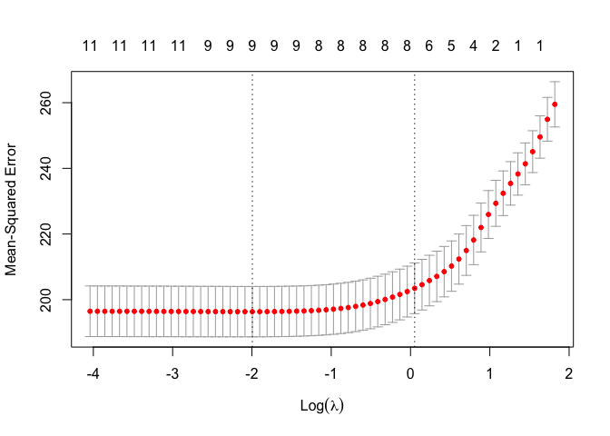
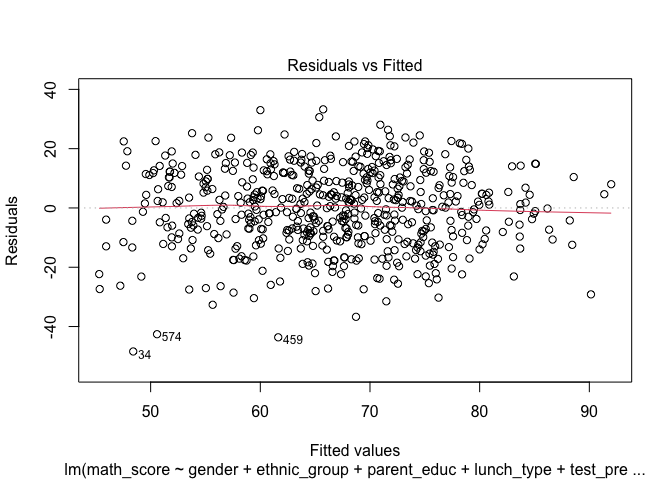
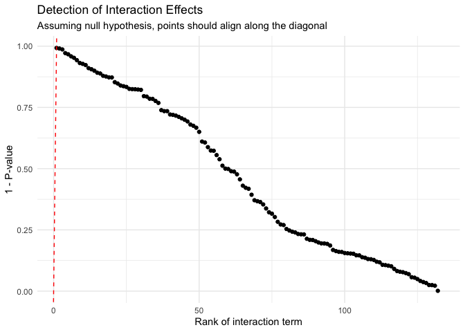

p8130_bm_final_proj
================
2024-11-25

``` r
library(tidyverse)
library(broom)
library(corrplot)
library(leaps)
library(glmnet)
library(faraway)
library(caret)
library(MASS) # boxcox
library(performance) # vif
```

``` r
df = read_csv("data/Project_1_data.csv")
```

    ## Rows: 948 Columns: 14
    ## ── Column specification ────────────────────────────────────────────────────────
    ## Delimiter: ","
    ## chr (10): Gender, EthnicGroup, ParentEduc, LunchType, TestPrep, ParentMarita...
    ## dbl  (4): NrSiblings, MathScore, ReadingScore, WritingScore
    ## 
    ## ℹ Use `spec()` to retrieve the full column specification for this data.
    ## ℹ Specify the column types or set `show_col_types = FALSE` to quiet this message.

``` r
score_df = df %>% 
  janitor::clean_names() %>% 
  drop_na() %>% # Drop rows with any missing values
  mutate(across(where(is.character), as.factor)) %>% 
  mutate(
    parent_educ = fct_relevel(parent_educ, "bachelor's degree"),
    lunch_type = fct_relevel(lunch_type, "standard"),
    parent_marital_status = fct_relevel(parent_marital_status, "married"),
    practice_sport = fct_relevel(practice_sport, "never"),
    wkly_study_hours = fct_relevel(wkly_study_hours, "<5"),
    wkly_study_hours = fct_recode(wkly_study_hours, "5 to 10" = "10-May"),
    transport_means = fct_relevel( transport_means, "private")
  )
```

    ## Warning: There was 1 warning in `mutate()`.
    ## ℹ In argument: `wkly_study_hours = fct_relevel(wkly_study_hours, "<5")`.
    ## Caused by warning:
    ## ! 1 unknown level in `f`: <5

``` r
score_df
```

    ## # A tibble: 587 × 14
    ##    gender ethnic_group parent_educ    lunch_type test_prep parent_marital_status
    ##    <fct>  <fct>        <fct>          <fct>      <fct>     <fct>                
    ##  1 female group B      master's degr… standard   none      single               
    ##  2 male   group C      some college   standard   none      married              
    ##  3 female group B      associate's d… standard   none      married              
    ##  4 female group B      some college   standard   completed widowed              
    ##  5 male   group B      some college   free/redu… none      married              
    ##  6 male   group D      high school    free/redu… completed single               
    ##  7 male   group D      associate's d… standard   none      divorced             
    ##  8 female group B      high school    standard   none      married              
    ##  9 male   group A      some college   standard   completed single               
    ## 10 female group A      master's degr… standard   none      divorced             
    ## # ℹ 577 more rows
    ## # ℹ 8 more variables: practice_sport <fct>, is_first_child <fct>,
    ## #   nr_siblings <dbl>, transport_means <fct>, wkly_study_hours <fct>,
    ## #   math_score <dbl>, reading_score <dbl>, writing_score <dbl>

``` r
#create a df just for predicting math score
math_df = 
  score_df %>% 
  dplyr::select(-reading_score, -writing_score) %>% 
  dplyr::select(math_score, everything())

# convert data to numeric
math_df_numeric = math_df %>% 
  mutate(across(where(is.factor), ~ as.numeric(.)))
```

``` r
# Descriptive Statistics
summary(score_df)
```

    ##     gender     ethnic_group             parent_educ         lunch_type 
    ##  female:315   group A: 50   bachelor's degree : 71   standard    :381  
    ##  male  :272   group B:123   associate's degree:128   free/reduced:206  
    ##               group C:174   high school       :122                     
    ##               group D:155   master's degree   : 39                     
    ##               group E: 85   some college      :116                     
    ##                             some high school  :111                     
    ##      test_prep   parent_marital_status   practice_sport is_first_child
    ##  completed:208   married :343          never    : 68    no :192       
    ##  none     :379   divorced: 92          regularly:218    yes:395       
    ##                  single  :137          sometimes:301                  
    ##                  widowed : 15                                         
    ##                                                                       
    ##                                                                       
    ##   nr_siblings     transport_means wkly_study_hours   math_score    
    ##  Min.   :0.00   private   :229    < 5    :154      Min.   :  0.00  
    ##  1st Qu.:1.00   school_bus:358    > 10   :104      1st Qu.: 56.00  
    ##  Median :2.00                     5 to 10:329      Median : 67.00  
    ##  Mean   :2.14                                      Mean   : 66.68  
    ##  3rd Qu.:3.00                                      3rd Qu.: 78.00  
    ##  Max.   :7.00                                      Max.   :100.00  
    ##  reading_score    writing_score  
    ##  Min.   : 17.00   Min.   : 10.0  
    ##  1st Qu.: 60.00   1st Qu.: 58.0  
    ##  Median : 70.00   Median : 69.0  
    ##  Mean   : 69.85   Mean   : 68.9  
    ##  3rd Qu.: 81.00   3rd Qu.: 79.0  
    ##  Max.   :100.00   Max.   :100.0

``` r
# Check for missing values
colSums(is.na(score_df))
```

    ##                gender          ethnic_group           parent_educ 
    ##                     0                     0                     0 
    ##            lunch_type             test_prep parent_marital_status 
    ##                     0                     0                     0 
    ##        practice_sport        is_first_child           nr_siblings 
    ##                     0                     0                     0 
    ##       transport_means      wkly_study_hours            math_score 
    ##                     0                     0                     0 
    ##         reading_score         writing_score 
    ##                     0                     0

No missing values in the outcome variables. significant missing in
various predictor variables.

``` r
# Visualize distributions of outcome variables
ggplot(score_df, aes(x = math_score)) + 
  geom_histogram(binwidth = 5, fill = "blue", alpha = 0.7) + 
  labs(title = "Distribution of Math Scores", x = "Math Score", y = "Frequency") +
  theme_minimal()
```

<!-- -->

``` r
ggplot(score_df, aes(x = reading_score)) + 
  geom_histogram(binwidth = 5, fill = "green", alpha = 0.7) + 
  labs(title = "Distribution of Reading Scores", x = "Reading Score", y = "Frequency") +
  theme_minimal()
```

<!-- -->

``` r
ggplot(score_df, aes(x = writing_score)) + 
  geom_histogram(binwidth = 5, fill = "red", alpha = 0.7) + 
  labs(title = "Distribution of Writing Scores", x = "Writing Score", y = "Frequency") +
  theme_minimal()
```

<!-- -->

``` r
par(mfrow=c(1,3))
boxplot(score_df$math_score, main='math_score')
boxplot(score_df$reading_score, main='reading_score')
boxplot(score_df$writing_score, main='writing_score')
```

<!-- -->

``` r
library(patchwork)
```

    ## 
    ## Attaching package: 'patchwork'

    ## The following object is masked from 'package:MASS':
    ## 
    ##     area

``` r
# Create individual bar plots for each categorical variable
plot_gender <- ggplot(score_df, aes(x = gender)) +
  geom_bar(fill = "skyblue") +
  labs(title = "Gender Distribution", x = "Gender", y = "Count") +
  theme_minimal()

plot_ethnic_group <- ggplot(score_df, aes(x = ethnic_group)) +
  geom_bar(fill = "lightgreen") +
  labs(title = "Ethnic Group Distribution", x = "Ethnic Group", y = "Count") +
  theme_minimal()

plot_parent_educ <- ggplot(score_df, aes(x = parent_educ)) +
  geom_bar(fill = "purple") +
  labs(title = "Parent Education Distribution", x = "Parent Education", y = "Count") +
  theme_minimal()

plot_lunch_type <- ggplot(score_df, aes(x = lunch_type)) +
  geom_bar(fill = "orange") +
  labs(title = "Lunch Type Distribution", x = "Lunch Type", y = "Count") +
  theme_minimal()

plot_test_prep <- ggplot(score_df, aes(x = test_prep)) +
  geom_bar(fill = "pink") +
  labs(title = "Test Prep Distribution", x = "Test Prep", y = "Count") +
  theme_minimal()

plot_practice_sport <- ggplot(score_df, aes(x = practice_sport)) +
  geom_bar(fill = "cyan") +
  labs(title = "Practice Sport Distribution", x = "Practice Sport", y = "Count") +
  theme_minimal()

# Example for other variables (add similar code for all remaining variables)
plot_is_first_child <- ggplot(score_df, aes(x = is_first_child)) +
  geom_bar(fill = "lightblue") +
  labs(title = "First Child Status Distribution", x = "Is First Child", y = "Count") +
  theme_minimal()

plot_nr_siblings <- ggplot(score_df, aes(x = factor(nr_siblings))) +
  geom_bar(fill = "red") +
  labs(title = "Number of Siblings Distribution", x = "Number of Siblings", y = "Count") +
  theme_minimal()

plot_transport_means <- ggplot(score_df, aes(x = transport_means)) +
  geom_bar(fill = "gold") +
  labs(title = "Transport Means Distribution", x = "Transport Means", y = "Count") +
  theme_minimal()

plot_wkly_study_hours <- ggplot(score_df, aes(x = wkly_study_hours)) +
  geom_bar(fill = "darkgreen") +
  labs(title = "Weekly Study Hours Distribution", x = "Weekly Study Hours", y = "Count") +
  theme_minimal()

# Adjusting plot layout with more vertical space
combined_plot <- (
  plot_gender + plot_ethnic_group + plot_parent_educ +
  plot_lunch_type + plot_test_prep + plot_practice_sport +
  plot_is_first_child + plot_nr_siblings +
  plot_transport_means + plot_wkly_study_hours
) + plot_layout(ncol = 2, heights = c(1, 1, 1, 1, 1)) # Adjust the number of rows to your needs

# Save as a larger plot with better dimensions
ggsave("combined_plot.png", combined_plot, width = 12, height = 18) # Adjust height/width

# Display the adjusted plot
print(combined_plot)
```

<!-- --> visualize
correlations

``` r
pairs(math_df_numeric)
```

<!-- -->

``` r
png("correlation_plot.png", width = 6, height = 4, units = "in", res = 150)
corrplot(cor(math_df_numeric), type = "upper", diag = FALSE)
```

looks like math score is correlated with gender, ethnic group, parent
education, lunch type, and test prep. Also slightly correlated with nr
siblings and weekly study hours

correlation between predictors: marital status & is first child parent
education & nr siblings, transportation means test prep & is first
child, nr siblings, transportation means, weekly study hours is first
child & nr siblings

Use automatic procedures to find a ‘best subset’ of the full model for
predicting math scores.

``` r
# Full model
full_model <- lm(math_score ~ ., data = math_df)

summary(full_model)
```

    ## 
    ## Call:
    ## lm(formula = math_score ~ ., data = math_df)
    ## 
    ## Residuals:
    ##     Min      1Q  Median      3Q     Max 
    ## -48.916  -9.265   0.725  10.104  33.013 
    ## 
    ## Coefficients:
    ##                               Estimate Std. Error t value Pr(>|t|)    
    ## (Intercept)                    68.6002     3.6318  18.889  < 2e-16 ***
    ## gendermale                      5.0855     1.1386   4.467 9.61e-06 ***
    ## ethnic_groupgroup B            -0.1788     2.3136  -0.077 0.938412    
    ## ethnic_groupgroup C            -0.2089     2.2149  -0.094 0.924894    
    ## ethnic_groupgroup D             3.6247     2.2286   1.626 0.104411    
    ## ethnic_groupgroup E            11.1752     2.4434   4.574 5.90e-06 ***
    ## parent_educassociate's degree  -1.7594     2.0219  -0.870 0.384578    
    ## parent_educhigh school         -6.9886     2.0606  -3.392 0.000743 ***
    ## parent_educmaster's degree      0.1444     2.7244   0.053 0.957739    
    ## parent_educsome college        -3.4719     2.0596  -1.686 0.092404 .  
    ## parent_educsome high school    -6.6652     2.0763  -3.210 0.001402 ** 
    ## lunch_typefree/reduced        -12.3539     1.1771 -10.495  < 2e-16 ***
    ## test_prepnone                  -4.7717     1.2007  -3.974 7.99e-05 ***
    ## parent_marital_statusdivorced  -5.4805     1.6170  -3.389 0.000750 ***
    ## parent_marital_statussingle    -3.3124     1.3795  -2.401 0.016671 *  
    ## parent_marital_statuswidowed    2.3139     3.6074   0.641 0.521509    
    ## practice_sportregularly         1.6701     1.9046   0.877 0.380922    
    ## practice_sportsometimes         1.5255     1.8439   0.827 0.408383    
    ## is_first_childyes               1.1303     1.2125   0.932 0.351621    
    ## nr_siblings                     0.7403     0.3844   1.926 0.054614 .  
    ## transport_meansschool_bus      -0.4319     1.1629  -0.371 0.710500    
    ## wkly_study_hours> 10            3.0384     1.7540   1.732 0.083781 .  
    ## wkly_study_hours5 to 10         3.5394     1.3429   2.636 0.008631 ** 
    ## ---
    ## Signif. codes:  0 '***' 0.001 '**' 0.01 '*' 0.05 '.' 0.1 ' ' 1
    ## 
    ## Residual standard error: 13.52 on 564 degrees of freedom
    ## Multiple R-squared:  0.3221, Adjusted R-squared:  0.2956 
    ## F-statistic: 12.18 on 22 and 564 DF,  p-value: < 2.2e-16

``` r
# Backward elimination
backward_model <- step(full_model, direction = "backward")
```

    ## Start:  AIC=3080.15
    ## math_score ~ gender + ethnic_group + parent_educ + lunch_type + 
    ##     test_prep + parent_marital_status + practice_sport + is_first_child + 
    ##     nr_siblings + transport_means + wkly_study_hours
    ## 
    ##                         Df Sum of Sq    RSS    AIC
    ## - practice_sport         2     149.5 103299 3077.0
    ## - transport_means        1      25.2 103175 3078.3
    ## - is_first_child         1     158.9 103308 3079.1
    ## <none>                               103149 3080.1
    ## - nr_siblings            1     678.4 103828 3082.0
    ## - wkly_study_hours       2    1299.9 104449 3083.5
    ## - parent_marital_status  3    2798.6 105948 3089.9
    ## - parent_educ            5    4174.0 107323 3093.4
    ## - test_prep              1    2888.2 106038 3094.4
    ## - gender                 1    3648.7 106798 3098.6
    ## - ethnic_group           4    8780.7 111930 3120.1
    ## - lunch_type             1   20145.7 123295 3182.9
    ## 
    ## Step:  AIC=3077
    ## math_score ~ gender + ethnic_group + parent_educ + lunch_type + 
    ##     test_prep + parent_marital_status + is_first_child + nr_siblings + 
    ##     transport_means + wkly_study_hours
    ## 
    ##                         Df Sum of Sq    RSS    AIC
    ## - transport_means        1      20.2 103319 3075.1
    ## - is_first_child         1     144.3 103443 3075.8
    ## <none>                               103299 3077.0
    ## - nr_siblings            1     676.7 103976 3078.8
    ## - wkly_study_hours       2    1325.3 104624 3080.5
    ## - parent_marital_status  3    2815.0 106114 3086.8
    ## - parent_educ            5    4108.3 107407 3089.9
    ## - test_prep              1    2955.2 106254 3091.6
    ## - gender                 1    3643.0 106942 3095.3
    ## - ethnic_group           4    8744.5 112043 3116.7
    ## - lunch_type             1   20057.7 123357 3179.2
    ## 
    ## Step:  AIC=3075.11
    ## math_score ~ gender + ethnic_group + parent_educ + lunch_type + 
    ##     test_prep + parent_marital_status + is_first_child + nr_siblings + 
    ##     wkly_study_hours
    ## 
    ##                         Df Sum of Sq    RSS    AIC
    ## - is_first_child         1     142.1 103461 3073.9
    ## <none>                               103319 3075.1
    ## - nr_siblings            1     675.5 103995 3076.9
    ## - wkly_study_hours       2    1319.0 104638 3078.6
    ## - parent_marital_status  3    2802.2 106121 3084.8
    ## - parent_educ            5    4088.2 107407 3087.9
    ## - test_prep              1    3021.0 106340 3090.0
    ## - gender                 1    3635.8 106955 3093.4
    ## - ethnic_group           4    8741.3 112060 3114.8
    ## - lunch_type             1   20047.0 123366 3177.2
    ## 
    ## Step:  AIC=3073.92
    ## math_score ~ gender + ethnic_group + parent_educ + lunch_type + 
    ##     test_prep + parent_marital_status + nr_siblings + wkly_study_hours
    ## 
    ##                         Df Sum of Sq    RSS    AIC
    ## <none>                               103461 3073.9
    ## - nr_siblings            1     629.8 104091 3075.5
    ## - wkly_study_hours       2    1344.8 104806 3077.5
    ## - parent_marital_status  3    2726.0 106187 3083.2
    ## - parent_educ            5    4053.0 107514 3086.5
    ## - test_prep              1    3115.5 106577 3089.3
    ## - gender                 1    3650.4 107112 3092.3
    ## - ethnic_group           4    8726.4 112188 3113.5
    ## - lunch_type             1   20082.2 123543 3176.1

``` r
summary(backward_model)
```

    ## 
    ## Call:
    ## lm(formula = math_score ~ gender + ethnic_group + parent_educ + 
    ##     lunch_type + test_prep + parent_marital_status + nr_siblings + 
    ##     wkly_study_hours, data = math_df)
    ## 
    ## Residuals:
    ##     Min      1Q  Median      3Q     Max 
    ## -48.412  -8.860   0.405  10.319  33.266 
    ## 
    ## Coefficients:
    ##                                Estimate Std. Error t value Pr(>|t|)    
    ## (Intercept)                    70.42447    3.11185  22.631  < 2e-16 ***
    ## gendermale                      5.08556    1.13600   4.477 9.16e-06 ***
    ## ethnic_groupgroup B            -0.12625    2.30718  -0.055 0.956379    
    ## ethnic_groupgroup C            -0.06815    2.20498  -0.031 0.975356    
    ## ethnic_groupgroup D             3.71549    2.22091   1.673 0.094886 .  
    ## ethnic_groupgroup E            11.18161    2.43421   4.594 5.37e-06 ***
    ## parent_educassociate's degree  -1.71868    2.01735  -0.852 0.394602    
    ## parent_educhigh school         -6.78035    2.04750  -3.312 0.000987 ***
    ## parent_educmaster's degree      0.16015    2.70815   0.059 0.952864    
    ## parent_educsome college        -3.31076    2.04812  -1.616 0.106545    
    ## parent_educsome high school    -6.59755    2.07021  -3.187 0.001517 ** 
    ## lunch_typefree/reduced        -12.32626    1.17393 -10.500  < 2e-16 ***
    ## test_prepnone                  -4.92090    1.18986  -4.136 4.07e-05 ***
    ## parent_marital_statusdivorced  -5.41133    1.60455  -3.372 0.000796 ***
    ## parent_marital_statussingle    -3.27652    1.37560  -2.382 0.017552 *  
    ## parent_marital_statuswidowed    2.07639    3.59312   0.578 0.563575    
    ## nr_siblings                     0.71090    0.38232   1.859 0.063482 .  
    ## wkly_study_hours> 10            3.04378    1.74927   1.740 0.082395 .  
    ## wkly_study_hours5 to 10         3.60274    1.33885   2.691 0.007335 ** 
    ## ---
    ## Signif. codes:  0 '***' 0.001 '**' 0.01 '*' 0.05 '.' 0.1 ' ' 1
    ## 
    ## Residual standard error: 13.5 on 568 degrees of freedom
    ## Multiple R-squared:   0.32,  Adjusted R-squared:  0.2985 
    ## F-statistic: 14.85 on 18 and 568 DF,  p-value: < 2.2e-16

``` r
model_summary = summary(backward_model)

coeff_table <- model_summary$coefficients

# Filter for significant terms (p-value < 0.05)
significant_terms <- coeff_table[coeff_table[, "Pr(>|t|)"] < 0.05, ]

# Create a data frame for better readability
significant_terms_df <- data.frame(
  Term = rownames(significant_terms),
  Coefficient = significant_terms[, "Estimate"],
  P_Value = significant_terms[, "Pr(>|t|)"]
)

# Print the significant terms
knitr::kable(significant_terms_df)
```

|                               | Term                          | Coefficient |   P_Value |
|:------------------------------|:------------------------------|------------:|----------:|
| (Intercept)                   | (Intercept)                   |   70.424471 | 0.0000000 |
| gendermale                    | gendermale                    |    5.085559 | 0.0000092 |
| ethnic_groupgroup E           | ethnic_groupgroup E           |   11.181607 | 0.0000054 |
| parent_educhigh school        | parent_educhigh school        |   -6.780350 | 0.0009868 |
| parent_educsome high school   | parent_educsome high school   |   -6.597548 | 0.0015171 |
| lunch_typefree/reduced        | lunch_typefree/reduced        |  -12.326263 | 0.0000000 |
| test_prepnone                 | test_prepnone                 |   -4.920901 | 0.0000407 |
| parent_marital_statusdivorced | parent_marital_statusdivorced |   -5.411327 | 0.0007956 |
| parent_marital_statussingle   | parent_marital_statussingle   |   -3.276517 | 0.0175525 |
| wkly_study_hours5 to 10       | wkly_study_hours5 to 10       |    3.602742 | 0.0073353 |

forward selection

``` r
# Null model (no predictors)
null_model <- lm(math_score ~ 1, data = math_df)

# Forward selection
forward_model <- step(null_model, direction = "forward", scope = formula(full_model))
```

    ## Start:  AIC=3264.33
    ## math_score ~ 1
    ## 
    ##                         Df Sum of Sq    RSS    AIC
    ## + lunch_type             1   22340.6 129816 3173.1
    ## + ethnic_group           4   11630.1 140526 3225.7
    ## + gender                 1    5114.8 147042 3246.3
    ## + test_prep              1    4114.3 148042 3250.2
    ## + parent_educ            5    4397.1 147759 3257.1
    ## + wkly_study_hours       2    2365.3 149791 3259.1
    ## + parent_marital_status  3    2625.8 149531 3260.1
    ## + nr_siblings            1     615.0 151541 3264.0
    ## <none>                               152157 3264.3
    ## + is_first_child         1     132.5 152024 3265.8
    ## + transport_means        1       0.3 152156 3266.3
    ## + practice_sport         2      17.8 152139 3268.3
    ## 
    ## Step:  AIC=3173.12
    ## math_score ~ lunch_type
    ## 
    ##                         Df Sum of Sq    RSS    AIC
    ## + ethnic_group           4   10097.8 119718 3133.6
    ## + test_prep              1    4711.5 125104 3153.4
    ## + gender                 1    4049.1 125767 3156.5
    ## + parent_educ            5    4657.6 125158 3161.7
    ## + parent_marital_status  3    2481.0 127335 3167.8
    ## + wkly_study_hours       2    2008.6 127807 3168.0
    ## + nr_siblings            1     601.2 129215 3172.4
    ## <none>                               129816 3173.1
    ## + is_first_child         1      93.5 129722 3174.7
    ## + transport_means        1       1.5 129814 3175.1
    ## + practice_sport         2      76.4 129739 3176.8
    ## 
    ## Step:  AIC=3133.59
    ## math_score ~ lunch_type + ethnic_group
    ## 
    ##                         Df Sum of Sq    RSS    AIC
    ## + test_prep              1    4077.4 115641 3115.2
    ## + gender                 1    3574.9 116143 3117.8
    ## + parent_marital_status  3    3208.1 116510 3123.7
    ## + parent_educ            5    3901.2 115817 3124.1
    ## + wkly_study_hours       2    1623.3 118095 3129.6
    ## + nr_siblings            1     669.1 119049 3132.3
    ## <none>                               119718 3133.6
    ## + is_first_child         1      82.1 119636 3135.2
    ## + transport_means        1       1.2 119717 3135.6
    ## + practice_sport         2     178.0 119540 3136.7
    ## 
    ## Step:  AIC=3115.25
    ## math_score ~ lunch_type + ethnic_group + test_prep
    ## 
    ##                         Df Sum of Sq    RSS    AIC
    ## + gender                 1    3258.7 112382 3100.5
    ## + parent_marital_status  3    3343.5 112297 3104.0
    ## + parent_educ            5    3694.7 111946 3106.2
    ## + wkly_study_hours       2    1226.5 114414 3113.0
    ## + nr_siblings            1     527.9 115113 3114.6
    ## <none>                               115641 3115.2
    ## + is_first_child         1      34.0 115607 3117.1
    ## + transport_means        1      12.8 115628 3117.2
    ## + practice_sport         2     113.8 115527 3118.7
    ## 
    ## Step:  AIC=3100.47
    ## math_score ~ lunch_type + ethnic_group + test_prep + gender
    ## 
    ##                         Df Sum of Sq    RSS    AIC
    ## + parent_educ            5    4081.3 108301 3088.8
    ## + parent_marital_status  3    3157.1 109225 3089.7
    ## + wkly_study_hours       2    1243.9 111138 3097.9
    ## + nr_siblings            1     631.9 111750 3099.2
    ## <none>                               112382 3100.5
    ## + is_first_child         1      24.9 112357 3102.3
    ## + transport_means        1       7.4 112375 3102.4
    ## + practice_sport         2     118.4 112264 3103.8
    ## 
    ## Step:  AIC=3088.76
    ## math_score ~ lunch_type + ethnic_group + test_prep + gender + 
    ##     parent_educ
    ## 
    ##                         Df Sum of Sq    RSS    AIC
    ## + parent_marital_status  3   2912.61 105388 3078.8
    ## + wkly_study_hours       2   1385.30 106915 3085.2
    ## + nr_siblings            1    681.65 107619 3087.1
    ## <none>                               108301 3088.8
    ## + is_first_child         1     46.96 108254 3090.5
    ## + transport_means        1      2.22 108298 3090.7
    ## + practice_sport         2    172.15 108129 3091.8
    ## 
    ## Step:  AIC=3078.75
    ## math_score ~ lunch_type + ethnic_group + test_prep + gender + 
    ##     parent_educ + parent_marital_status
    ## 
    ##                    Df Sum of Sq    RSS    AIC
    ## + wkly_study_hours  2   1297.10 104091 3075.5
    ## + nr_siblings       1    582.04 104806 3077.5
    ## <none>                          105388 3078.8
    ## + is_first_child    1    118.24 105270 3080.1
    ## + transport_means   1     11.07 105377 3080.7
    ## + practice_sport    2    153.50 105235 3081.9
    ## 
    ## Step:  AIC=3075.48
    ## math_score ~ lunch_type + ethnic_group + test_prep + gender + 
    ##     parent_educ + parent_marital_status + wkly_study_hours
    ## 
    ##                   Df Sum of Sq    RSS    AIC
    ## + nr_siblings      1    629.79 103461 3073.9
    ## <none>                         104091 3075.5
    ## + is_first_child   1     96.35 103995 3076.9
    ## + transport_means  1     17.33 104074 3077.4
    ## + practice_sport   2    131.10 103960 3078.7
    ## 
    ## Step:  AIC=3073.92
    ## math_score ~ lunch_type + ethnic_group + test_prep + gender + 
    ##     parent_educ + parent_marital_status + wkly_study_hours + 
    ##     nr_siblings
    ## 
    ##                   Df Sum of Sq    RSS    AIC
    ## <none>                         103461 3073.9
    ## + is_first_child   1   142.106 103319 3075.1
    ## + transport_means  1    18.041 103443 3075.8
    ## + practice_sport   2   130.088 103331 3077.2

``` r
# Summary of the final model
summary(forward_model)
```

    ## 
    ## Call:
    ## lm(formula = math_score ~ lunch_type + ethnic_group + test_prep + 
    ##     gender + parent_educ + parent_marital_status + wkly_study_hours + 
    ##     nr_siblings, data = math_df)
    ## 
    ## Residuals:
    ##     Min      1Q  Median      3Q     Max 
    ## -48.412  -8.860   0.405  10.319  33.266 
    ## 
    ## Coefficients:
    ##                                Estimate Std. Error t value Pr(>|t|)    
    ## (Intercept)                    70.42447    3.11185  22.631  < 2e-16 ***
    ## lunch_typefree/reduced        -12.32626    1.17393 -10.500  < 2e-16 ***
    ## ethnic_groupgroup B            -0.12625    2.30718  -0.055 0.956379    
    ## ethnic_groupgroup C            -0.06815    2.20498  -0.031 0.975356    
    ## ethnic_groupgroup D             3.71549    2.22091   1.673 0.094886 .  
    ## ethnic_groupgroup E            11.18161    2.43421   4.594 5.37e-06 ***
    ## test_prepnone                  -4.92090    1.18986  -4.136 4.07e-05 ***
    ## gendermale                      5.08556    1.13600   4.477 9.16e-06 ***
    ## parent_educassociate's degree  -1.71868    2.01735  -0.852 0.394602    
    ## parent_educhigh school         -6.78035    2.04750  -3.312 0.000987 ***
    ## parent_educmaster's degree      0.16015    2.70815   0.059 0.952864    
    ## parent_educsome college        -3.31076    2.04812  -1.616 0.106545    
    ## parent_educsome high school    -6.59755    2.07021  -3.187 0.001517 ** 
    ## parent_marital_statusdivorced  -5.41133    1.60455  -3.372 0.000796 ***
    ## parent_marital_statussingle    -3.27652    1.37560  -2.382 0.017552 *  
    ## parent_marital_statuswidowed    2.07639    3.59312   0.578 0.563575    
    ## wkly_study_hours> 10            3.04378    1.74927   1.740 0.082395 .  
    ## wkly_study_hours5 to 10         3.60274    1.33885   2.691 0.007335 ** 
    ## nr_siblings                     0.71090    0.38232   1.859 0.063482 .  
    ## ---
    ## Signif. codes:  0 '***' 0.001 '**' 0.01 '*' 0.05 '.' 0.1 ' ' 1
    ## 
    ## Residual standard error: 13.5 on 568 degrees of freedom
    ## Multiple R-squared:   0.32,  Adjusted R-squared:  0.2985 
    ## F-statistic: 14.85 on 18 and 568 DF,  p-value: < 2.2e-16

``` r
model_summary = summary(forward_model)

coeff_table <- model_summary$coefficients

# Filter for significant terms (p-value < 0.05)
significant_terms <- coeff_table[coeff_table[, "Pr(>|t|)"] < 0.05, ]

# Create a data frame for better readability
significant_terms_df <- data.frame(
  Term = rownames(significant_terms),
  Coefficient = significant_terms[, "Estimate"],
  P_Value = significant_terms[, "Pr(>|t|)"]
)

# Print the significant terms
knitr::kable(significant_terms_df)
```

|                               | Term                          | Coefficient |   P_Value |
|:------------------------------|:------------------------------|------------:|----------:|
| (Intercept)                   | (Intercept)                   |   70.424471 | 0.0000000 |
| lunch_typefree/reduced        | lunch_typefree/reduced        |  -12.326263 | 0.0000000 |
| ethnic_groupgroup E           | ethnic_groupgroup E           |   11.181607 | 0.0000054 |
| test_prepnone                 | test_prepnone                 |   -4.920901 | 0.0000407 |
| gendermale                    | gendermale                    |    5.085559 | 0.0000092 |
| parent_educhigh school        | parent_educhigh school        |   -6.780350 | 0.0009868 |
| parent_educsome high school   | parent_educsome high school   |   -6.597548 | 0.0015171 |
| parent_marital_statusdivorced | parent_marital_statusdivorced |   -5.411327 | 0.0007956 |
| parent_marital_statussingle   | parent_marital_statussingle   |   -3.276517 | 0.0175525 |
| wkly_study_hours5 to 10       | wkly_study_hours5 to 10       |    3.602742 | 0.0073353 |

stepwise

``` r
# Stepwise regression
stepwise_model <- step(full_model, direction = "both")
```

    ## Start:  AIC=3080.15
    ## math_score ~ gender + ethnic_group + parent_educ + lunch_type + 
    ##     test_prep + parent_marital_status + practice_sport + is_first_child + 
    ##     nr_siblings + transport_means + wkly_study_hours
    ## 
    ##                         Df Sum of Sq    RSS    AIC
    ## - practice_sport         2     149.5 103299 3077.0
    ## - transport_means        1      25.2 103175 3078.3
    ## - is_first_child         1     158.9 103308 3079.1
    ## <none>                               103149 3080.1
    ## - nr_siblings            1     678.4 103828 3082.0
    ## - wkly_study_hours       2    1299.9 104449 3083.5
    ## - parent_marital_status  3    2798.6 105948 3089.9
    ## - parent_educ            5    4174.0 107323 3093.4
    ## - test_prep              1    2888.2 106038 3094.4
    ## - gender                 1    3648.7 106798 3098.6
    ## - ethnic_group           4    8780.7 111930 3120.1
    ## - lunch_type             1   20145.7 123295 3182.9
    ## 
    ## Step:  AIC=3077
    ## math_score ~ gender + ethnic_group + parent_educ + lunch_type + 
    ##     test_prep + parent_marital_status + is_first_child + nr_siblings + 
    ##     transport_means + wkly_study_hours
    ## 
    ##                         Df Sum of Sq    RSS    AIC
    ## - transport_means        1      20.2 103319 3075.1
    ## - is_first_child         1     144.3 103443 3075.8
    ## <none>                               103299 3077.0
    ## - nr_siblings            1     676.7 103976 3078.8
    ## + practice_sport         2     149.5 103149 3080.1
    ## - wkly_study_hours       2    1325.3 104624 3080.5
    ## - parent_marital_status  3    2815.0 106114 3086.8
    ## - parent_educ            5    4108.3 107407 3089.9
    ## - test_prep              1    2955.2 106254 3091.6
    ## - gender                 1    3643.0 106942 3095.3
    ## - ethnic_group           4    8744.5 112043 3116.7
    ## - lunch_type             1   20057.7 123357 3179.2
    ## 
    ## Step:  AIC=3075.11
    ## math_score ~ gender + ethnic_group + parent_educ + lunch_type + 
    ##     test_prep + parent_marital_status + is_first_child + nr_siblings + 
    ##     wkly_study_hours
    ## 
    ##                         Df Sum of Sq    RSS    AIC
    ## - is_first_child         1     142.1 103461 3073.9
    ## <none>                               103319 3075.1
    ## - nr_siblings            1     675.5 103995 3076.9
    ## + transport_means        1      20.2 103299 3077.0
    ## + practice_sport         2     144.4 103175 3078.3
    ## - wkly_study_hours       2    1319.0 104638 3078.6
    ## - parent_marital_status  3    2802.2 106121 3084.8
    ## - parent_educ            5    4088.2 107407 3087.9
    ## - test_prep              1    3021.0 106340 3090.0
    ## - gender                 1    3635.8 106955 3093.4
    ## - ethnic_group           4    8741.3 112060 3114.8
    ## - lunch_type             1   20047.0 123366 3177.2
    ## 
    ## Step:  AIC=3073.92
    ## math_score ~ gender + ethnic_group + parent_educ + lunch_type + 
    ##     test_prep + parent_marital_status + nr_siblings + wkly_study_hours
    ## 
    ##                         Df Sum of Sq    RSS    AIC
    ## <none>                               103461 3073.9
    ## + is_first_child         1     142.1 103319 3075.1
    ## - nr_siblings            1     629.8 104091 3075.5
    ## + transport_means        1      18.0 103443 3075.8
    ## + practice_sport         2     130.1 103331 3077.2
    ## - wkly_study_hours       2    1344.8 104806 3077.5
    ## - parent_marital_status  3    2726.0 106187 3083.2
    ## - parent_educ            5    4053.0 107514 3086.5
    ## - test_prep              1    3115.5 106577 3089.3
    ## - gender                 1    3650.4 107112 3092.3
    ## - ethnic_group           4    8726.4 112188 3113.5
    ## - lunch_type             1   20082.2 123543 3176.1

``` r
# Summary of the final model
summary(stepwise_model)
```

    ## 
    ## Call:
    ## lm(formula = math_score ~ gender + ethnic_group + parent_educ + 
    ##     lunch_type + test_prep + parent_marital_status + nr_siblings + 
    ##     wkly_study_hours, data = math_df)
    ## 
    ## Residuals:
    ##     Min      1Q  Median      3Q     Max 
    ## -48.412  -8.860   0.405  10.319  33.266 
    ## 
    ## Coefficients:
    ##                                Estimate Std. Error t value Pr(>|t|)    
    ## (Intercept)                    70.42447    3.11185  22.631  < 2e-16 ***
    ## gendermale                      5.08556    1.13600   4.477 9.16e-06 ***
    ## ethnic_groupgroup B            -0.12625    2.30718  -0.055 0.956379    
    ## ethnic_groupgroup C            -0.06815    2.20498  -0.031 0.975356    
    ## ethnic_groupgroup D             3.71549    2.22091   1.673 0.094886 .  
    ## ethnic_groupgroup E            11.18161    2.43421   4.594 5.37e-06 ***
    ## parent_educassociate's degree  -1.71868    2.01735  -0.852 0.394602    
    ## parent_educhigh school         -6.78035    2.04750  -3.312 0.000987 ***
    ## parent_educmaster's degree      0.16015    2.70815   0.059 0.952864    
    ## parent_educsome college        -3.31076    2.04812  -1.616 0.106545    
    ## parent_educsome high school    -6.59755    2.07021  -3.187 0.001517 ** 
    ## lunch_typefree/reduced        -12.32626    1.17393 -10.500  < 2e-16 ***
    ## test_prepnone                  -4.92090    1.18986  -4.136 4.07e-05 ***
    ## parent_marital_statusdivorced  -5.41133    1.60455  -3.372 0.000796 ***
    ## parent_marital_statussingle    -3.27652    1.37560  -2.382 0.017552 *  
    ## parent_marital_statuswidowed    2.07639    3.59312   0.578 0.563575    
    ## nr_siblings                     0.71090    0.38232   1.859 0.063482 .  
    ## wkly_study_hours> 10            3.04378    1.74927   1.740 0.082395 .  
    ## wkly_study_hours5 to 10         3.60274    1.33885   2.691 0.007335 ** 
    ## ---
    ## Signif. codes:  0 '***' 0.001 '**' 0.01 '*' 0.05 '.' 0.1 ' ' 1
    ## 
    ## Residual standard error: 13.5 on 568 degrees of freedom
    ## Multiple R-squared:   0.32,  Adjusted R-squared:  0.2985 
    ## F-statistic: 14.85 on 18 and 568 DF,  p-value: < 2.2e-16

``` r
model_summary = summary(stepwise_model)

coeff_table <- model_summary$coefficients

# Filter for significant terms (p-value < 0.05)
significant_terms <- coeff_table[coeff_table[, "Pr(>|t|)"] < 0.05, ]

# Create a data frame for better readability
significant_terms_df <- data.frame(
  Term = rownames(significant_terms),
  Coefficient = significant_terms[, "Estimate"],
  P_Value = significant_terms[, "Pr(>|t|)"]
)

# Print the significant terms
knitr::kable(significant_terms_df)
```

|                               | Term                          | Coefficient |   P_Value |
|:------------------------------|:------------------------------|------------:|----------:|
| (Intercept)                   | (Intercept)                   |   70.424471 | 0.0000000 |
| gendermale                    | gendermale                    |    5.085559 | 0.0000092 |
| ethnic_groupgroup E           | ethnic_groupgroup E           |   11.181607 | 0.0000054 |
| parent_educhigh school        | parent_educhigh school        |   -6.780350 | 0.0009868 |
| parent_educsome high school   | parent_educsome high school   |   -6.597548 | 0.0015171 |
| lunch_typefree/reduced        | lunch_typefree/reduced        |  -12.326263 | 0.0000000 |
| test_prepnone                 | test_prepnone                 |   -4.920901 | 0.0000407 |
| parent_marital_statusdivorced | parent_marital_statusdivorced |   -5.411327 | 0.0007956 |
| parent_marital_statussingle   | parent_marital_statussingle   |   -3.276517 | 0.0175525 |
| wkly_study_hours5 to 10       | wkly_study_hours5 to 10       |    3.602742 | 0.0073353 |

- Do the procedures generate the same model?

yes! significant predictors are (7):

- Gender
- ethnic_group
- parent_educ
- lunch_type
- test_prep
- parent_marital_status
- wkly_study_hours

Since multi-colinearity can make a predictor appear less significant, we
should check for it.

``` r
vif(lm(math_score ~ ., data = math_df))
```

    ##                    gendermale           ethnic_groupgroup B 
    ##                      1.034618                      2.845495 
    ##           ethnic_groupgroup C           ethnic_groupgroup D 
    ##                      3.283702                      3.097841 
    ##           ethnic_groupgroup E parent_educassociate's degree 
    ##                      2.372927                      2.237225 
    ##        parent_educhigh school    parent_educmaster's degree 
    ##                      2.243647                      1.477643 
    ##       parent_educsome college   parent_educsome high school 
    ##                      2.158876                      2.121665 
    ##        lunch_typefree/reduced                 test_prepnone 
    ##                      1.012939                      1.058701 
    ## parent_marital_statusdivorced   parent_marital_statussingle 
    ##                      1.109134                      1.092887 
    ##  parent_marital_statuswidowed       practice_sportregularly 
    ##                      1.040052                      2.718020 
    ##       practice_sportsometimes             is_first_childyes 
    ##                      2.726220                      1.038500 
    ##                   nr_siblings     transport_meansschool_bus 
    ##                      1.039492                      1.032714 
    ##          wkly_study_hours> 10       wkly_study_hours5 to 10 
    ##                      1.439583                      1.425941

None of the VIFs are larger than 5, so multi-colinearity is likely not a
concern.

Use criterion-based procedures to guide your selection of the ‘best
subset’. Summarize your results (tabular or graphical).

``` r
mat = as.matrix(math_df_numeric)
# Printing the 2 best models of each size, using the Cp criterion:
leaps(x = mat[,2:12], y = mat[,1], nbest = 2, method = "Cp")
```

    ## $which
    ##        1     2     3     4     5     6     7     8     9     A     B
    ## 1  FALSE FALSE FALSE  TRUE FALSE FALSE FALSE FALSE FALSE FALSE FALSE
    ## 1  FALSE  TRUE FALSE FALSE FALSE FALSE FALSE FALSE FALSE FALSE FALSE
    ## 2  FALSE  TRUE FALSE  TRUE FALSE FALSE FALSE FALSE FALSE FALSE FALSE
    ## 2  FALSE FALSE FALSE  TRUE  TRUE FALSE FALSE FALSE FALSE FALSE FALSE
    ## 3  FALSE  TRUE FALSE  TRUE  TRUE FALSE FALSE FALSE FALSE FALSE FALSE
    ## 3   TRUE  TRUE FALSE  TRUE FALSE FALSE FALSE FALSE FALSE FALSE FALSE
    ## 4   TRUE  TRUE FALSE  TRUE  TRUE FALSE FALSE FALSE FALSE FALSE FALSE
    ## 4  FALSE  TRUE  TRUE  TRUE  TRUE FALSE FALSE FALSE FALSE FALSE FALSE
    ## 5   TRUE  TRUE  TRUE  TRUE  TRUE FALSE FALSE FALSE FALSE FALSE FALSE
    ## 5   TRUE  TRUE FALSE  TRUE  TRUE FALSE FALSE FALSE FALSE FALSE  TRUE
    ## 6   TRUE  TRUE  TRUE  TRUE  TRUE FALSE FALSE FALSE FALSE FALSE  TRUE
    ## 6   TRUE  TRUE  TRUE  TRUE  TRUE  TRUE FALSE FALSE FALSE FALSE FALSE
    ## 7   TRUE  TRUE  TRUE  TRUE  TRUE  TRUE FALSE FALSE FALSE FALSE  TRUE
    ## 7   TRUE  TRUE  TRUE  TRUE  TRUE FALSE FALSE FALSE  TRUE FALSE  TRUE
    ## 8   TRUE  TRUE  TRUE  TRUE  TRUE  TRUE FALSE FALSE  TRUE FALSE  TRUE
    ## 8   TRUE  TRUE  TRUE  TRUE  TRUE  TRUE FALSE  TRUE FALSE FALSE  TRUE
    ## 9   TRUE  TRUE  TRUE  TRUE  TRUE  TRUE FALSE  TRUE  TRUE FALSE  TRUE
    ## 9   TRUE  TRUE  TRUE  TRUE  TRUE  TRUE FALSE FALSE  TRUE  TRUE  TRUE
    ## 10  TRUE  TRUE  TRUE  TRUE  TRUE  TRUE FALSE  TRUE  TRUE  TRUE  TRUE
    ## 10  TRUE  TRUE  TRUE  TRUE  TRUE  TRUE  TRUE  TRUE  TRUE FALSE  TRUE
    ## 11  TRUE  TRUE  TRUE  TRUE  TRUE  TRUE  TRUE  TRUE  TRUE  TRUE  TRUE
    ## 
    ## $label
    ##  [1] "(Intercept)" "1"           "2"           "3"           "4"          
    ##  [6] "5"           "6"           "7"           "8"           "9"          
    ## [11] "A"           "B"          
    ## 
    ## $size
    ##  [1]  2  2  3  3  4  4  5  5  6  6  7  7  8  8  9  9 10 10 11 11 12
    ## 
    ## $Cp
    ##  [1]  92.293348 167.913644  58.840659  69.784228  37.433706  39.941035
    ##  [7]  20.306897  31.044895  14.174985  16.443060  10.175332  11.685145
    ## [13]   7.663704   8.838348   6.272364   9.549699   8.028065   8.252666
    ## [19]  10.010098  10.016545  12.000000

``` r
# Printing the 2 best models of each size, using the adjusted R^2 criterion:
leaps(x = mat[,2:12], y = mat[,1], nbest = 2, method = "adjr2")
```

    ## $which
    ##        1     2     3     4     5     6     7     8     9     A     B
    ## 1  FALSE FALSE FALSE  TRUE FALSE FALSE FALSE FALSE FALSE FALSE FALSE
    ## 1  FALSE  TRUE FALSE FALSE FALSE FALSE FALSE FALSE FALSE FALSE FALSE
    ## 2  FALSE  TRUE FALSE  TRUE FALSE FALSE FALSE FALSE FALSE FALSE FALSE
    ## 2  FALSE FALSE FALSE  TRUE  TRUE FALSE FALSE FALSE FALSE FALSE FALSE
    ## 3  FALSE  TRUE FALSE  TRUE  TRUE FALSE FALSE FALSE FALSE FALSE FALSE
    ## 3   TRUE  TRUE FALSE  TRUE FALSE FALSE FALSE FALSE FALSE FALSE FALSE
    ## 4   TRUE  TRUE FALSE  TRUE  TRUE FALSE FALSE FALSE FALSE FALSE FALSE
    ## 4  FALSE  TRUE  TRUE  TRUE  TRUE FALSE FALSE FALSE FALSE FALSE FALSE
    ## 5   TRUE  TRUE  TRUE  TRUE  TRUE FALSE FALSE FALSE FALSE FALSE FALSE
    ## 5   TRUE  TRUE FALSE  TRUE  TRUE FALSE FALSE FALSE FALSE FALSE  TRUE
    ## 6   TRUE  TRUE  TRUE  TRUE  TRUE FALSE FALSE FALSE FALSE FALSE  TRUE
    ## 6   TRUE  TRUE  TRUE  TRUE  TRUE  TRUE FALSE FALSE FALSE FALSE FALSE
    ## 7   TRUE  TRUE  TRUE  TRUE  TRUE  TRUE FALSE FALSE FALSE FALSE  TRUE
    ## 7   TRUE  TRUE  TRUE  TRUE  TRUE FALSE FALSE FALSE  TRUE FALSE  TRUE
    ## 8   TRUE  TRUE  TRUE  TRUE  TRUE  TRUE FALSE FALSE  TRUE FALSE  TRUE
    ## 8   TRUE  TRUE  TRUE  TRUE  TRUE  TRUE FALSE  TRUE FALSE FALSE  TRUE
    ## 9   TRUE  TRUE  TRUE  TRUE  TRUE  TRUE FALSE  TRUE  TRUE FALSE  TRUE
    ## 9   TRUE  TRUE  TRUE  TRUE  TRUE  TRUE FALSE FALSE  TRUE  TRUE  TRUE
    ## 10  TRUE  TRUE  TRUE  TRUE  TRUE  TRUE FALSE  TRUE  TRUE  TRUE  TRUE
    ## 10  TRUE  TRUE  TRUE  TRUE  TRUE  TRUE  TRUE  TRUE  TRUE FALSE  TRUE
    ## 11  TRUE  TRUE  TRUE  TRUE  TRUE  TRUE  TRUE  TRUE  TRUE  TRUE  TRUE
    ## 
    ## $label
    ##  [1] "(Intercept)" "1"           "2"           "3"           "4"          
    ##  [6] "5"           "6"           "7"           "8"           "9"          
    ## [11] "A"           "B"          
    ## 
    ## $size
    ##  [1]  2  2  3  3  4  4  5  5  6  6  7  7  8  8  9  9 10 10 11 11 12
    ## 
    ## $adjr2
    ##  [1] 0.1453682 0.0496653 0.1888495 0.1749759 0.2171829 0.2139989 0.2401690
    ##  [8] 0.2265093 0.2492236 0.2463334 0.2555876 0.2536603 0.2600708 0.2585688
    ## [15] 0.2631347 0.2589367 0.2621711 0.2618829 0.2609132 0.2609049 0.2596408

``` r
# Function regsubsets() performs a subset selection by identifying the "best" model that contains
# a certain number of predictors. By default "best" is chosen using SSE/RSS (smaller is better)
b = regsubsets(math_score ~ ., data = math_df_numeric)
rs = summary(b)

# plot of Cp and Adj-R2 as functions of parameters
par(mfrow=c(1,2))

plot(2:9, rs$cp, xlab="No of parameters", ylab="Cp Statistic")
abline(0,1)

plot(2:9, rs$adjr2, xlab="No of parameters", ylab="Adj R2")
```

<!-- --> Cp is close
to p at 7 predictors; Adjusted R square increases rapidly from 2-5
predictors and peaks at 8 predictors. Overall it seems like 7 or 8 would
be a good choice.

Use the LASSO method to perform variable selection. Make sure you choose
the “best lambda” to use and show how you determined this.

``` r
# Separate the response variable (life_exp) and predictors
y <- math_df_numeric$math_score
X <- as.matrix(math_df_numeric[, -1])  # Exclude the response variable

# Fit LASSO model with cross-validation
lasso_cv <- cv.glmnet(X, y, alpha = 1)  # alpha = 1 for LASSO (L2 regularization)

# Plot the cross-validation results
plot(lasso_cv)
```

<!-- -->

``` r
# Best lambda (lambda.min is the one that minimizes cross-validation error)
best_lambda <- lasso_cv$lambda.min
best_lambda
```

    ## [1] 0.1360388

``` r
# Coefficients at the best lambda
lasso_coefs <- coef(lasso_cv, s = "lambda.min")
print(lasso_coefs)
```

    ## 12 x 1 sparse Matrix of class "dgCMatrix"
    ##                                s1
    ## (Intercept)            74.9997531
    ## gender                  4.7965387
    ## ethnic_group            2.8091283
    ## parent_educ            -0.8471501
    ## lunch_type            -12.0102897
    ## test_prep              -5.0896477
    ## parent_marital_status  -1.1962485
    ## practice_sport          .        
    ## is_first_child          0.3173339
    ## nr_siblings             0.6298287
    ## transport_means         .        
    ## wkly_study_hours        1.5324095

The LASSO model narrows down to 9 predictors: `gender` `ethnic_group`
`parent_educ` `lunch_type` `test_prep` `parent_marital_status`
`wkly_study_hours` `is_first_child` `nr_siblings`

# evaluating candidate models

## MLR assumptions

### 7-predictor model

- how are the models in terms of assumptions?

``` r
model_1 = lm(math_score ~ gender + ethnic_group + parent_educ + 
    lunch_type + test_prep + parent_marital_status + nr_siblings + 
    wkly_study_hours, data = math_df)

par(mfrow = c(2, 2))
plot(model_1)
```

<!-- --> QQ plot
doesn’t seem so normal, some deviation at large values. Let’s try a
transformation.

``` r
math_df$math_score <- math_df$math_score + 1

boxcox(model_1, lambda = seq(-3, 3, by = 0.25))
```

<!-- --> looks like a
power of 1.5 is recommended.

``` r
math_df_tr = math_df %>% 
  mutate(sqrt_math_score = sqrt(math_score),
         log_math_score = log(math_score),
         ahalf_math_score = (math_score)^1.5)

model_1.5 = lm(sqrt_math_score ~ gender + ethnic_group + parent_educ + lunch_type
+ test_prep + parent_marital_status + wkly_study_hours, data = math_df_tr)

model_1.6 = lm(log_math_score ~ gender + ethnic_group + parent_educ + lunch_type
+ test_prep + parent_marital_status + wkly_study_hours, data = math_df_tr)

model_1.7 = lm(ahalf_math_score ~ gender + ethnic_group + parent_educ + lunch_type
+ test_prep + parent_marital_status + wkly_study_hours, data = math_df_tr)

plot(model_1)
```

<!-- --><!-- --><!-- --><!-- -->

``` r
plot(model_1.5)
```

<!-- --><!-- --><!-- --><!-- -->

``` r
plot(model_1.6)
```

<!-- --><!-- --><!-- --><!-- -->

``` r
plot(model_1.7)
```

<!-- --><!-- --><!-- --><!-- -->
The QQ plot did not get better with transformation.

### 9-predictor model

``` r
model_3 = lm(math_score ~ gender + ethnic_group + parent_educ + lunch_type
+ test_prep + parent_marital_status + wkly_study_hours + is_first_child + nr_siblings,
data = math_df)

plot(model_3)
```

<!-- --><!-- --><!-- --><!-- -->
same issue with QQ plot

## Predictive power

### 8-predictor model

RMSE Rsquared MAE  
13.71652 0.2769511 11.15795

``` r
set.seed(1)
# Use 10-fold validation and create the training sets
train = trainControl(method = "cv", number = 10)

# Fit the 4-variables model
model_caret = train(math_score ~ gender + ethnic_group + parent_educ + 
    lunch_type + test_prep + parent_marital_status + nr_siblings + 
    wkly_study_hours, data = math_df,
                   trControl = train,
                   method = 'lm',
                   na.action = na.pass)

model_caret$finalModel
```

    ## 
    ## Call:
    ## lm(formula = .outcome ~ ., data = dat)
    ## 
    ## Coefficients:
    ##                     (Intercept)                       gendermale  
    ##                        71.42447                          5.08556  
    ##           `ethnic_groupgroup B`            `ethnic_groupgroup C`  
    ##                        -0.12625                         -0.06815  
    ##           `ethnic_groupgroup D`            `ethnic_groupgroup E`  
    ##                         3.71549                         11.18161  
    ## `parent_educassociate's degree`         `parent_educhigh school`  
    ##                        -1.71868                         -6.78035  
    ##    `parent_educmaster's degree`        `parent_educsome college`  
    ##                         0.16015                         -3.31076  
    ##   `parent_educsome high school`         `lunch_typefree/reduced`  
    ##                        -6.59755                        -12.32626  
    ##                   test_prepnone    parent_marital_statusdivorced  
    ##                        -4.92090                         -5.41133  
    ##     parent_marital_statussingle     parent_marital_statuswidowed  
    ##                        -3.27652                          2.07639  
    ##                     nr_siblings           `wkly_study_hours> 10`  
    ##                         0.71090                          3.04378  
    ##       `wkly_study_hours5 to 10`  
    ##                         3.60274

``` r
print(model_caret)
```

    ## Linear Regression 
    ## 
    ## 587 samples
    ##   8 predictor
    ## 
    ## No pre-processing
    ## Resampling: Cross-Validated (10 fold) 
    ## Summary of sample sizes: 529, 527, 529, 528, 529, 528, ... 
    ## Resampling results:
    ## 
    ##   RMSE      Rsquared   MAE     
    ##   13.71652  0.2769511  11.15795
    ## 
    ## Tuning parameter 'intercept' was held constant at a value of TRUE

### 9-predictor model

RMSE 13.68887

``` r
train = trainControl(method = "cv", number = 10)

# Fit the 9-variables model
model_caret = train(math_score ~ gender + ethnic_group + parent_educ + lunch_type
+ test_prep + parent_marital_status + wkly_study_hours + is_first_child + nr_siblings,
data = math_df,
                   trControl = train,
                   method = 'lm',
                   na.action = na.pass)

model_caret$finalModel
```

    ## 
    ## Call:
    ## lm(formula = .outcome ~ ., data = dat)
    ## 
    ## Coefficients:
    ##                     (Intercept)                       gendermale  
    ##                        70.73235                          5.07558  
    ##           `ethnic_groupgroup B`            `ethnic_groupgroup C`  
    ##                        -0.19800                         -0.13561  
    ##           `ethnic_groupgroup D`            `ethnic_groupgroup E`  
    ##                         3.70484                         11.12113  
    ## `parent_educassociate's degree`         `parent_educhigh school`  
    ##                        -1.72281                         -6.87134  
    ##    `parent_educmaster's degree`        `parent_educsome college`  
    ##                         0.04822                         -3.36599  
    ##   `parent_educsome high school`         `lunch_typefree/reduced`  
    ##                        -6.61341                        -12.31606  
    ##                   test_prepnone    parent_marital_statusdivorced  
    ##                        -4.85519                         -5.54027  
    ##     parent_marital_statussingle     parent_marital_statuswidowed  
    ##                        -3.26333                          2.14079  
    ##          `wkly_study_hours> 10`        `wkly_study_hours5 to 10`  
    ##                         3.02920                          3.56756  
    ##               is_first_childyes                      nr_siblings  
    ##                         1.06499                          0.73877

``` r
print(model_caret)
```

    ## Linear Regression 
    ## 
    ## 587 samples
    ##   9 predictor
    ## 
    ## No pre-processing
    ## Resampling: Cross-Validated (10 fold) 
    ## Summary of sample sizes: 528, 527, 529, 528, 529, 529, ... 
    ## Resampling results:
    ## 
    ##   RMSE      Rsquared   MAE     
    ##   13.68887  0.2855527  11.17425
    ## 
    ## Tuning parameter 'intercept' was held constant at a value of TRUE

Why does test preparation have a varying effect based on ethnic group or
marital status? Does the interaction between weekly study hours and
marital status reflect broader socioeconomic patterns?

try visualization approach Cox and Wermuth (1996) or Cox (1984)
discussed some methods for detecting interactions. The problem is
usually how general the interaction terms should be. Basically, we (a)
fit (and test) all second-order interaction terms, one at a time, and
(b) plot their corresponding p-values (i.e., the No. terms as a function
of 1−𝑝). The idea is then to look if a certain number of interaction
terms should be retained: Under the assumption that all interaction
terms are null the distribution of the p-values should be uniform (or
equivalently, the points on the scatterplot should be roughly
distributed along a line passing through the origin).

fitting many (if not all) interactions might lead to overfitting, but it
is also useless in a certain sense (some high-order interaction terms
often have no sense at all). However, this has to do with
interpretation, not detection of interactions

``` r
# Fit all second-order interactions
fit_all_interactions <- lm(math_score ~ (gender + ethnic_group + parent_educ + 
    lunch_type + test_prep + parent_marital_status + nr_siblings + 
    wkly_study_hours)^2, data = math_df)

# Extract p-values for interaction terms
interaction_pvals = tidy(fit_all_interactions) %>%
  filter(str_detect(term, ":")) %>% # Keep only interaction terms
  dplyr::select(term, p.value) %>%
  arrange(p.value)

# Add rank for plotting
interaction_pvals <- interaction_pvals %>%
  mutate(rank = row_number())

# Plot p-values against 1 - p
ggplot(interaction_pvals, aes(x = rank, y = 1 - p.value)) +
  geom_point() +
  geom_abline(intercept = 0, slope = 1, color = "red", linetype = "dashed") +
  labs(
    x = "Rank of interaction term",
    y = "1 - P-value",
    title = "Detection of Interaction Effects",
    subtitle = "Assuming null hypothesis, points should align along the diagonal"
  ) +
  theme_minimal()
```

    ## Warning: Removed 1 row containing missing values or values outside the scale range
    ## (`geom_point()`).

<!-- -->

``` r
# Print significant interaction terms
significant_interactions <- interaction_pvals %>%
  filter(p.value < 0.05)

print(significant_interactions)
```

    ## # A tibble: 7 × 3
    ##   term                                                        p.value  rank
    ##   <chr>                                                         <dbl> <int>
    ## 1 parent_educassociate's degree:parent_marital_statusdivorced 0.00724     1
    ## 2 parent_educhigh school:parent_marital_statusdivorced        0.00954     2
    ## 3 gendermale:parent_educmaster's degree                       0.0132      3
    ## 4 ethnic_groupgroup E:test_prepnone                           0.0281      4
    ## 5 parent_marital_statuswidowed:wkly_study_hours5 to 10        0.0330      5
    ## 6 test_prepnone:parent_marital_statusdivorced                 0.0414      6
    ## 7 gendermale:ethnic_groupgroup C                              0.0475      7

There might be some significant interactions. So we explored all two way
interactions and found significant ones as follows.

``` r
interaction_model_8 = lm(math_score ~ (gender + ethnic_group + parent_educ + 
    lunch_type + test_prep + parent_marital_status + nr_siblings + 
    wkly_study_hours)^2, data = math_df)

model_summary = summary(interaction_model_8)

coeff_table <- model_summary$coefficients

# Filter for significant terms (p-value < 0.05)
significant_terms <- coeff_table[coeff_table[, "Pr(>|t|)"] < 0.05, ]

# Create a data frame for better readability
significant_terms_df <- data.frame(
  Term = rownames(significant_terms),
  Coefficient = significant_terms[, "Estimate"],
  P_Value = significant_terms[, "Pr(>|t|)"]
)

# Print the significant terms
knitr::kable(significant_terms_df)
```

|                                                             | Term                                                        | Coefficient |   P_Value |
|:------------------------------------------------------------|:------------------------------------------------------------|------------:|----------:|
| (Intercept)                                                 | (Intercept)                                                 |   85.313774 | 0.0000000 |
| test_prepnone                                               | test_prepnone                                               |  -16.919969 | 0.0255864 |
| gendermale:ethnic_groupgroup C                              | gendermale:ethnic_groupgroup C                              |   11.333618 | 0.0474692 |
| gendermale:parent_educmaster’s degree                       | gendermale:parent_educmaster’s degree                       |   16.838302 | 0.0132374 |
| ethnic_groupgroup E:test_prepnone                           | ethnic_groupgroup E:test_prepnone                           |   13.769141 | 0.0281039 |
| parent_educassociate’s degree:parent_marital_statusdivorced | parent_educassociate’s degree:parent_marital_statusdivorced |  -21.250715 | 0.0072394 |
| parent_educhigh school:parent_marital_statusdivorced        | parent_educhigh school:parent_marital_statusdivorced        |  -19.726259 | 0.0095350 |
| test_prepnone:parent_marital_statusdivorced                 | test_prepnone:parent_marital_statusdivorced                 |   -8.028161 | 0.0414007 |
| parent_marital_statuswidowed:wkly_study_hours5 to 10        | parent_marital_statuswidowed:wkly_study_hours5 to 10        |   84.642589 | 0.0329787 |

We add the significant ones one by one, keep the significant ones here.
Thought: because we have 8 predictors, we will have 28 possible two way
interactions. The multiple comparisons might lead to significance due to
chance.

``` r
interaction_model_1.2 = lm(math_score ~ gender + ethnic_group + parent_educ + 
    lunch_type + test_prep + parent_marital_status + nr_siblings + 
    wkly_study_hours + 
      parent_educ:parent_marital_status + 
      test_prep:parent_marital_status, data = math_df)

summary(interaction_model_1.2)
```

    ## 
    ## Call:
    ## lm(formula = math_score ~ gender + ethnic_group + parent_educ + 
    ##     lunch_type + test_prep + parent_marital_status + nr_siblings + 
    ##     wkly_study_hours + parent_educ:parent_marital_status + test_prep:parent_marital_status, 
    ##     data = math_df)
    ## 
    ## Residuals:
    ##     Min      1Q  Median      3Q     Max 
    ## -45.563  -8.931   0.490  10.355  30.228 
    ## 
    ## Coefficients:
    ##                                                              Estimate
    ## (Intercept)                                                  69.98076
    ## gendermale                                                    4.94668
    ## ethnic_groupgroup B                                           0.04169
    ## ethnic_groupgroup C                                          -0.06199
    ## ethnic_groupgroup D                                           3.46202
    ## ethnic_groupgroup E                                          11.66280
    ## parent_educassociate's degree                                -0.50802
    ## parent_educhigh school                                       -6.06848
    ## parent_educmaster's degree                                    1.83913
    ## parent_educsome college                                      -2.47836
    ## parent_educsome high school                                  -5.93090
    ## lunch_typefree/reduced                                      -12.70138
    ## test_prepnone                                                -3.25032
    ## parent_marital_statusdivorced                                13.16554
    ## parent_marital_statussingle                                  -4.82227
    ## parent_marital_statuswidowed                                 15.38088
    ## nr_siblings                                                   0.74473
    ## wkly_study_hours> 10                                          2.50336
    ## wkly_study_hours5 to 10                                       3.09169
    ## parent_educassociate's degree:parent_marital_statusdivorced -20.31374
    ## parent_educhigh school:parent_marital_statusdivorced        -16.26356
    ## parent_educmaster's degree:parent_marital_statusdivorced    -17.69493
    ## parent_educsome college:parent_marital_statusdivorced       -10.80290
    ## parent_educsome high school:parent_marital_statusdivorced   -11.55301
    ## parent_educassociate's degree:parent_marital_statussingle     5.17280
    ## parent_educhigh school:parent_marital_statussingle            8.71667
    ## parent_educmaster's degree:parent_marital_statussingle        3.80369
    ## parent_educsome college:parent_marital_statussingle           0.66822
    ## parent_educsome high school:parent_marital_statussingle       2.03013
    ## parent_educassociate's degree:parent_marital_statuswidowed  -10.39443
    ## parent_educhigh school:parent_marital_statuswidowed         -23.52702
    ## parent_educmaster's degree:parent_marital_statuswidowed     -20.98868
    ## parent_educsome college:parent_marital_statuswidowed         -1.06116
    ## parent_educsome high school:parent_marital_statuswidowed     -6.37128
    ## test_prepnone:parent_marital_statusdivorced                  -7.26528
    ## test_prepnone:parent_marital_statussingle                    -3.41886
    ## test_prepnone:parent_marital_statuswidowed                   -4.78429
    ##                                                             Std. Error t value
    ## (Intercept)                                                    3.29463  21.241
    ## gendermale                                                     1.13820   4.346
    ## ethnic_groupgroup B                                            2.29392   0.018
    ## ethnic_groupgroup C                                            2.18999  -0.028
    ## ethnic_groupgroup D                                            2.20935   1.567
    ## ethnic_groupgroup E                                            2.44193   4.776
    ## parent_educassociate's degree                                  2.54142  -0.200
    ## parent_educhigh school                                         2.56882  -2.362
    ## parent_educmaster's degree                                     3.67798   0.500
    ## parent_educsome college                                        2.56558  -0.966
    ## parent_educsome high school                                    2.64552  -2.242
    ## lunch_typefree/reduced                                         1.17902 -10.773
    ## test_prepnone                                                  1.54939  -2.098
    ## parent_marital_statusdivorced                                  6.13939   2.144
    ## parent_marital_statussingle                                    4.29546  -1.123
    ## parent_marital_statuswidowed                                  12.70371   1.211
    ## nr_siblings                                                    0.38169   1.951
    ## wkly_study_hours> 10                                           1.74743   1.433
    ## wkly_study_hours5 to 10                                        1.33867   2.310
    ## parent_educassociate's degree:parent_marital_statusdivorced    6.59005  -3.082
    ## parent_educhigh school:parent_marital_statusdivorced           6.40215  -2.540
    ## parent_educmaster's degree:parent_marital_statusdivorced       7.90585  -2.238
    ## parent_educsome college:parent_marital_statusdivorced          6.54036  -1.652
    ## parent_educsome high school:parent_marital_statusdivorced      6.53267  -1.768
    ## parent_educassociate's degree:parent_marital_statussingle      4.97352   1.040
    ## parent_educhigh school:parent_marital_statussingle             5.16144   1.689
    ## parent_educmaster's degree:parent_marital_statussingle         6.53369   0.582
    ## parent_educsome college:parent_marital_statussingle            5.21285   0.128
    ## parent_educsome high school:parent_marital_statussingle        5.09444   0.398
    ## parent_educassociate's degree:parent_marital_statuswidowed    15.87817  -0.655
    ## parent_educhigh school:parent_marital_statuswidowed           10.85522  -2.167
    ## parent_educmaster's degree:parent_marital_statuswidowed       18.58708  -1.129
    ## parent_educsome college:parent_marital_statuswidowed          11.77903  -0.090
    ## parent_educsome high school:parent_marital_statuswidowed      13.53787  -0.471
    ## test_prepnone:parent_marital_statusdivorced                    3.40223  -2.135
    ## test_prepnone:parent_marital_statussingle                      2.84718  -1.201
    ## test_prepnone:parent_marital_statuswidowed                     9.84455  -0.486
    ##                                                             Pr(>|t|)    
    ## (Intercept)                                                  < 2e-16 ***
    ## gendermale                                                  1.65e-05 ***
    ## ethnic_groupgroup B                                          0.98551    
    ## ethnic_groupgroup C                                          0.97743    
    ## ethnic_groupgroup D                                          0.11769    
    ## ethnic_groupgroup E                                         2.30e-06 ***
    ## parent_educassociate's degree                                0.84163    
    ## parent_educhigh school                                       0.01851 *  
    ## parent_educmaster's degree                                   0.61725    
    ## parent_educsome college                                      0.33447    
    ## parent_educsome high school                                  0.02537 *  
    ## lunch_typefree/reduced                                       < 2e-16 ***
    ## test_prepnone                                                0.03638 *  
    ## parent_marital_statusdivorced                                0.03244 *  
    ## parent_marital_statussingle                                  0.26208    
    ## parent_marital_statuswidowed                                 0.22652    
    ## nr_siblings                                                  0.05155 .  
    ## wkly_study_hours> 10                                         0.15254    
    ## wkly_study_hours5 to 10                                      0.02128 *  
    ## parent_educassociate's degree:parent_marital_statusdivorced  0.00216 ** 
    ## parent_educhigh school:parent_marital_statusdivorced         0.01135 *  
    ## parent_educmaster's degree:parent_marital_statusdivorced     0.02561 *  
    ## parent_educsome college:parent_marital_statusdivorced        0.09916 .  
    ## parent_educsome high school:parent_marital_statusdivorced    0.07753 .  
    ## parent_educassociate's degree:parent_marital_statussingle    0.29876    
    ## parent_educhigh school:parent_marital_statussingle           0.09182 .  
    ## parent_educmaster's degree:parent_marital_statussingle       0.56069    
    ## parent_educsome college:parent_marital_statussingle          0.89805    
    ## parent_educsome high school:parent_marital_statussingle      0.69042    
    ## parent_educassociate's degree:parent_marital_statuswidowed   0.51298    
    ## parent_educhigh school:parent_marital_statuswidowed          0.03064 *  
    ## parent_educmaster's degree:parent_marital_statuswidowed      0.25930    
    ## parent_educsome college:parent_marital_statuswidowed         0.92825    
    ## parent_educsome high school:parent_marital_statuswidowed     0.63809    
    ## test_prepnone:parent_marital_statusdivorced                  0.03317 *  
    ## test_prepnone:parent_marital_statussingle                    0.23035    
    ## test_prepnone:parent_marital_statuswidowed                   0.62717    
    ## ---
    ## Signif. codes:  0 '***' 0.001 '**' 0.01 '*' 0.05 '.' 0.1 ' ' 1
    ## 
    ## Residual standard error: 13.34 on 550 degrees of freedom
    ## Multiple R-squared:  0.3568, Adjusted R-squared:  0.3147 
    ## F-statistic: 8.475 on 36 and 550 DF,  p-value: < 2.2e-16

The adjusted r squared is only .02 higher than before adding the
interaction terms.

Let’s look at the model’s predictive ability using a 10-fold cv

for interaction_model_1.2 is RMSE Rsquared  
13.77241 0.2788751 vs the model without interactions: RMSE Rsquared  
13.71652 0.2769511

The large model predicts no better than the small model. For simplicity,
we choose the small model.

``` r
# Use 10-fold validation and create the training sets
train = trainControl(method = "cv", number = 10)

# Fit the 4-variables model
model_caret = train(math_score ~ gender + ethnic_group + parent_educ + 
    lunch_type + test_prep + parent_marital_status + nr_siblings + 
    wkly_study_hours + parent_educ:parent_marital_status + test_prep:parent_marital_status, data = math_df,
                   trControl = train,
                   method = 'lm',
                   na.action = na.pass)
```

    ## Warning in predict.lm(modelFit, newdata): prediction from rank-deficient fit;
    ## attr(*, "non-estim") has doubtful cases

``` r
model_caret$finalModel
```

    ## 
    ## Call:
    ## lm(formula = .outcome ~ ., data = dat)
    ## 
    ## Coefficients:
    ##                                                   (Intercept)  
    ##                                                      69.98076  
    ##                                                    gendermale  
    ##                                                       4.94668  
    ##                                         `ethnic_groupgroup B`  
    ##                                                       0.04169  
    ##                                         `ethnic_groupgroup C`  
    ##                                                      -0.06199  
    ##                                         `ethnic_groupgroup D`  
    ##                                                       3.46202  
    ##                                         `ethnic_groupgroup E`  
    ##                                                      11.66280  
    ##                               `parent_educassociate's degree`  
    ##                                                      -0.50802  
    ##                                      `parent_educhigh school`  
    ##                                                      -6.06848  
    ##                                  `parent_educmaster's degree`  
    ##                                                       1.83913  
    ##                                     `parent_educsome college`  
    ##                                                      -2.47836  
    ##                                 `parent_educsome high school`  
    ##                                                      -5.93090  
    ##                                      `lunch_typefree/reduced`  
    ##                                                     -12.70138  
    ##                                                 test_prepnone  
    ##                                                      -3.25032  
    ##                                 parent_marital_statusdivorced  
    ##                                                      13.16554  
    ##                                   parent_marital_statussingle  
    ##                                                      -4.82227  
    ##                                  parent_marital_statuswidowed  
    ##                                                      15.38088  
    ##                                                   nr_siblings  
    ##                                                       0.74473  
    ##                                        `wkly_study_hours> 10`  
    ##                                                       2.50336  
    ##                                     `wkly_study_hours5 to 10`  
    ##                                                       3.09169  
    ## `parent_educassociate's degree:parent_marital_statusdivorced`  
    ##                                                     -20.31374  
    ##        `parent_educhigh school:parent_marital_statusdivorced`  
    ##                                                     -16.26356  
    ##    `parent_educmaster's degree:parent_marital_statusdivorced`  
    ##                                                     -17.69493  
    ##       `parent_educsome college:parent_marital_statusdivorced`  
    ##                                                     -10.80290  
    ##   `parent_educsome high school:parent_marital_statusdivorced`  
    ##                                                     -11.55301  
    ##   `parent_educassociate's degree:parent_marital_statussingle`  
    ##                                                       5.17280  
    ##          `parent_educhigh school:parent_marital_statussingle`  
    ##                                                       8.71667  
    ##      `parent_educmaster's degree:parent_marital_statussingle`  
    ##                                                       3.80369  
    ##         `parent_educsome college:parent_marital_statussingle`  
    ##                                                       0.66822  
    ##     `parent_educsome high school:parent_marital_statussingle`  
    ##                                                       2.03013  
    ##  `parent_educassociate's degree:parent_marital_statuswidowed`  
    ##                                                     -10.39443  
    ##         `parent_educhigh school:parent_marital_statuswidowed`  
    ##                                                     -23.52702  
    ##     `parent_educmaster's degree:parent_marital_statuswidowed`  
    ##                                                     -20.98868  
    ##        `parent_educsome college:parent_marital_statuswidowed`  
    ##                                                      -1.06116  
    ##    `parent_educsome high school:parent_marital_statuswidowed`  
    ##                                                      -6.37128  
    ##                 `test_prepnone:parent_marital_statusdivorced`  
    ##                                                      -7.26528  
    ##                   `test_prepnone:parent_marital_statussingle`  
    ##                                                      -3.41886  
    ##                  `test_prepnone:parent_marital_statuswidowed`  
    ##                                                      -4.78429

``` r
print(model_caret)
```

    ## Linear Regression 
    ## 
    ## 587 samples
    ##   8 predictor
    ## 
    ## No pre-processing
    ## Resampling: Cross-Validated (10 fold) 
    ## Summary of sample sizes: 528, 529, 530, 527, 527, 528, ... 
    ## Resampling results:
    ## 
    ##   RMSE      Rsquared   MAE     
    ##   13.77241  0.2788751  11.38097
    ## 
    ## Tuning parameter 'intercept' was held constant at a value of TRUE

``` r
model_1 = lm(math_score ~ gender + ethnic_group + parent_educ + 
    lunch_type + test_prep + parent_marital_status + nr_siblings + 
    wkly_study_hours, data = math_df)

model_summary = summary(model_1)

coeff_table <- model_summary$coefficients

# Filter for significant terms (p-value < 0.05)
significant_terms <- coeff_table[coeff_table[, "Pr(>|t|)"] < 0.05, ]

# Create a data frame for better readability
significant_terms_df <- data.frame(
  Term = rownames(significant_terms),
  Coefficient = significant_terms[, "Estimate"],
  P_Value = significant_terms[, "Pr(>|t|)"]
)

# Print the significant terms
knitr::kable(significant_terms_df)
```

|                               | Term                          | Coefficient |   P_Value |
|:------------------------------|:------------------------------|------------:|----------:|
| (Intercept)                   | (Intercept)                   |   71.424471 | 0.0000000 |
| gendermale                    | gendermale                    |    5.085559 | 0.0000092 |
| ethnic_groupgroup E           | ethnic_groupgroup E           |   11.181607 | 0.0000054 |
| parent_educhigh school        | parent_educhigh school        |   -6.780350 | 0.0009868 |
| parent_educsome high school   | parent_educsome high school   |   -6.597548 | 0.0015171 |
| lunch_typefree/reduced        | lunch_typefree/reduced        |  -12.326263 | 0.0000000 |
| test_prepnone                 | test_prepnone                 |   -4.920901 | 0.0000407 |
| parent_marital_statusdivorced | parent_marital_statusdivorced |   -5.411327 | 0.0007956 |
| parent_marital_statussingle   | parent_marital_statussingle   |   -3.276517 | 0.0175525 |
| wkly_study_hours5 to 10       | wkly_study_hours5 to 10       |    3.602742 | 0.0073353 |

# 3. Are the optimal prediction models similar or different across the three test scores? Is it possible to leverage one score as the auxiliary information to learn the model for another score (still its model against variables 1-11) better?

``` r
scores_model = lm(math_score ~ gender + ethnic_group + parent_educ + 
    lunch_type + test_prep + parent_marital_status + nr_siblings + wkly_study_hours + 
      reading_score+
      writing_score, data = score_df)

model_summary = summary(scores_model)

coeff_table <- model_summary$coefficients

# Filter for significant terms (p-value < 0.05)
significant_terms <- coeff_table[coeff_table[, "Pr(>|t|)"] < 0.05, ]

# Create a data frame for better readability
significant_terms_df <- data.frame(
  Term = rownames(significant_terms),
  Coefficient = significant_terms[, "Estimate"],
  P_Value = significant_terms[, "Pr(>|t|)"]
)

# Print the significant terms
knitr::kable(significant_terms_df)
```

|                             | Term                        | Coefficient |   P_Value |
|:----------------------------|:----------------------------|------------:|----------:|
| (Intercept)                 | (Intercept)                 | -11.5016145 | 0.0000000 |
| gendermale                  | gendermale                  |  13.8057741 | 0.0000000 |
| ethnic_groupgroup E         | ethnic_groupgroup E         |   5.3460618 | 0.0000001 |
| parent_educhigh school      | parent_educhigh school      |   2.0393625 | 0.0157139 |
| parent_educsome high school | parent_educsome high school |   2.0116096 | 0.0186131 |
| lunch_typefree/reduced      | lunch_typefree/reduced      |  -3.3491258 | 0.0000000 |
| test_prepnone               | test_prepnone               |   3.1989816 | 0.0000000 |
| wkly_study_hours\> 10       | wkly_study_hours\> 10       |   1.8614758 | 0.0082347 |
| reading_score               | reading_score               |   0.2163089 | 0.0001098 |
| writing_score               | writing_score               |   0.7624045 | 0.0000000 |

This model is doing really well, explaining about 89 percent of the
variance in math scores.

a cv show significantly improved performance RMSE Rsquared MAE  
5.49093 0.8855928 4.407864

``` r
# Use 10-fold validation and create the training sets
train = trainControl(method = "cv", number = 10)

# Fit the 4-variables model
model_caret = train(math_score ~ gender + ethnic_group + parent_educ + 
    lunch_type + test_prep + parent_marital_status + nr_siblings + wkly_study_hours + 
      reading_score + writing_score, data = score_df,
                   trControl = train,
                   method = 'lm',
                   na.action = na.pass)

model_caret$finalModel
```

    ## 
    ## Call:
    ## lm(formula = .outcome ~ ., data = dat)
    ## 
    ## Coefficients:
    ##                     (Intercept)                       gendermale  
    ##                       -11.50161                         13.80577  
    ##           `ethnic_groupgroup B`            `ethnic_groupgroup C`  
    ##                         1.15239                          0.01508  
    ##           `ethnic_groupgroup D`            `ethnic_groupgroup E`  
    ##                        -0.73464                          5.34606  
    ## `parent_educassociate's degree`         `parent_educhigh school`  
    ##                         1.15343                          2.03936  
    ##    `parent_educmaster's degree`        `parent_educsome college`  
    ##                        -2.07646                          1.42747  
    ##   `parent_educsome high school`         `lunch_typefree/reduced`  
    ##                         2.01161                         -3.34913  
    ##                   test_prepnone    parent_marital_statusdivorced  
    ##                         3.19898                         -0.33594  
    ##     parent_marital_statussingle     parent_marital_statuswidowed  
    ##                        -0.19627                          0.96882  
    ##                     nr_siblings           `wkly_study_hours> 10`  
    ##                         0.23820                          1.86148  
    ##       `wkly_study_hours5 to 10`                    reading_score  
    ##                         0.82040                          0.21631  
    ##                   writing_score  
    ##                         0.76240

``` r
print(model_caret)
```

    ## Linear Regression 
    ## 
    ## 587 samples
    ##  10 predictor
    ## 
    ## No pre-processing
    ## Resampling: Cross-Validated (10 fold) 
    ## Summary of sample sizes: 529, 529, 528, 528, 528, 528, ... 
    ## Resampling results:
    ## 
    ##   RMSE      Rsquared   MAE     
    ##   5.471594  0.8847911  4.416419
    ## 
    ## Tuning parameter 'intercept' was held constant at a value of TRUE

So yes, we definitely should add the other two scores to predict math
scores in addition to the social and personal factors.
