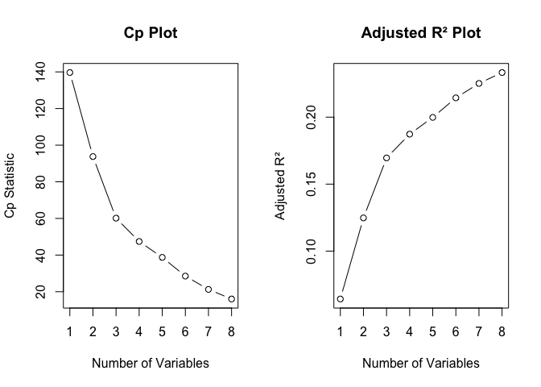
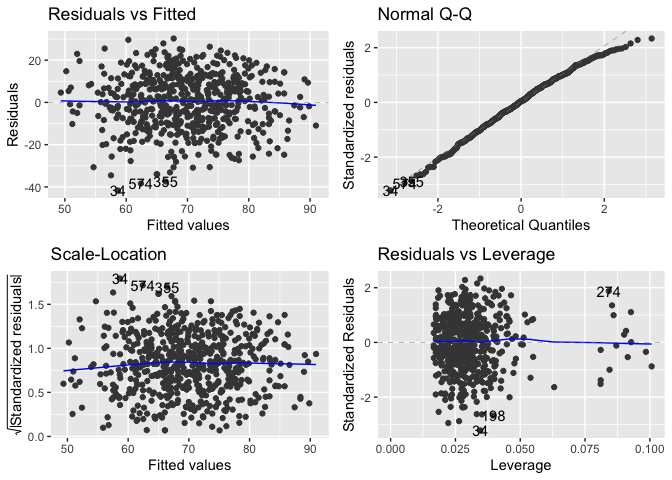
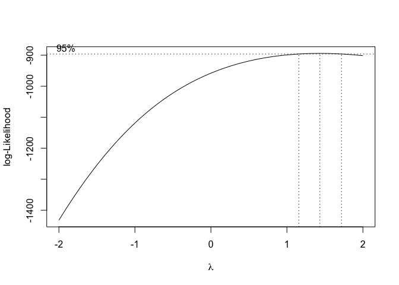

Reading_score_analysis
================
Kangyu Xu (kx2224)
2024-12-18

``` r
library(tidyverse)
```

    ## ── Attaching core tidyverse packages ──────────────────────── tidyverse 2.0.0 ──
    ## ✔ dplyr     1.1.4     ✔ readr     2.1.5
    ## ✔ forcats   1.0.0     ✔ stringr   1.5.1
    ## ✔ ggplot2   3.5.1     ✔ tibble    3.2.1
    ## ✔ lubridate 1.9.3     ✔ tidyr     1.3.1
    ## ✔ purrr     1.0.2     
    ## ── Conflicts ────────────────────────────────────────── tidyverse_conflicts() ──
    ## ✖ dplyr::filter() masks stats::filter()
    ## ✖ dplyr::lag()    masks stats::lag()
    ## ℹ Use the conflicted package (<http://conflicted.r-lib.org/>) to force all conflicts to become errors

``` r
library(caret)
```

    ## Loading required package: lattice
    ## 
    ## Attaching package: 'caret'
    ## 
    ## The following object is masked from 'package:purrr':
    ## 
    ##     lift

``` r
library(leaps)
library(glmnet)
```

    ## Loading required package: Matrix
    ## 
    ## Attaching package: 'Matrix'
    ## 
    ## The following objects are masked from 'package:tidyr':
    ## 
    ##     expand, pack, unpack
    ## 
    ## Loaded glmnet 4.1-8

``` r
library(MASS)      # for Box-Cox transformation
```

    ## 
    ## Attaching package: 'MASS'
    ## 
    ## The following object is masked from 'package:dplyr':
    ## 
    ##     select

``` r
library(ggfortify) # for model diagnostics
library(performance) # for VIF
```

``` r
# data clean
data = read_csv("data/Project_1_data.csv") |>
  janitor::clean_names() |>
  drop_na()
```

    ## Rows: 948 Columns: 14
    ## ── Column specification ────────────────────────────────────────────────────────
    ## Delimiter: ","
    ## chr (10): Gender, EthnicGroup, ParentEduc, LunchType, TestPrep, ParentMarita...
    ## dbl  (4): NrSiblings, MathScore, ReadingScore, WritingScore
    ## 
    ## ℹ Use `spec()` to retrieve the full column specification for this data.
    ## ℹ Specify the column types or set `show_col_types = FALSE` to quiet this message.

``` r
reading_df = data |>
  dplyr::select(-math_score,-writing_score)|>
  dplyr::select(reading_score, everything())
reading_df_numeric = reading_df |>
  mutate(across(where(is.factor), as.numeric))

summary(reading_df)
```

    ##  reading_score       gender          ethnic_group       parent_educ       
    ##  Min.   : 17.00   Length:587         Length:587         Length:587        
    ##  1st Qu.: 60.00   Class :character   Class :character   Class :character  
    ##  Median : 70.00   Mode  :character   Mode  :character   Mode  :character  
    ##  Mean   : 69.85                                                           
    ##  3rd Qu.: 81.00                                                           
    ##  Max.   :100.00                                                           
    ##   lunch_type         test_prep         parent_marital_status practice_sport    
    ##  Length:587         Length:587         Length:587            Length:587        
    ##  Class :character   Class :character   Class :character      Class :character  
    ##  Mode  :character   Mode  :character   Mode  :character      Mode  :character  
    ##                                                                                
    ##                                                                                
    ##                                                                                
    ##  is_first_child      nr_siblings   transport_means    wkly_study_hours  
    ##  Length:587         Min.   :0.00   Length:587         Length:587        
    ##  Class :character   1st Qu.:1.00   Class :character   Class :character  
    ##  Mode  :character   Median :2.00   Mode  :character   Mode  :character  
    ##                     Mean   :2.14                                        
    ##                     3rd Qu.:3.00                                        
    ##                     Max.   :7.00

``` r
y = reading_df$reading_score
X = model.matrix(reading_score ~ ., data = reading_df_numeric)[, -1]

#----------------------------------------------------
# Forward、Backward and Stepwise regression
#----------------------------------------------------
full_model = lm(reading_score ~ ., data = reading_df)
null_model = lm(reading_score ~ 1, data = reading_df)

# Forward Selection
forward_model = step(null_model, direction = "forward", scope = formula(full_model), trace = FALSE)

# Backward Elimination
backward_model = step(full_model, direction = "backward", trace = FALSE)

# Stepwise Regression
stepwise_model = step(full_model, direction = "both", trace = FALSE)

# Output model
cat("Forward Selection Model:\n")
```

    ## Forward Selection Model:

``` r
summary(forward_model)
```

    ## 
    ## Call:
    ## lm(formula = reading_score ~ lunch_type + gender + test_prep + 
    ##     parent_educ + ethnic_group + parent_marital_status + wkly_study_hours, 
    ##     data = reading_df)
    ## 
    ## Residuals:
    ##     Min      1Q  Median      3Q     Max 
    ## -41.661  -8.604   0.594   9.263  30.252 
    ## 
    ## Coefficients:
    ##                              Estimate Std. Error t value Pr(>|t|)    
    ## (Intercept)                   67.7283     3.0403  22.277  < 2e-16 ***
    ## lunch_typestandard             8.4814     1.1468   7.395 5.07e-13 ***
    ## gendermale                    -7.7224     1.1084  -6.967 8.98e-12 ***
    ## test_prepnone                 -6.4210     1.1610  -5.531 4.87e-08 ***
    ## parent_educbachelor's degree   2.4853     1.9696   1.262  0.20754    
    ## parent_educhigh school        -5.2903     1.6930  -3.125  0.00187 ** 
    ## parent_educmaster's degree     4.0736     2.4339   1.674  0.09474 .  
    ## parent_educsome college       -2.4173     1.7039  -1.419  0.15652    
    ## parent_educsome high school   -4.9095     1.7238  -2.848  0.00456 ** 
    ## ethnic_groupgroup B           -1.4318     2.2509  -0.636  0.52496    
    ## ethnic_groupgroup C           -0.7388     2.1541  -0.343  0.73175    
    ## ethnic_groupgroup D            2.5473     2.1671   1.175  0.24030    
    ## ethnic_groupgroup E            5.8112     2.3770   2.445  0.01480 *  
    ## parent_marital_statusmarried   5.1453     1.5668   3.284  0.00109 ** 
    ## parent_marital_statussingle    1.7892     1.7875   1.001  0.31729    
    ## parent_marital_statuswidowed   5.4490     3.7016   1.472  0.14156    
    ## wkly_study_hours> 10           1.2128     1.7068   0.711  0.47763    
    ## wkly_study_hours10-May         2.6738     1.3069   2.046  0.04122 *  
    ## ---
    ## Signif. codes:  0 '***' 0.001 '**' 0.01 '*' 0.05 '.' 0.1 ' ' 1
    ## 
    ## Residual standard error: 13.19 on 569 degrees of freedom
    ## Multiple R-squared:  0.2661, Adjusted R-squared:  0.2442 
    ## F-statistic: 12.14 on 17 and 569 DF,  p-value: < 2.2e-16

``` r
cat("Backward Elimination Model:\n")
```

    ## Backward Elimination Model:

``` r
summary(backward_model)
```

    ## 
    ## Call:
    ## lm(formula = reading_score ~ gender + ethnic_group + parent_educ + 
    ##     lunch_type + test_prep + parent_marital_status + wkly_study_hours, 
    ##     data = reading_df)
    ## 
    ## Residuals:
    ##     Min      1Q  Median      3Q     Max 
    ## -41.661  -8.604   0.594   9.263  30.252 
    ## 
    ## Coefficients:
    ##                              Estimate Std. Error t value Pr(>|t|)    
    ## (Intercept)                   67.7283     3.0403  22.277  < 2e-16 ***
    ## gendermale                    -7.7224     1.1084  -6.967 8.98e-12 ***
    ## ethnic_groupgroup B           -1.4318     2.2509  -0.636  0.52496    
    ## ethnic_groupgroup C           -0.7388     2.1541  -0.343  0.73175    
    ## ethnic_groupgroup D            2.5473     2.1671   1.175  0.24030    
    ## ethnic_groupgroup E            5.8112     2.3770   2.445  0.01480 *  
    ## parent_educbachelor's degree   2.4853     1.9696   1.262  0.20754    
    ## parent_educhigh school        -5.2903     1.6930  -3.125  0.00187 ** 
    ## parent_educmaster's degree     4.0736     2.4339   1.674  0.09474 .  
    ## parent_educsome college       -2.4173     1.7039  -1.419  0.15652    
    ## parent_educsome high school   -4.9095     1.7238  -2.848  0.00456 ** 
    ## lunch_typestandard             8.4814     1.1468   7.395 5.07e-13 ***
    ## test_prepnone                 -6.4210     1.1610  -5.531 4.87e-08 ***
    ## parent_marital_statusmarried   5.1453     1.5668   3.284  0.00109 ** 
    ## parent_marital_statussingle    1.7892     1.7875   1.001  0.31729    
    ## parent_marital_statuswidowed   5.4490     3.7016   1.472  0.14156    
    ## wkly_study_hours> 10           1.2128     1.7068   0.711  0.47763    
    ## wkly_study_hours10-May         2.6738     1.3069   2.046  0.04122 *  
    ## ---
    ## Signif. codes:  0 '***' 0.001 '**' 0.01 '*' 0.05 '.' 0.1 ' ' 1
    ## 
    ## Residual standard error: 13.19 on 569 degrees of freedom
    ## Multiple R-squared:  0.2661, Adjusted R-squared:  0.2442 
    ## F-statistic: 12.14 on 17 and 569 DF,  p-value: < 2.2e-16

``` r
cat("Stepwise Selection Model:\n")
```

    ## Stepwise Selection Model:

``` r
summary(stepwise_model)
```

    ## 
    ## Call:
    ## lm(formula = reading_score ~ gender + ethnic_group + parent_educ + 
    ##     lunch_type + test_prep + parent_marital_status + wkly_study_hours, 
    ##     data = reading_df)
    ## 
    ## Residuals:
    ##     Min      1Q  Median      3Q     Max 
    ## -41.661  -8.604   0.594   9.263  30.252 
    ## 
    ## Coefficients:
    ##                              Estimate Std. Error t value Pr(>|t|)    
    ## (Intercept)                   67.7283     3.0403  22.277  < 2e-16 ***
    ## gendermale                    -7.7224     1.1084  -6.967 8.98e-12 ***
    ## ethnic_groupgroup B           -1.4318     2.2509  -0.636  0.52496    
    ## ethnic_groupgroup C           -0.7388     2.1541  -0.343  0.73175    
    ## ethnic_groupgroup D            2.5473     2.1671   1.175  0.24030    
    ## ethnic_groupgroup E            5.8112     2.3770   2.445  0.01480 *  
    ## parent_educbachelor's degree   2.4853     1.9696   1.262  0.20754    
    ## parent_educhigh school        -5.2903     1.6930  -3.125  0.00187 ** 
    ## parent_educmaster's degree     4.0736     2.4339   1.674  0.09474 .  
    ## parent_educsome college       -2.4173     1.7039  -1.419  0.15652    
    ## parent_educsome high school   -4.9095     1.7238  -2.848  0.00456 ** 
    ## lunch_typestandard             8.4814     1.1468   7.395 5.07e-13 ***
    ## test_prepnone                 -6.4210     1.1610  -5.531 4.87e-08 ***
    ## parent_marital_statusmarried   5.1453     1.5668   3.284  0.00109 ** 
    ## parent_marital_statussingle    1.7892     1.7875   1.001  0.31729    
    ## parent_marital_statuswidowed   5.4490     3.7016   1.472  0.14156    
    ## wkly_study_hours> 10           1.2128     1.7068   0.711  0.47763    
    ## wkly_study_hours10-May         2.6738     1.3069   2.046  0.04122 *  
    ## ---
    ## Signif. codes:  0 '***' 0.001 '**' 0.01 '*' 0.05 '.' 0.1 ' ' 1
    ## 
    ## Residual standard error: 13.19 on 569 degrees of freedom
    ## Multiple R-squared:  0.2661, Adjusted R-squared:  0.2442 
    ## F-statistic: 12.14 on 17 and 569 DF,  p-value: < 2.2e-16

``` r
#----------------------------------------------------
# 3. Criterion-Based Model Selection
#----------------------------------------------------
# Use Cp and Adjusted R² 
subset_model = regsubsets(reading_score ~ ., data = reading_df, nbest = 1)
subset_summary = summary(subset_model)
best_subset_formula = as.formula("reading_score ~ .")
# Visualize Cp and Adjusted R²
par(mfrow = c(1, 2))
plot(subset_summary$cp, xlab = "Number of Variables", ylab = "Cp Statistic", type = "b", main = "Cp Plot")
abline(a = 0, b = 1, col = "red")
plot(subset_summary$adjr2, xlab = "Number of Variables", ylab = "Adjusted R²", type = "b", main = "Adjusted R² Plot")
```

<!-- -->

``` r
summary(subset_model)
```

    ## Subset selection object
    ## Call: regsubsets.formula(reading_score ~ ., data = reading_df, nbest = 1)
    ## 22 Variables  (and intercept)
    ##                              Forced in Forced out
    ## gendermale                       FALSE      FALSE
    ## ethnic_groupgroup B              FALSE      FALSE
    ## ethnic_groupgroup C              FALSE      FALSE
    ## ethnic_groupgroup D              FALSE      FALSE
    ## ethnic_groupgroup E              FALSE      FALSE
    ## parent_educbachelor's degree     FALSE      FALSE
    ## parent_educhigh school           FALSE      FALSE
    ## parent_educmaster's degree       FALSE      FALSE
    ## parent_educsome college          FALSE      FALSE
    ## parent_educsome high school      FALSE      FALSE
    ## lunch_typestandard               FALSE      FALSE
    ## test_prepnone                    FALSE      FALSE
    ## parent_marital_statusmarried     FALSE      FALSE
    ## parent_marital_statussingle      FALSE      FALSE
    ## parent_marital_statuswidowed     FALSE      FALSE
    ## practice_sportregularly          FALSE      FALSE
    ## practice_sportsometimes          FALSE      FALSE
    ## is_first_childyes                FALSE      FALSE
    ## nr_siblings                      FALSE      FALSE
    ## transport_meansschool_bus        FALSE      FALSE
    ## wkly_study_hours> 10             FALSE      FALSE
    ## wkly_study_hours10-May           FALSE      FALSE
    ## 1 subsets of each size up to 8
    ## Selection Algorithm: exhaustive
    ##          gendermale ethnic_groupgroup B ethnic_groupgroup C ethnic_groupgroup D
    ## 1  ( 1 ) " "        " "                 " "                 " "                
    ## 2  ( 1 ) "*"        " "                 " "                 " "                
    ## 3  ( 1 ) "*"        " "                 " "                 " "                
    ## 4  ( 1 ) "*"        " "                 " "                 " "                
    ## 5  ( 1 ) "*"        " "                 " "                 " "                
    ## 6  ( 1 ) "*"        " "                 " "                 " "                
    ## 7  ( 1 ) "*"        " "                 " "                 " "                
    ## 8  ( 1 ) "*"        " "                 " "                 "*"                
    ##          ethnic_groupgroup E parent_educbachelor's degree
    ## 1  ( 1 ) " "                 " "                         
    ## 2  ( 1 ) " "                 " "                         
    ## 3  ( 1 ) " "                 " "                         
    ## 4  ( 1 ) "*"                 " "                         
    ## 5  ( 1 ) " "                 " "                         
    ## 6  ( 1 ) "*"                 " "                         
    ## 7  ( 1 ) "*"                 " "                         
    ## 8  ( 1 ) "*"                 " "                         
    ##          parent_educhigh school parent_educmaster's degree
    ## 1  ( 1 ) " "                    " "                       
    ## 2  ( 1 ) " "                    " "                       
    ## 3  ( 1 ) " "                    " "                       
    ## 4  ( 1 ) " "                    " "                       
    ## 5  ( 1 ) "*"                    " "                       
    ## 6  ( 1 ) "*"                    " "                       
    ## 7  ( 1 ) "*"                    " "                       
    ## 8  ( 1 ) "*"                    " "                       
    ##          parent_educsome college parent_educsome high school lunch_typestandard
    ## 1  ( 1 ) " "                     " "                         "*"               
    ## 2  ( 1 ) " "                     " "                         "*"               
    ## 3  ( 1 ) " "                     " "                         "*"               
    ## 4  ( 1 ) " "                     " "                         "*"               
    ## 5  ( 1 ) " "                     "*"                         "*"               
    ## 6  ( 1 ) " "                     "*"                         "*"               
    ## 7  ( 1 ) " "                     "*"                         "*"               
    ## 8  ( 1 ) " "                     "*"                         "*"               
    ##          test_prepnone parent_marital_statusmarried parent_marital_statussingle
    ## 1  ( 1 ) " "           " "                          " "                        
    ## 2  ( 1 ) " "           " "                          " "                        
    ## 3  ( 1 ) "*"           " "                          " "                        
    ## 4  ( 1 ) "*"           " "                          " "                        
    ## 5  ( 1 ) "*"           " "                          " "                        
    ## 6  ( 1 ) "*"           " "                          " "                        
    ## 7  ( 1 ) "*"           "*"                          " "                        
    ## 8  ( 1 ) "*"           "*"                          " "                        
    ##          parent_marital_statuswidowed practice_sportregularly
    ## 1  ( 1 ) " "                          " "                    
    ## 2  ( 1 ) " "                          " "                    
    ## 3  ( 1 ) " "                          " "                    
    ## 4  ( 1 ) " "                          " "                    
    ## 5  ( 1 ) " "                          " "                    
    ## 6  ( 1 ) " "                          " "                    
    ## 7  ( 1 ) " "                          " "                    
    ## 8  ( 1 ) " "                          " "                    
    ##          practice_sportsometimes is_first_childyes nr_siblings
    ## 1  ( 1 ) " "                     " "               " "        
    ## 2  ( 1 ) " "                     " "               " "        
    ## 3  ( 1 ) " "                     " "               " "        
    ## 4  ( 1 ) " "                     " "               " "        
    ## 5  ( 1 ) " "                     " "               " "        
    ## 6  ( 1 ) " "                     " "               " "        
    ## 7  ( 1 ) " "                     " "               " "        
    ## 8  ( 1 ) " "                     " "               " "        
    ##          transport_meansschool_bus wkly_study_hours> 10 wkly_study_hours10-May
    ## 1  ( 1 ) " "                       " "                  " "                   
    ## 2  ( 1 ) " "                       " "                  " "                   
    ## 3  ( 1 ) " "                       " "                  " "                   
    ## 4  ( 1 ) " "                       " "                  " "                   
    ## 5  ( 1 ) " "                       " "                  " "                   
    ## 6  ( 1 ) " "                       " "                  " "                   
    ## 7  ( 1 ) " "                       " "                  " "                   
    ## 8  ( 1 ) " "                       " "                  " "

``` r
#----------------------------------------------------
# 4. LASSO regression
#----------------------------------------------------
set.seed(123)
lasso_cv = cv.glmnet(X, y, alpha = 1) # alpha = 1 表示 LASSO
best_lambda = lasso_cv$lambda.min

lasso_coefs = coef(lasso_cv, s = best_lambda)
print("LASSO Coefficients:")
```

    ## [1] "LASSO Coefficients:"

``` r
print(lasso_coefs)
```

    ## 23 x 1 sparse Matrix of class "dgCMatrix"
    ##                                       s1
    ## (Intercept)                  67.70987941
    ## gendermale                   -7.16787796
    ## ethnic_groupgroup B          -0.63937180
    ## ethnic_groupgroup C          -0.01039436
    ## ethnic_groupgroup D           2.42034284
    ## ethnic_groupgroup E           5.77082588
    ## parent_educbachelor's degree  2.55594452
    ## parent_educhigh school       -4.43985652
    ## parent_educmaster's degree    3.64286678
    ## parent_educsome college      -1.37937960
    ## parent_educsome high school  -3.82484104
    ## lunch_typestandard            7.97069201
    ## test_prepnone                -5.95785315
    ## parent_marital_statusmarried  3.42305850
    ## parent_marital_statussingle   .         
    ## parent_marital_statuswidowed  2.73226010
    ## practice_sportregularly      -0.44864373
    ## practice_sportsometimes       0.49193265
    ## is_first_childyes             0.66627523
    ## nr_siblings                   0.24839951
    ## transport_meansschool_bus     .         
    ## wkly_study_hours> 10          0.07641822
    ## wkly_study_hours10-May        1.80590256

``` r
#----------------------------------------------------
# 5. Compare and Choose best model
#----------------------------------------------------
# Cross validation
set.seed(123)
train_control = trainControl(method = "cv", number = 10)

# Stepwise
final_stepwise = train(formula(stepwise_model), data = reading_df, method = "lm", trControl = train_control)

# Criterion-based
final_criterion = train(best_subset_formula, data = reading_df, 
                         method = "lm", 
                         trControl = train_control)

# LASSO
lasso_preds = predict(lasso_cv, newx = X, s = best_lambda)
lasso_rmse = sqrt(mean((y - lasso_preds)^2))

cat("Stepwise RMSE:", final_stepwise$results$RMSE, "\n")
```

    ## Stepwise RMSE: 13.35236

``` r
cat("Criterion RMSE:", final_criterion$results$RMSE, "\n")
```

    ## Criterion RMSE: 13.41259

``` r
cat("LASSO RMSE:", lasso_rmse, "\n")
```

    ## LASSO RMSE: 12.99304

``` r
#----------------------------------------------------
# 6. Diagnosis
#----------------------------------------------------
cat("Final Stepwise Model Summary:\n")
```

    ## Final Stepwise Model Summary:

``` r
summary(stepwise_model)
```

    ## 
    ## Call:
    ## lm(formula = reading_score ~ gender + ethnic_group + parent_educ + 
    ##     lunch_type + test_prep + parent_marital_status + wkly_study_hours, 
    ##     data = reading_df)
    ## 
    ## Residuals:
    ##     Min      1Q  Median      3Q     Max 
    ## -41.661  -8.604   0.594   9.263  30.252 
    ## 
    ## Coefficients:
    ##                              Estimate Std. Error t value Pr(>|t|)    
    ## (Intercept)                   67.7283     3.0403  22.277  < 2e-16 ***
    ## gendermale                    -7.7224     1.1084  -6.967 8.98e-12 ***
    ## ethnic_groupgroup B           -1.4318     2.2509  -0.636  0.52496    
    ## ethnic_groupgroup C           -0.7388     2.1541  -0.343  0.73175    
    ## ethnic_groupgroup D            2.5473     2.1671   1.175  0.24030    
    ## ethnic_groupgroup E            5.8112     2.3770   2.445  0.01480 *  
    ## parent_educbachelor's degree   2.4853     1.9696   1.262  0.20754    
    ## parent_educhigh school        -5.2903     1.6930  -3.125  0.00187 ** 
    ## parent_educmaster's degree     4.0736     2.4339   1.674  0.09474 .  
    ## parent_educsome college       -2.4173     1.7039  -1.419  0.15652    
    ## parent_educsome high school   -4.9095     1.7238  -2.848  0.00456 ** 
    ## lunch_typestandard             8.4814     1.1468   7.395 5.07e-13 ***
    ## test_prepnone                 -6.4210     1.1610  -5.531 4.87e-08 ***
    ## parent_marital_statusmarried   5.1453     1.5668   3.284  0.00109 ** 
    ## parent_marital_statussingle    1.7892     1.7875   1.001  0.31729    
    ## parent_marital_statuswidowed   5.4490     3.7016   1.472  0.14156    
    ## wkly_study_hours> 10           1.2128     1.7068   0.711  0.47763    
    ## wkly_study_hours10-May         2.6738     1.3069   2.046  0.04122 *  
    ## ---
    ## Signif. codes:  0 '***' 0.001 '**' 0.01 '*' 0.05 '.' 0.1 ' ' 1
    ## 
    ## Residual standard error: 13.19 on 569 degrees of freedom
    ## Multiple R-squared:  0.2661, Adjusted R-squared:  0.2442 
    ## F-statistic: 12.14 on 17 and 569 DF,  p-value: < 2.2e-16

``` r
# diagnosis
autoplot(stepwise_model)
```

<!-- -->

``` r
# VIF
vif_values = car::vif(stepwise_model)
cat("Variance Inflation Factor (VIF):\n")
```

    ## Variance Inflation Factor (VIF):

``` r
print(vif_values)
```

    ##                           GVIF Df GVIF^(1/(2*Df))
    ## gender                1.031480  1        1.015618
    ## ethnic_group          1.118848  4        1.014136
    ## parent_educ           1.095974  5        1.009206
    ## lunch_type            1.011511  1        1.005739
    ## test_prep             1.041202  1        1.020393
    ## parent_marital_status 1.054771  3        1.008927
    ## wkly_study_hours      1.061180  2        1.014956

``` r
# Box-Cox
boxcox(stepwise_model, lambda = seq(-2, 2, by = 0.1))
```

<!-- --> So we choose
the stepwise model.

## Interacting Effect Checking

``` r
interaction_model = lm(reading_score ~ .^2, data = reading_df)
summary(interaction_model)
```

    ## 
    ## Call:
    ## lm(formula = reading_score ~ .^2, data = reading_df)
    ## 
    ## Residuals:
    ##     Min      1Q  Median      3Q     Max 
    ## -35.313  -6.516   0.000   7.136  27.200 
    ## 
    ## Coefficients: (5 not defined because of singularities)
    ##                                                             Estimate Std. Error
    ## (Intercept)                                                86.652810  21.558345
    ## gendermale                                                 -7.464415   9.948112
    ## ethnic_groupgroup B                                       -20.165316  17.839659
    ## ethnic_groupgroup C                                       -24.865500  17.213787
    ## ethnic_groupgroup D                                        -8.119202  18.443186
    ## ethnic_groupgroup E                                       -19.637836  17.828087
    ## parent_educbachelor's degree                               36.927746  16.190027
    ## parent_educhigh school                                      7.674809  14.322498
    ## parent_educmaster's degree                                -28.654622  21.820483
    ## parent_educsome college                                    -9.092810  13.463286
    ## parent_educsome high school                                -6.061721  13.149506
    ## lunch_typestandard                                         -0.120103   9.648099
    ## test_prepnone                                             -20.194607   9.996412
    ## parent_marital_statusmarried                               15.264846  13.018108
    ## parent_marital_statussingle                                 6.637086  15.668157
    ## parent_marital_statuswidowed                               19.284030  31.270808
    ## practice_sportregularly                                   -22.079112  16.071970
    ## practice_sportsometimes                                   -20.144529  16.021095
    ## is_first_childyes                                          12.039079  10.360338
    ## nr_siblings                                                -1.485603   3.103648
    ## transport_meansschool_bus                                  -6.316090   9.698686
    ## wkly_study_hours> 10                                      -23.221610  14.948241
    ## wkly_study_hours10-May                                     -0.134981  12.036225
    ## gendermale:ethnic_groupgroup B                              6.927466   6.276622
    ## gendermale:ethnic_groupgroup C                             10.909986   6.058401
    ## gendermale:ethnic_groupgroup D                              6.638805   6.100452
    ## gendermale:ethnic_groupgroup E                              7.879321   6.528749
    ## gendermale:parent_educbachelor's degree                    -5.900737   4.842756
    ## gendermale:parent_educhigh school                          -0.669537   3.902967
    ## gendermale:parent_educmaster's degree                       5.838804   6.714185
    ## gendermale:parent_educsome college                         -6.266605   4.151242
    ## gendermale:parent_educsome high school                     -1.209631   4.091513
    ## gendermale:lunch_typestandard                              -0.914987   2.857661
    ## gendermale:test_prepnone                                    0.069844   2.794666
    ## gendermale:parent_marital_statusmarried                     0.570748   4.010685
    ## gendermale:parent_marital_statussingle                     -1.579200   4.504179
    ## gendermale:parent_marital_statuswidowed                    24.035065  26.601226
    ## gendermale:practice_sportregularly                         -5.231810   4.783298
    ## gendermale:practice_sportsometimes                         -4.428890   4.744073
    ## gendermale:is_first_childyes                                3.025512   2.956689
    ## gendermale:nr_siblings                                     -0.937758   0.914982
    ## gendermale:transport_meansschool_bus                       -0.512855   2.711986
    ## gendermale:wkly_study_hours> 10                            -3.389706   4.283764
    ## gendermale:wkly_study_hours10-May                          -1.497070   3.240547
    ## ethnic_groupgroup B:parent_educbachelor's degree           -5.938662  13.454197
    ## ethnic_groupgroup C:parent_educbachelor's degree           -4.269891  13.531989
    ## ethnic_groupgroup D:parent_educbachelor's degree           -7.147201  13.320585
    ## ethnic_groupgroup E:parent_educbachelor's degree          -18.921509  15.626356
    ## ethnic_groupgroup B:parent_educhigh school                -13.903955   8.469331
    ## ethnic_groupgroup C:parent_educhigh school                 -8.155110   8.156363
    ## ethnic_groupgroup D:parent_educhigh school                 -7.285926   8.259263
    ## ethnic_groupgroup E:parent_educhigh school                 -6.303997   9.285221
    ## ethnic_groupgroup B:parent_educmaster's degree             20.760274  15.826166
    ## ethnic_groupgroup C:parent_educmaster's degree              7.870762  14.665463
    ## ethnic_groupgroup D:parent_educmaster's degree             14.089949  14.938060
    ## ethnic_groupgroup E:parent_educmaster's degree             17.076788  15.745628
    ## ethnic_groupgroup B:parent_educsome college                 2.473459   9.425956
    ## ethnic_groupgroup C:parent_educsome college                 7.911024   8.722904
    ## ethnic_groupgroup D:parent_educsome college                 9.968136   9.140701
    ## ethnic_groupgroup E:parent_educsome college                 7.772972   9.173551
    ## ethnic_groupgroup B:parent_educsome high school           -10.995981   8.805772
    ## ethnic_groupgroup C:parent_educsome high school            -3.039602   8.224852
    ## ethnic_groupgroup D:parent_educsome high school            -3.538849   8.318577
    ## ethnic_groupgroup E:parent_educsome high school             6.346320   8.929231
    ## ethnic_groupgroup B:lunch_typestandard                      5.664931   5.987016
    ## ethnic_groupgroup C:lunch_typestandard                     10.280542   5.730665
    ## ethnic_groupgroup D:lunch_typestandard                      9.797965   5.646309
    ## ethnic_groupgroup E:lunch_typestandard                      2.909241   6.601021
    ## ethnic_groupgroup B:test_prepnone                           6.012016   6.366063
    ## ethnic_groupgroup C:test_prepnone                           9.879911   6.002474
    ## ethnic_groupgroup D:test_prepnone                           6.995423   6.108946
    ## ethnic_groupgroup E:test_prepnone                          13.654671   6.498733
    ## ethnic_groupgroup B:parent_marital_statusmarried            9.178195   8.229831
    ## ethnic_groupgroup C:parent_marital_statusmarried            1.371131   7.546311
    ## ethnic_groupgroup D:parent_marital_statusmarried           -9.123507   7.460632
    ## ethnic_groupgroup E:parent_marital_statusmarried            0.685549   8.324082
    ## ethnic_groupgroup B:parent_marital_statussingle            19.212973   9.861025
    ## ethnic_groupgroup C:parent_marital_statussingle             6.430873   9.429374
    ## ethnic_groupgroup D:parent_marital_statussingle             2.105452   9.144914
    ## ethnic_groupgroup E:parent_marital_statussingle            17.495217  10.517920
    ## ethnic_groupgroup B:parent_marital_statuswidowed           23.380298  87.724201
    ## ethnic_groupgroup C:parent_marital_statuswidowed          110.546341 121.512429
    ## ethnic_groupgroup D:parent_marital_statuswidowed          -23.052122  75.943690
    ## ethnic_groupgroup E:parent_marital_statuswidowed                  NA         NA
    ## ethnic_groupgroup B:practice_sportregularly                12.914114  10.980597
    ## ethnic_groupgroup C:practice_sportregularly                11.696265  10.951945
    ## ethnic_groupgroup D:practice_sportregularly                 9.650943  12.107598
    ## ethnic_groupgroup E:practice_sportregularly                12.381975  11.100421
    ## ethnic_groupgroup B:practice_sportsometimes                11.144176  11.853138
    ## ethnic_groupgroup C:practice_sportsometimes                18.491749  11.542535
    ## ethnic_groupgroup D:practice_sportsometimes                 8.470935  12.783531
    ## ethnic_groupgroup E:practice_sportsometimes                10.310523  11.620312
    ## ethnic_groupgroup B:is_first_childyes                       8.285194   6.069061
    ## ethnic_groupgroup C:is_first_childyes                       1.213103   5.716772
    ## ethnic_groupgroup D:is_first_childyes                      -0.270167   5.789398
    ## ethnic_groupgroup E:is_first_childyes                       3.962654   6.666940
    ## ethnic_groupgroup B:nr_siblings                             0.249735   2.095707
    ## ethnic_groupgroup C:nr_siblings                             0.092095   1.979971
    ## ethnic_groupgroup D:nr_siblings                            -0.561439   2.014573
    ## ethnic_groupgroup E:nr_siblings                             3.454391   2.395471
    ## ethnic_groupgroup B:transport_meansschool_bus             -11.210577   6.216383
    ## ethnic_groupgroup C:transport_meansschool_bus             -13.130845   5.704016
    ## ethnic_groupgroup D:transport_meansschool_bus              -5.728041   5.698398
    ## ethnic_groupgroup E:transport_meansschool_bus             -12.137511   6.663472
    ## ethnic_groupgroup B:wkly_study_hours> 10                   -7.147273  10.998717
    ## ethnic_groupgroup C:wkly_study_hours> 10                    0.007762  10.894233
    ## ethnic_groupgroup D:wkly_study_hours> 10                    2.268857  10.732846
    ## ethnic_groupgroup E:wkly_study_hours> 10                   -4.353571  11.900488
    ## ethnic_groupgroup B:wkly_study_hours10-May                 -8.449931   8.740797
    ## ethnic_groupgroup C:wkly_study_hours10-May                 -2.866893   8.572407
    ## ethnic_groupgroup D:wkly_study_hours10-May                 -2.811620   8.705353
    ## ethnic_groupgroup E:wkly_study_hours10-May                 -5.193734   9.417411
    ## parent_educbachelor's degree:lunch_typestandard             3.009013   5.159802
    ## parent_educhigh school:lunch_typestandard                   2.065004   4.200130
    ## parent_educmaster's degree:lunch_typestandard               8.701083   7.978550
    ## parent_educsome college:lunch_typestandard                  4.935216   4.277469
    ## parent_educsome high school:lunch_typestandard              6.582918   4.347811
    ## parent_educbachelor's degree:test_prepnone                 -3.605229   4.833501
    ## parent_educhigh school:test_prepnone                        0.942119   4.640786
    ## parent_educmaster's degree:test_prepnone                    0.828723   8.177518
    ## parent_educsome college:test_prepnone                      -3.758412   4.296819
    ## parent_educsome high school:test_prepnone                   2.170927   4.244366
    ## parent_educbachelor's degree:parent_marital_statusmarried -17.984352   8.558704
    ## parent_educhigh school:parent_marital_statusmarried         5.495708   6.031123
    ## parent_educmaster's degree:parent_marital_statusmarried    -0.899679   9.073871
    ## parent_educsome college:parent_marital_statusmarried       -4.677371   5.988770
    ## parent_educsome high school:parent_marital_statusmarried   -3.558397   5.839393
    ## parent_educbachelor's degree:parent_marital_statussingle  -16.938226   9.106364
    ## parent_educhigh school:parent_marital_statussingle         10.253829   6.634232
    ## parent_educmaster's degree:parent_marital_statussingle     -0.659718   9.502616
    ## parent_educsome college:parent_marital_statussingle        -2.497921   6.660085
    ## parent_educsome high school:parent_marital_statussingle    -0.020679   6.510505
    ## parent_educbachelor's degree:parent_marital_statuswidowed  21.929668  84.211810
    ## parent_educhigh school:parent_marital_statuswidowed        -2.507216  78.356194
    ## parent_educmaster's degree:parent_marital_statuswidowed   -70.346565  45.327351
    ## parent_educsome college:parent_marital_statuswidowed      -53.761748  59.019184
    ## parent_educsome high school:parent_marital_statuswidowed  -13.736670  57.620288
    ## parent_educbachelor's degree:practice_sportregularly       -5.742987   8.829132
    ## parent_educhigh school:practice_sportregularly            -16.222405   7.605694
    ## parent_educmaster's degree:practice_sportregularly          2.124224  11.094977
    ## parent_educsome college:practice_sportregularly            -3.035355   7.881126
    ## parent_educsome high school:practice_sportregularly        -2.220201   7.580298
    ## parent_educbachelor's degree:practice_sportsometimes      -12.859128   8.483797
    ## parent_educhigh school:practice_sportsometimes            -13.121479   7.214292
    ## parent_educmaster's degree:practice_sportsometimes          5.973273   9.291278
    ## parent_educsome college:practice_sportsometimes            -1.672002   7.519775
    ## parent_educsome high school:practice_sportsometimes         2.913390   7.167762
    ## parent_educbachelor's degree:is_first_childyes              4.554067   5.308089
    ## parent_educhigh school:is_first_childyes                    7.256767   4.582552
    ## parent_educmaster's degree:is_first_childyes                6.139178   7.697451
    ## parent_educsome college:is_first_childyes                   8.976229   4.393592
    ## parent_educsome high school:is_first_childyes               3.689051   4.388873
    ## parent_educbachelor's degree:nr_siblings                   -0.476088   1.699747
    ## parent_educhigh school:nr_siblings                          1.012064   1.346170
    ## parent_educmaster's degree:nr_siblings                      0.776705   2.398088
    ## parent_educsome college:nr_siblings                         0.921460   1.488559
    ## parent_educsome high school:nr_siblings                     0.102181   1.452180
    ## parent_educbachelor's degree:transport_meansschool_bus      4.047872   5.398993
    ## parent_educhigh school:transport_meansschool_bus            5.354862   4.340500
    ## parent_educmaster's degree:transport_meansschool_bus        6.402583   6.680822
    ## parent_educsome college:transport_meansschool_bus           5.471397   4.381679
    ## parent_educsome high school:transport_meansschool_bus       6.362679   4.414842
    ## parent_educbachelor's degree:wkly_study_hours> 10          -8.576993   7.658161
    ## parent_educhigh school:wkly_study_hours> 10                -8.892574   6.452183
    ## parent_educmaster's degree:wkly_study_hours> 10            -3.501947  13.840506
    ## parent_educsome college:wkly_study_hours> 10               -5.403789   6.391353
    ## parent_educsome high school:wkly_study_hours> 10           -5.736565   6.546085
    ## parent_educbachelor's degree:wkly_study_hours10-May        -4.131555   5.332589
    ## parent_educhigh school:wkly_study_hours10-May             -12.114081   4.979378
    ## parent_educmaster's degree:wkly_study_hours10-May          -1.299889   7.136270
    ## parent_educsome college:wkly_study_hours10-May             -3.671234   5.054713
    ## parent_educsome high school:wkly_study_hours10-May         -9.389532   5.362561
    ## lunch_typestandard:test_prepnone                           -3.815843   3.138311
    ## lunch_typestandard:parent_marital_statusmarried            -8.354548   4.131306
    ## lunch_typestandard:parent_marital_statussingle             -4.249727   4.772768
    ## lunch_typestandard:parent_marital_statuswidowed            53.032094  73.732150
    ## lunch_typestandard:practice_sportregularly                  7.705744   5.475765
    ## lunch_typestandard:practice_sportsometimes                 10.810066   5.277849
    ## lunch_typestandard:is_first_childyes                       -4.371394   3.179583
    ## lunch_typestandard:nr_siblings                              0.760098   0.969972
    ## lunch_typestandard:transport_meansschool_bus               -3.520897   2.970988
    ## lunch_typestandard:wkly_study_hours> 10                     7.448168   4.417459
    ## lunch_typestandard:wkly_study_hours10-May                  -0.150559   3.334978
    ## test_prepnone:parent_marital_statusmarried                  2.685964   4.270678
    ## test_prepnone:parent_marital_statussingle                  -1.869376   4.917378
    ## test_prepnone:parent_marital_statuswidowed                -55.361814  61.167959
    ## test_prepnone:practice_sportregularly                       4.397545   5.315447
    ## test_prepnone:practice_sportsometimes                       6.695718   5.179240
    ## test_prepnone:is_first_childyes                             1.158471   3.146438
    ## test_prepnone:nr_siblings                                  -0.485647   0.997232
    ## test_prepnone:transport_meansschool_bus                     1.714949   2.899050
    ## test_prepnone:wkly_study_hours> 10                         -3.448651   4.530551
    ## test_prepnone:wkly_study_hours10-May                        2.495949   3.589660
    ## parent_marital_statusmarried:practice_sportregularly        3.906408   6.987011
    ## parent_marital_statussingle:practice_sportregularly        -5.780831   9.034712
    ## parent_marital_statuswidowed:practice_sportregularly      -60.687877  83.189081
    ## parent_marital_statusmarried:practice_sportsometimes        1.066168   6.874596
    ## parent_marital_statussingle:practice_sportsometimes        -4.339879   8.733089
    ## parent_marital_statuswidowed:practice_sportsometimes              NA         NA
    ## parent_marital_statusmarried:is_first_childyes            -16.731923   4.892875
    ## parent_marital_statussingle:is_first_childyes              -8.769447   5.456087
    ## parent_marital_statuswidowed:is_first_childyes             33.182190  40.828009
    ## parent_marital_statusmarried:nr_siblings                   -0.840597   1.461690
    ## parent_marital_statussingle:nr_siblings                    -0.644484   1.646293
    ## parent_marital_statuswidowed:nr_siblings                   -9.150470   9.972519
    ## parent_marital_statusmarried:transport_meansschool_bus      4.412302   4.084008
    ## parent_marital_statussingle:transport_meansschool_bus      -0.563874   4.680753
    ## parent_marital_statuswidowed:transport_meansschool_bus            NA         NA
    ## parent_marital_statusmarried:wkly_study_hours> 10          21.073358   6.460989
    ## parent_marital_statussingle:wkly_study_hours> 10           27.001000   7.161508
    ## parent_marital_statuswidowed:wkly_study_hours> 10                 NA         NA
    ## parent_marital_statusmarried:wkly_study_hours10-May         4.126213   4.755351
    ## parent_marital_statussingle:wkly_study_hours10-May          4.595880   5.249529
    ## parent_marital_statuswidowed:wkly_study_hours10-May               NA         NA
    ## practice_sportregularly:is_first_childyes                  -3.164192   6.127977
    ## practice_sportsometimes:is_first_childyes                  -4.741102   5.946839
    ## practice_sportregularly:nr_siblings                        -0.616213   1.821947
    ## practice_sportsometimes:nr_siblings                         0.557541   1.750316
    ## practice_sportregularly:transport_meansschool_bus          10.319065   5.037510
    ## practice_sportsometimes:transport_meansschool_bus           6.701725   4.892931
    ## practice_sportregularly:wkly_study_hours> 10                5.499385   7.268664
    ## practice_sportsometimes:wkly_study_hours> 10                3.812137   7.161778
    ## practice_sportregularly:wkly_study_hours10-May              9.121294   5.785063
    ## practice_sportsometimes:wkly_study_hours10-May              0.814808   5.771786
    ## is_first_childyes:nr_siblings                               0.359903   1.112040
    ## is_first_childyes:transport_meansschool_bus                 0.109605   3.178099
    ## is_first_childyes:wkly_study_hours> 10                      2.433921   4.656647
    ## is_first_childyes:wkly_study_hours10-May                   -1.170608   3.536468
    ## nr_siblings:transport_meansschool_bus                       0.855448   0.962074
    ## nr_siblings:wkly_study_hours> 10                            1.488733   1.543230
    ## nr_siblings:wkly_study_hours10-May                          1.828624   1.116257
    ## transport_meansschool_bus:wkly_study_hours> 10              1.357190   4.462681
    ## transport_meansschool_bus:wkly_study_hours10-May            3.570681   3.237242
    ##                                                           t value Pr(>|t|)    
    ## (Intercept)                                                 4.019 7.11e-05 ***
    ## gendermale                                                 -0.750 0.453545    
    ## ethnic_groupgroup B                                        -1.130 0.259077    
    ## ethnic_groupgroup C                                        -1.445 0.149468    
    ## ethnic_groupgroup D                                        -0.440 0.660037    
    ## ethnic_groupgroup E                                        -1.102 0.271412    
    ## parent_educbachelor's degree                                2.281 0.023140 *  
    ## parent_educhigh school                                      0.536 0.592389    
    ## parent_educmaster's degree                                 -1.313 0.189955    
    ## parent_educsome college                                    -0.675 0.499870    
    ## parent_educsome high school                                -0.461 0.645089    
    ## lunch_typestandard                                         -0.012 0.990075    
    ## test_prepnone                                              -2.020 0.044106 *  
    ## parent_marital_statusmarried                                1.173 0.241740    
    ## parent_marital_statussingle                                 0.424 0.672109    
    ## parent_marital_statuswidowed                                0.617 0.537838    
    ## practice_sportregularly                                    -1.374 0.170372    
    ## practice_sportsometimes                                    -1.257 0.209435    
    ## is_first_childyes                                           1.162 0.245993    
    ## nr_siblings                                                -0.479 0.632470    
    ## transport_meansschool_bus                                  -0.651 0.515314    
    ## wkly_study_hours> 10                                       -1.553 0.121193    
    ## wkly_study_hours10-May                                     -0.011 0.991058    
    ## gendermale:ethnic_groupgroup B                              1.104 0.270465    
    ## gendermale:ethnic_groupgroup C                              1.801 0.072573 .  
    ## gendermale:ethnic_groupgroup D                              1.088 0.277216    
    ## gendermale:ethnic_groupgroup E                              1.207 0.228279    
    ## gendermale:parent_educbachelor's degree                    -1.218 0.223847    
    ## gendermale:parent_educhigh school                          -0.172 0.863891    
    ## gendermale:parent_educmaster's degree                       0.870 0.385088    
    ## gendermale:parent_educsome college                         -1.510 0.132032    
    ## gendermale:parent_educsome high school                     -0.296 0.767673    
    ## gendermale:lunch_typestandard                              -0.320 0.749013    
    ## gendermale:test_prepnone                                    0.025 0.980075    
    ## gendermale:parent_marital_statusmarried                     0.142 0.886917    
    ## gendermale:parent_marital_statussingle                     -0.351 0.726088    
    ## gendermale:parent_marital_statuswidowed                     0.904 0.366849    
    ## gendermale:practice_sportregularly                         -1.094 0.274791    
    ## gendermale:practice_sportsometimes                         -0.934 0.351157    
    ## gendermale:is_first_childyes                                1.023 0.306866    
    ## gendermale:nr_siblings                                     -1.025 0.306104    
    ## gendermale:transport_meansschool_bus                       -0.189 0.850116    
    ## gendermale:wkly_study_hours> 10                            -0.791 0.429296    
    ## gendermale:wkly_study_hours10-May                          -0.462 0.644375    
    ## ethnic_groupgroup B:parent_educbachelor's degree           -0.441 0.659190    
    ## ethnic_groupgroup C:parent_educbachelor's degree           -0.316 0.752535    
    ## ethnic_groupgroup D:parent_educbachelor's degree           -0.537 0.591909    
    ## ethnic_groupgroup E:parent_educbachelor's degree           -1.211 0.226741    
    ## ethnic_groupgroup B:parent_educhigh school                 -1.642 0.101531    
    ## ethnic_groupgroup C:parent_educhigh school                 -1.000 0.318058    
    ## ethnic_groupgroup D:parent_educhigh school                 -0.882 0.378285    
    ## ethnic_groupgroup E:parent_educhigh school                 -0.679 0.497621    
    ## ethnic_groupgroup B:parent_educmaster's degree              1.312 0.190436    
    ## ethnic_groupgroup C:parent_educmaster's degree              0.537 0.591816    
    ## ethnic_groupgroup D:parent_educmaster's degree              0.943 0.346200    
    ## ethnic_groupgroup E:parent_educmaster's degree              1.085 0.278853    
    ## ethnic_groupgroup B:parent_educsome college                 0.262 0.793156    
    ## ethnic_groupgroup C:parent_educsome college                 0.907 0.365055    
    ## ethnic_groupgroup D:parent_educsome college                 1.091 0.276215    
    ## ethnic_groupgroup E:parent_educsome college                 0.847 0.397379    
    ## ethnic_groupgroup B:parent_educsome high school            -1.249 0.212580    
    ## ethnic_groupgroup C:parent_educsome high school            -0.370 0.711926    
    ## ethnic_groupgroup D:parent_educsome high school            -0.425 0.670789    
    ## ethnic_groupgroup E:parent_educsome high school             0.711 0.477710    
    ## ethnic_groupgroup B:lunch_typestandard                      0.946 0.344682    
    ## ethnic_groupgroup C:lunch_typestandard                      1.794 0.073662 .  
    ## ethnic_groupgroup D:lunch_typestandard                      1.735 0.083548 .  
    ## ethnic_groupgroup E:lunch_typestandard                      0.441 0.659677    
    ## ethnic_groupgroup B:test_prepnone                           0.944 0.345608    
    ## ethnic_groupgroup C:test_prepnone                           1.646 0.100644    
    ## ethnic_groupgroup D:test_prepnone                           1.145 0.252926    
    ## ethnic_groupgroup E:test_prepnone                           2.101 0.036326 *  
    ## ethnic_groupgroup B:parent_marital_statusmarried            1.115 0.265496    
    ## ethnic_groupgroup C:parent_marital_statusmarried            0.182 0.855924    
    ## ethnic_groupgroup D:parent_marital_statusmarried           -1.223 0.222175    
    ## ethnic_groupgroup E:parent_marital_statusmarried            0.082 0.934409    
    ## ethnic_groupgroup B:parent_marital_statussingle             1.948 0.052149 .  
    ## ethnic_groupgroup C:parent_marital_statussingle             0.682 0.495676    
    ## ethnic_groupgroup D:parent_marital_statussingle             0.230 0.818043    
    ## ethnic_groupgroup E:parent_marital_statussingle             1.663 0.097111 .  
    ## ethnic_groupgroup B:parent_marital_statuswidowed            0.267 0.789991    
    ## ethnic_groupgroup C:parent_marital_statuswidowed            0.910 0.363563    
    ## ethnic_groupgroup D:parent_marital_statuswidowed           -0.304 0.761652    
    ## ethnic_groupgroup E:parent_marital_statuswidowed               NA       NA    
    ## ethnic_groupgroup B:practice_sportregularly                 1.176 0.240340    
    ## ethnic_groupgroup C:practice_sportregularly                 1.068 0.286255    
    ## ethnic_groupgroup D:practice_sportregularly                 0.797 0.425921    
    ## ethnic_groupgroup E:practice_sportregularly                 1.115 0.265403    
    ## ethnic_groupgroup B:practice_sportsometimes                 0.940 0.347753    
    ## ethnic_groupgroup C:practice_sportsometimes                 1.602 0.110023    
    ## ethnic_groupgroup D:practice_sportsometimes                 0.663 0.507984    
    ## ethnic_groupgroup E:practice_sportsometimes                 0.887 0.375520    
    ## ethnic_groupgroup B:is_first_childyes                       1.365 0.173060    
    ## ethnic_groupgroup C:is_first_childyes                       0.212 0.832071    
    ## ethnic_groupgroup D:is_first_childyes                      -0.047 0.962806    
    ## ethnic_groupgroup E:is_first_childyes                       0.594 0.552637    
    ## ethnic_groupgroup B:nr_siblings                             0.119 0.905211    
    ## ethnic_groupgroup C:nr_siblings                             0.047 0.962927    
    ## ethnic_groupgroup D:nr_siblings                            -0.279 0.780644    
    ## ethnic_groupgroup E:nr_siblings                             1.442 0.150160    
    ## ethnic_groupgroup B:transport_meansschool_bus              -1.803 0.072165 .  
    ## ethnic_groupgroup C:transport_meansschool_bus              -2.302 0.021905 *  
    ## ethnic_groupgroup D:transport_meansschool_bus              -1.005 0.315477    
    ## ethnic_groupgroup E:transport_meansschool_bus              -1.821 0.069363 .  
    ## ethnic_groupgroup B:wkly_study_hours> 10                   -0.650 0.516219    
    ## ethnic_groupgroup C:wkly_study_hours> 10                    0.001 0.999432    
    ## ethnic_groupgroup D:wkly_study_hours> 10                    0.211 0.832700    
    ## ethnic_groupgroup E:wkly_study_hours> 10                   -0.366 0.714706    
    ## ethnic_groupgroup B:wkly_study_hours10-May                 -0.967 0.334333    
    ## ethnic_groupgroup C:wkly_study_hours10-May                 -0.334 0.738248    
    ## ethnic_groupgroup D:wkly_study_hours10-May                 -0.323 0.746901    
    ## ethnic_groupgroup E:wkly_study_hours10-May                 -0.552 0.581632    
    ## parent_educbachelor's degree:lunch_typestandard             0.583 0.560149    
    ## parent_educhigh school:lunch_typestandard                   0.492 0.623265    
    ## parent_educmaster's degree:lunch_typestandard               1.091 0.276198    
    ## parent_educsome college:lunch_typestandard                  1.154 0.249362    
    ## parent_educsome high school:lunch_typestandard              1.514 0.130886    
    ## parent_educbachelor's degree:test_prepnone                 -0.746 0.456226    
    ## parent_educhigh school:test_prepnone                        0.203 0.839243    
    ## parent_educmaster's degree:test_prepnone                    0.101 0.919336    
    ## parent_educsome college:test_prepnone                      -0.875 0.382324    
    ## parent_educsome high school:test_prepnone                   0.511 0.609326    
    ## parent_educbachelor's degree:parent_marital_statusmarried  -2.101 0.036312 *  
    ## parent_educhigh school:parent_marital_statusmarried         0.911 0.362788    
    ## parent_educmaster's degree:parent_marital_statusmarried    -0.099 0.921074    
    ## parent_educsome college:parent_marital_statusmarried       -0.781 0.435303    
    ## parent_educsome high school:parent_marital_statusmarried   -0.609 0.542659    
    ## parent_educbachelor's degree:parent_marital_statussingle   -1.860 0.063697 .  
    ## parent_educhigh school:parent_marital_statussingle          1.546 0.123084    
    ## parent_educmaster's degree:parent_marital_statussingle     -0.069 0.944690    
    ## parent_educsome college:parent_marital_statussingle        -0.375 0.707838    
    ## parent_educsome high school:parent_marital_statussingle    -0.003 0.997468    
    ## parent_educbachelor's degree:parent_marital_statuswidowed   0.260 0.794696    
    ## parent_educhigh school:parent_marital_statuswidowed        -0.032 0.974492    
    ## parent_educmaster's degree:parent_marital_statuswidowed    -1.552 0.121551    
    ## parent_educsome college:parent_marital_statuswidowed       -0.911 0.362949    
    ## parent_educsome high school:parent_marital_statuswidowed   -0.238 0.811707    
    ## parent_educbachelor's degree:practice_sportregularly       -0.650 0.515812    
    ## parent_educhigh school:practice_sportregularly             -2.133 0.033608 *  
    ## parent_educmaster's degree:practice_sportregularly          0.191 0.848275    
    ## parent_educsome college:practice_sportregularly            -0.385 0.700360    
    ## parent_educsome high school:practice_sportregularly        -0.293 0.769775    
    ## parent_educbachelor's degree:practice_sportsometimes       -1.516 0.130468    
    ## parent_educhigh school:practice_sportsometimes             -1.819 0.069772 .  
    ## parent_educmaster's degree:practice_sportsometimes          0.643 0.520706    
    ## parent_educsome college:practice_sportsometimes            -0.222 0.824170    
    ## parent_educsome high school:practice_sportsometimes         0.406 0.684649    
    ## parent_educbachelor's degree:is_first_childyes              0.858 0.391493    
    ## parent_educhigh school:is_first_childyes                    1.584 0.114173    
    ## parent_educmaster's degree:is_first_childyes                0.798 0.425653    
    ## parent_educsome college:is_first_childyes                   2.043 0.041780 *  
    ## parent_educsome high school:is_first_childyes               0.841 0.401162    
    ## parent_educbachelor's degree:nr_siblings                   -0.280 0.779567    
    ## parent_educhigh school:nr_siblings                          0.752 0.452658    
    ## parent_educmaster's degree:nr_siblings                      0.324 0.746214    
    ## parent_educsome college:nr_siblings                         0.619 0.536291    
    ## parent_educsome high school:nr_siblings                     0.070 0.943943    
    ## parent_educbachelor's degree:transport_meansschool_bus      0.750 0.453899    
    ## parent_educhigh school:transport_meansschool_bus            1.234 0.218123    
    ## parent_educmaster's degree:transport_meansschool_bus        0.958 0.338530    
    ## parent_educsome college:transport_meansschool_bus           1.249 0.212589    
    ## parent_educsome high school:transport_meansschool_bus       1.441 0.150399    
    ## parent_educbachelor's degree:wkly_study_hours> 10          -1.120 0.263471    
    ## parent_educhigh school:wkly_study_hours> 10                -1.378 0.168991    
    ## parent_educmaster's degree:wkly_study_hours> 10            -0.253 0.800396    
    ## parent_educsome college:wkly_study_hours> 10               -0.845 0.398404    
    ## parent_educsome high school:wkly_study_hours> 10           -0.876 0.381434    
    ## parent_educbachelor's degree:wkly_study_hours10-May        -0.775 0.438983    
    ## parent_educhigh school:wkly_study_hours10-May              -2.433 0.015468 *  
    ## parent_educmaster's degree:wkly_study_hours10-May          -0.182 0.855566    
    ## parent_educsome college:wkly_study_hours10-May             -0.726 0.468129    
    ## parent_educsome high school:wkly_study_hours10-May         -1.751 0.080810 .  
    ## lunch_typestandard:test_prepnone                           -1.216 0.224825    
    ## lunch_typestandard:parent_marital_statusmarried            -2.022 0.043891 *  
    ## lunch_typestandard:parent_marital_statussingle             -0.890 0.373841    
    ## lunch_typestandard:parent_marital_statuswidowed             0.719 0.472453    
    ## lunch_typestandard:practice_sportregularly                  1.407 0.160220    
    ## lunch_typestandard:practice_sportsometimes                  2.048 0.041268 *  
    ## lunch_typestandard:is_first_childyes                       -1.375 0.170041    
    ## lunch_typestandard:nr_siblings                              0.784 0.433775    
    ## lunch_typestandard:transport_meansschool_bus               -1.185 0.236765    
    ## lunch_typestandard:wkly_study_hours> 10                     1.686 0.092650 .  
    ## lunch_typestandard:wkly_study_hours10-May                  -0.045 0.964017    
    ## test_prepnone:parent_marital_statusmarried                  0.629 0.529794    
    ## test_prepnone:parent_marital_statussingle                  -0.380 0.704054    
    ## test_prepnone:parent_marital_statuswidowed                 -0.905 0.366031    
    ## test_prepnone:practice_sportregularly                       0.827 0.408608    
    ## test_prepnone:practice_sportsometimes                       1.293 0.196912    
    ## test_prepnone:is_first_childyes                             0.368 0.712952    
    ## test_prepnone:nr_siblings                                  -0.487 0.626559    
    ## test_prepnone:transport_meansschool_bus                     0.592 0.554521    
    ## test_prepnone:wkly_study_hours> 10                         -0.761 0.447038    
    ## test_prepnone:wkly_study_hours10-May                        0.695 0.487307    
    ## parent_marital_statusmarried:practice_sportregularly        0.559 0.576445    
    ## parent_marital_statussingle:practice_sportregularly        -0.640 0.522680    
    ## parent_marital_statuswidowed:practice_sportregularly       -0.730 0.466161    
    ## parent_marital_statusmarried:practice_sportsometimes        0.155 0.876839    
    ## parent_marital_statussingle:practice_sportsometimes        -0.497 0.619531    
    ## parent_marital_statuswidowed:practice_sportsometimes           NA       NA    
    ## parent_marital_statusmarried:is_first_childyes             -3.420 0.000699 ***
    ## parent_marital_statussingle:is_first_childyes              -1.607 0.108873    
    ## parent_marital_statuswidowed:is_first_childyes              0.813 0.416911    
    ## parent_marital_statusmarried:nr_siblings                   -0.575 0.565594    
    ## parent_marital_statussingle:nr_siblings                    -0.391 0.695678    
    ## parent_marital_statuswidowed:nr_siblings                   -0.918 0.359461    
    ## parent_marital_statusmarried:transport_meansschool_bus      1.080 0.280696    
    ## parent_marital_statussingle:transport_meansschool_bus      -0.120 0.904181    
    ## parent_marital_statuswidowed:transport_meansschool_bus         NA       NA    
    ## parent_marital_statusmarried:wkly_study_hours> 10           3.262 0.001214 ** 
    ## parent_marital_statussingle:wkly_study_hours> 10            3.770 0.000191 ***
    ## parent_marital_statuswidowed:wkly_study_hours> 10              NA       NA    
    ## parent_marital_statusmarried:wkly_study_hours10-May         0.868 0.386139    
    ## parent_marital_statussingle:wkly_study_hours10-May          0.875 0.381896    
    ## parent_marital_statuswidowed:wkly_study_hours10-May            NA       NA    
    ## practice_sportregularly:is_first_childyes                  -0.516 0.605927    
    ## practice_sportsometimes:is_first_childyes                  -0.797 0.425834    
    ## practice_sportregularly:nr_siblings                        -0.338 0.735398    
    ## practice_sportsometimes:nr_siblings                         0.319 0.750263    
    ## practice_sportregularly:transport_meansschool_bus           2.048 0.041243 *  
    ## practice_sportsometimes:transport_meansschool_bus           1.370 0.171644    
    ## practice_sportregularly:wkly_study_hours> 10                0.757 0.449793    
    ## practice_sportsometimes:wkly_study_hours> 10                0.532 0.594855    
    ## practice_sportregularly:wkly_study_hours10-May              1.577 0.115746    
    ## practice_sportsometimes:wkly_study_hours10-May              0.141 0.887814    
    ## is_first_childyes:nr_siblings                               0.324 0.746398    
    ## is_first_childyes:transport_meansschool_bus                 0.034 0.972508    
    ## is_first_childyes:wkly_study_hours> 10                      0.523 0.601522    
    ## is_first_childyes:wkly_study_hours10-May                   -0.331 0.740830    
    ## nr_siblings:transport_meansschool_bus                       0.889 0.374507    
    ## nr_siblings:wkly_study_hours> 10                            0.965 0.335351    
    ## nr_siblings:wkly_study_hours10-May                          1.638 0.102261    
    ## transport_meansschool_bus:wkly_study_hours> 10              0.304 0.761213    
    ## transport_meansschool_bus:wkly_study_hours10-May            1.103 0.270766    
    ## ---
    ## Signif. codes:  0 '***' 0.001 '**' 0.01 '*' 0.05 '.' 0.1 ' ' 1
    ## 
    ## Residual standard error: 12.97 on 359 degrees of freedom
    ## Multiple R-squared:  0.552,  Adjusted R-squared:  0.2687 
    ## F-statistic: 1.949 on 227 and 359 DF,  p-value: 7.697e-09

``` r
anova(stepwise_model, interaction_model)
```

    ## Analysis of Variance Table
    ## 
    ## Model 1: reading_score ~ gender + ethnic_group + parent_educ + lunch_type + 
    ##     test_prep + parent_marital_status + wkly_study_hours
    ## Model 2: reading_score ~ (gender + ethnic_group + parent_educ + lunch_type + 
    ##     test_prep + parent_marital_status + practice_sport + is_first_child + 
    ##     nr_siblings + transport_means + wkly_study_hours)^2
    ##   Res.Df   RSS  Df Sum of Sq      F Pr(>F)
    ## 1    569 98922                            
    ## 2    359 60390 210     38533 1.0908 0.2357

As the F-test’s result is 0.2357 \> 0.05, so we can conclude that there
are no interacting effects on this model.

``` r
# Fit all second-order interactions
fit_all_interactions <- lm(reading_score ~ (gender + ethnic_group + parent_educ + 
    lunch_type + test_prep + parent_marital_status + nr_siblings + 
    wkly_study_hours)^2, data = reading_df)

# Extract p-values for interaction terms
interaction_pvals = broom::tidy(fit_all_interactions) %>%
  filter(str_detect(term, ":")) %>% # Keep only interaction terms
  dplyr::select(term, p.value) %>%
  arrange(p.value)

significant_interactions <- interaction_pvals %>%
  filter(p.value < 0.05)

print(significant_interactions)
```

    ## # A tibble: 6 × 2
    ##   term                                                      p.value
    ##   <chr>                                                       <dbl>
    ## 1 parent_marital_statussingle:wkly_study_hours> 10          0.00223
    ## 2 parent_marital_statusmarried:wkly_study_hours> 10         0.0138 
    ## 3 ethnic_groupgroup E:test_prepnone                         0.0169 
    ## 4 parent_educbachelor's degree:parent_marital_statusmarried 0.0254 
    ## 5 gendermale:ethnic_groupgroup C                            0.0271 
    ## 6 parent_educbachelor's degree:parent_marital_statussingle  0.0280

``` r
interaction_model_1.2 = lm(reading_score ~ gender + ethnic_group + parent_educ + 
    lunch_type + test_prep + parent_marital_status + nr_siblings + 
    wkly_study_hours + 
      parent_marital_status:wkly_study_hours + 
      ethnic_group:test_prep+
      parent_educ:parent_marital_status, data = reading_df)

summary(interaction_model_1.2)
```

    ## 
    ## Call:
    ## lm(formula = reading_score ~ gender + ethnic_group + parent_educ + 
    ##     lunch_type + test_prep + parent_marital_status + nr_siblings + 
    ##     wkly_study_hours + parent_marital_status:wkly_study_hours + 
    ##     ethnic_group:test_prep + parent_educ:parent_marital_status, 
    ##     data = reading_df)
    ## 
    ## Residuals:
    ##     Min      1Q  Median      3Q     Max 
    ## -46.077  -7.992   0.317   9.536  30.979 
    ## 
    ## Coefficients:
    ##                                                           Estimate Std. Error
    ## (Intercept)                                                70.9237     5.4119
    ## gendermale                                                 -7.5463     1.1214
    ## ethnic_groupgroup B                                        -4.8187     3.8044
    ## ethnic_groupgroup C                                        -5.0174     3.6506
    ## ethnic_groupgroup D                                        -0.9467     3.7918
    ## ethnic_groupgroup E                                         0.9038     3.9271
    ## parent_educbachelor's degree                               16.3033     5.8918
    ## parent_educhigh school                                     -5.5685     4.2857
    ## parent_educmaster's degree                                  5.0309     5.5968
    ## parent_educsome college                                     5.3613     4.3911
    ## parent_educsome high school                                 0.5902     4.2743
    ## lunch_typestandard                                          8.7412     1.1589
    ## test_prepnone                                             -12.7288     3.9516
    ## parent_marital_statusmarried                                6.3565     4.3965
    ## parent_marital_statussingle                                -1.5890     4.8817
    ## parent_marital_statuswidowed                                7.6990    15.9679
    ## nr_siblings                                                 0.3557     0.3756
    ## wkly_study_hours> 10                                      -10.5815     4.5290
    ## wkly_study_hours10-May                                     -1.1157     3.3861
    ## parent_marital_statusmarried:wkly_study_hours> 10          10.2464     5.0284
    ## parent_marital_statussingle:wkly_study_hours> 10           19.8162     5.6586
    ## parent_marital_statuswidowed:wkly_study_hours> 10           6.6071    15.5008
    ## parent_marital_statusmarried:wkly_study_hours10-May         2.8007     3.7811
    ## parent_marital_statussingle:wkly_study_hours10-May          7.6159     4.2560
    ## parent_marital_statuswidowed:wkly_study_hours10-May        12.3640    14.1587
    ## ethnic_groupgroup B:test_prepnone                           5.9580     4.6873
    ## ethnic_groupgroup C:test_prepnone                           6.8781     4.4717
    ## ethnic_groupgroup D:test_prepnone                           5.8960     4.6052
    ## ethnic_groupgroup E:test_prepnone                           8.4533     4.9198
    ## parent_educbachelor's degree:parent_marital_statusmarried -15.0343     6.3972
    ## parent_educhigh school:parent_marital_statusmarried        -0.4017     4.7858
    ## parent_educmaster's degree:parent_marital_statusmarried    -1.4898     6.5401
    ## parent_educsome college:parent_marital_statusmarried       -8.8457     4.9012
    ## parent_educsome high school:parent_marital_statusmarried   -6.7156     4.8454
    ## parent_educbachelor's degree:parent_marital_statussingle  -16.8279     7.2180
    ## parent_educhigh school:parent_marital_statussingle          2.6782     5.5388
    ## parent_educmaster's degree:parent_marital_statussingle      1.7561     7.2434
    ## parent_educsome college:parent_marital_statussingle       -11.5863     5.6179
    ## parent_educsome high school:parent_marital_statussingle    -6.2810     5.4253
    ## parent_educbachelor's degree:parent_marital_statuswidowed -21.5454    15.3056
    ## parent_educhigh school:parent_marital_statuswidowed       -24.5696    14.2674
    ## parent_educmaster's degree:parent_marital_statuswidowed   -23.7633    18.5734
    ## parent_educsome college:parent_marital_statuswidowed       -4.3112    14.5455
    ## parent_educsome high school:parent_marital_statuswidowed   -1.1121    15.4250
    ##                                                           t value Pr(>|t|)    
    ## (Intercept)                                                13.105  < 2e-16 ***
    ## gendermale                                                 -6.730 4.33e-11 ***
    ## ethnic_groupgroup B                                        -1.267  0.20584    
    ## ethnic_groupgroup C                                        -1.374  0.16989    
    ## ethnic_groupgroup D                                        -0.250  0.80294    
    ## ethnic_groupgroup E                                         0.230  0.81807    
    ## parent_educbachelor's degree                                2.767  0.00585 ** 
    ## parent_educhigh school                                     -1.299  0.19438    
    ## parent_educmaster's degree                                  0.899  0.36911    
    ## parent_educsome college                                     1.221  0.22264    
    ## parent_educsome high school                                 0.138  0.89022    
    ## lunch_typestandard                                          7.543 1.95e-13 ***
    ## test_prepnone                                              -3.221  0.00135 ** 
    ## parent_marital_statusmarried                                1.446  0.14881    
    ## parent_marital_statussingle                                -0.326  0.74492    
    ## parent_marital_statuswidowed                                0.482  0.62989    
    ## nr_siblings                                                 0.947  0.34416    
    ## wkly_study_hours> 10                                       -2.336  0.01983 *  
    ## wkly_study_hours10-May                                     -0.330  0.74189    
    ## parent_marital_statusmarried:wkly_study_hours> 10           2.038  0.04206 *  
    ## parent_marital_statussingle:wkly_study_hours> 10            3.502  0.00050 ***
    ## parent_marital_statuswidowed:wkly_study_hours> 10           0.426  0.67010    
    ## parent_marital_statusmarried:wkly_study_hours10-May         0.741  0.45918    
    ## parent_marital_statussingle:wkly_study_hours10-May          1.789  0.07410 .  
    ## parent_marital_statuswidowed:wkly_study_hours10-May         0.873  0.38291    
    ## ethnic_groupgroup B:test_prepnone                           1.271  0.20424    
    ## ethnic_groupgroup C:test_prepnone                           1.538  0.12460    
    ## ethnic_groupgroup D:test_prepnone                           1.280  0.20098    
    ## ethnic_groupgroup E:test_prepnone                           1.718  0.08633 .  
    ## parent_educbachelor's degree:parent_marital_statusmarried  -2.350  0.01912 *  
    ## parent_educhigh school:parent_marital_statusmarried        -0.084  0.93314    
    ## parent_educmaster's degree:parent_marital_statusmarried    -0.228  0.81989    
    ## parent_educsome college:parent_marital_statusmarried       -1.805  0.07166 .  
    ## parent_educsome high school:parent_marital_statusmarried   -1.386  0.16632    
    ## parent_educbachelor's degree:parent_marital_statussingle   -2.331  0.02010 *  
    ## parent_educhigh school:parent_marital_statussingle          0.484  0.62891    
    ## parent_educmaster's degree:parent_marital_statussingle      0.242  0.80853    
    ## parent_educsome college:parent_marital_statussingle        -2.062  0.03965 *  
    ## parent_educsome high school:parent_marital_statussingle    -1.158  0.24749    
    ## parent_educbachelor's degree:parent_marital_statuswidowed  -1.408  0.15980    
    ## parent_educhigh school:parent_marital_statuswidowed        -1.722  0.08563 .  
    ## parent_educmaster's degree:parent_marital_statuswidowed    -1.279  0.20129    
    ## parent_educsome college:parent_marital_statuswidowed       -0.296  0.76704    
    ## parent_educsome high school:parent_marital_statuswidowed   -0.072  0.94255    
    ## ---
    ## Signif. codes:  0 '***' 0.001 '**' 0.01 '*' 0.05 '.' 0.1 ' ' 1
    ## 
    ## Residual standard error: 13.03 on 543 degrees of freedom
    ## Multiple R-squared:  0.3163, Adjusted R-squared:  0.2622 
    ## F-statistic: 5.843 on 43 and 543 DF,  p-value: < 2.2e-16

## Question3

``` r
baseline_model = stepwise_model
augmented_formula <- update(formula(baseline_model), . ~ . + math_score + writing_score)
augmented_model <- lm(augmented_formula, data = data)
summary(augmented_model)
```

    ## 
    ## Call:
    ## lm(formula = augmented_formula, data = data)
    ## 
    ## Residuals:
    ##      Min       1Q   Median       3Q      Max 
    ## -13.8472  -2.6835  -0.0416   2.7127  10.1896 
    ## 
    ## Coefficients:
    ##                              Estimate Std. Error t value Pr(>|t|)    
    ## (Intercept)                   2.27929    1.36702   1.667 0.095998 .  
    ## gendermale                   -0.12277    0.56833  -0.216 0.829051    
    ## ethnic_groupgroup B          -0.10268    0.69239  -0.148 0.882157    
    ## ethnic_groupgroup C          -0.78295    0.66158  -1.183 0.237124    
    ## ethnic_groupgroup D          -2.19263    0.67009  -3.272 0.001132 ** 
    ## ethnic_groupgroup E          -0.64702    0.75231  -0.860 0.390127    
    ## parent_educbachelor's degree -0.28428    0.60754  -0.468 0.640016    
    ## parent_educhigh school        0.74677    0.52776   1.415 0.157620    
    ## parent_educmaster's degree   -0.81221    0.75911  -1.070 0.285095    
    ## parent_educsome college      -0.64789    0.52386  -1.237 0.216689    
    ## parent_educsome high school   1.19867    0.53718   2.231 0.026045 *  
    ## lunch_typestandard           -1.20146    0.38671  -3.107 0.001986 ** 
    ## test_prepnone                 1.99564    0.39329   5.074 5.28e-07 ***
    ## parent_marital_statusmarried -0.13365    0.48650  -0.275 0.783639    
    ## parent_marital_statussingle  -0.40457    0.54979  -0.736 0.462114    
    ## parent_marital_statuswidowed -1.52353    1.14115  -1.335 0.182384    
    ## wkly_study_hours> 10         -0.34895    0.52775  -0.661 0.508744    
    ## wkly_study_hours10-May       -0.19347    0.40381  -0.479 0.632044    
    ## math_score                    0.11794    0.03098   3.807 0.000156 ***
    ## writing_score                 0.87653    0.03317  26.429  < 2e-16 ***
    ## ---
    ## Signif. codes:  0 '***' 0.001 '**' 0.01 '*' 0.05 '.' 0.1 ' ' 1
    ## 
    ## Residual standard error: 4.049 on 567 degrees of freedom
    ## Multiple R-squared:  0.931,  Adjusted R-squared:  0.9287 
    ## F-statistic: 402.8 on 19 and 567 DF,  p-value: < 2.2e-16

``` r
anova(baseline_model, augmented_model)
```

    ## Analysis of Variance Table
    ## 
    ## Model 1: reading_score ~ gender + ethnic_group + parent_educ + lunch_type + 
    ##     test_prep + parent_marital_status + wkly_study_hours
    ## Model 2: reading_score ~ gender + ethnic_group + parent_educ + lunch_type + 
    ##     test_prep + parent_marital_status + wkly_study_hours + math_score + 
    ##     writing_score
    ##   Res.Df   RSS Df Sum of Sq      F    Pr(>F)    
    ## 1    569 98922                                  
    ## 2    567  9298  2     89624 2732.7 < 2.2e-16 ***
    ## ---
    ## Signif. codes:  0 '***' 0.001 '**' 0.01 '*' 0.05 '.' 0.1 ' ' 1

``` r
library(caret)

set.seed(123)
cv_baseline <- train(formula(baseline_model), data = data, 
                     method = "lm", trControl = trainControl(method = "cv", number = 10))

cv_augmented <- train(formula(augmented_model), data = data, 
                      method = "lm", trControl = trainControl(method = "cv", number = 10))

cat("Baseline Model RMSE:", cv_baseline$results$RMSE, "\n")
```

    ## Baseline Model RMSE: 13.35236

``` r
cat("Augmented Model RMSE:", cv_augmented$results$RMSE, "\n")
```

    ## Augmented Model RMSE: 4.103633
