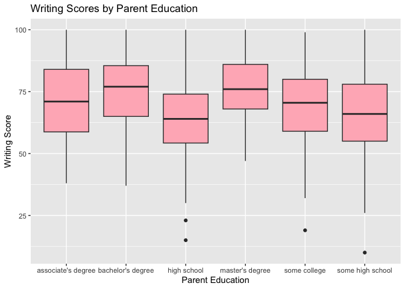
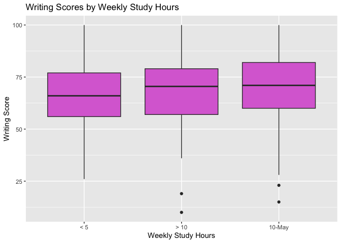

Writing Scores Analysis
================

## Import and Clean the Data

``` r
writing = read.csv(file = "./data/Project_1_data.csv") |> 
  janitor::clean_names() |> 
  mutate(across(where(is.character), ~na_if(.x, "")))
  
writing = writing |> 
  filter(!is.na(writing_score)) |> 
  drop_na()

head(writing)
```

    ##   gender ethnic_group        parent_educ   lunch_type test_prep
    ## 1 female      group B    master's degree     standard      none
    ## 2   male      group C       some college     standard      none
    ## 3 female      group B associate's degree     standard      none
    ## 4 female      group B       some college     standard completed
    ## 5   male      group B       some college free/reduced      none
    ## 6   male      group D        high school free/reduced completed
    ##   parent_marital_status practice_sport is_first_child nr_siblings
    ## 1                single      sometimes            yes           4
    ## 2               married      sometimes            yes           0
    ## 3               married      regularly            yes           1
    ## 4               widowed          never             no           1
    ## 5               married      sometimes            yes           1
    ## 6                single      sometimes             no           3
    ##   transport_means wkly_study_hours math_score reading_score writing_score
    ## 1      school_bus              < 5         87            93            91
    ## 2      school_bus           10-May         76            78            75
    ## 3      school_bus           10-May         73            84            79
    ## 4         private           10-May         85            93            89
    ## 5         private             > 10         41            43            39
    ## 6         private             > 10         65            64            68

## Descriptive Statistics

``` r
summary(writing$writing_score)
```

    ##    Min. 1st Qu.  Median    Mean 3rd Qu.    Max. 
    ##    10.0    58.0    69.0    68.9    79.0   100.0

``` r
var(writing$writing_score)
```

    ## [1] 241.8025

``` r
sd(writing$writing_score)
```

    ## [1] 15.55

## Percentiles

``` r
percentiles = quantile(writing$writing_score, probs = seq(0.1, 1, by = 0.1))

print(percentiles)
```

    ##   10%   20%   30%   40%   50%   60%   70%   80%   90%  100% 
    ##  49.0  55.2  60.0  65.0  69.0  74.0  78.0  83.0  89.0 100.0

## Visualizations

``` r
ggplot(writing, aes(x = writing_score)) +
  geom_histogram(binwidth = 5, fill = "blue", color = "black", alpha = 0.7) +
  labs(
    title = "Distribution of Writing Scores",
    x = "Score",
    y = "Frequency")
```

<!-- -->

``` r
ggplot(writing, aes(x = writing_score)) +
  geom_density(fill = "purple", alpha = 0.5) +
  labs(
    title = "Density Plot of Writing Scores",
    x = "Writing Score",
    y = "Density")
```

<!-- -->

``` r
ggplot(writing, aes(x = gender, y = writing_score)) +
  geom_boxplot(fill = "lightblue") +
  labs(
    title = "Writing Scores by Gender",
    x = "Gender",
    y = "Writing Score")
```

<!-- -->

``` r
ggplot(writing, aes(x = ethnic_group, y = writing_score)) +
  geom_boxplot(fill = "lightgreen") +
  labs(
    title = "Writing Scores by Ethnic Group",
    x = "Ethnic Group",
    y = "Writing Score")
```

<!-- -->

``` r
ggplot(writing, aes(x = parent_educ, y = writing_score)) +
  geom_boxplot(fill = "lightpink") +
  labs(
    title = "Writing Scores by Parent Education",
    x = "Parent Education",
    y = "Writing Score")
```

<!-- -->

``` r
ggplot(writing, aes(x = lunch_type, y = writing_score)) +
  geom_boxplot(fill = "yellow") +
  labs(
    title = "Writing Scores by Lunch Type",
    x = "Lunch Type",
    y = "Writing Score")
```

<!-- -->

``` r
ggplot(writing, aes(x = test_prep, y = writing_score)) +
  geom_boxplot(fill = "orange") +
  labs(
    title = "Writing Scores by Test Prep",
    x = "Test Prep",
    y = "Writing Score")
```

<!-- -->

``` r
ggplot(writing, aes(x = parent_marital_status, y = writing_score)) +
  geom_boxplot(fill = "navyblue") +
  labs(
    title = "Writing Scores by Parent Marital Status",
    x = "Parent Marital Status",
    y = "Writing Score")
```

<!-- -->

``` r
ggplot(writing, aes(x = practice_sport, y = writing_score)) +
  geom_boxplot(fill = "thistle") +
  labs(
    title = "Writing Scores by Practice Sport",
    x = "Practice Sport",
    y = "Writing Score")
```

<!-- -->

``` r
ggplot(writing, aes(x = is_first_child, y = writing_score)) +
  geom_boxplot(fill = "sienna") +
  labs(
    title = "Writing Scores by First Child",
    x = "First Child",
    y = "Writing Score")
```

<!-- -->

``` r
ggplot(writing, aes(x = nr_siblings, y = writing_score)) +
  geom_boxplot(fill = "salmon") +
  labs(
    title = "Writing Scores by Number of Siblings",
    x = "Number of Siblings",
    y = "Writing Score")
```

    ## Warning: Continuous x aesthetic
    ## ℹ did you forget `aes(group = ...)`?

<!-- -->

``` r
ggplot(writing, aes(x = transport_means, y = writing_score)) +
  geom_boxplot(fill = "royalblue") +
  labs(
    title = "Writing Scores by Transportation Means",
    x = "Transportation Means",
    y = "Writing Score")
```

<!-- -->

``` r
ggplot(writing, aes(x = wkly_study_hours, y = writing_score)) +
  geom_boxplot(fill = "orchid") +
  labs(
    title = "Writing Scores by Weekly Study Hours",
    x = "Weekly Study Hours",
    y = "Writing Score")
```

<!-- -->

## Statistical Testing

We used procedures to investigate significant predictors associated with
writing scores.

### Linear Regression

``` r
lm_model = lm(writing_score ~ gender + ethnic_group + parent_educ + lunch_type + test_prep + parent_marital_status + practice_sport + is_first_child + nr_siblings + transport_means + wkly_study_hours, data = writing)

summary(lm_model)
```

    ## 
    ## Call:
    ## lm(formula = writing_score ~ gender + ethnic_group + parent_educ + 
    ##     lunch_type + test_prep + parent_marital_status + practice_sport + 
    ##     is_first_child + nr_siblings + transport_means + wkly_study_hours, 
    ##     data = writing)
    ## 
    ## Residuals:
    ##     Min      1Q  Median      3Q     Max 
    ## -46.922  -8.043   1.071   8.811  26.214 
    ## 
    ## Coefficients:
    ##                               Estimate Std. Error t value Pr(>|t|)    
    ## (Intercept)                  63.939541   3.530228  18.112  < 2e-16 ***
    ## gendermale                   -9.268845   1.064760  -8.705  < 2e-16 ***
    ## ethnic_groupgroup B          -1.372239   2.163560  -0.634 0.526175    
    ## ethnic_groupgroup C           0.005008   2.071256   0.002 0.998072    
    ## ethnic_groupgroup D           5.010576   2.084123   2.404 0.016531 *  
    ## ethnic_groupgroup E           6.018419   2.284980   2.634 0.008673 ** 
    ## parent_educbachelor's degree  3.086897   1.890798   1.633 0.103113    
    ## parent_educhigh school       -6.361777   1.633119  -3.895 0.000110 ***
    ## parent_educmaster's degree    5.581496   2.350617   2.374 0.017907 *  
    ## parent_educsome college      -1.791985   1.641742  -1.092 0.275513    
    ## parent_educsome high school  -6.130783   1.657904  -3.698 0.000239 ***
    ## lunch_typestandard            9.390698   1.100772   8.531  < 2e-16 ***
    ## test_prepnone                -8.754351   1.122889  -7.796 3.09e-14 ***
    ## parent_marital_statusmarried  5.246610   1.512157   3.470 0.000561 ***
    ## parent_marital_statussingle   2.144248   1.725778   1.242 0.214575    
    ## parent_marital_statuswidowed  6.877832   3.564779   1.929 0.054184 .  
    ## practice_sportregularly       1.606102   1.781092   0.902 0.367574    
    ## practice_sportsometimes       1.674659   1.724312   0.971 0.331863    
    ## is_first_childyes             1.045414   1.133850   0.922 0.356921    
    ## nr_siblings                   0.546033   0.359485   1.519 0.129340    
    ## transport_meansschool_bus     0.240107   1.087508   0.221 0.825338    
    ## wkly_study_hours> 10          1.188892   1.640324   0.725 0.468881    
    ## wkly_study_hours10-May        2.802323   1.255870   2.231 0.026048 *  
    ## ---
    ## Signif. codes:  0 '***' 0.001 '**' 0.01 '*' 0.05 '.' 0.1 ' ' 1
    ## 
    ## Residual standard error: 12.65 on 564 degrees of freedom
    ## Multiple R-squared:  0.3634, Adjusted R-squared:  0.3385 
    ## F-statistic: 14.63 on 22 and 564 DF,  p-value: < 2.2e-16

We used procedures to investigate significant predictors associated with
writing scores. Backward, forward, and stepwise as well as
criterion-based and LASSO regression was used to model the predictors
against writing scores and identify significant predictors. The
significant predictors extracted in the model are gender, ethnic group,
parent education, lunch type, test preparation, parent marital status
and weekly study hours.

We first used linear regression to model the relationship between
writing scores and predictors to quantify the strength and direction of
the relationship. The significant predictors with p-values less than
0.05 which indicates a statistically significant relationship are gender
(Male), ethnic group (D, E), parent education, (Some High School, High
School, Master’s Degree), lunch type (Standard), test prep (None),
parent marital status (Married), and weekly study hours (10-May).

The residual standard error of 12.65 indicates the model’s predicitions
are off by about 12.65 points. The multiple R-squared of 0.3634 means
about 36.34% of the variation in the writing scores can be explained by
the predictors. The f-statistic of 14.63 and a p-value of less than 0.05
indicates a highly significant model.

### Correlation Matrix

``` r
writing = writing |> 
  mutate(across(c(gender, ethnic_group, parent_educ, lunch_type, test_prep, parent_marital_status, practice_sport, is_first_child, nr_siblings, transport_means, wkly_study_hours), as.factor))

writing_encoded = writing |> 
  mutate(across(where(is.factor), as.numeric))

cor_writing = writing_encoded |> 
  select_if(is.numeric)

cor_matrix = cor(cor_writing, use = "complete.obs", method = "pearson")

print(cor_matrix)
```

    ##                             gender ethnic_group  parent_educ   lunch_type
    ## gender                 1.000000000  0.005079202 -0.021259218  0.053363154
    ## ethnic_group           0.005079202  1.000000000 -0.008102497  0.039116746
    ## parent_educ           -0.021259218 -0.008102497  1.000000000 -0.009371435
    ## lunch_type             0.053363154  0.039116746 -0.009371435  1.000000000
    ## test_prep             -0.040129121 -0.017865520  0.017867033  0.029888578
    ## parent_marital_status -0.033438606 -0.027559843 -0.026242055 -0.034558508
    ## practice_sport        -0.014763219 -0.024419470 -0.008094825 -0.016807118
    ## is_first_child         0.014328248  0.001128474  0.021101207  0.012326372
    ## nr_siblings           -0.034606638 -0.025868769 -0.054044212  0.001872997
    ## transport_means        0.014795263 -0.030533290 -0.072615332  0.011967843
    ## wkly_study_hours      -0.016311032  0.001006745  0.001546539  0.047556263
    ## math_score             0.183344700  0.226466399 -0.109100845  0.383179573
    ## reading_score         -0.234755011  0.163739469 -0.107854086  0.256612463
    ## writing_score         -0.279943857  0.194208347 -0.116739243  0.271475729
    ##                         test_prep parent_marital_status practice_sport
    ## gender                -0.04012912          -0.033438606   -0.014763219
    ## ethnic_group          -0.01786552          -0.027559843   -0.024419470
    ## parent_educ            0.01786703          -0.026242055   -0.008094825
    ## lunch_type             0.02988858          -0.034558508   -0.016807118
    ## test_prep              1.00000000          -0.033163435   -0.033407781
    ## parent_marital_status -0.03316343           1.000000000    0.022413063
    ## practice_sport        -0.03340778           0.022413063    1.000000000
    ## is_first_child        -0.05340039          -0.086675589    0.011698968
    ## nr_siblings           -0.04798028           0.044236769    0.004110089
    ## transport_means        0.07196028           0.006372934    0.050366165
    ## wkly_study_hours      -0.04568828          -0.015446923    0.013143838
    ## math_score            -0.16443773           0.016759179   -0.001323171
    ## reading_score         -0.19622698           0.026315081    0.029274208
    ## writing_score         -0.26054207           0.044087663    0.033872175
    ##                       is_first_child  nr_siblings transport_means
    ## gender                   0.014328248 -0.034606638     0.014795263
    ## ethnic_group             0.001128474 -0.025868769    -0.030533290
    ## parent_educ              0.021101207 -0.054044212    -0.072615332
    ## lunch_type               0.012326372  0.001872997     0.011967843
    ## test_prep               -0.053400392 -0.047980280     0.071960279
    ## parent_marital_status   -0.086675589  0.044236769     0.006372934
    ## practice_sport           0.011698968  0.004110089     0.050366165
    ## is_first_child           1.000000000 -0.083833027     0.008167280
    ## nr_siblings             -0.083833027  1.000000000    -0.002383219
    ## transport_means          0.008167280 -0.002383219     1.000000000
    ## wkly_study_hours         0.039165127 -0.038208669     0.001104249
    ## math_score               0.029512768  0.063578248     0.001491884
    ## reading_score            0.038714243  0.044769867     0.011728627
    ## writing_score            0.025949378  0.062888068     0.002106993
    ##                       wkly_study_hours   math_score reading_score writing_score
    ## gender                    -0.016311032  0.183344700   -0.23475501  -0.279943857
    ## ethnic_group               0.001006745  0.226466399    0.16373947   0.194208347
    ## parent_educ                0.001546539 -0.109100845   -0.10785409  -0.116739243
    ## lunch_type                 0.047556263  0.383179573    0.25661246   0.271475729
    ## test_prep                 -0.045688278 -0.164437735   -0.19622698  -0.260542074
    ## parent_marital_status     -0.015446923  0.016759179    0.02631508   0.044087663
    ## practice_sport             0.013143838 -0.001323171    0.02927421   0.033872175
    ## is_first_child             0.039165127  0.029512768    0.03871424   0.025949378
    ## nr_siblings               -0.038208669  0.063578248    0.04476987   0.062888068
    ## transport_means            0.001104249  0.001491884    0.01172863   0.002106993
    ## wkly_study_hours           1.000000000  0.108768508    0.09826373   0.103835459
    ## math_score                 0.108768508  1.000000000    0.82017293   0.812460476
    ## reading_score              0.098263733  0.820172926    1.00000000   0.957728382
    ## writing_score              0.103835459  0.812460476    0.95772838   1.000000000

``` r
cor_table = knitr::kable(cor_matrix, format = "markdown")

print(cor_table)
```

    ## 
    ## 
    ## |                      |     gender| ethnic_group| parent_educ| lunch_type|  test_prep| parent_marital_status| practice_sport| is_first_child| nr_siblings| transport_means| wkly_study_hours| math_score| reading_score| writing_score|
    ## |:---------------------|----------:|------------:|-----------:|----------:|----------:|---------------------:|--------------:|--------------:|-----------:|---------------:|----------------:|----------:|-------------:|-------------:|
    ## |gender                |  1.0000000|    0.0050792|  -0.0212592|  0.0533632| -0.0401291|            -0.0334386|     -0.0147632|      0.0143282|  -0.0346066|       0.0147953|       -0.0163110|  0.1833447|    -0.2347550|    -0.2799439|
    ## |ethnic_group          |  0.0050792|    1.0000000|  -0.0081025|  0.0391167| -0.0178655|            -0.0275598|     -0.0244195|      0.0011285|  -0.0258688|      -0.0305333|        0.0010067|  0.2264664|     0.1637395|     0.1942083|
    ## |parent_educ           | -0.0212592|   -0.0081025|   1.0000000| -0.0093714|  0.0178670|            -0.0262421|     -0.0080948|      0.0211012|  -0.0540442|      -0.0726153|        0.0015465| -0.1091008|    -0.1078541|    -0.1167392|
    ## |lunch_type            |  0.0533632|    0.0391167|  -0.0093714|  1.0000000|  0.0298886|            -0.0345585|     -0.0168071|      0.0123264|   0.0018730|       0.0119678|        0.0475563|  0.3831796|     0.2566125|     0.2714757|
    ## |test_prep             | -0.0401291|   -0.0178655|   0.0178670|  0.0298886|  1.0000000|            -0.0331634|     -0.0334078|     -0.0534004|  -0.0479803|       0.0719603|       -0.0456883| -0.1644377|    -0.1962270|    -0.2605421|
    ## |parent_marital_status | -0.0334386|   -0.0275598|  -0.0262421| -0.0345585| -0.0331634|             1.0000000|      0.0224131|     -0.0866756|   0.0442368|       0.0063729|       -0.0154469|  0.0167592|     0.0263151|     0.0440877|
    ## |practice_sport        | -0.0147632|   -0.0244195|  -0.0080948| -0.0168071| -0.0334078|             0.0224131|      1.0000000|      0.0116990|   0.0041101|       0.0503662|        0.0131438| -0.0013232|     0.0292742|     0.0338722|
    ## |is_first_child        |  0.0143282|    0.0011285|   0.0211012|  0.0123264| -0.0534004|            -0.0866756|      0.0116990|      1.0000000|  -0.0838330|       0.0081673|        0.0391651|  0.0295128|     0.0387142|     0.0259494|
    ## |nr_siblings           | -0.0346066|   -0.0258688|  -0.0540442|  0.0018730| -0.0479803|             0.0442368|      0.0041101|     -0.0838330|   1.0000000|      -0.0023832|       -0.0382087|  0.0635782|     0.0447699|     0.0628881|
    ## |transport_means       |  0.0147953|   -0.0305333|  -0.0726153|  0.0119678|  0.0719603|             0.0063729|      0.0503662|      0.0081673|  -0.0023832|       1.0000000|        0.0011042|  0.0014919|     0.0117286|     0.0021070|
    ## |wkly_study_hours      | -0.0163110|    0.0010067|   0.0015465|  0.0475563| -0.0456883|            -0.0154469|      0.0131438|      0.0391651|  -0.0382087|       0.0011042|        1.0000000|  0.1087685|     0.0982637|     0.1038355|
    ## |math_score            |  0.1833447|    0.2264664|  -0.1091008|  0.3831796| -0.1644377|             0.0167592|     -0.0013232|      0.0295128|   0.0635782|       0.0014919|        0.1087685|  1.0000000|     0.8201729|     0.8124605|
    ## |reading_score         | -0.2347550|    0.1637395|  -0.1078541|  0.2566125| -0.1962270|             0.0263151|      0.0292742|      0.0387142|   0.0447699|       0.0117286|        0.0982637|  0.8201729|     1.0000000|     0.9577284|
    ## |writing_score         | -0.2799439|    0.1942083|  -0.1167392|  0.2714757| -0.2605421|             0.0440877|      0.0338722|      0.0259494|   0.0628881|       0.0021070|        0.1038355|  0.8124605|     0.9577284|     1.0000000|

Pearson’s correlation is used to measure the linear relationship between
variables and improve interpretibility. According to the correlation
matrix, there is strong positive correlation between writing and reading
scores as well as writing and math scores, 0.96 and 0.81 respectively.
This suggests that students who do well in writing, tend to do well in
reading and math, and more likely perform better in reading compared to
math.

Additionally, the predictors indicate correlation with writing scores.
Gender has a negative correlation of -0.28, indicating that males tend
to have lower writing scores compared to females. Lunch type shows a
moderate positive correlation of 0.27 meaning students on a standard
lunch plan tend to perform better. Furthermore, test prep has a negative
correlation with writing scores of -0.26 which means students who did
not complete test prep tend to have lower scores. These predictors
showed significant correlation with writing scores, aligning with
regression analysis.

### Backward Elimination Method

``` r
full_model = lm(writing_score ~ gender + ethnic_group + parent_educ + lunch_type + test_prep + parent_marital_status + practice_sport + is_first_child + nr_siblings + transport_means + wkly_study_hours, data = writing)

backward_model = step(full_model, direction = "backward")
```

    ## Start:  AIC=3008.49
    ## writing_score ~ gender + ethnic_group + parent_educ + lunch_type + 
    ##     test_prep + parent_marital_status + practice_sport + is_first_child + 
    ##     nr_siblings + transport_means + wkly_study_hours
    ## 
    ##                         Df Sum of Sq    RSS    AIC
    ## - nr_siblings            7    1128.4  90577 3001.8
    ## - practice_sport         2     120.3  89569 3005.3
    ## - transport_means        1       5.9  89454 3006.5
    ## - is_first_child         1      55.0  89503 3006.8
    ## <none>                                89448 3008.5
    ## - wkly_study_hours       2     884.4  90333 3010.3
    ## - parent_marital_status  3    2375.1  91824 3017.9
    ## - ethnic_group           4    4578.6  94027 3029.8
    ## - parent_educ            5    8360.9  97809 3050.9
    ## - test_prep              1    9766.4  99215 3067.3
    ## - lunch_type             1   10949.7 100398 3074.3
    ## - gender                 1   12071.2 101520 3080.8
    ## 
    ## Step:  AIC=3001.85
    ## writing_score ~ gender + ethnic_group + parent_educ + lunch_type + 
    ##     test_prep + parent_marital_status + practice_sport + is_first_child + 
    ##     transport_means + wkly_study_hours
    ## 
    ##                         Df Sum of Sq    RSS    AIC
    ## - practice_sport         2     157.8  90735 2998.9
    ## - transport_means        1       8.3  90585 2999.9
    ## - is_first_child         1     102.2  90679 3000.5
    ## <none>                                90577 3001.8
    ## - wkly_study_hours       2     783.2  91360 3002.9
    ## - parent_marital_status  3    2533.3  93110 3012.0
    ## - ethnic_group           4    4850.5  95427 3024.5
    ## - parent_educ            5    8390.0  98967 3043.8
    ## - test_prep              1    9961.6 100538 3061.1
    ## - lunch_type             1   11681.1 102258 3071.1
    ## - gender                 1   12361.3 102938 3074.9
    ## 
    ## Step:  AIC=2998.87
    ## writing_score ~ gender + ethnic_group + parent_educ + lunch_type + 
    ##     test_prep + parent_marital_status + is_first_child + transport_means + 
    ##     wkly_study_hours
    ## 
    ##                         Df Sum of Sq    RSS    AIC
    ## - transport_means        1      12.5  90747 2996.9
    ## - is_first_child         1      93.3  90828 2997.5
    ## <none>                                90735 2998.9
    ## - wkly_study_hours       2     804.6  91539 3000.1
    ## - parent_marital_status  3    2553.4  93288 3009.2
    ## - ethnic_group           4    4843.2  95578 3021.4
    ## - parent_educ            5    8318.4  99053 3040.4
    ## - test_prep              1   10110.5 100845 3058.9
    ## - lunch_type             1   11615.2 102350 3067.6
    ## - gender                 1   12381.3 103116 3072.0
    ## 
    ## Step:  AIC=2996.95
    ## writing_score ~ gender + ethnic_group + parent_educ + lunch_type + 
    ##     test_prep + parent_marital_status + is_first_child + wkly_study_hours
    ## 
    ##                         Df Sum of Sq    RSS    AIC
    ## - is_first_child         1      94.7  90842 2995.6
    ## <none>                                90747 2996.9
    ## - wkly_study_hours       2     806.7  91554 2998.2
    ## - parent_marital_status  3    2568.2  93315 3007.3
    ## - ethnic_group           4    4836.0  95583 3019.4
    ## - parent_educ            5    8384.8  99132 3038.8
    ## - test_prep              1   10125.5 100873 3057.1
    ## - lunch_type             1   11624.0 102371 3065.7
    ## - gender                 1   12372.4 103119 3070.0
    ## 
    ## Step:  AIC=2995.57
    ## writing_score ~ gender + ethnic_group + parent_educ + lunch_type + 
    ##     test_prep + parent_marital_status + wkly_study_hours
    ## 
    ##                         Df Sum of Sq    RSS    AIC
    ## <none>                                90842 2995.6
    ## - wkly_study_hours       2     827.3  91669 2996.9
    ## - parent_marital_status  3    2508.2  93350 3005.6
    ## - ethnic_group           4    4803.2  95645 3017.8
    ## - parent_educ            5    8364.6  99206 3037.3
    ## - test_prep              1   10274.5 101116 3056.5
    ## - lunch_type             1   11644.0 102486 3064.4
    ## - gender                 1   12344.4 103186 3068.4

``` r
summary(backward_model)
```

    ## 
    ## Call:
    ## lm(formula = writing_score ~ gender + ethnic_group + parent_educ + 
    ##     lunch_type + test_prep + parent_marital_status + wkly_study_hours, 
    ##     data = writing)
    ## 
    ## Residuals:
    ##     Min      1Q  Median      3Q     Max 
    ## -45.977  -7.958   0.963   9.188  26.159 
    ## 
    ## Coefficients:
    ##                              Estimate Std. Error t value Pr(>|t|)    
    ## (Intercept)                  67.57375    2.91348  23.194  < 2e-16 ***
    ## gendermale                   -9.33994    1.06218  -8.793  < 2e-16 ***
    ## ethnic_groupgroup B          -1.46879    2.15698  -0.681 0.496180    
    ## ethnic_groupgroup C           0.06504    2.06421   0.032 0.974877    
    ## ethnic_groupgroup D           4.93524    2.07666   2.377 0.017806 *  
    ## ethnic_groupgroup E           5.88238    2.27782   2.582 0.010059 *  
    ## parent_educbachelor's degree  2.94629    1.88747   1.561 0.119086    
    ## parent_educhigh school       -6.21892    1.62236  -3.833 0.000141 ***
    ## parent_educmaster's degree    5.35114    2.33241   2.294 0.022139 *  
    ## parent_educsome college      -1.79878    1.63279  -1.102 0.271075    
    ## parent_educsome high school  -6.28800    1.65187  -3.807 0.000156 ***
    ## lunch_typestandard            9.38554    1.09899   8.540  < 2e-16 ***
    ## test_prepnone                -8.92515    1.11256  -8.022 5.96e-15 ***
    ## parent_marital_statusmarried  5.28139    1.50141   3.518 0.000470 ***
    ## parent_marital_statussingle   2.20131    1.71297   1.285 0.199286    
    ## parent_marital_statuswidowed  6.89594    3.54724   1.944 0.052384 .  
    ## wkly_study_hours> 10          1.35009    1.63558   0.825 0.409463    
    ## wkly_study_hours10-May        2.80033    1.25235   2.236 0.025735 *  
    ## ---
    ## Signif. codes:  0 '***' 0.001 '**' 0.01 '*' 0.05 '.' 0.1 ' ' 1
    ## 
    ## Residual standard error: 12.64 on 569 degrees of freedom
    ## Multiple R-squared:  0.3589, Adjusted R-squared:  0.3397 
    ## F-statistic: 18.74 on 17 and 569 DF,  p-value: < 2.2e-16

### Forward Selection

``` r
empty_model = lm(writing_score ~ 1, data = writing)

forward_model = step(empty_model, 
                     scope = list(lower = empty_model, 
                                  upper = ~ gender + ethnic_group + parent_educ + lunch_type + test_prep + parent_marital_status + practice_sport + is_first_child + nr_siblings + transport_means + wkly_study_hours), direction = "forward")
```

    ## Start:  AIC=3222.53
    ## writing_score ~ 1
    ## 
    ##                         Df Sum of Sq    RSS    AIC
    ## + gender                 1   11104.5 130592 3176.6
    ## + lunch_type             1   10442.9 131253 3179.6
    ## + test_prep              1    9618.7 132078 3183.3
    ## + parent_educ            5   11133.9 130562 3184.5
    ## + ethnic_group           4    5484.2 136212 3207.4
    ## + wkly_study_hours       2    1531.9 140164 3220.1
    ## + parent_marital_status  3    1929.1 139767 3220.5
    ## <none>                               141696 3222.5
    ## + is_first_child         1      95.4 141601 3224.1
    ## + transport_means        1       0.6 141696 3224.5
    ## + practice_sport         2     162.8 141533 3225.9
    ## + nr_siblings            7    2379.4 139317 3226.6
    ## 
    ## Step:  AIC=3176.62
    ## writing_score ~ gender
    ## 
    ##                         Df Sum of Sq    RSS    AIC
    ## + lunch_type             1   11657.0 118935 3123.7
    ## + test_prep              1   10482.9 120109 3129.5
    ## + parent_educ            5    9612.1 120980 3141.7
    ## + ethnic_group           4    5921.4 124670 3157.4
    ## + parent_marital_status  3    2060.8 128531 3173.3
    ## + wkly_study_hours       2    1464.7 129127 3174.0
    ## <none>                               130592 3176.6
    ## + is_first_child         1     127.2 130465 3178.0
    ## + nr_siblings            7    2712.5 127879 3178.3
    ## + transport_means        1       5.5 130586 3178.6
    ## + practice_sport         2     125.5 130466 3180.1
    ## 
    ## Step:  AIC=3123.74
    ## writing_score ~ gender + lunch_type
    ## 
    ##                         Df Sum of Sq    RSS    AIC
    ## + test_prep              1   11216.2 107719 3067.6
    ## + parent_educ            5    9909.5 109025 3082.7
    ## + ethnic_group           4    5256.1 113679 3105.2
    ## + parent_marital_status  3    2028.6 116906 3119.6
    ## + wkly_study_hours       2    1162.9 117772 3122.0
    ## <none>                               118935 3123.7
    ## + is_first_child         1     100.6 118834 3125.2
    ## + transport_means        1       1.3 118933 3125.7
    ## + practice_sport         2     179.9 118755 3126.8
    ## + nr_siblings            7    1869.1 117066 3128.4
    ## 
    ## Step:  AIC=3067.59
    ## writing_score ~ gender + lunch_type + test_prep
    ## 
    ##                         Df Sum of Sq    RSS    AIC
    ## + parent_educ            5    9190.5  98528 3025.2
    ## + ethnic_group           4    5091.3 102627 3047.2
    ## + parent_marital_status  3    2161.1 105557 3061.7
    ## + wkly_study_hours       2     743.3 106975 3067.5
    ## <none>                               107719 3067.6
    ## + transport_means        1      77.9 107641 3069.2
    ## + is_first_child         1      19.3 107699 3069.5
    ## + practice_sport         2      92.7 107626 3071.1
    ## + nr_siblings            7    1564.9 106154 3073.0
    ## 
    ## Step:  AIC=3025.24
    ## writing_score ~ gender + lunch_type + test_prep + parent_educ
    ## 
    ##                         Df Sum of Sq   RSS    AIC
    ## + ethnic_group           4    4313.2 94215 3007.0
    ## + parent_marital_status  3    1944.7 96583 3019.5
    ## + wkly_study_hours       2     974.0 97554 3023.4
    ## <none>                               98528 3025.2
    ## + is_first_child         1      34.2 98494 3027.0
    ## + transport_means        1      18.0 98510 3027.1
    ## + practice_sport         2     177.4 98351 3028.2
    ## + nr_siblings            7    1513.7 97014 3030.2
    ## 
    ## Step:  AIC=3006.97
    ## writing_score ~ gender + lunch_type + test_prep + parent_educ + 
    ##     ethnic_group
    ## 
    ##                         Df Sum of Sq   RSS    AIC
    ## + parent_marital_status  3   2545.71 91669 2996.9
    ## + wkly_study_hours       2    864.83 93350 3005.6
    ## <none>                               94215 3007.0
    ## + is_first_child         1     48.28 94167 3008.7
    ## + transport_means        1     32.92 94182 3008.8
    ## + practice_sport         2    195.29 94020 3009.8
    ## + nr_siblings            7   1263.49 92951 3013.0
    ## 
    ## Step:  AIC=2996.89
    ## writing_score ~ gender + lunch_type + test_prep + parent_educ + 
    ##     ethnic_group + parent_marital_status
    ## 
    ##                    Df Sum of Sq   RSS    AIC
    ## + wkly_study_hours  2    827.32 90842 2995.6
    ## <none>                          91669 2996.9
    ## + is_first_child    1    115.33 91554 2998.2
    ## + transport_means   1     16.41 91653 2998.8
    ## + practice_sport    2    173.57 91496 2999.8
    ## + nr_siblings       7   1121.28 90548 3003.7
    ## 
    ## Step:  AIC=2995.57
    ## writing_score ~ gender + lunch_type + test_prep + parent_educ + 
    ##     ethnic_group + parent_marital_status + wkly_study_hours
    ## 
    ##                   Df Sum of Sq   RSS    AIC
    ## <none>                         90842 2995.6
    ## + is_first_child   1     94.72 90747 2996.9
    ## + transport_means  1     13.98 90828 2997.5
    ## + practice_sport   2    153.26 90689 2998.6
    ## + nr_siblings      7   1212.90 89629 3001.7

``` r
summary(forward_model)
```

    ## 
    ## Call:
    ## lm(formula = writing_score ~ gender + lunch_type + test_prep + 
    ##     parent_educ + ethnic_group + parent_marital_status + wkly_study_hours, 
    ##     data = writing)
    ## 
    ## Residuals:
    ##     Min      1Q  Median      3Q     Max 
    ## -45.977  -7.958   0.963   9.188  26.159 
    ## 
    ## Coefficients:
    ##                              Estimate Std. Error t value Pr(>|t|)    
    ## (Intercept)                  67.57375    2.91348  23.194  < 2e-16 ***
    ## gendermale                   -9.33994    1.06218  -8.793  < 2e-16 ***
    ## lunch_typestandard            9.38554    1.09899   8.540  < 2e-16 ***
    ## test_prepnone                -8.92515    1.11256  -8.022 5.96e-15 ***
    ## parent_educbachelor's degree  2.94629    1.88747   1.561 0.119086    
    ## parent_educhigh school       -6.21892    1.62236  -3.833 0.000141 ***
    ## parent_educmaster's degree    5.35114    2.33241   2.294 0.022139 *  
    ## parent_educsome college      -1.79878    1.63279  -1.102 0.271075    
    ## parent_educsome high school  -6.28800    1.65187  -3.807 0.000156 ***
    ## ethnic_groupgroup B          -1.46879    2.15698  -0.681 0.496180    
    ## ethnic_groupgroup C           0.06504    2.06421   0.032 0.974877    
    ## ethnic_groupgroup D           4.93524    2.07666   2.377 0.017806 *  
    ## ethnic_groupgroup E           5.88238    2.27782   2.582 0.010059 *  
    ## parent_marital_statusmarried  5.28139    1.50141   3.518 0.000470 ***
    ## parent_marital_statussingle   2.20131    1.71297   1.285 0.199286    
    ## parent_marital_statuswidowed  6.89594    3.54724   1.944 0.052384 .  
    ## wkly_study_hours> 10          1.35009    1.63558   0.825 0.409463    
    ## wkly_study_hours10-May        2.80033    1.25235   2.236 0.025735 *  
    ## ---
    ## Signif. codes:  0 '***' 0.001 '**' 0.01 '*' 0.05 '.' 0.1 ' ' 1
    ## 
    ## Residual standard error: 12.64 on 569 degrees of freedom
    ## Multiple R-squared:  0.3589, Adjusted R-squared:  0.3397 
    ## F-statistic: 18.74 on 17 and 569 DF,  p-value: < 2.2e-16

### Stepwise Method (stepAIC)

``` r
null_model = lm(writing_score ~ 1, data = writing)

stepwise_model = stepAIC(full_model, direction = "both", trace = TRUE)
```

    ## Start:  AIC=3008.49
    ## writing_score ~ gender + ethnic_group + parent_educ + lunch_type + 
    ##     test_prep + parent_marital_status + practice_sport + is_first_child + 
    ##     nr_siblings + transport_means + wkly_study_hours
    ## 
    ##                         Df Sum of Sq    RSS    AIC
    ## - nr_siblings            7    1128.4  90577 3001.8
    ## - practice_sport         2     120.3  89569 3005.3
    ## - transport_means        1       5.9  89454 3006.5
    ## - is_first_child         1      55.0  89503 3006.8
    ## <none>                                89448 3008.5
    ## - wkly_study_hours       2     884.4  90333 3010.3
    ## - parent_marital_status  3    2375.1  91824 3017.9
    ## - ethnic_group           4    4578.6  94027 3029.8
    ## - parent_educ            5    8360.9  97809 3050.9
    ## - test_prep              1    9766.4  99215 3067.3
    ## - lunch_type             1   10949.7 100398 3074.3
    ## - gender                 1   12071.2 101520 3080.8
    ## 
    ## Step:  AIC=3001.85
    ## writing_score ~ gender + ethnic_group + parent_educ + lunch_type + 
    ##     test_prep + parent_marital_status + practice_sport + is_first_child + 
    ##     transport_means + wkly_study_hours
    ## 
    ##                         Df Sum of Sq    RSS    AIC
    ## - practice_sport         2     157.8  90735 2998.9
    ## - transport_means        1       8.3  90585 2999.9
    ## - is_first_child         1     102.2  90679 3000.5
    ## <none>                                90577 3001.8
    ## - wkly_study_hours       2     783.2  91360 3002.9
    ## + nr_siblings            7    1128.4  89448 3008.5
    ## - parent_marital_status  3    2533.3  93110 3012.0
    ## - ethnic_group           4    4850.5  95427 3024.5
    ## - parent_educ            5    8390.0  98967 3043.8
    ## - test_prep              1    9961.6 100538 3061.1
    ## - lunch_type             1   11681.1 102258 3071.1
    ## - gender                 1   12361.3 102938 3074.9
    ## 
    ## Step:  AIC=2998.87
    ## writing_score ~ gender + ethnic_group + parent_educ + lunch_type + 
    ##     test_prep + parent_marital_status + is_first_child + transport_means + 
    ##     wkly_study_hours
    ## 
    ##                         Df Sum of Sq    RSS    AIC
    ## - transport_means        1      12.5  90747 2996.9
    ## - is_first_child         1      93.3  90828 2997.5
    ## <none>                                90735 2998.9
    ## - wkly_study_hours       2     804.6  91539 3000.1
    ## + practice_sport         2     157.8  90577 3001.8
    ## + nr_siblings            7    1165.8  89569 3005.3
    ## - parent_marital_status  3    2553.4  93288 3009.2
    ## - ethnic_group           4    4843.2  95578 3021.4
    ## - parent_educ            5    8318.4  99053 3040.4
    ## - test_prep              1   10110.5 100845 3058.9
    ## - lunch_type             1   11615.2 102350 3067.6
    ## - gender                 1   12381.3 103116 3072.0
    ## 
    ## Step:  AIC=2996.95
    ## writing_score ~ gender + ethnic_group + parent_educ + lunch_type + 
    ##     test_prep + parent_marital_status + is_first_child + wkly_study_hours
    ## 
    ##                         Df Sum of Sq    RSS    AIC
    ## - is_first_child         1      94.7  90842 2995.6
    ## <none>                                90747 2996.9
    ## - wkly_study_hours       2     806.7  91554 2998.2
    ## + transport_means        1      12.5  90735 2998.9
    ## + practice_sport         2     162.0  90585 2999.9
    ## + nr_siblings            7    1169.0  89578 3003.3
    ## - parent_marital_status  3    2568.2  93315 3007.3
    ## - ethnic_group           4    4836.0  95583 3019.4
    ## - parent_educ            5    8384.8  99132 3038.8
    ## - test_prep              1   10125.5 100873 3057.1
    ## - lunch_type             1   11624.0 102371 3065.7
    ## - gender                 1   12372.4 103119 3070.0
    ## 
    ## Step:  AIC=2995.57
    ## writing_score ~ gender + ethnic_group + parent_educ + lunch_type + 
    ##     test_prep + parent_marital_status + wkly_study_hours
    ## 
    ##                         Df Sum of Sq    RSS    AIC
    ## <none>                                90842 2995.6
    ## - wkly_study_hours       2     827.3  91669 2996.9
    ## + is_first_child         1      94.7  90747 2996.9
    ## + transport_means        1      14.0  90828 2997.5
    ## + practice_sport         2     153.3  90689 2998.6
    ## + nr_siblings            7    1212.9  89629 3001.7
    ## - parent_marital_status  3    2508.2  93350 3005.6
    ## - ethnic_group           4    4803.2  95645 3017.8
    ## - parent_educ            5    8364.6  99206 3037.3
    ## - test_prep              1   10274.5 101116 3056.5
    ## - lunch_type             1   11644.0 102486 3064.4
    ## - gender                 1   12344.4 103186 3068.4

``` r
summary(stepwise_model)
```

    ## 
    ## Call:
    ## lm(formula = writing_score ~ gender + ethnic_group + parent_educ + 
    ##     lunch_type + test_prep + parent_marital_status + wkly_study_hours, 
    ##     data = writing)
    ## 
    ## Residuals:
    ##     Min      1Q  Median      3Q     Max 
    ## -45.977  -7.958   0.963   9.188  26.159 
    ## 
    ## Coefficients:
    ##                              Estimate Std. Error t value Pr(>|t|)    
    ## (Intercept)                  67.57375    2.91348  23.194  < 2e-16 ***
    ## gendermale                   -9.33994    1.06218  -8.793  < 2e-16 ***
    ## ethnic_groupgroup B          -1.46879    2.15698  -0.681 0.496180    
    ## ethnic_groupgroup C           0.06504    2.06421   0.032 0.974877    
    ## ethnic_groupgroup D           4.93524    2.07666   2.377 0.017806 *  
    ## ethnic_groupgroup E           5.88238    2.27782   2.582 0.010059 *  
    ## parent_educbachelor's degree  2.94629    1.88747   1.561 0.119086    
    ## parent_educhigh school       -6.21892    1.62236  -3.833 0.000141 ***
    ## parent_educmaster's degree    5.35114    2.33241   2.294 0.022139 *  
    ## parent_educsome college      -1.79878    1.63279  -1.102 0.271075    
    ## parent_educsome high school  -6.28800    1.65187  -3.807 0.000156 ***
    ## lunch_typestandard            9.38554    1.09899   8.540  < 2e-16 ***
    ## test_prepnone                -8.92515    1.11256  -8.022 5.96e-15 ***
    ## parent_marital_statusmarried  5.28139    1.50141   3.518 0.000470 ***
    ## parent_marital_statussingle   2.20131    1.71297   1.285 0.199286    
    ## parent_marital_statuswidowed  6.89594    3.54724   1.944 0.052384 .  
    ## wkly_study_hours> 10          1.35009    1.63558   0.825 0.409463    
    ## wkly_study_hours10-May        2.80033    1.25235   2.236 0.025735 *  
    ## ---
    ## Signif. codes:  0 '***' 0.001 '**' 0.01 '*' 0.05 '.' 0.1 ' ' 1
    ## 
    ## Residual standard error: 12.64 on 569 degrees of freedom
    ## Multiple R-squared:  0.3589, Adjusted R-squared:  0.3397 
    ## F-statistic: 18.74 on 17 and 569 DF,  p-value: < 2.2e-16

Backward, forward, and stepwise are used for model selection and used to
identfy important predictors by simplifying the model and reducing
overfitting. The three models confirm the significant predictors
indentified in the linear regression model.

### Checking for Multicollinearity

``` r
vif_values = vif(lm_model)
print(vif_values)
```

    ##                           GVIF Df GVIF^(1/(2*Df))
    ## gender                1.034618  1        1.017162
    ## ethnic_group          1.160887  4        1.018823
    ## parent_educ           1.141315  5        1.013306
    ## lunch_type            1.012939  1        1.006449
    ## test_prep             1.058701  1        1.028932
    ## parent_marital_status 1.078609  3        1.012692
    ## practice_sport        1.054346  2        1.013318
    ## is_first_child        1.038500  1        1.019068
    ## nr_siblings           1.039492  1        1.019555
    ## transport_means       1.032714  1        1.016225
    ## wkly_study_hours      1.074275  2        1.018073

``` r
high_vif = vif_values[vif_values > 5]
print(high_vif)
```

    ## numeric(0)

We checked for multicollinearity by calculating the Variance Inflation
Factor (VIF) for each predictor. Since none of the values exceed 5,
there are no collinearity issues that could inflate standard errors and
lead to unreliable coefficient estimates.

### Criterion-Based Procedures

Applying AIC-Based Stepwise Selection

``` r
aic_stepwise = stepAIC(full_model, scope = list(lower = null_model, upper = full_model), direction = "both", trace = TRUE)
```

    ## Start:  AIC=3008.49
    ## writing_score ~ gender + ethnic_group + parent_educ + lunch_type + 
    ##     test_prep + parent_marital_status + practice_sport + is_first_child + 
    ##     nr_siblings + transport_means + wkly_study_hours
    ## 
    ##                         Df Sum of Sq    RSS    AIC
    ## - nr_siblings            7    1128.4  90577 3001.8
    ## - practice_sport         2     120.3  89569 3005.3
    ## - transport_means        1       5.9  89454 3006.5
    ## - is_first_child         1      55.0  89503 3006.8
    ## <none>                                89448 3008.5
    ## - wkly_study_hours       2     884.4  90333 3010.3
    ## - parent_marital_status  3    2375.1  91824 3017.9
    ## - ethnic_group           4    4578.6  94027 3029.8
    ## - parent_educ            5    8360.9  97809 3050.9
    ## - test_prep              1    9766.4  99215 3067.3
    ## - lunch_type             1   10949.7 100398 3074.3
    ## - gender                 1   12071.2 101520 3080.8
    ## 
    ## Step:  AIC=3001.85
    ## writing_score ~ gender + ethnic_group + parent_educ + lunch_type + 
    ##     test_prep + parent_marital_status + practice_sport + is_first_child + 
    ##     transport_means + wkly_study_hours
    ## 
    ##                         Df Sum of Sq    RSS    AIC
    ## - practice_sport         2     157.8  90735 2998.9
    ## - transport_means        1       8.3  90585 2999.9
    ## - is_first_child         1     102.2  90679 3000.5
    ## <none>                                90577 3001.8
    ## - wkly_study_hours       2     783.2  91360 3002.9
    ## + nr_siblings            7    1128.4  89448 3008.5
    ## - parent_marital_status  3    2533.3  93110 3012.0
    ## - ethnic_group           4    4850.5  95427 3024.5
    ## - parent_educ            5    8390.0  98967 3043.8
    ## - test_prep              1    9961.6 100538 3061.1
    ## - lunch_type             1   11681.1 102258 3071.1
    ## - gender                 1   12361.3 102938 3074.9
    ## 
    ## Step:  AIC=2998.87
    ## writing_score ~ gender + ethnic_group + parent_educ + lunch_type + 
    ##     test_prep + parent_marital_status + is_first_child + transport_means + 
    ##     wkly_study_hours
    ## 
    ##                         Df Sum of Sq    RSS    AIC
    ## - transport_means        1      12.5  90747 2996.9
    ## - is_first_child         1      93.3  90828 2997.5
    ## <none>                                90735 2998.9
    ## - wkly_study_hours       2     804.6  91539 3000.1
    ## + practice_sport         2     157.8  90577 3001.8
    ## + nr_siblings            7    1165.8  89569 3005.3
    ## - parent_marital_status  3    2553.4  93288 3009.2
    ## - ethnic_group           4    4843.2  95578 3021.4
    ## - parent_educ            5    8318.4  99053 3040.4
    ## - test_prep              1   10110.5 100845 3058.9
    ## - lunch_type             1   11615.2 102350 3067.6
    ## - gender                 1   12381.3 103116 3072.0
    ## 
    ## Step:  AIC=2996.95
    ## writing_score ~ gender + ethnic_group + parent_educ + lunch_type + 
    ##     test_prep + parent_marital_status + is_first_child + wkly_study_hours
    ## 
    ##                         Df Sum of Sq    RSS    AIC
    ## - is_first_child         1      94.7  90842 2995.6
    ## <none>                                90747 2996.9
    ## - wkly_study_hours       2     806.7  91554 2998.2
    ## + transport_means        1      12.5  90735 2998.9
    ## + practice_sport         2     162.0  90585 2999.9
    ## + nr_siblings            7    1169.0  89578 3003.3
    ## - parent_marital_status  3    2568.2  93315 3007.3
    ## - ethnic_group           4    4836.0  95583 3019.4
    ## - parent_educ            5    8384.8  99132 3038.8
    ## - test_prep              1   10125.5 100873 3057.1
    ## - lunch_type             1   11624.0 102371 3065.7
    ## - gender                 1   12372.4 103119 3070.0
    ## 
    ## Step:  AIC=2995.57
    ## writing_score ~ gender + ethnic_group + parent_educ + lunch_type + 
    ##     test_prep + parent_marital_status + wkly_study_hours
    ## 
    ##                         Df Sum of Sq    RSS    AIC
    ## <none>                                90842 2995.6
    ## - wkly_study_hours       2     827.3  91669 2996.9
    ## + is_first_child         1      94.7  90747 2996.9
    ## + transport_means        1      14.0  90828 2997.5
    ## + practice_sport         2     153.3  90689 2998.6
    ## + nr_siblings            7    1212.9  89629 3001.7
    ## - parent_marital_status  3    2508.2  93350 3005.6
    ## - ethnic_group           4    4803.2  95645 3017.8
    ## - parent_educ            5    8364.6  99206 3037.3
    ## - test_prep              1   10274.5 101116 3056.5
    ## - lunch_type             1   11644.0 102486 3064.4
    ## - gender                 1   12344.4 103186 3068.4

``` r
summary(aic_stepwise)
```

    ## 
    ## Call:
    ## lm(formula = writing_score ~ gender + ethnic_group + parent_educ + 
    ##     lunch_type + test_prep + parent_marital_status + wkly_study_hours, 
    ##     data = writing)
    ## 
    ## Residuals:
    ##     Min      1Q  Median      3Q     Max 
    ## -45.977  -7.958   0.963   9.188  26.159 
    ## 
    ## Coefficients:
    ##                              Estimate Std. Error t value Pr(>|t|)    
    ## (Intercept)                  67.57375    2.91348  23.194  < 2e-16 ***
    ## gendermale                   -9.33994    1.06218  -8.793  < 2e-16 ***
    ## ethnic_groupgroup B          -1.46879    2.15698  -0.681 0.496180    
    ## ethnic_groupgroup C           0.06504    2.06421   0.032 0.974877    
    ## ethnic_groupgroup D           4.93524    2.07666   2.377 0.017806 *  
    ## ethnic_groupgroup E           5.88238    2.27782   2.582 0.010059 *  
    ## parent_educbachelor's degree  2.94629    1.88747   1.561 0.119086    
    ## parent_educhigh school       -6.21892    1.62236  -3.833 0.000141 ***
    ## parent_educmaster's degree    5.35114    2.33241   2.294 0.022139 *  
    ## parent_educsome college      -1.79878    1.63279  -1.102 0.271075    
    ## parent_educsome high school  -6.28800    1.65187  -3.807 0.000156 ***
    ## lunch_typestandard            9.38554    1.09899   8.540  < 2e-16 ***
    ## test_prepnone                -8.92515    1.11256  -8.022 5.96e-15 ***
    ## parent_marital_statusmarried  5.28139    1.50141   3.518 0.000470 ***
    ## parent_marital_statussingle   2.20131    1.71297   1.285 0.199286    
    ## parent_marital_statuswidowed  6.89594    3.54724   1.944 0.052384 .  
    ## wkly_study_hours> 10          1.35009    1.63558   0.825 0.409463    
    ## wkly_study_hours10-May        2.80033    1.25235   2.236 0.025735 *  
    ## ---
    ## Signif. codes:  0 '***' 0.001 '**' 0.01 '*' 0.05 '.' 0.1 ' ' 1
    ## 
    ## Residual standard error: 12.64 on 569 degrees of freedom
    ## Multiple R-squared:  0.3589, Adjusted R-squared:  0.3397 
    ## F-statistic: 18.74 on 17 and 569 DF,  p-value: < 2.2e-16

Applying BIC-Based Stepwise Selection

``` r
n = nrow(writing)
bic_stepwise = stepAIC(full_model, scope = list(lower = null_model, upper = full_model), direction = "both", trace = TRUE, k = log(n))
```

    ## Start:  AIC=3135.37
    ## writing_score ~ gender + ethnic_group + parent_educ + lunch_type + 
    ##     test_prep + parent_marital_status + practice_sport + is_first_child + 
    ##     nr_siblings + transport_means + wkly_study_hours
    ## 
    ##                         Df Sum of Sq    RSS    AIC
    ## - nr_siblings            7    1128.4  90577 3098.1
    ## - practice_sport         2     120.3  89569 3123.4
    ## - wkly_study_hours       2     884.4  90333 3128.4
    ## - transport_means        1       5.9  89454 3129.0
    ## - is_first_child         1      55.0  89503 3129.4
    ## - parent_marital_status  3    2375.1  91824 3131.6
    ## <none>                                89448 3135.4
    ## - ethnic_group           4    4578.6  94027 3139.2
    ## - parent_educ            5    8360.9  97809 3155.9
    ## - test_prep              1    9766.4  99215 3189.8
    ## - lunch_type             1   10949.7 100398 3196.8
    ## - gender                 1   12071.2 101520 3203.3
    ## 
    ## Step:  AIC=3098.1
    ## writing_score ~ gender + ethnic_group + parent_educ + lunch_type + 
    ##     test_prep + parent_marital_status + practice_sport + is_first_child + 
    ##     transport_means + wkly_study_hours
    ## 
    ##                         Df Sum of Sq    RSS    AIC
    ## - practice_sport         2     157.8  90735 3086.4
    ## - wkly_study_hours       2     783.2  91360 3090.4
    ## - transport_means        1       8.3  90585 3091.8
    ## - is_first_child         1     102.2  90679 3092.4
    ## - parent_marital_status  3    2533.3  93110 3095.2
    ## <none>                                90577 3098.1
    ## - ethnic_group           4    4850.5  95427 3103.2
    ## - parent_educ            5    8390.0  98967 3118.2
    ## + nr_siblings            7    1128.4  89448 3135.4
    ## - test_prep              1    9961.6 100538 3153.0
    ## - lunch_type             1   11681.1 102258 3162.9
    ## - gender                 1   12361.3 102938 3166.8
    ## 
    ## Step:  AIC=3086.37
    ## writing_score ~ gender + ethnic_group + parent_educ + lunch_type + 
    ##     test_prep + parent_marital_status + is_first_child + transport_means + 
    ##     wkly_study_hours
    ## 
    ##                         Df Sum of Sq    RSS    AIC
    ## - wkly_study_hours       2     804.6  91539 3078.8
    ## - transport_means        1      12.5  90747 3080.1
    ## - is_first_child         1      93.3  90828 3080.6
    ## - parent_marital_status  3    2553.4  93288 3083.5
    ## <none>                                90735 3086.4
    ## - ethnic_group           4    4843.2  95578 3091.4
    ## + practice_sport         2     157.8  90577 3098.1
    ## - parent_educ            5    8318.4  99053 3106.0
    ## + nr_siblings            7    1165.8  89569 3123.4
    ## - test_prep              1   10110.5 100845 3142.0
    ## - lunch_type             1   11615.2 102350 3150.7
    ## - gender                 1   12381.3 103116 3155.1
    ## 
    ## Step:  AIC=3078.81
    ## writing_score ~ gender + ethnic_group + parent_educ + lunch_type + 
    ##     test_prep + parent_marital_status + is_first_child + transport_means
    ## 
    ##                         Df Sum of Sq    RSS    AIC
    ## - transport_means        1      14.7  91554 3072.5
    ## - is_first_child         1     113.6  91653 3073.2
    ## - parent_marital_status  3    2596.0  94135 3076.1
    ## <none>                                91539 3078.8
    ## - ethnic_group           4    4960.1  96499 3084.3
    ## + wkly_study_hours       2     804.6  90735 3086.4
    ## + practice_sport         2     179.2  91360 3090.4
    ## - parent_educ            5    8123.9  99663 3096.8
    ## + nr_siblings            7    1064.8  90474 3116.6
    ## - test_prep              1   10504.6 102044 3136.2
    ## - lunch_type             1   11946.1 103485 3144.4
    ## - gender                 1   12650.6 104190 3148.4
    ## 
    ## Step:  AIC=3072.52
    ## writing_score ~ gender + ethnic_group + parent_educ + lunch_type + 
    ##     test_prep + parent_marital_status + is_first_child
    ## 
    ##                         Df Sum of Sq    RSS    AIC
    ## - is_first_child         1     115.3  91669 3066.9
    ## - parent_marital_status  3    2612.8  94167 3069.9
    ## <none>                                91554 3072.5
    ## - ethnic_group           4    4952.4  96506 3077.9
    ## + transport_means        1      14.7  91539 3078.8
    ## + wkly_study_hours       2     806.7  90747 3080.1
    ## + practice_sport         2     184.0  91370 3084.1
    ## - parent_educ            5    8190.4  99744 3090.9
    ## + nr_siblings            7    1066.8  90487 3110.3
    ## - test_prep              1   10513.0 102067 3130.0
    ## - lunch_type             1   11955.2 103509 3138.2
    ## - gender                 1   12640.2 104194 3142.1
    ## 
    ## Step:  AIC=3066.89
    ## writing_score ~ gender + ethnic_group + parent_educ + lunch_type + 
    ##     test_prep + parent_marital_status
    ## 
    ##                         Df Sum of Sq    RSS    AIC
    ## - parent_marital_status  3    2545.7  94215 3063.8
    ## <none>                                91669 3066.9
    ## - ethnic_group           4    4914.3  96583 3072.0
    ## + is_first_child         1     115.3  91554 3072.5
    ## + transport_means        1      16.4  91653 3073.2
    ## + wkly_study_hours       2     827.3  90842 3074.3
    ## + practice_sport         2     173.6  91496 3078.5
    ## - parent_educ            5    8166.8  99836 3085.1
    ## + nr_siblings            7    1121.3  90548 3104.3
    ## - test_prep              1   10682.5 102352 3125.2
    ## - lunch_type             1   11982.5 103652 3132.6
    ## - gender                 1   12612.0 104281 3136.2
    ## 
    ## Step:  AIC=3063.84
    ## writing_score ~ gender + ethnic_group + parent_educ + lunch_type + 
    ##     test_prep
    ## 
    ##                         Df Sum of Sq    RSS    AIC
    ## <none>                                94215 3063.8
    ## - ethnic_group           4    4313.2  98528 3064.6
    ## + parent_marital_status  3    2545.7  91669 3066.9
    ## + is_first_child         1      48.3  94167 3069.9
    ## + transport_means        1      32.9  94182 3070.0
    ## + wkly_study_hours       2     864.8  93350 3071.2
    ## + practice_sport         2     195.3  94020 3075.4
    ## - parent_educ            5    8412.4 102627 3082.2
    ## + nr_siblings            7    1263.5  92951 3100.5
    ## - test_prep              1   10486.4 104701 3119.4
    ## - lunch_type             1   12063.8 106279 3128.2
    ## - gender                 1   12303.4 106518 3129.5

``` r
summary(bic_stepwise)
```

    ## 
    ## Call:
    ## lm(formula = writing_score ~ gender + ethnic_group + parent_educ + 
    ##     lunch_type + test_prep, data = writing)
    ## 
    ## Residuals:
    ##     Min      1Q  Median      3Q     Max 
    ## -47.989  -8.180   1.061   8.768  28.287 
    ## 
    ## Coefficients:
    ##                              Estimate Std. Error t value Pr(>|t|)    
    ## (Intercept)                    73.023      2.415  30.242  < 2e-16 ***
    ## gendermale                     -9.300      1.074  -8.658  < 2e-16 ***
    ## ethnic_groupgroup B            -1.427      2.161  -0.660 0.509345    
    ## ethnic_groupgroup C             0.420      2.076   0.202 0.839764    
    ## ethnic_groupgroup D             4.646      2.094   2.219 0.026884 *  
    ## ethnic_groupgroup E             5.778      2.304   2.508 0.012424 *  
    ## parent_educbachelor's degree    3.209      1.904   1.686 0.092411 .  
    ## parent_educhigh school         -6.082      1.639  -3.711 0.000226 ***
    ## parent_educmaster's degree      4.924      2.355   2.091 0.036969 *  
    ## parent_educsome college        -1.649      1.653  -0.998 0.318897    
    ## parent_educsome high school    -6.491      1.671  -3.885 0.000114 ***
    ## lunch_typestandard              9.534      1.112   8.573  < 2e-16 ***
    ## test_prepnone                  -8.963      1.121  -7.993 7.27e-15 ***
    ## ---
    ## Signif. codes:  0 '***' 0.001 '**' 0.01 '*' 0.05 '.' 0.1 ' ' 1
    ## 
    ## Residual standard error: 12.81 on 574 degrees of freedom
    ## Multiple R-squared:  0.3351, Adjusted R-squared:  0.3212 
    ## F-statistic: 24.11 on 12 and 574 DF,  p-value: < 2.2e-16

Criterion-based selection is used to identify the model that offers the
best trade-off of fit and simplicity to avoid overfitting. AIC measure
the goodness of fit and BIC is similar but includes a heavier penatly
for adding additional predictors.

### LASSO

``` r
X = model.matrix(writing_score ~ gender + ethnic_group + parent_educ + lunch_type + test_prep + parent_marital_status + practice_sport + is_first_child + nr_siblings + transport_means + wkly_study_hours, data = writing)[, -1]

Y = writing$writing_score
```

``` r
set.seed(123)
lasso_cv = cv.glmnet(X, Y, alpha = 1)
```

``` r
best_lambda = lasso_cv$lambda.min
lasso_model = glmnet(X, Y, alpha = 1, lambda = best_lambda)
```

``` r
lasso_coefficients = coef(lasso_model)
print(lasso_coefficients)
```

    ## 29 x 1 sparse Matrix of class "dgCMatrix"
    ##                                      s0
    ## (Intercept)                  69.9971302
    ## gendermale                   -8.6437837
    ## ethnic_groupgroup B          -1.1344453
    ## ethnic_groupgroup C           .        
    ## ethnic_groupgroup D           3.8432421
    ## ethnic_groupgroup E           4.6734959
    ## parent_educbachelor's degree  3.0200591
    ## parent_educhigh school       -4.9281037
    ## parent_educmaster's degree    4.9815435
    ## parent_educsome college      -0.2289000
    ## parent_educsome high school  -4.7873087
    ## lunch_typestandard            8.5721461
    ## test_prepnone                -8.3333402
    ## parent_marital_statusmarried  2.9844705
    ## parent_marital_statussingle   .        
    ## parent_marital_statuswidowed  2.9120218
    ## practice_sportregularly       .        
    ## practice_sportsometimes       .        
    ## is_first_childyes             .        
    ## nr_siblings1                 -0.4625891
    ## nr_siblings2                 -1.2764818
    ## nr_siblings3                  0.3988938
    ## nr_siblings4                  0.7655582
    ## nr_siblings5                  .        
    ## nr_siblings6                  2.5197364
    ## nr_siblings7                  3.3246107
    ## transport_meansschool_bus     .        
    ## wkly_study_hours> 10          .        
    ## wkly_study_hours10-May        1.6664666

The LASSO regression performs both variable selection and
regularization. According to the model, the variables with meaningful
contribution are gender and lunch type. Gender has a coefficient of
-8.64 indicating that male students have a writing score 8.64 points
lower than female students on average. Lunch type has a coefficient of
8.57 indicating that students with a standard lunch type score 8.57
points higher on average than those with free/reduced lunch.
Additionally, ethnic group and practice sport have coefficients of 0
indicating no significant impact on writing scores.

### Predictive Power through cross-validation

``` r
set.seed(123)
train_control = trainControl(method = "cv", number = 10)

lasso_caret = train(
  writing_score ~ gender + ethnic_group + parent_educ + lunch_type + test_prep + parent_marital_status + practice_sport + is_first_child + nr_siblings + transport_means + wkly_study_hours, data = writing, method = "glmnet", trControl = train_control, tuneGrid = expand.grid(alpha = 1, lambda = seq(0.001, 1, length = 100)))

print(lasso_caret)
```

    ## glmnet 
    ## 
    ## 587 samples
    ##  11 predictor
    ## 
    ## No pre-processing
    ## Resampling: Cross-Validated (10 fold) 
    ## Summary of sample sizes: 527, 528, 528, 529, 528, 529, ... 
    ## Resampling results across tuning parameters:
    ## 
    ##   lambda      RMSE      Rsquared   MAE     
    ##   0.00100000  12.87544  0.3198786  10.39248
    ##   0.01109091  12.87331  0.3200702  10.39098
    ##   0.02118182  12.86716  0.3205261  10.38604
    ##   0.03127273  12.86306  0.3207992  10.38229
    ##   0.04136364  12.86027  0.3209560  10.37899
    ##   0.05145455  12.85745  0.3211307  10.37600
    ##   0.06154545  12.85516  0.3212818  10.37406
    ##   0.07163636  12.85342  0.3213868  10.37332
    ##   0.08172727  12.85178  0.3215089  10.37234
    ##   0.09181818  12.84942  0.3217155  10.37064
    ##   0.10190909  12.84662  0.3219829  10.36857
    ##   0.11200000  12.84405  0.3222397  10.36645
    ##   0.12209091  12.84114  0.3225463  10.36403
    ##   0.13218182  12.83868  0.3228215  10.36203
    ##   0.14227273  12.83650  0.3230815  10.36073
    ##   0.15236364  12.83429  0.3233506  10.35971
    ##   0.16245455  12.83169  0.3236714  10.35809
    ##   0.17254545  12.82917  0.3240003  10.35640
    ##   0.18263636  12.82692  0.3243147  10.35538
    ##   0.19272727  12.82553  0.3245521  10.35478
    ##   0.20281818  12.82434  0.3247817  10.35514
    ##   0.21290909  12.82346  0.3249886  10.35570
    ##   0.22300000  12.82282  0.3251771  10.35645
    ##   0.23309091  12.82218  0.3253705  10.35727
    ##   0.24318182  12.82129  0.3256019  10.35766
    ##   0.25327273  12.82050  0.3258357  10.35825
    ##   0.26336364  12.82001  0.3260263  10.35905
    ##   0.27345455  12.81956  0.3262160  10.35955
    ##   0.28354545  12.81931  0.3263958  10.35995
    ##   0.29363636  12.81935  0.3265519  10.36043
    ##   0.30372727  12.81974  0.3266778  10.36105
    ##   0.31381818  12.82037  0.3267896  10.36194
    ##   0.32390909  12.82114  0.3268965  10.36294
    ##   0.33400000  12.82211  0.3269892  10.36446
    ##   0.34409091  12.82327  0.3270679  10.36615
    ##   0.35418182  12.82475  0.3271192  10.36787
    ##   0.36427273  12.82656  0.3271392  10.36967
    ##   0.37436364  12.82855  0.3271429  10.37154
    ##   0.38445455  12.83078  0.3271235  10.37356
    ##   0.39454545  12.83276  0.3271420  10.37535
    ##   0.40463636  12.83491  0.3271468  10.37740
    ##   0.41472727  12.83719  0.3271439  10.37969
    ##   0.42481818  12.83938  0.3271593  10.38180
    ##   0.43490909  12.84154  0.3271890  10.38396
    ##   0.44500000  12.84389  0.3272050  10.38622
    ##   0.45509091  12.84636  0.3272150  10.38845
    ##   0.46518182  12.84892  0.3272210  10.39082
    ##   0.47527273  12.85170  0.3272067  10.39358
    ##   0.48536364  12.85444  0.3272012  10.39622
    ##   0.49545455  12.85730  0.3271881  10.39884
    ##   0.50554545  12.86009  0.3271957  10.40089
    ##   0.51563636  12.86299  0.3271948  10.40305
    ##   0.52572727  12.86598  0.3271883  10.40557
    ##   0.53581818  12.86901  0.3271824  10.40807
    ##   0.54590909  12.87245  0.3271386  10.41072
    ##   0.55600000  12.87631  0.3270445  10.41358
    ##   0.56609091  12.88040  0.3269273  10.41658
    ##   0.57618182  12.88460  0.3268038  10.41958
    ##   0.58627273  12.88885  0.3266791  10.42257
    ##   0.59636364  12.89325  0.3265425  10.42567
    ##   0.60645455  12.89767  0.3264108  10.42869
    ##   0.61654545  12.90231  0.3262507  10.43190
    ##   0.62663636  12.90711  0.3260748  10.43507
    ##   0.63672727  12.91202  0.3258890  10.43824
    ##   0.64681818  12.91704  0.3256934  10.44142
    ##   0.65690909  12.92218  0.3254905  10.44494
    ##   0.66700000  12.92740  0.3252827  10.44870
    ##   0.67709091  12.93265  0.3250762  10.45243
    ##   0.68718182  12.93797  0.3248639  10.45629
    ##   0.69727273  12.94340  0.3246414  10.46027
    ##   0.70736364  12.94894  0.3244086  10.46453
    ##   0.71745455  12.95455  0.3241814  10.46877
    ##   0.72754545  12.96024  0.3239626  10.47287
    ##   0.73763636  12.96606  0.3237209  10.47721
    ##   0.74772727  12.97203  0.3234654  10.48165
    ##   0.75781818  12.97810  0.3232007  10.48610
    ##   0.76790909  12.98428  0.3229255  10.49077
    ##   0.77800000  12.99057  0.3226408  10.49558
    ##   0.78809091  12.99695  0.3223503  10.50037
    ##   0.79818182  13.00343  0.3220528  10.50514
    ##   0.80827273  13.00996  0.3217481  10.51004
    ##   0.81836364  13.01646  0.3214507  10.51491
    ##   0.82845455  13.02307  0.3211432  10.51984
    ##   0.83854545  13.02979  0.3208247  10.52479
    ##   0.84863636  13.03663  0.3204952  10.52982
    ##   0.85872727  13.04356  0.3201554  10.53503
    ##   0.86881818  13.05059  0.3198052  10.54047
    ##   0.87890909  13.05773  0.3194440  10.54595
    ##   0.88900000  13.06510  0.3190365  10.55165
    ##   0.89909091  13.07267  0.3185924  10.55739
    ##   0.90918182  13.08033  0.3181374  10.56346
    ##   0.91927273  13.08808  0.3176714  10.56976
    ##   0.92936364  13.09593  0.3171940  10.57616
    ##   0.93945455  13.10387  0.3167052  10.58286
    ##   0.94954545  13.11185  0.3162087  10.58961
    ##   0.95963636  13.11987  0.3157062  10.59632
    ##   0.96972727  13.12798  0.3151920  10.60306
    ##   0.97981818  13.13618  0.3146621  10.60981
    ##   0.98990909  13.14445  0.3141209  10.61657
    ##   1.00000000  13.15281  0.3135676  10.62349
    ## 
    ## Tuning parameter 'alpha' was held constant at a value of 1
    ## RMSE was used to select the optimal model using the smallest value.
    ## The final values used for the model were alpha = 1 and lambda = 0.2835455.

``` r
predictions = predict(lasso_caret$finalModel, newx = X, s = lasso_caret$bestTune$lambda)

mse = mean((predictions - Y)^2)
r2 = 1 - (sum((Y - predictions)^2) / sum((Y - mean(Y))^2))
mae = mean(abs(predictions - Y))

print(paste("Test RMSE:", sqrt(mse)))
```

    ## [1] "Test RMSE: 12.4465018150252"

``` r
print(paste("Test R-Squared:", r2))
```

    ## [1] "Test R-Squared: 0.358237554891462"

``` r
print(paste("Test MAE:", mae))
```

    ## [1] "Test MAE: 10.0406787031912"

``` r
dev.new()
plot(residuals(lasso_caret), main = "Residuals Plot", ylab = "Residuals")
abline(h = 0, col = "red")
```

### Interaction Effect

``` r
interaction_model = lm(writing_score ~ gender * practice_sport + parent_educ * test_prep, data = writing)

summary(interaction_model)
```

    ## 
    ## Call:
    ## lm(formula = writing_score ~ gender * practice_sport + parent_educ * 
    ##     test_prep, data = writing)
    ## 
    ## Residuals:
    ##    Min     1Q Median     3Q    Max 
    ## -56.18  -9.50   1.41  10.40  30.38 
    ## 
    ## Coefficients:
    ##                                            Estimate Std. Error t value Pr(>|t|)
    ## (Intercept)                                 79.6603     3.0677  25.968  < 2e-16
    ## gendermale                                  -7.2013     3.4005  -2.118  0.03463
    ## practice_sportregularly                      2.3872     2.6838   0.889  0.37413
    ## practice_sportsometimes                      1.8538     2.5769   0.719  0.47219
    ## parent_educbachelor's degree                 1.5669     3.2157   0.487  0.62626
    ## parent_educhigh school                      -8.1881     3.0944  -2.646  0.00837
    ## parent_educmaster's degree                  -0.7502     4.4841  -0.167  0.86720
    ## parent_educsome college                     -0.4387     3.0909  -0.142  0.88719
    ## parent_educsome high school                 -7.6974     2.8181  -2.731  0.00650
    ## test_prepnone                              -10.1866     2.5170  -4.047  5.9e-05
    ## gendermale:practice_sportregularly          -2.0362     3.8893  -0.524  0.60079
    ## gendermale:practice_sportsometimes          -1.1337     3.7712  -0.301  0.76382
    ## parent_educbachelor's degree:test_prepnone   2.6461     4.1984   0.630  0.52877
    ## parent_educhigh school:test_prepnone         2.7996     3.7848   0.740  0.45978
    ## parent_educmaster's degree:test_prepnone     8.9717     5.4552   1.645  0.10060
    ## parent_educsome college:test_prepnone       -1.3819     3.7993  -0.364  0.71621
    ## parent_educsome high school:test_prepnone    2.0154     3.6780   0.548  0.58394
    ##                                               
    ## (Intercept)                                ***
    ## gendermale                                 *  
    ## practice_sportregularly                       
    ## practice_sportsometimes                       
    ## parent_educbachelor's degree                  
    ## parent_educhigh school                     ** 
    ## parent_educmaster's degree                    
    ## parent_educsome college                       
    ## parent_educsome high school                ** 
    ## test_prepnone                              ***
    ## gendermale:practice_sportregularly            
    ## gendermale:practice_sportsometimes            
    ## parent_educbachelor's degree:test_prepnone    
    ## parent_educhigh school:test_prepnone          
    ## parent_educmaster's degree:test_prepnone      
    ## parent_educsome college:test_prepnone         
    ## parent_educsome high school:test_prepnone     
    ## ---
    ## Signif. codes:  0 '***' 0.001 '**' 0.01 '*' 0.05 '.' 0.1 ' ' 1
    ## 
    ## Residual standard error: 13.91 on 570 degrees of freedom
    ## Multiple R-squared:  0.2221, Adjusted R-squared:  0.2003 
    ## F-statistic: 10.17 on 16 and 570 DF,  p-value: < 2.2e-16

ANOVA

``` r
base_model = lm(writing_score ~ gender + practice_sport, data = writing)

anova(base_model, interaction_model)
```

    ## Analysis of Variance Table
    ## 
    ## Model 1: writing_score ~ gender + practice_sport
    ## Model 2: writing_score ~ gender * practice_sport + parent_educ * test_prep
    ##   Res.Df    RSS Df Sum of Sq      F    Pr(>F)    
    ## 1    583 130466                                  
    ## 2    570 110225 13     20241 8.0517 6.287e-15 ***
    ## ---
    ## Signif. codes:  0 '***' 0.001 '**' 0.01 '*' 0.05 '.' 0.1 ' ' 1

Procedures as mentioned help to simplify the model and improve
prediction accuracy. Interaction effects were also explored and metrics
were computed to asses the model’s predictive power. From the model,
males consistently score lower than females, regardless of sport
participation, completing test prep has a positive impact on writing
scores, and lower parent educaation are associated with significantly
lower scores, however, higher parent education does not schow
significant benefit.

It is important to note that the R-sqaured suggets that there are
important predictors of writing scores not included and that there are
no significant interaction effects.
