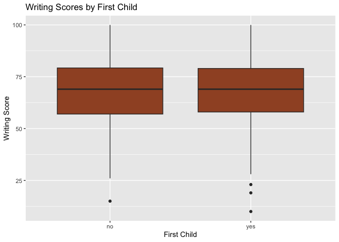

Writing Scores Analysis
================

### Import and Clean the Data

``` r
writing = read.csv(file = "./data/Project_1_data.csv") |> 
  janitor::clean_names() |> 
  mutate(across(where(is.character), ~na_if(.x, "")))
  
writing = writing |> 
  filter(!is.na(writing_score))
head(writing)
```

    ##   gender ethnic_group        parent_educ   lunch_type test_prep
    ## 1 female         <NA>  bachelor's degree     standard      none
    ## 2 female      group C       some college     standard      <NA>
    ## 3 female      group B    master's degree     standard      none
    ## 4   male      group A associate's degree free/reduced      none
    ## 5   male      group C       some college     standard      none
    ## 6 female      group B associate's degree     standard      none
    ##   parent_marital_status practice_sport is_first_child nr_siblings
    ## 1               married      regularly            yes           3
    ## 2               married      sometimes            yes           0
    ## 3                single      sometimes            yes           4
    ## 4               married          never             no           1
    ## 5               married      sometimes            yes           0
    ## 6               married      regularly            yes           1
    ##   transport_means wkly_study_hours math_score reading_score writing_score
    ## 1      school_bus              < 5         71            71            74
    ## 2            <NA>           10-May         69            90            88
    ## 3      school_bus              < 5         87            93            91
    ## 4            <NA>           10-May         45            56            42
    ## 5      school_bus           10-May         76            78            75
    ## 6      school_bus           10-May         73            84            79

- get rid of NA in specific plots

### Descriptive Statistics

``` r
summary(writing$writing_score)
```

    ##    Min. 1st Qu.  Median    Mean 3rd Qu.    Max. 
    ##   10.00   57.00   68.00   67.93   78.25  100.00

``` r
var(writing$writing_score)
```

    ## [1] 237.5483

``` r
sd(writing$writing_score)
```

    ## [1] 15.4126

### Percentiles

``` r
percentiles = quantile(writing$writing_score, probs = seq(0.1, 1, by = 0.1))

print(percentiles)
```

    ##  10%  20%  30%  40%  50%  60%  70%  80%  90% 100% 
    ##   48   54   60   65   68   73   77   81   87  100

### Visualizations

``` r
ggplot(writing, aes(x = writing_score)) +
  geom_histogram(binwidth = 5, fill = "blue", color = "black", alpha = 0.7) +
  labs(
    title = "Distribution of Writing Scores",
    x = "Score",
    y = "Frequency")
```

<!-- -->

``` r
ggplot(writing, aes(x = writing_score)) +
  geom_density(fill = "purple", alpha = 0.5) +
  labs(
    title = "Density Plot of Writing Scores",
    x = "Writing Score",
    y = "Density")
```

<!-- -->

``` r
ggplot(writing, aes(x = gender, y = writing_score)) +
  geom_boxplot(fill = "lightblue") +
  labs(
    title = "Writing Scores by Gender",
    x = "Gender",
    y = "Writing Score")
```

<!-- -->

``` r
ggplot(writing, aes(x = ethnic_group, y = writing_score)) +
  geom_boxplot(fill = "lightgreen") +
  labs(
    title = "Writing Scores by Ethnic Group",
    x = "Ethnic Group",
    y = "Writing Score")
```

<!-- -->

``` r
ggplot(writing, aes(x = parent_educ, y = writing_score)) +
  geom_boxplot(fill = "lightpink") +
  labs(
    title = "Writing Scores by Parent Education",
    x = "Parent Education",
    y = "Writing Score")
```

<!-- -->

``` r
ggplot(writing, aes(x = lunch_type, y = writing_score)) +
  geom_boxplot(fill = "yellow") +
  labs(
    title = "Writing Scores by Lunch Type",
    x = "Lunch Type",
    y = "Writing Score")
```

<!-- -->

``` r
ggplot(writing, aes(x = test_prep, y = writing_score)) +
  geom_boxplot(fill = "orange") +
  labs(
    title = "Writing Scores by Test Prep",
    x = "Test Prep",
    y = "Writing Score")
```

<!-- -->

``` r
ggplot(writing, aes(x = parent_marital_status, y = writing_score)) +
  geom_boxplot(fill = "navyblue") +
  labs(
    title = "Writing Scores by Parent Marital Status",
    x = "Parent Marital Status",
    y = "Writing Score")
```

<!-- -->

``` r
ggplot(writing, aes(x = practice_sport, y = writing_score)) +
  geom_boxplot(fill = "thistle") +
  labs(
    title = "Writing Scores by Practice Sport",
    x = "Practice Sport",
    y = "Writing Score")
```

<!-- -->

``` r
ggplot(writing, aes(x = is_first_child, y = writing_score)) +
  geom_boxplot(fill = "sienna") +
  labs(
    title = "Writing Scores by First Child",
    x = "First Child",
    y = "Writing Score")
```

<!-- -->

``` r
ggplot(writing, aes(x = nr_siblings, y = writing_score)) +
  geom_boxplot(fill = "salmon") +
  labs(
    title = "Writing Scores by Number of Siblings",
    x = "Number of Siblings",
    y = "Writing Score")
```

    ## Warning: Continuous x aesthetic
    ## ℹ did you forget `aes(group = ...)`?

    ## Warning: Removed 46 rows containing missing values or values outside the scale range
    ## (`stat_boxplot()`).

<!-- -->

``` r
ggplot(writing, aes(x = transport_means, y = writing_score)) +
  geom_boxplot(fill = "royalblue") +
  labs(
    title = "Writing Scores by Transportation Means",
    x = "Transportation Means",
    y = "Writing Score")
```

<!-- -->

``` r
ggplot(writing, aes(x = wkly_study_hours, y = writing_score)) +
  geom_boxplot(fill = "orchid") +
  labs(
    title = "Writing Scores by Weekly Study Hours",
    x = "Weekly Study Hours",
    y = "Writing Score")
```

<!-- -->

### Statistical Testing

``` r
t_test = t.test(writing_score ~ gender, data = writing)

print(t_test)
```

    ## 
    ##  Welch Two Sample t-test
    ## 
    ## data:  writing_score by gender
    ## t = 9.3186, df = 945.96, p-value < 2.2e-16
    ## alternative hypothesis: true difference in means between group female and group male is not equal to 0
    ## 95 percent confidence interval:
    ##   7.042445 10.800036
    ## sample estimates:
    ## mean in group female   mean in group male 
    ##             72.25820             63.33696
